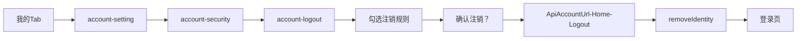
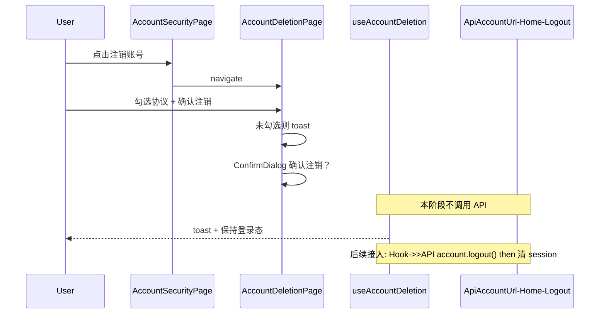

# 注销账号功能（对齐 legacy ryx）

## Legacy 对标结论

实际生效路径（非 orphan 的 `_ryx` 皮肤页）：



| 环节     | Legacy 行为                                                                                                                                                                                               | H5 对齐方式                                                                                            |
| -------- | --------------------------------------------------------------------------------------------------------------------------------------------------------------------------------------------------------- | ------------------------------------------------------------------------------------------------------ |
| 入口     | [`account-security.page.html`](beeantmobile-main/projects/ryx/src/app/account/account-security/account-security.page.html) 「安全」区，登录历史下方；文案「注销账号」+ 右侧「注销后无法恢复，请谨慎操作」 | 改 [`AccountSecurityPage.tsx`](apps/h5/src/pages/settings/AccountSecurityPage.tsx) 同一区块            |
| 注销页   | [`account-logout.page.html`](beeantmobile-main/projects/ryx/src/app/account/account-logout/account-logout.page.html) 4 条后果 + checkbox +「确认注销」                                                    | 新页面 `/settings/account-deletion`                                                                    |
| 校验     | 未勾选 → toast「请勾选注销规则」                                                                                                                                                                          | `PageToast` 同等文案                                                                                   |
| 二次确认 | `CoreHelper.alert("确认注销？", 是/否)`                                                                                                                                                                   | 复用 [`ConfirmDialog`](apps/h5/src/components/ConfirmDialog.tsx)                                       |
| 短信验证 | `IsActiveMobile` 被硬编码 `false`，**不实现**                                                                                                                                                             | 跳过（与 legacy 一致）                                                                                 |
| API      | [`AccountService.logout()`](beeantmobile-main/projects/ryx/src/app/account/account.service.ts) → `ApiAccountUrl-Home-Logout`, `data: {}`                                                                  | **本阶段不调用**；hook 内预留 `api.account.logout()` 位置 + TODO，后续一行接入 |
| 成功后   | `removeIdentity()` → 登录页                                                                                                                                                                               | 同上，与 API 一并接入；本阶段确认后仅 toast，保持登录态 |

**不采用** orphan 的 `account-logout_ryx` 作为主流程（无 checkbox、底部 sheet），但其「注销前/后」提示文案可作为 H5 页面视觉增强，不改变校验逻辑。

---

## API 接入策略（无环境变量）

**不新增** `VITE_ENABLE_ACCOUNT_DELETION` 或类似开关。用户要求是：实现阶段**不要随意调用真实注销接口**，以免测试账号失效。

本阶段 `useAccountDeletion`：

```ts
// mutationFn — stub only, do NOT call api.account.logout() yet
async function deleteAccountStub(): Promise<void> {
  // TODO: await getApi().account.logout()  // ApiAccountUrl-Home-Logout
  // TODO: clearSession(); queryClient.clear(); resetApi(); navigate("/login/password")
  return;
}
```

确认注销后行为（与 legacy 流程对齐，但止于 UI）：

1. 关闭 `ConfirmDialog`
2. `PageToast` 提示（如「注销申请已提交」或简短成功文案——**不**清 session、**不**跳转登录）
3. 可选：返回 `/settings/security`

后续接入真实 API 时，只需在 `mutationFn` 内取消 TODO 注释，无需改 env 或页面结构。Mock handler 也不改，避免误触 `HOME_LOGOUT`。

---

## UI 设计（H5 主题 + 质感）

复用现有 settings 设计语言：

- 页面壳：[`SettingsPageChrome`](apps/h5/src/components/settings/SettingsPageChrome.tsx)，标题「账号注销」，`backTo="/settings/security"`
- 卡片：`SETTINGS_MENU_CARD_CLASS` / 白底圆角 + 轻 shadow（与 [`SettingsMenuCard`](apps/h5/src/components/settings/SettingsMenuCard.tsx) 一致）

**页面结构：**

1. **警示头图区** — 浅橙/浅红渐变底 + warning 图标（inline SVG，不引 legacy assets）；主标题「账号注销」；副标题「账号注销后，将放弃以下资产和权益」（legacy 原文）
2. **注销前提示卡**（取自 `_ryx` 文案，仅展示）— 未完成订单 / 未完成报销单
3. **后果列表卡** — 编号 1–4（legacy 四条；第 3 条用 [`getAppName()`](apps/h5/src/lib/env.ts) 替换「融易行」）
4. **协议勾选行** — iOS 风格 checkbox +「我已理解并同意以上规则，自愿放弃账号内的各类权益和资产」
5. **底部固定 CTA** — 全宽按钮；未勾选时 disabled 或点击 toast；文案「确认注销」
6. **ConfirmDialog** — title「确认注销？」，message 与 legacy 一致，destructive 确认按钮「是」

**入口行**（[`AccountSecurityPage.tsx`](apps/h5/src/pages/settings/AccountSecurityPage.tsx)）：

```tsx
<SettingsMenuRow
  label="注销账号"
  icon={<SettingsMenuIcon variant="accountDelete" />} // 新增红色/橙色 shell 图标
  value="注销后无法恢复，请谨慎操作"
  valueTone="hint"
  onClick={() => navigate("/settings/account-deletion")}
  borderless
/>
```

「登录历史」行去掉 `borderless`，使两行同卡分隔。

---

## 实现文件

| 文件                                                                                                           | 动作                                                                        |
| -------------------------------------------------------------------------------------------------------------- | --------------------------------------------------------------------------- |
| [`apps/h5/src/lib/account-deletion.ts`](apps/h5/src/lib/account-deletion.ts)                                   | **新建**：规则文案常量、toast 文案                                           |
| [`apps/h5/src/hooks/useAccountDeletion.ts`](apps/h5/src/hooks/useAccountDeletion.ts)                           | **新建**：mutation stub（预留 API TODO，本阶段不请求）                       |
| [`apps/h5/src/pages/settings/AccountDeletionPage.tsx`](apps/h5/src/pages/settings/AccountDeletionPage.tsx)     | **新建**：完整 UI + 交互                                                    |
| [`apps/h5/src/pages/settings/AccountSecurityPage.tsx`](apps/h5/src/pages/settings/AccountSecurityPage.tsx)     | 添加入口行                                                                  |
| [`apps/h5/src/app/routes.tsx`](apps/h5/src/app/routes.tsx)                                                     | 注册 `settings/account-deletion`                                            |
| [`apps/h5/src/lib/legacy-route-registry.ts`](apps/h5/src/lib/legacy-route-registry.ts)                         | 添加 `account-logout` / `account-logout_ryx` → `/settings/account-deletion` |
| [`apps/h5/src/components/settings/SettingsMenuIcon.tsx`](apps/h5/src/components/settings/SettingsMenuIcon.tsx) | 新增 `accountDelete` variant                                                |
| [`apps/h5/src/lib/account-deletion.test.ts`](apps/h5/src/lib/account-deletion.test.ts)                         | **新建**：规则文案常量单测（无 env 开关测试）                               |

**不改动**：[`packages/api/src/apis/account.ts`](packages/api/src/apis/account.ts)（`logout()` 已存在）；[`packages/mock`](packages/mock) 注销 handler 保持原样。

---

## 交互流程（H5）



---

## 验证清单

- 账户安全页「安全」区：登录历史在上，注销账号在下，文案与 legacy 一致
- 未勾选协议点击「确认注销」→ toast「请勾选注销规则」
- 勾选后 → ConfirmDialog → 取消无副作用
- 确认注销后：toast 提示，**账号仍保持登录**，Network 无 `ApiAccountUrl-Home-Logout` 请求
- `pnpm --filter h5 test` / `typecheck` 通过
