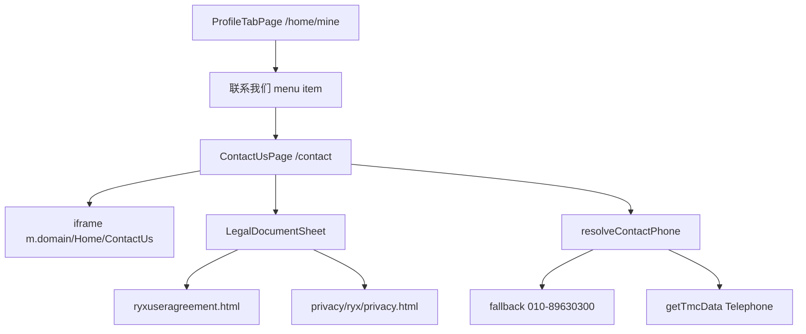

# Contact Us Page (联系我们)

## Legacy behavior (source of truth)

Legacy ryx page: [`tab-tmc-contact-us.page.ts`](file:///Users/liaiguo/private/projects/rongyixing/beeantmobile-main/projects/ryx/src/app/tabs/tab-tmc-contact-us/tab-tmc-contact-us.page.ts)

| Area         | Legacy behavior                                                                                                            |
| ------------ | -------------------------------------------------------------------------------------------------------------------------- |
| Route        | `tab-tmc-contact-us` from 我的 → 联系我们                                                                                  |
| Header       | Title **联系我们**, back button                                                                                            |
| Main content | iframe → `http://m.{domain}/Home/ContactUs` (`domain` = `CONFIG.appDomain`, e.g. `rtesp.cn` / `rongtrip.cn`)               |
| Legal URLs   | `{getApiUrl()}/ryxuseragreement.html`, `{getApiUrl()}/privacy/ryx/privacy.html` (`getApiUrl()` = hardcoded `app.{domain}`) |
| Row 1        | **用户协议** + **隐私政策** (TMC ryx version)                                                                              |
| Row 2        | **联系客服** → `tel:` dial                                                                                                 |
| Phone source | `CONFIG.contactus.phone` (`010-89630300`) → else `TmcApiHomeUrl-Tmc-GetTmcData` → `Telephone`                              |
| No phone     | Alert: `请联系贵公司客服！`                                                                                                |

Current monorepo state: menu item exists but is `comingSoon: true` in [`profile-menu.tsx`](apps/h5/src/config/profile-menu.tsx); no route/page yet. API constant `TMC_GETTMCDATA` exists but `getTmcData()` is not implemented.



## Implementation plan

### 1. Shared types + API

**Add** [`packages/shared-types/src/tmc-data.ts`](packages/shared-types/src/tmc-data.ts) with minimal `TmcData` interface (`Telephone?: string` plus optional hotline fields from legacy entity for future use). Export from [`packages/shared-types/src/index.ts`](packages/shared-types/src/index.ts).

**Extend** [`packages/api/src/apis/tmc.ts`](packages/api/src/apis/tmc.ts):

```ts
getTmcData() {
  return proxy.send<TmcData>({
    method: TMC_METHODS.TMC_GETTMCDATA,
    data: {},
  });
}
```

**Mock**: add handler in [`packages/mock/src/handlers/tmc.ts`](packages/mock/src/handlers/tmc.ts) returning `{ Telephone: "010-89630300" }` (or a distinct test number).

### 2. H5 lib + hook

**Add** [`apps/h5/src/lib/contact-us.ts`](apps/h5/src/lib/contact-us.ts):

- `DEFAULT_CONTACT_PHONE = "010-89630300"` (legacy `CONFIG.contactus.phone`)
- `resolveContactPhone(staticPhone, tmcData?)` — phone → mobile → `Telephone`

**Legacy-aligned URL builders** (mirror `CONFIG.getApiUrl()` + `http://m.${domain}`):

- `getLegacyAppDomain()` — derive host suffix from `VITE_API_BASE_URL` (e.g. `app.rtesp.com` → `rtesp.com`; `app.rongtrip.cn` → `rongtrip.cn`), with `getDomain()` / `VITE_API_DOMAIN` as fallback
- `getAppPortalBaseUrl()` — `http(s)://app.{domain}` (for legal doc URLs)
- `getContactUsIframeUrl()` — `http://m.{domain}/Home/ContactUs`

**H5 improvements** (not legacy; optional when Setting is loaded):

- If `getApi().proxy.getApiConfig()?.Urls?.MobileHomeUrl` is present → use `{MobileHomeUrl}/Home/ContactUs` for iframe (overrides `m.{domain}` swap)
- If `Urls.ClientAppUrl` is present → use it for legal doc base (overrides hardcoded `app.{domain}`)
- Dev proxy note: when `getApiBaseUrl()` is `""`, always resolve external URLs from `VITE_API_BASE_URL`, not same-origin proxy path

- `getUserAgreementUrl()` / `getPrivacyPolicyUrl()` — `{appBase}/ryxuseragreement.html`, `{appBase}/privacy/ryx/privacy.html` (optional `?v=` cache-bust is fine)

**Add** [`apps/h5/src/hooks/useTmcData.ts`](apps/h5/src/hooks/useTmcData.ts) — `useQuery` wrapping `getApi().tmc.getTmcData()`, `staleTime: 5min`, silent failure (page still works with static fallback).

**Tests**: [`apps/h5/src/lib/contact-us.test.ts`](apps/h5/src/lib/contact-us.test.ts) for URL derivation and phone fallback chain.

### 3. UI components

**Add** [`apps/h5/src/components/contact/LegalDocumentSheet.tsx`](apps/h5/src/components/contact/LegalDocumentSheet.tsx) — reuse the bottom-sheet + iframe pattern from [`FlightInsuranceDetailSheet.tsx`](apps/h5/src/components/flight/FlightInsuranceDetailSheet.tsx) (title, close, `min-h-[60vh]` iframe). User confirmed sheet mode.

**Add** [`apps/h5/src/pages/contact/ContactUsPage.tsx`](apps/h5/src/pages/contact/ContactUsPage.tsx):

- `usePageHeader({ visible: false })` + custom header matching [`TravelTaskPage.tsx`](apps/h5/src/pages/travel/TravelTaskPage.tsx) gradient back bar (title **联系我们**, back → `/home/mine`)
- Page bg `#F5F6F9` (profile tab chrome)
- **Top**: iframe area (`flex-1`, white bg, `min-h-[45vh]`)
  - Show loading text while iframe loads
  - On error / blocked embed: show short hint + `浏览器打开` link (pattern from [`TravelIframeView.tsx`](apps/h5/src/components/travel/TravelIframeView.tsx))
- **Bottom**: two white `rounded-lg` cards (reuse row styling from [`ProfileMenuSection.tsx`](apps/h5/src/components/profile/ProfileMenuSection.tsx)):
  1. Combined row: **用户协议** | **隐私政策** as `text-brand-primary` text buttons opening `LegalDocumentSheet`
  2. **联系客服** row with chevron → `onCall()`:
     - `window.location.href = tel:...` (legacy used programmatic `<a>` click)
     - if no phone: `window.alert("请联系贵公司客服！")`

Phone is **not** displayed in the row (legacy template had empty `<p>`); behavior-only alignment.

### 4. Routing + menu wiring

**Update** [`apps/h5/src/app/routes.tsx`](apps/h5/src/app/routes.tsx):

```ts
{
  path: "/contact",
  element: <RootLayout />,
  children: [{ index: true, element: <ContactUsPage /> }],
}
```

**Update** [`apps/h5/src/config/profile-menu.tsx`](apps/h5/src/config/profile-menu.tsx):

```ts
{ id: "contact", label: "联系我们", to: "/contact", icon: ... }
// remove comingSoon: true
```

`ProfileMenuList` will automatically render a `Link` instead of disabled button.

### 5. Verification

```bash
pnpm --filter @ryx/h5 test -- contact-us
pnpm typecheck
```

Manual checklist:

- 我的 → 联系我们 navigates to `/contact`
- iframe loads ContactUs content in proxy mode (`pnpm dev:h5:test`)
- 用户协议 / 隐私政策 open bottom sheet with correct URLs
- 联系客服 dials resolved phone; mock mode uses static fallback
- Back returns to 我的 tab

## Notes / risks

- **URL resolution vs legacy**: Legacy never reads `Urls.MobileHomeUrl` or `Urls.ClientAppUrl` from Setting — it hardcodes `m.{CONFIG.appDomain}` and `app.{CONFIG.appDomain}`. H5 will match that behavior by default and treat Setting Urls as an **optimization** when ApiConfig is already loaded (better multi-tenant / env switching). Document this distinction in code comments.
- **iframe embed**: `m.rtesp.com` may block embedding via `X-Frame-Options` in some environments. Mitigation: fallback link + keep list actions usable (phone + legal docs are not iframe-dependent).
- **Dev proxy**: Vite currently proxies `/Home/*` to `app.*` but not `m.*`. External iframe URL will hit `m.rtesp.com` directly in dev (acceptable; same as legacy). Legal doc URLs can use same-origin `/Home/...` only if we proxy those paths — otherwise use full `VITE_API_BASE_URL` host.
- **Scope**: intentionally excludes commented legacy items (使用手册, footer copyright, 关于我们) per legacy active UI.

## Key files

| Action | File                                                                |
| ------ | ------------------------------------------------------------------- |
| New    | `packages/shared-types/src/tmc-data.ts`                             |
| Edit   | `packages/api/src/apis/tmc.ts`, `packages/mock/src/handlers/tmc.ts` |
| New    | `apps/h5/src/lib/contact-us.ts`, `apps/h5/src/hooks/useTmcData.ts`  |
| New    | `apps/h5/src/pages/contact/ContactUsPage.tsx`                       |
| New    | `apps/h5/src/components/contact/LegalDocumentSheet.tsx`             |
| Edit   | `apps/h5/src/app/routes.tsx`, `apps/h5/src/config/profile-menu.tsx` |
