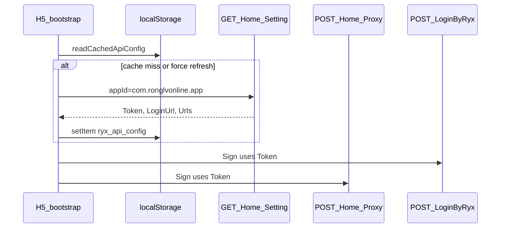

# Dynamic Token from /Home/Setting

## Reasonableness assessment

**Yes — this is the correct approach** for production alignment with the legacy app.

| Aspect               | Assessment                                                                                                                                                |
| -------------------- | --------------------------------------------------------------------------------------------------------------------------------------------------------- |
| Legacy parity        | beeantmobile loads `GET /Home/Setting?appId={packageName}` on startup and caches `Token` + `Urls` + `LoginUrl`                                            |
| Security / env drift | Hardcoded `VITE_API_TOKEN` breaks when test/prod tokens differ; dynamic fetch avoids mismatch                                                             |
| Infra already exists | [`packages/api/src/proxy/api-config.ts`](packages/api/src/proxy/api-config.ts) has `loadApiConfig` + `readCachedApiConfig` (storage key `ryx_api_config`) |
| Setting is unsigned  | `GET /Home/Setting` needs no Token — no chicken-and-egg problem                                                                                           |
| Dev proxy works      | With `getApiBaseUrl()` returning `""` in dev, URL resolves to `/Home/Setting?appId=...` → Vite proxies to `app.rtesp.com`                                 |

**What you gain beyond Token:** same response also provides `LoginUrl` and full `Urls` map (needed later for `direct` mode and microservice routing).

**Trade-off:** one extra HTTP request on cold start (~100ms). Mitigated by localStorage cache (`ryx_api_config`) for subsequent visits.



---

## Current gap (why it does not work today)

1. [`apps/h5/src/lib/api.ts`](apps/h5/src/lib/api.ts) passes `apiConfig: getStaticApiConfig()` — skips Setting when `VITE_API_TOKEN` is set
2. `appId` is **never** passed to `createApi()` ([`packages/api/src/index.ts`](packages/api/src/index.ts) supports it but H5 does not use it)
3. [`useAuth.ts`](apps/h5/src/hooks/useAuth.ts) only calls `loadApiConfig()` when `!hasStaticApiConfig()` — with env token, Setting is never hit
4. No app-start bootstrap — Token is not guaranteed before login page

---

## Implementation plan

### 1. Env & types — remove static Token, add appId

**Files:** [`apps/h5/.env.development`](apps/h5/.env.development), [`.env.example`](apps/h5/.env.example), [`apps/h5/src/vite-env.d.ts`](apps/h5/src/vite-env.d.ts), [`apps/h5/src/lib/env.ts`](apps/h5/src/lib/env.ts)

- Remove `VITE_API_TOKEN` from committed env files (keep commented optional override in `.env.example` only for emergency local debug)
- Add `VITE_APP_ID=com.ronglvonline.app`
- Replace `getStaticApiConfig()` / `hasStaticApiConfig()` with:
  - `getAppId(): string` — reads `VITE_APP_ID`, default `com.ronglvonline.app`
  - `getSettingBaseUrl(): string` — returns real `VITE_API_BASE_URL` (not empty dev proxy base) so Setting URL is always `http://app.rtesp.com/Home/Setting?...` or same-origin `/Home/Setting` in dev

Note: `getApiBaseUrl()` returns `""` in dev for Proxy CORS; Setting fetch should use the same origin (`""` → `/Home/Setting`) which Vite already proxies via `/Home` rule — **no separate base URL needed** if we keep using `getApiBaseUrl()` for Setting in dev.

### 2. API client wiring

**File:** [`apps/h5/src/lib/api.ts`](apps/h5/src/lib/api.ts)

- Pass `appId: getAppId()` to `createApi()`
- Remove `apiConfig: getStaticApiConfig()`
- Optionally seed with `readCachedApiConfig()` import from `@ryx/api` for instant offline reuse (proxy-client already does this internally)

Add new export:

```typescript
export async function bootstrapApi(): Promise<void> {
  if (getApiMode() === "mock") return;
  const api = getApi();
  await api.proxy.loadApiConfig();
}
```

`loadApiConfig()` in proxy-client already persists to `localStorage` via [`api-config.ts`](packages/api/src/proxy/api-config.ts).

### 3. App-start bootstrap (user choice: before login)

**File:** [`apps/h5/src/main.tsx`](apps/h5/src/main.tsx)

- Before `createRoot().render()`, await `bootstrapApi()` when not mock
- On failure: still render app but log error; login will surface Sign failure if no cache exists
- Optional small `ApiBootstrapGate` wrapper component if we want a loading state on splash — minimal scope: await in `main.tsx` is enough for v1

### 4. Simplify login hook

**File:** [`apps/h5/src/hooks/useAuth.ts`](apps/h5/src/hooks/useAuth.ts)

- Remove `hasStaticApiConfig` branch and redundant `loadApiConfig()` call (bootstrap handles it)
- Keep mock-mode early return unchanged

### 5. Optional: use Setting `LoginUrl` dynamically

[`resolve-url.ts`](packages/api/src/proxy/resolve-url.ts) already prefers `apiConfig.LoginUrl` for login methods when present. After bootstrap, `LoginByRyx` URL comes from Setting automatically — can remove redundant `VITE_LOGIN_URL` from `.env.development` (keep as optional override only if needed).

### 6. Docs update

**File:** [`docs/h5-login-troubleshooting.md`](docs/h5-login-troubleshooting.md)

- Update "Recommended dev env" section: remove `VITE_API_TOKEN`, document `VITE_APP_ID` + bootstrap flow

---

## Files touched (summary)

| File                               | Change                                        |
| ---------------------------------- | --------------------------------------------- |
| `apps/h5/src/lib/env.ts`           | Remove static token helpers; add `getAppId()` |
| `apps/h5/src/lib/api.ts`           | Pass `appId`, add `bootstrapApi()`            |
| `apps/h5/src/main.tsx`             | Await bootstrap before render                 |
| `apps/h5/src/hooks/useAuth.ts`     | Remove static-config branch                   |
| `apps/h5/.env.development`         | Remove `VITE_API_TOKEN`, add `VITE_APP_ID`    |
| `apps/h5/.env.example`             | Document new vars                             |
| `apps/h5/src/vite-env.d.ts`        | Type updates                                  |
| `docs/h5-login-troubleshooting.md` | Reflect new flow                              |

**No changes required** to `packages/api` core logic — `loadApiConfig`, `ensureApiConfig`, and Sign in `proxy-client.ts` already use `apiConfig.Token` for all signed requests including `LoginByRyx` and `/Home/Proxy`.

---

## Verification

1. Clear `localStorage` key `ryx_api_config`
2. Remove `VITE_API_TOKEN`, restart `pnpm dev:h5`
3. Network tab: `GET /Home/Setting?appId=com.ronglvonline.app` before login
4. Confirm `ryx_api_config` in Application → Local Storage contains `Token: 41C21104...`
5. Login succeeds; `LoginByRyx` and `/Home/Proxy` form bodies include same `Token`
6. Second page load: Setting may be skipped if cache has Token (until explicit refresh)
