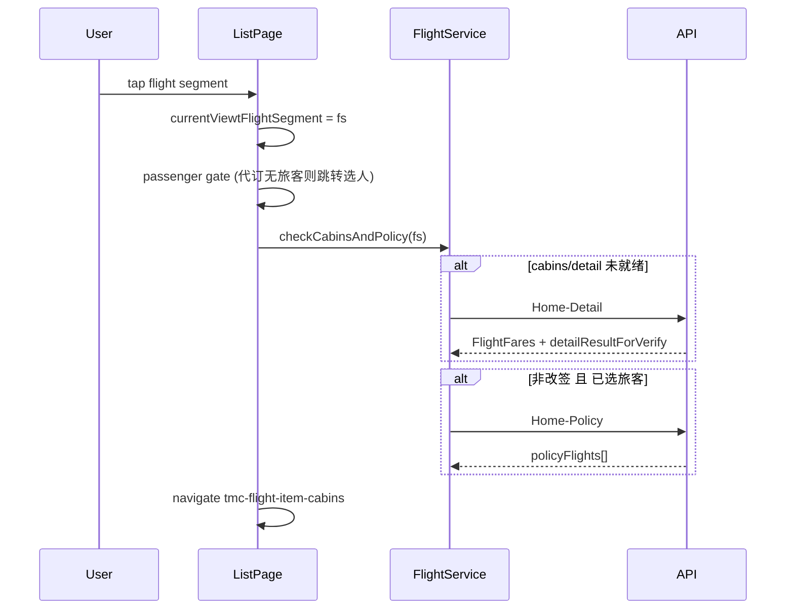
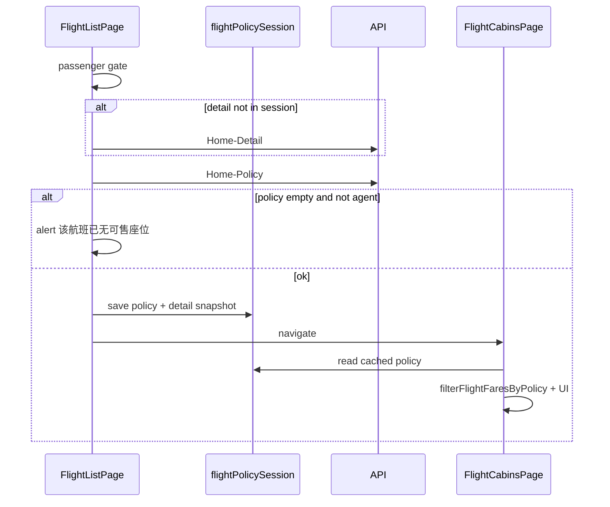
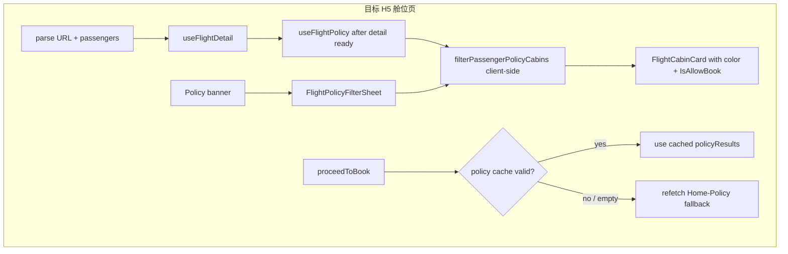

# 机票舱位页差标（Policy）流程分析与补齐计划

## 结论（直接回答）

**是的，legacy ryx 在进入 `tmc-flight-item-cabins_ryx` 之前就会计算/拉取差标。**

列表点击航班时的顺序（[`tmc-flight-list_ryx.base.page.ts`](beeantmobile-main/projects/ryx/src/app/tmc/tmc-flight/tmc-flight-list_ryx/tmc-flight-list_ryx.base.page.ts)）：



舱位页 **不再调 Policy API**，而是读取 `TmcFlightService.policyFlights`，通过 `filterPassengerPolicyCabins()` 做**客户端过滤与着色**（[`tmc-flight.service.ts`](beeantmobile-main/projects/ryx/src/app/tmc/tmc-flight/tmc-flight.service.ts) L208–290）。

截图中的「已按照【申晓杰】的差旅标准过滤舱位」和右上角「过滤差标」，都是舱位页在 **Policy 已就绪** 后的 UI 表现（[`tmc-flight-item-cabins_ryx.page.html`](beeantmobile-main/projects/ryx/src/app/tmc/tmc-flight/tmc-flight-item-cabins_ryx/tmc-flight-item-cabins_ryx.page.html) L40–52）。

---

## 当前 monorepo 实现（有问题之处）

[`FlightListPage.openCabins`](apps/h5/src/pages/flight/FlightListPage.tsx) 仅做旅客校验后直接 `navigate(buildCabinsPath(...))`，**不拉 Detail、不拉 Policy**。

[`FlightCabinsPage`](apps/h5/src/pages/flight/FlightCabinsPage.tsx) 流程：

| 步骤             | Legacy                                 | 当前 H5                                                                                            |
| ---------------- | -------------------------------------- | -------------------------------------------------------------------------------------------------- |
| 进入舱位页前     | Home-Detail（按需）+ Home-Policy       | 无                                                                                                 |
| 舱位页挂载       | 读内存 + 客户端过滤                    | `useFlightDetail` → Home-Detail                                                                    |
| 差标 Policy      | 列表点击时已拉取                       | **仅在 `proceedToBook` 点预订时**调 `getFlightPolicy`                                              |
| 舱位列表         | 按差标过滤 + 色标                      | 仅按航班号 + 经济/商务 Tab；`isFlightFareBookable` 只判断售罄                                      |
| 头部「过滤差标」 | 有                                     | **无**（[`FlightCabinsHeader`](apps/h5/src/components/flight/FlightCabinsHeader.tsx) 仅返回+标题） |
| 横幅文案         | 「已按照【xxx】的差旅标准过滤舱位」    | **无**                                                                                             |
| 预订按钮色/禁用  | success/warning/danger + `IsAllowBook` | 固定蓝色，仅售罄置灰                                                                               |

已有可复用基础（但未接到舱位展示链）：

- [`buildFlightPolicyParams`](apps/h5/src/lib/flight-book-policy.ts) — Policy 请求体组装
- [`buildPassengerFlightPoliciesMap`](apps/h5/src/lib/flight-book-policy.ts) — 按旅客/舱位匹配 policy
- [`isFlightPolicyBookAllowed`](apps/h5/src/lib/flight-book-policy.ts) — 预订拦截（已在 `proceedToBook` 使用）
- 酒店完整参考：[`HotelDetailPage`](apps/h5/src/pages/hotel/HotelDetailPage.tsx) + [`useHotelPolicy`](apps/h5/src/hooks/useHotelList.ts) + [`buildPolicyColorMap`](apps/h5/src/lib/hotel-book-policy.ts) + [`HotelPolicyFilterSheet`](apps/h5/src/components/hotel/HotelPolicyFilterSheet.tsx)

文档也标明舱位 Policy 未完整：[`flight-list-migration-strategy.md`](docs/api/domains/flight-list-migration-strategy.md) Phase B 勾选项「Policy 完整色标 / 过滤差标」仍为 `[ ]`。

---

## Legacy 舱位页差标 UI 行为（对照截图）

1. **默认过滤旅客**（`setDefaultFilteredInfo`）：自用预订 / 仅 1 位旅客 / 首次进入时，自动 `isFilterPolicy = true`。
2. **「过滤差标」**：弹出旅客单选 +「不过滤差标」；确认后只更新 `isFilterPolicy`，**不重新调 Policy API**（客户端重算 `getPolicyCabins()`）。
3. **过滤开启时**：只展示该旅客 `FlightPolicies` 中匹配当前航班号的舱位；合并 Detail 里的完整 fare 数据。
4. **色标规则**：
   - 无 Rules/Descriptions → `success`（绿）
   - 有违规但可订 → `warning`（黄）
   - `IsAllowBook === false` → `danger`（红，按钮禁用）
5. **过滤关闭时**：展示全部舱位，默认 `secondary` 样式。
6. **点预订时**：若 `policyFlights` 为空会**再次**调 Home-Policy（兜底）；若仍为空则 `alert("差标获取失败")`，非代理不可继续。

**注意**：Legacy 对「Policy 返回空」有两套行为，不可混为一谈：

| 场景                                                             | Legacy 行为                                                     |
| ---------------------------------------------------------------- | --------------------------------------------------------------- |
| **列表页** `checkCabinsAndPolicy` 返回 `[]`                      | 非代理阻止进入舱位页（「该航班已无可售座位」）；代理可进        |
| **舱位页** `isFilterPolicy=true` 但 `policyFlights` 无该旅客条目 | 回退为**全部舱位** + `secondary` 默认样式（未进入 filter 分支） |
| **舱位页** 有旅客条目但 `FlightPolicies` 为空                    | 过滤后列表为空                                                  |
| **预订** `onBookTicket` 重拉仍为空                               | `差标获取失败`，非代理 return                                   |

---

## 架构决策（已确认）

**列表点击必须先 Policy 再跳转** — 与 legacy `checkCabinsAndPolicy` 对齐（用户已确认 P0 必做）。

| 阶段         | Legacy                            | 目标 H5                                           |
| ------------ | --------------------------------- | ------------------------------------------------- |
| 列表点击     | Detail（按需）→ Policy → navigate | 同左：`openCabins` 内 await，成功后再 `navigate`  |
| 舱位页挂载   | 读 `policyFlights` 内存           | 读 session/React Query 缓存；缺失或失效时 refetch |
| 切换过滤旅客 | 客户端重算，不 refetch            | 同左                                              |

不再采用「仅在舱位页首次拉 Policy」作为唯一入口；舱位页 `useFlightPolicy` 作为**缓存复用 + 失效补拉**。



---

## 架构建议（舱位页与预订）

舱位页仍拉 `useFlightDetail`（URL 驱动、刷新友好）；Policy 以列表预取结果为主，舱位页仅在缓存缺失/失效时补拉。



**Policy 缓存失效策略（P0-4，补齐原计划缺口）**

Legacy 将 `policyFlights` 放在 service 单例中，舱位页只读内存、**无 TTL**；仅在 `onBookTicket` 时若为空再拉一次。H5 用 React Query 管理，需显式定义失效条件，与现有价格超时机制对齐：

| 失效条件                                                                                                                          | 动作                                                                                  |
| --------------------------------------------------------------------------------------------------------------------------------- | ------------------------------------------------------------------------------------- |
| `detailRouteKey` 变更（航班/日期/起降城市/`flightNumber`）                                                                        | `queryKey` 变化 → 自动 refetch Detail + Policy                                        |
| `passengerSelectionFingerprint` 变更                                                                                              | Policy `queryKey` 含旅客指纹 → refetch                                                |
| `isFlightListTimedOut(priceSnapshotAt)`（10 分钟，与 [`useFlightPriceTimeout`](apps/h5/src/hooks/useFlightPriceTimeout.ts) 一致） | 弹超时窗；用户确认回列表刷新后，Detail/Policy 随新数据重拉                            |
| `proceedToBook` 时 `policyResults` 为空或 `isError`                                                                               | **兜底 refetch**（对齐 legacy `onBookTicket`）；仍失败 → `差标获取失败`，非代理 block |
| 用户切换「过滤差标」旅客                                                                                                          | **不 refetch**（legacy `filterPolicyFlights` 仅客户端重算）                           |

**列表页前置 Policy 规则（P0，对齐 `checkCabinsAndPolicy`）**

- 有已选旅客且非改签：列表点击时 **await Home-Policy**，写入 `flight-policy-session`（或 seed React Query cache）
- Policy 返回空 `[]`：**非代理** → `alert("该航班已无可售座位")`，**不跳转**；**代理** → 允许进入舱位页
- 列表点击期间显示 loading（卡片或全屏），避免重复点击
- Detail：若列表 snapshot 不足以组 Policy payload，列表点击时先拉 Home-Detail（与 legacy `initFlightSegmentCabins` 等价）

`proceedToBook` 伪逻辑：

```
if (policyQuery.data?.length && !policyStale && !policyTimedOut) use cache
else await refetchPolicy()
if still empty && !isAgent → alert + return
```

---

## 需补充的内容（按优先级）

### P0 — 数据链（无 UI 也会错）

0. **列表页 `openCabins` 前置 Policy（必做）**

   - 文件：[`FlightListPage.tsx`](apps/h5/src/pages/flight/FlightListPage.tsx)
   - 流程：`checkCabinsAndPolicy` 等价 — Detail（按需）→ Policy → 写 session → navigate
   - 空 policy 阻断非代理（「该航班已无可售座位」）
   - 新增 [`flight-policy-session.ts`](apps/h5/src/lib/flight-policy-session.ts)（或扩展现有 `flight-list-session`）：按 `detailRouteKey` + `passengerSelectionFingerprint` 存 `FlightPolicyPassengerResult[]`

1. **`useFlightPolicy` hook**（仿 `useHotelPolicy`）

   - 文件：[`apps/h5/src/hooks/useFlight.ts`](apps/h5/src/hooks/useFlight.ts)
   - `enabled`: `detailReady && passengers.length > 0`
   - `queryKey`: `["flight", "policy", params]`

2. **舱位页读取列表预取的 Policy**

   - [`FlightCabinsPage`](apps/h5/src/pages/flight/FlightCabinsPage.tsx) 优先读 session / seeded query cache
   - `useFlightPolicy` 的 `initialData` 或 `enabled: !hasCachedPolicy`；无缓存时再请求
   - 仍用 `buildFlightPolicyParams({ listSnapshot, detailSnapshot, passengers })`

3. **`filterFlightFaresByPolicy` 纯函数**（移植 legacy `filterPassengerPolicyCabins`）

   - 新文件建议：[`apps/h5/src/lib/flight-cabin-policy.ts`](apps/h5/src/lib/flight-cabin-policy.ts)
   - 输入：`FlightFare[]`、`FlightPolicyPassengerResult[]`、`filterPassengerId | null`、`filterEnabled: boolean`、`flightNumber`
   - 输出：带 `color` / `IsAllowBook` / 合并后 `FlightFare` 的展示行
   - 单元测试对照 legacy 三色规则

   **空结果 / 加载态默认行为（显式定义）**

   | 状态                            | H5 行为                                                                                                                  |
   | ------------------------------- | ------------------------------------------------------------------------------------------------------------------------ |
   | Policy **加载中** (`isLoading`) | 舱位列表区显示 loading skeleton（表单/头部可先渲染）                                                                     |
   | Policy **请求失败** (`isError`) | 非代理：顶部错误提示 + 预订时 block（已有 `shouldBlockBookingOnPolicyFetchFailure`）；代理：等同「过滤关闭」展示全部舱位 |
   | Policy **成功但 `[]` 空数组**   | **过滤 ON**：等同 legacy 无匹配旅客 — 展示全部舱位 + 默认样式（`secondary`）；**过滤 OFF**：全部舱位 + 默认样式          |
   | Policy **有数据 + 过滤 ON**     | 仅展示该旅客 `FlightPolicies` 中匹配 `flightNumber` 的舱位 + 色标                                                        |
   | Policy **有数据 + 过滤 OFF**    | 全部舱位 + 默认样式（不看色标）                                                                                          |

4. **`proceedToBook` 缓存复用 + 失效判断**
   - 见上文「Policy 缓存失效策略」
   - 有有效缓存时直接用 `policyQuery.data`；否则兜底 refetch

### P1 — 截图 UI

5. **扩展 [`FlightCabinsHeader`](apps/h5/src/components/flight/FlightCabinsHeader.tsx)**

   - 右侧「过滤差标」按钮（自用/改签场景可按 legacy 隐藏）

6. **`PolicyFilterSheet` 共享组件**

   - 抽取 [`HotelPolicyFilterSheet`](apps/h5/src/components/hotel/HotelPolicyFilterSheet.tsx) 为通用 `PolicyFilterSheet`（旅客单选 +「不过滤差标」+ 确认/取消）
   - 酒店/机票仅传 `productLabel` / `description` 等文案 props；避免复制两份 sheet
   - 机票 wrapper：`FlightPolicyFilterSheet` 薄封装即可

7. **差标横幅组件**

   - 文案：`已按照【{name}】的差旅标准过滤舱位`
   - 点击可展开 legacy「差标标准」图例（绿/黄/红说明）— 可二期

8. **改造 [`FlightCabinCard`](apps/h5/src/components/flight/FlightCabinCard.tsx)** — 过滤 ON/OFF 视觉规范

   | 模式                                       | 舱位列表                 | 预订按钮                                                                                                                     |
   | ------------------------------------------ | ------------------------ | ---------------------------------------------------------------------------------------------------------------------------- |
   | **过滤 OFF** (`policyFilterEnabled=false`) | 展示 Detail 全部可售舱位 | 默认蓝 `#5099fe`；仅售罄置灰（当前行为）                                                                                     |
   | **过滤 ON**                                | 仅展示 policy 匹配舱位   | `success` → 绿 `#5099fe` 或 legacy 绿系；`warning` → 黄/橙提示色；`danger` + `!IsAllowBook` → 红/灰 + **disabled**（非代理） |
   | **过滤 ON + 代理**                         | 同左                     | `IsAllowBook=false` 仍可点（legacy agent 豁免）                                                                              |

   Props：`policyColor?: "success" | "warning" | "danger" | "default"`，`allowBook` 综合售罄 + policy。

9. **默认过滤旅客逻辑**（`setDefaultFilteredInfo` 对齐）

   Legacy 逻辑（[`tmc-flight-item-cabins_ryx.base.page.ts`](beeantmobile-main/projects/ryx/src/app/tmc/tmc-flight/tmc-flight-item-cabins_ryx/tmc-flight-item-cabins_ryx.base.page.ts) L181–187）：

   ```ts
   isFilterPolicy = isSelf || !bookInfo || bookInfos.length === 1;
   ```

   H5 需补齐 **`isSelf`（自用预订）** 数据源——当前 monorepo **尚无** `isSelfBookType()` 等价物：

   - **方案 A（推荐）**：扩展 `member.getProfile()` / `useMemberProfile` 暴露 `BookType`（Legacy `StaffBookType.Self`），实现 `isSelfBookType()`
   - **方案 B（过渡）**：`selectedPassengers.length === 1` 且该旅客 `AccountId` 与当前登录 identity 一致时视为自用
   - 舱位页进入时：若 `isSelfBookType() || passengers.length === 1` → `policyFilterEnabled=true` 且默认选中该旅客
   - 自用预订时隐藏头部「过滤差标」（legacy `*ngIf='!isSelf'` on filter button）

### P2 — 文档与 Mock

10. 更新 [`flight-list-migration-strategy.md`](docs/api/domains/flight-list-migration-strategy.md) 勾选 Policy 项
11. Mock：确保 [`packages/mock/src/handlers/flight.ts`](packages/mock/src/handlers/flight.ts) `HOME_POLICY` 返回多舱位、多色标 fixture 便于 UI 验收

（列表页「过滤差标」入口 legacy 有但不滤列表行 — 仍后置，非截图必达）

---

## 当前处理方式是否有问题？

| 维度                                | 评估                                             |
| ----------------------------------- | ------------------------------------------------ |
| 列表直达舱位、Policy 在列表点击时拉 | **P0 必做** — 对齐 legacy `checkCabinsAndPolicy` |
| Policy 仅在预订时拉                 | **有问题** — 计划 P0 改为列表+舱位页双阶段       |
| 无过滤 UI / 无色标                  | **缺失** — 企业差旅核心能力                      |
| 预订时才 `alert` 拦截超标           | **体验差** — 应在列表展示阶段即禁用/标色         |
| 已有 `flight-book-policy.ts`        | 基础够用，缺舱位列表侧的 filter/color 层         |

---

## 建议实施顺序

1. `flight-policy-session.ts` + list `openCabins` 前置 Policy（含非代理阻断）
2. `flight-cabin-policy.ts` + tests
3. `useFlightPolicy` + `FlightCabinsPage` 读缓存/补拉
4. `FlightCabinCard` 色标 + `IsAllowBook`
5. `PolicyFilterSheet` + 机票 header / 横幅
6. `proceedToBook` 缓存复用 + 失效判断
7. `isSelfBookType` + Mock/文档/Proxy 验收

验收标准：列表点击有 loading，Policy 成功后才进舱位页；非代理遇空 policy 被阻断；进舱位页后出现截图同款横幅；切换过滤旅客后列表与按钮色同步；超标舱非代理不可预订。
