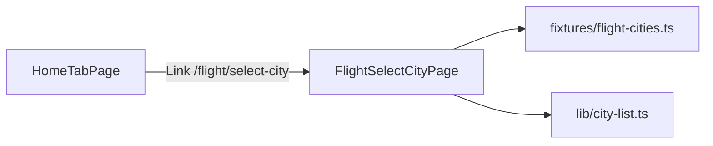

# Flight Select City Page (Home Entry + UI Shell)

## Goal

Add a dev entry on the home tab and a standalone city-picker page matching [`docs/设计图/机票/机票——选择出发城市.png`](docs/设计图/机票/机票——选择出发城市.png). Scope is **UI + navigation only**; data from mock fixtures until flight Resource API is wired later.

## Architecture



- Route lives **outside** [`TabLayout`](apps/h5/src/app/layouts/TabLayout.tsx) (no bottom tab bar on picker).
- Page is **self-contained** (like [`PasswordLoginPage`](apps/h5/src/pages/PasswordLoginPage.tsx)), not [`H5Shell`](apps/h5/src/components/H5Shell.tsx) — design has custom gradient header + back.

## 1. Home entry

Update [`HomeTabPage.tsx`](apps/h5/src/pages/home/HomeTabPage.tsx):

- Below [`HomeServiceEntries`](apps/h5/src/components/home/HomeServiceEntries.tsx), add a simple white card with a `Link` to `/flight/select-city`.
- Label: **机票-选择城市** (as requested).
- Keep existing flight/train/hotel icons unchanged (flight icon stays non-linked).

## 2. Routing

Update [`routes.tsx`](apps/h5/src/app/routes.tsx):

```tsx
{ path: "/flight/select-city", element: <FlightSelectCityPage /> }
```

Top-level route (sibling to `/home`, `/hotel`), no layout wrapper.

## 3. Scroll layout strategy

Single-column flex shell; **one scroll container** for all city content below the search bar:

- **Header**: normal flow (`shrink-0`), not `position: fixed`.
- **Search bar**: normal flow below header (`shrink-0`); does not stick on scroll in v1.
- **List**: `flex-1 overflow-y-auto` — only this region scrolls; `padding-right` reserved for index rail (~24px).
- **Alphabet index**: `position: fixed; right: 0; top: 50%; transform: translateY(-50%)` — overlays scroll area.
- Back button uses same `exitPicker()` as city selection (see §3.1).

## 3.1 Page regions (match design)

New page: [`apps/h5/src/pages/flight/FlightSelectCityPage.tsx`](apps/h5/src/pages/flight/FlightSelectCityPage.tsx)

| Region       | Design                                                   | Implementation                                                           |
| ------------ | -------------------------------------------------------- | ------------------------------------------------------------------------ |
| Header       | Back + title「选择出发城市」, light blue gradient        | `exitPicker()` helper; `pt-[env(safe-area-inset-top)]`                   |
| Search       | Input +「搜索」button, placeholder「搜索城市或车站名称」 | Controlled input; filter on change / search tap                          |
| 出差单内城市 | 3-col chip grid, one blue (v1 placeholder)               | Show when mock travel-form cities exist; see §3.2                        |
| 热门城市     | 3-col chip grid                                          | `IsHot === true` from mock; hidden when search active and no hot matches |
| A–Z list     | Section headers + rows                                   | `groupByFirstLetter` on filtered list                                    |
| Right rail   | Letter jump index                                        | **Only letters that exist in filtered data** (not full A–Z)              |
| Empty        | —                                                        | When `keyword` non-empty and all regions empty →「未找到匹配城市」       |

Background: `bg-[#F5F6F8]` (matches TabLayout main).

**Navigation (back + select):** never bare `navigate(-1)` — direct visit / refresh leaves empty history stack.

```ts
function exitPicker(selectedCity?: FlightCityOption) {
  const state = selectedCity ? { selectedCity } : undefined;
  if (window.history.length > 1) {
    navigate(-1, { state });
  } else {
    navigate("/home", { state });
  }
}
```

- Back button → `exitPicker()`
- City chip/row tap → `exitPicker(city)`

**Search empty state:** when `keyword.trim()` is non-empty and filtered travel-form + hot + alphabet groups are all empty, render「未找到匹配城市」in the scroll region.

## 3.2 Travel-form blue chip (v1 placeholder)

Design shows one pre-selected blue chip (e.g. 天津西). v1 is **visual-only mock** via `MOCK_DEFAULT_SELECTED_CODE` in fixtures. Tapping any city immediately calls `exitPicker(city)`. Real travel-form binding deferred to follow-up.

## 4. Extracted components (app-local)

Under `apps/h5/src/components/flight/`:

- `FlightCitySearchBar.tsx` — search input + button
- `CityChipSection.tsx` — titled 3-column grid; optional `selectedCode` for placeholder highlight
- `CityAlphabetList.tsx` — scrollable grouped list with section `id="letter-{X}"` anchors
- `AlphabetIndex.tsx` — fixed right rail; props: `letters: string[]` (derived from grouped keys only)
- `CitySearchEmpty.tsx` —「未找到匹配城市」when search has no matches

Shared util: [`apps/h5/src/lib/city-list.ts`](apps/h5/src/lib/city-list.ts)

- `deriveFirstLetter(pinyin)` — `pinyin[0].toUpperCase()` (fallback when `FirstLetter` missing)
- `groupByFirstLetter(items)` — groups on `FirstLetter`; fallback via `deriveFirstLetter(Pinyin)`
- `filterCities(items, keyword)` — match `Name`, `Nickname`, `Code`, `Pinyin` (case-insensitive)
- `getAvailableLetters(groups)` — sorted unique keys for index rail

**FirstLetter rule:** fixtures precompute `FirstLetter` from `Pinyin`; utils fall back for future API rows missing the field.

## 5. Mock data

New [`apps/h5/src/fixtures/flight-cities.ts`](apps/h5/src/fixtures/flight-cities.ts):

- Type `FlightCityOption` (subset of legacy `TrafficlineEntity`: `Code`, `Name`, `Nickname`, `Pinyin`, `FirstLetter`, `IsHot`)
- `MOCK_TRAVEL_FORM_CITIES` — 6 items mirroring design (北京南, 天津西, …)
- `MOCK_DEFAULT_SELECTED_CODE` — v1 placeholder for blue chip highlight
- `MOCK_HOT_CITIES` — 9 hot cities (北京, 上海, …)
- `MOCK_ALL_CITIES` — A-section + enough letters for scroll/index demo; each includes `Pinyin` + derived `FirstLetter`

No changes to `packages/api` in this step.

## 6. Tests

Colocated [`apps/h5/src/lib/city-list.test.ts`](apps/h5/src/lib/city-list.test.ts):

- `deriveFirstLetter` / `groupByFirstLetter` — grouping, empty input, missing FirstLetter fallback
- `filterCities` — match by Name, Code, Pinyin; empty keyword returns all; no match returns `[]`
- `getAvailableLetters` — only letters present in grouped data

Run: `pnpm --filter @ryx/h5 test`

## 7. Accessibility & mobile

- Back button: `aria-label="Go back"`
- Chip buttons: `min-h-11` touch targets
- Alphabet index: `aria-label` per letter
- List sections: `role="list"` / `role="listitem"`

- Empty state: `role="status"`

## 8. Out of scope (follow-up)

- `TmcApiHomeUrl-Resource-Airport` API + `useFlightAirports()` hook
- International tab (legacy has 国内/国际 segment)
- Travel-form cities from real `GetTravelUrl` / booking flow
- Wiring flight icon on home to this page

- Wiring flight icon on home to this page
- Sticky search bar on scroll

## Files to add/change

| Action | File                                                                               |
| ------ | ---------------------------------------------------------------------------------- |
| Edit   | [`apps/h5/src/pages/home/HomeTabPage.tsx`](apps/h5/src/pages/home/HomeTabPage.tsx) |
| Edit   | [`apps/h5/src/app/routes.tsx`](apps/h5/src/app/routes.tsx)                         |
| Add    | `apps/h5/src/pages/flight/FlightSelectCityPage.tsx`                                |
| Add    | `apps/h5/src/components/flight/*.tsx` (5 small components)                         |
| Add    | `apps/h5/src/fixtures/flight-cities.ts`                                            |
| Add    | `apps/h5/src/lib/city-list.ts`                                                     |
| Add    | `apps/h5/src/lib/city-list.test.ts`                                                |

## Verification

1. `pnpm --filter @ryx/h5 typecheck && pnpm --filter @ryx/h5 test`
2. Manual: Home →「机票-选择城市」→ full-screen picker; back returns to tab home
3. Direct visit `/flight/select-city` → select city → lands on `/home` with state (not blank / external)
4. Search with no match →「未找到匹配城市」
5. Index rail shows only letters present in list; tap scrolls to section
