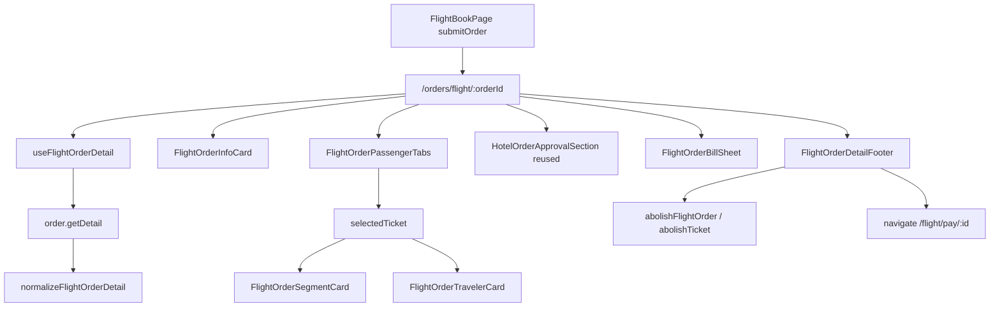

# Flight Order Detail Page

## Goal

Replace the placeholder [`OrderFlightDetailPage.tsx`](apps/h5/src/pages/order/OrderFlightDetailPage.tsx) with a production-ready page aligned with:

- **Design**: [`docs/需求实施/机票/飞机票-订单详情.png`](docs/需求实施/机票/飞机票-订单详情.png)
- **Legacy behavior**: `tmc-order-flight-detail_ryx` in beeantmobile `tmc-order-flight-detail.base.page.ts`
- **Existing patterns**: mirror hotel detail migration ([`OrderHotelDetailPage.tsx`](apps/h5/src/pages/order/OrderHotelDetailPage.tsx), [hotel order detail plan](.cursor/plans/hotel_order_detail_page_e528e62b.plan.md))

**Navigation fix (confirmed)**: After `Flight-Book` success, **always** `replace` to `/orders/flight/:orderId` — remove the current branch that skips to `/flight/pay/:id` from [`FlightBookPage.tsx`](apps/h5/src/pages/flight/FlightBookPage.tsx) (~L442–448). Payment remains available from detail footer and list actions.



---

## Current gaps

| Area              | Today                                                       | Needed                                         |
| ----------------- | ----------------------------------------------------------- | ---------------------------------------------- |
| Page UI           | Minimal dl list + single pay link                           | Full layout per screenshot                     |
| Post-book nav     | Person pay → `/flight/pay`                                  | Always → detail page                           |
| `order.getDetail` | Summary via `mapFlightDetail` only                          | Full `normalizeFlightOrderDetail`              |
| Types             | `OrderDetailResponse = HotelOrderDetail`                    | Flight tickets/trips/travelers on detail model |
| Cancel API        | Method constants only                                       | `cancelFlight` / `abolishTicket` on `OrderApi` |
| Mock              | Summary-only `FLT*` fixture; `ORD-FLT-*` returns hotel data | Legacy-shaped flight fixture + handler routing |
| Polling           | None on flight detail                                       | 3s while transitional ticket statuses (legacy) |

---

## Phase 1 — Types and API adapter

### 1.1 Extend shared types

Add [`packages/shared-types/src/flight-order.ts`](packages/shared-types/src/flight-order.ts) (export from index):

- `FlightOrderTrip` — segment fields from `OrderFlightTrips[]`: cities, airports/terminals, times, `FlightNumber`, `CodeShareNumber`, `PlaneType`, `CabinType`, `FlyTime`, `IsStop`, `StopCities`, airline logo/name
- `FlightOrderTicket` — per `OrderFlightTickets[]`: `Id`, `Key`, `StatusName`, `FullTicketNo`, `Explain`, `Trips[]`, `Traveler`
- `FlightOrderTraveler` — from `OrderPassengers` + `OrderTravels` by ticket `Key`: name, type, masked credential, mobile, email, cost center, org, expense type, illegal policy/reason
- `FlightOrderActionFlags` — reuse shape from `HotelOrderActionFlags` (`showPay`, `showCancel`, `showInspurRepush`)
- `FlightCancelParams` — `{ OrderId, TicketId, Channel }`
- `FlightAbolishTicketParams` — `{ OrderId, TicketId, Tag: "flight" }`

Extend [`HotelOrderDetail`](packages/shared-types/src/hotel.ts) (or alias as `OrderDetailResponse`) with flight-only optional fields:

```ts
Tickets?: FlightOrderTicket[];
PayHoldMinutes?: number; // from VariablesObj.OrderPayHoldTime
```

Keep existing summary fields (`RouteTitle`, `TicketStatusName`, etc.) for pay/result pages.

### 1.2 `normalizeFlightOrderDetail`

In [`packages/api/src/apis/order-detail-map.ts`](packages/api/src/apis/order-detail-map.ts):

- Add `mapLegacyFlightDetail(payload)` — parse `Order`, `OrderFlightTickets`, `OrderFlightTrips`, `OrderPassengers`, `OrderTravels`, `OrderItems`, `Histories`, `VariablesObj`
- **Ticket tabs**: one per `OrderFlightTicket`, sorted by `Id` desc; append “original” tickets after active (legacy `orderFlightTicketsTabs` logic)
- **Traveler join**: match `OrderTravels` by ticket `Key`
- **Actions** (`buildFlightActionFlags`):
  - `showPay`: any ticket `StatusName` includes `预订成功` AND `TravelPayType` is person(2) or credit(4) AND `PayHoldMinutes > 0` with active countdown
  - `showCancel`: same hold window + `isShowPay` equivalent (legacy footer visibility)
  - Map `OrderPayHoldTime` → `PayHoldMinutes`
- **Status display**: map `等待处理` → `等待审批` (legacy)
- Add `shouldNormalizeFlightDetail(data, summary)` — true when `ProductType === "Flight"` or `OrderFlightTickets.length > 0`
- Export `normalizeFlightOrderDetail`

Wire in [`packages/api/src/apis/order.ts`](packages/api/src/apis/order.ts) `getDetail`:

```ts
if (shouldNormalizeFlightDetail(raw, summary)) return normalizeFlightOrderDetail(raw);
if (shouldNormalizeHotelDetail(raw, summary)) return normalizeHotelOrderDetail(raw);
return summary;
```

### 1.3 Cancel APIs

Extend `OrderApi`:

- `cancelFlight(params: FlightCancelParams)` → `TmcApiOrderUrl-Order-AbolishOrder` with `Tag: "flight"`
- `abolishFlightTicket(params: FlightAbolishTicketParams)` → `TmcApiOrderUrl-Order-AbolishTicket`

Reuse existing `checkInspurRepush` for flight footer.

Add adapter tests in `order-detail-map.test.ts` using legacy fixture shaped like existing flight test (~L10–40) but with full tickets/travels/items.

---

## Phase 2 — H5 lib and hooks

### 2.1 [`apps/h5/src/lib/flight-order-detail.ts`](apps/h5/src/lib/flight-order-detail.ts)

Mirror [`hotel-order-detail.ts`](apps/h5/src/lib/hotel-order-detail.ts):

- `coerceFlightOrderDetail`, `getSelectedTicket`, `filterBillLinesForTicket`
- `resolveCancelTarget` — pay-hold cancel only: `tickets.length > 1` → abolish **last** ticket (`AbolishTicket`); `length === 1` → abolish order (`AbolishOrder`). Document that 退票 uses `RefundFlight` elsewhere (order list), not this helper
- `shouldShowFooter`, `formatPayHoldCountdownZh` — `mm分ss秒` for screenshot header (separate from pay page `02:05` format)
- `isTransitionalFlightStatus` — for polling set: `Booking`, `Booked`, `Issuing`, `BookExchanging`, `BookExchanged`, `Exchanging`, `Abolishing`, `ExchangeAbolishing`
- Reuse `formatTravelPayType`, `formatOrderDateTime`, `formatTravelerCredentialDisplay` from hotel lib

### 2.2 [`apps/h5/src/hooks/useFlightOrderDetail.ts`](apps/h5/src/hooks/useFlightOrderDetail.ts)

- `useFlightOrderDetail(orderId)` — `refetchInterval: 3000` while any ticket in transitional status (legacy 3s)
- `useCancelFlightOrder()` — calls `cancelFlight` or `abolishFlightTicket` based on ticket count
- Reuse `useInspurRepush` from hotel hook (same API)

---

## Phase 3 — UI components (`apps/h5/src/components/order/flight/`)

Reuse chrome from [`hotel-detail-chrome.ts`](apps/h5/src/components/hotel/hotel-detail-chrome.ts) and [`HotelOrderDetailRow.tsx`](apps/h5/src/components/order/hotel/HotelOrderDetailRow.tsx).

| Component                  | Responsibility  | Design notes                                                                                                                                                                                                                                                                                                                                                                        |
| -------------------------- | --------------- | ----------------------------------------------------------------------------------------------------------------------------------------------------------------------------------------------------------------------------------------------------------------------------------------------------------------------------------------------------------------------------------- |
| `FlightOrderInfoCard`      | 订单信息        | Title + **支付剩余 mm分ss秒** + `OrderStatusBadge`; rows: 订单编号, 付款方式, 完成时间, 订单金额 + 账单明细 link                                                                                                                                                                                                                                                                    |
| `FlightOrderPassengerTabs` | 乘机人切换      | Copy pill style from [`HotelOrderRoomTabs`](apps/h5/src/components/order/hotel/HotelOrderRoomTabs.tsx); label = passenger name; hide when single ticket                                                                                                                                                                                                                             |
| `FlightOrderSegmentCard`   | 航班信息        | Route header `上海 -> 北京` + ticket status badge (green 已出票); date/duration row; inner gray box with times/airports; center arrow + duration + flight no; airline row; **退改签说明 ›** opens [`FlightFareRulesSheet`](apps/h5/src/components/flight/FlightFareRulesSheet.tsx) or inline `Explain` text sheet                                                                   |
| `FlightOrderTravelerCard`  | 旅客信息        | Same rows as screenshot: 姓名(成人), 证件, 电话, 邮箱, 成本中心, 组织架构, 费用类别, 违规内容                                                                                                                                                                                                                                                                                       |
| `FlightOrderBillSheet`     | 账单明细        | **New component** — reuse bottom-sheet chrome pattern from [`FlightBookBillSheet`](apps/h5/src/components/flight/FlightBookBillSheet.tsx) (already implemented on book page) + **data model** from [`HotelOrderBillSheet`](apps/h5/src/components/order/hotel/HotelOrderBillSheet.tsx) (`OrderItems` lines filtered by ticket). No runtime dependency on `FlightBookBillBreakdown`. |
| `FlightOrderDetailFooter`  | 取消 / 立即支付 | Same layout as [`HotelOrderDetailFooter`](apps/h5/src/components/order/hotel/HotelOrderDetailFooter.tsx)                                                                                                                                                                                                                                                                            |
| `FlightOrderCancelDialog`  | 取消确认        | Simple confirm: `是否取消预订？`                                                                                                                                                                                                                                                                                                                                                    |

**Segment card layout**: borrow timeline patterns from [`FlightCabinsSummary`](apps/h5/src/components/flight/FlightCabinsSummary.tsx) + route arrow asset; adapt for order trip DTO (not `FlightSegment`).

**Page chrome**: `usePageHeader({ tone: "hotel", title: "订单详情" })` — same sky gradient as hotel detail; page bg `#F5F6F9`.

---

## Phase 4 — Rewrite detail page

Replace [`OrderFlightDetailPage.tsx`](apps/h5/src/pages/order/OrderFlightDetailPage.tsx) following [`OrderHotelDetailPage.tsx`](apps/h5/src/pages/order/OrderHotelDetailPage.tsx) structure:

- State: `selectedTicketIndex`, `billOpen`, `cancelOpen`, `rulesOpen`, toast
- `handleBack` → `/home/orders?tab=flight` (close sheets first)
- Support `location.state.action === "cancel"` from list (future)
- Render: InfoCard → Tabs → SegmentCard → TravelerCard → **HotelOrderApprovalSection** (`Histories`)
- Inspur repush button when `checkInspurRepush` true (same block as hotel page)
- Footer padding offset when actions visible
- Pay → `navigate(/flight/pay/:orderId)`
- Cancel → confirm dialog → `useCancelFlightOrder` with legacy ticket selection logic

**Hook migration (scoped)**: `OrderFlightDetailPage` switches from `useOrderDetail` → `useFlightOrderDetail`. **Do not remove** `useOrderDetail` from [`useHotelBook.ts`](apps/h5/src/hooks/useHotelBook.ts) — it remains required by `HotelResultPage`, `OrderPayPage`, `FlightResultPage`, and `FlightPayPage` (summary fields only).

---

## Phase 5 — Navigation and list integration

### 5.1 [`FlightBookPage.tsx`](apps/h5/src/pages/flight/FlightBookPage.tsx)

After successful book (non-save):

```ts
if (orderId) {
  finishBookNavigation(`/orders/flight/${orderId}`, {
    bookedOrderId: orderId,
    product: "flight",
  });
  return;
}
```

**Remove the entire `IsCheckPay` block from flight book** (not ambiguous):

- Delete `submitPhase` state (`"book" | "checkPay"`) and `submitPendingLabel` checkPay branch
- Delete `pollFlightCheckPay` + `shouldNavigateToPay` usage in [`FlightBookPage.tsx`](apps/h5/src/pages/flight/FlightBookPage.tsx)
- Navigate to detail immediately after `submitBook` resolves with `orderId`

**Keep the module** [`flight-book-check-pay.ts`](apps/h5/src/lib/flight-book-check-pay.ts) — [`hotel-book-check-pay.ts`](apps/h5/src/lib/hotel-book-check-pay.ts) re-exports it for hotel book pay navigation. Detail page status polling (`useFlightOrderDetail` 3s) replaces checkPay as the post-book readiness mechanism for flight.

Optional cleanup: move `shouldNavigateToPay` tests out of [`order-pay.test.ts`](apps/h5/src/lib/order-pay.test.ts) into a dedicated `flight-book-check-pay.test.ts` (hotel-only consumer remains).

### 5.2 [`OrderListPage.tsx`](apps/h5/src/pages/order/OrderListPage.tsx)

- Wire flight **取消** action → navigate to detail with `{ action: "cancel" }` (replace toast)
- Flight **支付** → keep `/flight/pay/:id` or detail (both valid)

---

## Phase 6 — Mock, tests, docs

### Mock ([`packages/mock/src/fixtures/order.ts`](packages/mock/src/fixtures/order.ts))

- Add `createMockFlightOrderDetailLegacy(orderId)` with:
  - 2+ `OrderFlightTickets` (multi-passenger tabs)
  - Full `OrderFlightTrips`, `OrderPassengers`, `OrderTravels`, `OrderItems`
  - `Variables`: `{ OrderPayHoldTime: 8, isPay: true }`, `TravelPayType: "公付"`
  - `Histories` sample
  - Ticket statuses: one `预订成功` / `待付款` scenario for footer
- Fix `resolveOrderDetailPayload` / hotel handler: `ORD-FLT-*` and `FLT*` → flight legacy fixture (not hotel)
- Mock handlers for `AbolishOrder` / `AbolishTicket` (flight tag)

### Tests

- `order-detail-map.test.ts`: full flight normalization cases (multi-ticket, actions, traveler join)
- `flight-order-detail.test.ts`: footer actions, cancel ticket selection, countdown formatting

### Docs

- Update [`docs/api/PAGE-API-MATRIX.md`](docs/api/PAGE-API-MATRIX.md) flight detail row to `[x]`
- Add brief section to [`docs/api/domains/flight-pay-migration-strategy.md`](docs/api/domains/flight-pay-migration-strategy.md) noting post-book always lands on detail

---

## Legacy business rules (must match)

| Rule                                                   | Implementation                                                                                                                                                                                                                                        |
| ------------------------------------------------------ | ----------------------------------------------------------------------------------------------------------------------------------------------------------------------------------------------------------------------------------------------------- |
| Footer visible                                         | Only when pay hold countdown active (`OrderPayHoldTime > 0`)                                                                                                                                                                                          |
| Pay button                                             | Person(2) or Credit(4) + ticket status contains `预订成功`                                                                                                                                                                                            |
| Cancel button                                          | Shown with pay during hold window                                                                                                                                                                                                                     |
| Cancel API (detail footer, pay-hold **取消预订** only) | `tickets.length > 1` → `AbolishTicket` on **last** ticket (改签后取消事务); `length === 1` → `AbolishOrder` via `cancelFlight`. **Not** 退票 — list-side `RefundFlight` / `onRefundFlightTicket` is a separate API and out of scope for detail footer |
| Status polling                                         | 3s while transitional statuses                                                                                                                                                                                                                        |
| Pay action                                             | Navigate to `/flight/pay/:orderId` (H5 product decision; legacy used inline pay modal)                                                                                                                                                                |
| Approval                                               | Render `Histories` via existing `HotelOrderApprovalSection`                                                                                                                                                                                           |

---

## Risk / proxy note

Proxy flight `Order-Detail` may still hit backend SQL error (`FromCityName` column) per [`docs/api/task-list.md`](docs/api/task-list.md). Development and CI should rely on enriched mock fixture until proxy is unblocked.

---

## Suggested implementation order

1. Types + `normalizeFlightOrderDetail` + tests
2. Mock legacy fixture + handler routing
3. `flight-order-detail.ts` + `useFlightOrderDetail`
4. UI components (info → tabs → segment → traveler → bill → footer)
5. Rewrite `OrderFlightDetailPage`
6. Navigation fix in `FlightBookPage` + list cancel wiring
7. Cancel API on `OrderApi` + dialog flow
