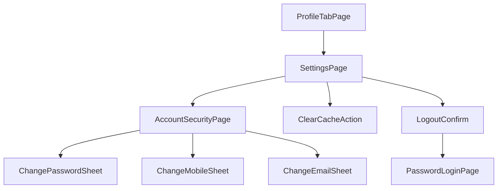

# H5 设置页与账户安全实现计划

## 目标与范围

| 页面     | 新路由               | Legacy                 | 核心能力                                         |
| -------- | -------------------- | ---------------------- | ------------------------------------------------ |
| 设置     | `/settings`          | `account-setting_ryx`  | `GetItems` 菜单、清除缓存、版本信息、退出登录    |
| 账户安全 | `/settings/security` | `account-security_ryx` | `Home-Get` 摘要、改登录密码、手机/邮箱绑定与修改 |

**入口改造**（显式 checklist）：

- [`apps/h5/src/config/profile-menu.tsx`](apps/h5/src/config/profile-menu.tsx)：「设置」改为 `{ id: "settings", label: "设置", to: "/settings", icon: ... }`，**移除 `comingSoon`**
- **无需修改** [`ProfileMenuSection.tsx`](apps/h5/src/components/profile/ProfileMenuSection.tsx)：类型已定义 `to?: string`、`comingSoon?: boolean`；渲染条件为 `item.to && !item.comingSoon` → `<Link>`，与「证件管理」(`to: "/credentials"`) 相同模式，改 config 即可生效

**不在本期**：微信/钉钉/飞书/设备绑定（需 OAuth/Cordova，ryx 质量参差）；消息中心独立页（若 `GetItems` 返回可先做外链或占位）。

---

## 用户流程



---

## 1. 数据层（`packages/api` + `packages/shared-types` + `packages/mock`）

### 1.1 类型（新建 [`packages/shared-types/src/account.ts`](packages/shared-types/src/account.ts)）

定义可适配 Beeant 响应的 DTO（实现时先用 proxy 抓包校准字段名）：

- `AccountSettingsItem`：`Name`, `Url?`, `Type?`, `Value?`, `Route?`（兼容 `GetItems` 动态项）
- `AccountSettingsItemsResponse`：`Items: AccountSettingsItem[]`
- `AccountHomeSummary`：`Mobile?`, `HideMobile?`, `Email?`, `HideEmail?`, `HasPassword?` 等（来自 `ApiAccountUrl-Home-Get`）
- `ModifyPasswordParams`：`OldPassword`, `NewPassword`, `ConfirmPassword`
- `MobileSecurityLoad` / `EmailSecurityLoad`：当前绑定状态
- `MobileSecurityAction` / `EmailSecurityAction`：验证码 + 新值提交体

从 [`packages/shared-types/src/index.ts`](packages/shared-types/src/index.ts) 导出。

### 1.2 API Methods（新建 flow 文件）

| 文件                                                                                     | Methods                                                                        |
| ---------------------------------------------------------------------------------------- | ------------------------------------------------------------------------------ |
| [`packages/api/src/methods/account-flow.ts`](packages/api/src/methods/account-flow.ts)   | `HOME_GET`, `HOME_GETITEMS`, `HOME_LOGOUT`                                     |
| [`packages/api/src/methods/password-flow.ts`](packages/api/src/methods/password-flow.ts) | `PASSWORD_MODIFY`, `MOBILE_LOAD/SENDCODE/ACTION`, `EMAIL_LOAD/SENDCODE/ACTION` |

复用已有常量：[`packages/api/src/methods/member.ts`](packages/api/src/methods/member.ts)（Account URL）、[`packages/api/src/methods/auth.ts`](packages/api/src/methods/auth.ts)（Password URL）。

### 1.3 API 封装

- 新建 [`packages/api/src/apis/account.ts`](packages/api/src/apis/account.ts)：`getSettingsItems()`, `getHomeSummary()`, `logout()`
- 新建 [`packages/api/src/apis/account-security.ts`](packages/api/src/apis/account-security.ts)：`loadMobile()`, `sendMobileCode()`, `submitMobileAction()`, `loadEmail()`, `sendEmailCode()`, `submitEmailAction()`, `modifyPassword()`
- 在 [`packages/api/src/index.ts`](packages/api/src/index.ts) 挂到 `createApi()`：`account`, `accountSecurity`
- 退出登录（**best-effort**，与 ryx `account.service` 顺序一致）：
  1. `ApiAccountUrl-Home-Logout`（`account.logout()`）
  2. `ApiLoginUrl-Home-Logout`（[`authProxy.logout()`](packages/api/src/apis/auth-proxy.ts)）
  3. **无论任一步成功或失败**（含第一个失败第二个成功、两个都失败），均在 `finally` 中执行：`clearSession()` + `queryClient.clear()` + `resetApi()`（内含 [`clearApiConfigCache()`](apps/h5/src/lib/api.ts)）+ `navigate("/login/password", { replace: true })`
  4. 仅在两步都失败时可选 toast 提示「已退出本地登录」；不向用户阻塞在已登出状态

### 1.4 Mock

- [`packages/mock/src/fixtures/account.ts`](packages/mock/src/fixtures/account.ts)：设置菜单项（账户安全、清除缓存、版本）、账户摘要、改密/手机/邮箱成功响应
- [`packages/mock/src/handlers/account.ts`](packages/mock/src/handlers/account.ts)：注册上述 Methods
- 接入 [`packages/mock/src/create-default-mock-handler.ts`](packages/mock/src/create-default-mock-handler.ts)（或现有聚合入口）

### 1.5 适配与测试

- [`packages/api/src/apis/account-settings-adapter.ts`](packages/api/src/apis/account-settings-adapter.ts)：将 `GetItems` 映射为内部 `SettingsMenuAction` 枚举（`navigate` / `action` / `external` / `display`）
- 单元测试：adapter 映射、[`apps/h5/src/lib/account-settings.ts`](apps/h5/src/lib/account-settings.ts) 表单校验（密码强度、手机号、验证码）

**实现注意**：若 proxy 下 `GetItems` 字段与假设不符，以 `http://app.rtesp.com` 抓包结果更新 adapter，mock 保持同一结构。

---

## 2. H5 页面与组件

### 2.1 路由

在 [`apps/h5/src/app/routes.tsx`](apps/h5/src/app/routes.tsx) 增加（与 [`/credentials`](apps/h5/src/app/routes.tsx) 相同 `RootLayout` 壳）：

```tsx
{
  path: "/settings",
  element: <RootLayout />,
  children: [
    { index: true, element: <SettingsPage /> },
    { path: "security", element: <AccountSecurityPage /> },
  ],
},
```

可选：`/me/settings` → `Navigate` 到 `/settings`（对齐 [PAGE-API-MATRIX](docs/api/PAGE-API-MATRIX.md)）。

### 2.2 共享 UI

新建 [`apps/h5/src/components/settings/`](apps/h5/src/components/settings/)：

| 组件                  | 说明                                                                                                          |
| --------------------- | ------------------------------------------------------------------------------------------------------------- |
| `SettingsPageChrome`  | 复用 [`CredentialListPage`](apps/h5/src/pages/credential/CredentialListPage.tsx) 渐变顶栏 + 返回 `/home/mine` |
| `SettingsMenuCard`    | 单张白卡 + 内部分割线（优于 ryx 分散条目；视觉对齐 `ProfileMenuList` / `HotelBookOptionRow`）                 |
| `SettingsMenuRow`     | 左标签 + 右值/箭头；支持 `destructive`（退出登录）                                                            |
| `ChangePasswordSheet` | 旧密码 / 新密码 / 确认 + 显隐切换                                                                             |
| `ChangeMobileSheet`   | 加载当前手机 → 新手机号 + 短信验证码 + 倒计时                                                                 |
| `ChangeEmailSheet`    | 同上，邮箱验证码流程                                                                                          |

字体与色值沿用 `HOTEL_DETAIL_FONT`、`text-brand-title`、`#666666` 副文案。

### 2.3 设置页 [`SettingsPage.tsx`](apps/h5/src/pages/settings/SettingsPage.tsx)

- `useQuery` 拉取 `getSettingsItems()`；失败时使用静态兜底菜单（账户安全、清除缓存、版本）
- 行点击：
  - **账户安全** → `/settings/security`
  - **清除缓存** → `ConfirmDialog` → 复用已有 [`clearApiConfigCache()`](apps/h5/src/lib/api.ts)（清除 `/Home/Setting` 本地缓存）+ `queryClient.clear()` + toast（**不**调用 `resetApi()`，避免打断当前 API 客户端除非用户退出）
  - **版本** → 只读展示：应用名用已有 [`getAppName()`](apps/h5/src/lib/env.ts)（`VITE_APP_NAME`）；版本号在 [`vite.config.ts`](apps/h5/vite.config.ts) 通过 `define: { __APP_VERSION__: JSON.stringify(pkg.version) }` 注入（**不**在运行时 `import package.json`）；补充 `src/vite-env.d.ts` 声明 `__APP_VERSION__`
  - **退出登录** → `ConfirmDialog` → 走 [`useLogout`](apps/h5/src/hooks/useLogout.ts) best-effort 流程（见 §1.3）
- 底部分离红色「退出登录」按钮（ryx 习惯，比混在列表里更醒目）

### 2.4 账户安全页 [`AccountSecurityPage.tsx`](apps/h5/src/pages/settings/AccountSecurityPage.tsx)

- `useQuery`：`getHomeSummary()` + 已有 `useMemberProfile()` 作兜底展示
- 菜单行：
  - **登录密码** → `ChangePasswordSheet` → `modifyPassword()`
  - **手机号** → `ChangeMobileSheet`（`Mobile-Load` 预填/脱敏）
  - **邮箱** → `ChangeEmailSheet`
- 成功后 `invalidateQueries` 刷新摘要；错误用 `formatApiError`

### 2.5 Hooks

- [`apps/h5/src/hooks/useAccountSettings.ts`](apps/h5/src/hooks/useAccountSettings.ts)
- [`apps/h5/src/hooks/useAccountSecurity.ts`](apps/h5/src/hooks/useAccountSecurity.ts)
- [`apps/h5/src/hooks/useLogout.ts`](apps/h5/src/hooks/useLogout.ts)

---

## 3. 相对 ryx 的优化（保持功能对齐）

| ryx 问题                       | 本实现                                                               |
| ------------------------------ | -------------------------------------------------------------------- |
| 设置项样式不统一               | 分组白卡 + 统一行高/箭头                                             |
| Alert 退出无二次确认样式       | 使用现有 [`ConfirmDialog`](apps/h5/src/components/ConfirmDialog.tsx) |
| 改密/绑手机多层 full-page 跳转 | Bottom sheet，减少路由栈                                             |
| Cordova 绑定项在 H5 无意义     | 不展示第三方绑定（除非后续有 H5 OAuth）                              |
| 清除缓存无反馈                 | 确认 + 成功 toast                                                    |

---

## 4. 验证

```bash
pnpm --filter @ryx/api test
pnpm --filter @ryx/h5 test
pnpm --filter @ryx/h5 typecheck
```

手动（`pnpm dev:h5` mock + proxy）：

1. 我的 → 设置 → 账户安全 → 改密/手机/邮箱表单可提交
2. 清除缓存有确认与反馈
3. 退出登录回到登录页，刷新需重新登录
4. Proxy 模式下 `GetItems` 与 ryx 菜单项一致

---

## 5. 文档

更新 [`docs/api/PAGE-API-MATRIX.md`](docs/api/PAGE-API-MATRIX.md) 中账户设置/账户安全 H5 列为 `[~]` 或 `[x]`（实现完成后）。
