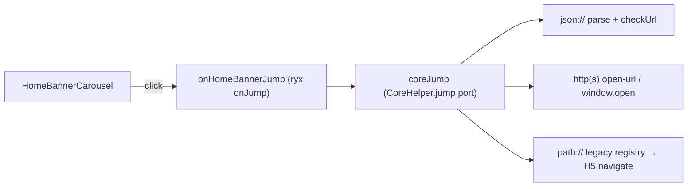

# Home Banner Carousel Plan

## Goal

Replace the static 208px hero image in [`HomeHeroSection.tsx`](apps/h5/src/components/home/HomeHeroSection.tsx) with a swipeable/auto-playing carousel backed by `TmcApiHomeUrl-Banner-List`.

**Hard requirement (user):** banner click navigation must **fully align with ryx** — same entry (`onJump`) and same resolution (`CoreHelper.jump`), not a partial path map with fallbacks like toast.

## Legacy sources of truth

| Concern                     | File                                                                                                                                                                           |
| --------------------------- | ------------------------------------------------------------------------------------------------------------------------------------------------------------------------------ |
| Banner click entry          | [`tab-tmc-home_ryx.page.ts` `onJump`](file:///Users/liaiguo/private/projects/rongyixing/beeantmobile-main/projects/ryx/src/app/tabs/tab-tmc-home_ryx/tab-tmc-home_ryx.page.ts) |
| Swiper click (same handler) | [`tmc-home.base.page.ts` `initBannerSwiper`](file:///Users/liaiguo/private/projects/rongyixing/beeantmobile-main/projects/ryx/src/app/tabs/tab-tmc-home/tmc-home.base.page.ts) |
| Jump resolver               | [`coreHelper.ts` `jump`](file:///Users/liaiguo/private/projects/rongyixing/beeantmobile-main/projects/core/src/coreHelper.ts) (~L1418)                                         |
| Embedded H5 / external URL  | [`open-url.component.ts`](file:///Users/liaiguo/private/projects/rongyixing/beeantmobile-main/projects/core/src/pages/components/open-url-comp/open-url.component.ts)          |
| Banner API                  | [`tmc.service.ts` `getBanners`](file:///Users/liaiguo/private/projects/rongyixing/beeantmobile-main/projects/ryx/src/app/tmc/tmc.service.ts)                                   |
| Route inventory             | [`PAGE-API-MATRIX.md` §4 旧路由→新路由](docs/api/PAGE-API-MATRIX.md)                                                                                                           |

## Legacy behavior to mirror (carousel)

| Behavior        | Legacy                                             | H5 target                                                                       |
| --------------- | -------------------------------------------------- | ------------------------------------------------------------------------------- |
| API             | `TmcApiHomeUrl-Banner-List`                        | `proxy.send` in [`packages/api/src/apis/tmc.ts`](packages/api/src/apis/tmc.ts)  |
| Item shape      | `ImageUrl`, `Title`, `Id`, `Url`, `Tag`            | `HomeBanner` in `@ryx/shared-types`                                             |
| Autoplay        | Swiper `delay: 3000`, `speed: 600`, `loop: true`   | 3s interval; linear wrap OK for v1                                              |
| Dots            | White bullets bottom center                        | Match legacy (~7px)                                                             |
| Empty / no auth | Default config image                               | [`HOME_ASSETS.heroBanner`](apps/h5/src/config/home-assets.ts)                   |
| Personal filter | `getFilteredBanners`                               | [`PERSONAL_PUSH_FILTER_TAGS`](apps/h5/src/lib/message-notification-settings.ts) |
| Load gate       | ticket + `checkShouldAndHasSelectTmc()` for agents | ticket required; agent `TmcId` gate when identity exposes it                    |

## Click jump — full ryx alignment (not simplified)

### 1. Entry: `onHomeBannerJump` (= ryx `onJump`)

Mirror [`tab-tmc-home_ryx.page.ts` L71–98](file:///Users/liaiguo/private/projects/rongyixing/beeantmobile-main/projects/ryx/src/app/tabs/tab-tmc-home_ryx/tab-tmc-home_ryx.page.ts):

- Input: `{ Url?: object \| string; Name?: string; Title?: string }` (banner row)
- If `Url` is object → `tmpUrlStr = "json://" + JSON.stringify(Url)` and spread `Url` into query props
- If `Url` is string → use as-is
- Special case: `Name === '自助值机'` → `browserOpts` with header bar visible (legacy `CONFIG.themeColor`)
- Call `coreJump(navigate, tmpUrlStr, { Name, ...query, title: Name, browserOpts, isEnableCheckIfCanBack: false })`

Banner carousel and future workbench tiles **must share this function** — no banner-specific shortcut.

### 2. Resolver: `coreJump` (= `CoreHelper.jump`)

New [`apps/h5/src/lib/core-jump.ts`](apps/h5/src/lib/core-jump.ts) ports branches in order:

**A. `json://` prefix**

1. `JSON.parse` payload → `jumpInfo`
2. If `jumpInfo.checkUrl` → **direct external POST** (NOT `/Home/Proxy` / `proxy-client`):
   - Legacy: `req.Url = jumpInfo.checkUrl`; `CoreHelper.postData(req.Url, req)` ([`coreHelper.ts` L1451–1456](file:///Users/liaiguo/private/projects/rongyixing/beeantmobile-main/projects/core/src/coreHelper.ts))
   - H5 port: `fetch(checkUrl + "?ngsw-bypass", { method: "POST", headers: { "content-type": "application/x-www-form-urlencoded" }, body })` where `body` serializes the same request-entity fields as legacy `postData`: `Timestamp`, `Language`, `Ticket`, `TicketName`, `Domain`, `Data` (JSON-stringified `querys`), plus `x-requested-with=XMLHttpRequest`
   - On `checkResult == null` or `!checkResult.Status` → alert「请求异常」/ `checkResult.Message`; abort jump
   - On success merge `checkResult.Data` keys into query props
3. WeChat mini (`wechatMiniAppId` + `wechatMiniPath` + `isWechatMini`) → no-op in pure H5 with dev-only console warn (Capacitor-only in legacy)
4. If `jumpInfo.path` → normalize to `path://{path}`
5. Else if `jumpInfo.url` → use http branch; honor `isBlank` / `isOpenInAppBrowser`

**B. `http(s)://`**

1. Merge query string keys into props (legacy L1511–1522)
2. `isOpenInAppBrowser` or `isBlank` → `window.open(url)` (H5 equivalent of `openInAppBrowser`)
3. Else → navigate to **`/open-url`** with query params (`url`, `title`, `isHideTitle`, merged query) — H5 equivalent of `CoreHelper.go(['open-url'])` / `OpenUrlComponent` modal
4. Reuse [`TravelIframeView`](apps/h5/src/components/travel/TravelIframeView.tsx) + workflow srcdoc logic where URL matches workflow host (same as approval/travel pages)

**C. `path://`**

1. Strip prefix, parse `path?k=v` query into props
2. **Normalize legacy path** before registry lookup:
   - Banner `jump` uses API `path` as-is (e.g. workbench fixture `tmc-flight-search`) — does **not** call `getRoutePath` ([`coreHelper.jump` L1559–1577](file:///Users/liaiguo/private/projects/rongyixing/beeantmobile-main/projects/core/src/coreHelper.ts))
   - Programmatic nav uses ryx [`AppHelper.getRoutePath`](file:///Users/liaiguo/private/projects/rongyixing/beeantmobile-main/projects/ryx/src/app/appHelper.ts): strip suffix after last `_`, then append `_` + skin (`ryx`) → e.g. `account-setting` → `account-setting_ryx`
   - H5: implement `normalizeLegacyRoutePath(path, style = "ryx")` mirroring `getRoutePath`, then registry lookup on **both** raw and normalized keys
3. **Bidirectional registry**: each H5 route maps from **all** legacy aliases — e.g. `tmc-flight-search`, `tmc-flight-search_ryx`, and normalized forms all → `/home?product=flight`. Registry built from [`PAGE-API-MATRIX.md` §4](docs/api/PAGE-API-MATRIX.md) plus explicit alias pairs; unit test asserts alias equivalence
4. Resolve → React `navigate()` with mapped path + query
5. **No toast for unmapped paths** — log + best-effort fallback or `/open-url` when `url` field present; document gap in matrix

Example registry entries (extend to full matrix):

| Legacy `path`                                 | H5 route               |
| --------------------------------------------- | ---------------------- |
| `tmc-flight-search` / `tmc-flight-search_ryx` | `/home?product=flight` |
| `tmc-train-search` / `tmc-train-search_ryx`   | `/home?product=train`  |
| `tmc-hotel-search` / `tmc-hotel-search_ryx`   | `/home?product=hotel`  |
| `tmc-order-list_ryx`                          | `/orders`              |
| `tmc-bulletin-list_ryx`                       | `/notice`              |
| `tmc-approval-task`                           | `/travel/approval`     |
| `goBusiness`                                  | `/travel/apply`        |
| `account-setting_ryx` / `account-setting`     | `/settings`            |
| `account-security_ryx`                        | `/settings/security`   |
| `member-credential-list`                      | `/credentials`         |
| `tmc-select-passenger_ryx`                    | `/passenger/select`    |
| `open-url`                                    | `/open-url`            |

Registry lives in [`apps/h5/src/lib/legacy-route-registry.ts`](apps/h5/src/lib/legacy-route-registry.ts) with unit tests per mapped path.

### 3. New `/open-url` page (prerequisite for http jump parity)

- [`apps/h5/src/pages/open-url/OpenUrlPage.tsx`](apps/h5/src/pages/open-url/OpenUrlPage.tsx) — reads search params, renders `TravelIframeView` or full-window iframe
- Route in [`apps/h5/src/app/routes.tsx`](apps/h5/src/app/routes.tsx): `/open-url`
- Ticket injection for workflow URLs via existing [`buildWorkflowOpenUrl`](apps/h5/src/lib/approval-task-url.ts) / [`withTicketParam`](apps/h5/src/lib/workbench.ts) patterns

This page is shared infrastructure (banner, messages, orders) — not banner-only.

## Architecture (data + UI)

### Shared types + API

- [`packages/shared-types/src/home-banner.ts`](packages/shared-types/src/home-banner.ts) — `HomeBanner`, `HomeBannerLink` (align with workbench `Url` shape in [`workbench.ts`](packages/shared-types/src/workbench.ts))
- [`TmcApi.getBanners()`](packages/api/src/apis/tmc.ts) via `TMC_METHODS.BANNER_LIST`
- Mock: [`packages/mock/src/fixtures/home-banners.ts`](packages/mock/src/fixtures/home-banners.ts) with mixed `Url` types (object path, http, checkUrl sample)

### Banner utilities

- [`apps/h5/src/lib/home-banners.ts`](apps/h5/src/lib/home-banners.ts) — `filterPersonalizedBanners`, `resolveBannerSlides`

### Hook + UI

- [`apps/h5/src/hooks/useHomeBanners.ts`](apps/h5/src/hooks/useHomeBanners.ts)
- [`apps/h5/src/components/home/HomeBannerCarousel.tsx`](apps/h5/src/components/home/HomeBannerCarousel.tsx) — `h-[208px]`, autoplay 3s, dots, lazy images
- Wire through [`HomeTabPage.tsx`](apps/h5/src/pages/home/HomeTabPage.tsx) → [`HomeHeroSection.tsx`](apps/h5/src/components/home/HomeHeroSection.tsx)
- Click: `onHomeBannerJump(banner)` — **only** jump entry

## Tests

| Area                            | Coverage                                                                                          |
| ------------------------------- | ------------------------------------------------------------------------------------------------- |
| `core-jump.test.ts`             | json/http/path branches; **checkUrl direct fetch** (not proxy); 自助值机 browserOpts; query merge |
| `legacy-route-registry.test.ts` | every matrix-mapped path; **alias pairs** (`foo` ↔ `foo_ryx` → same H5 route)                    |
| `home-banners.test.ts`          | personal filter + fallback slide                                                                  |
| `onHomeBannerJump` integration  | object Url → same target as manual `json://` string                                               |
| Mock API                        | `BANNER_LIST` returns fixture                                                                     |

## Verification (parity checklist)

Compare side-by-side with [ryx home](http://app.rtesp.com/rl/#/tabs_ryx/tab-tmc-home_ryx) logged in:

1. Carousel loads API images; dots match slide count
2. Click banner with `path: tmc-hotel-search` → lands on hotel search (H5: `/home?product=hotel`)
3. Click banner with external `url` (no `isOpenInAppBrowser`) → `/open-url` iframe, not raw tab
4. Click banner with `isOpenInAppBrowser: true` → new window
5. Banner with `checkUrl` failing → error alert, no navigation
6. Personalized recommendation off → filtered banners match legacy
7. Logged out → static hero fallback

## Out of scope

- Swiper `loop: true` infinite clone slides (linear wrap acceptable)
- WeChat mini-program `navigateTo` (document as Capacitor-only; H5 skips)
- Workbench grid UI (jump module built for reuse later)

## Implementation order

1. `core-jump` + `legacy-route-registry` + `/open-url` page (jump parity first — blocks correct banner clicks)
2. API + mock banners
3. Carousel UI + hook
4. Matrix docs + manual parity pass vs ryx
