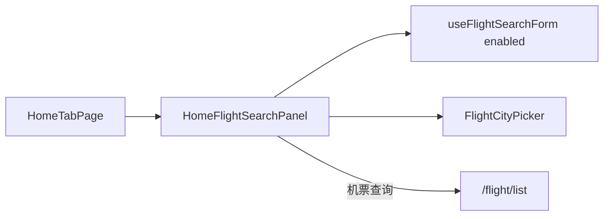

# 首页机票 Tab 搜索迁移

## 目标

- 点击 [`HomeHeroSection`](apps/h5/src/components/home/HomeHeroSection.tsx)「国内机票」时**留在首页**，展示与截图一致的白卡片搜索区（结构对齐 [`HomeTrainSearchPanel`](apps/h5/src/components/home/HomeTrainSearchPanel.tsx)）。
- 复用 [`useFlightSearchForm`](apps/h5/src/hooks/useFlightSearchForm.ts) + [`FlightCityPicker`](apps/h5/src/components/flight/common/FlightCityPicker.tsx)；查询跳转 `/flight/list`。
- 将 [`FlightSearchPage`](apps/h5/src/pages/flight/FlightSearchPage.tsx) 能力迁入首页；`/flight` index 重定向 `/home?product=flight`（与火车票、酒店不对称策略一致）。

## 设计决策

| 品类         | 首页面板                          | 独立搜索页                                                            |
| ------------ | --------------------------------- | --------------------------------------------------------------------- |
| 酒店         | `HomeHotelSearchPanel` @ `/home`  | 保留 [`HotelSearchPage`](apps/h5/src/pages/hotel/HotelSearchPage.tsx) |
| 火车         | `HomeTrainSearchPanel` @ `/home`  | 已移除 → redirect                                                     |
| 机票（本次） | `HomeFlightSearchPanel` @ `/home` | **不保留** → `/flight` redirect                                       |

- **不在首页复刻** `SearchPassengerButton`、独立页大卡片布局（与火车迁移一致，留列表/填单阶段接入）。
- **互换图标**：暂复用 [`train-swap-stations.png`](apps/h5/src/assets/home/train-swap-stations.png)（用户确认）；后续可替换为 `flight-swap-cities.png`。
- **互换无动画**：与火车最终行为一致，即时交换城市。

## 数据流



## 实现步骤

### 1. 新增 `HomeFlightSearchPanel`

文件：[`apps/h5/src/components/home/HomeFlightSearchPanel.tsx`](apps/h5/src/components/home/HomeFlightSearchPanel.tsx)

镜像 [`HomeTrainSearchPanel`](apps/h5/src/components/home/HomeTrainSearchPanel.tsx) layout token：

| 区域   | 内容                                                                                    |
| ------ | --------------------------------------------------------------------------------------- |
| 第一行 | 出发城市 / 互换按钮 / 到达城市（`displayCityName`，HarmonyOS 17px `#010101`）           |
| 第二行 | 出发日期：`formatHotelDateShort` + `relativeDayLabel`（与火车/截图「1月5日 今天」一致） |
| 底部   | 「机票查询」渐变按钮                                                                    |
| 校验   | `validationError` 行内展示                                                              |

- 不复用 [`FlightCityPairField`](apps/h5/src/components/flight/common/FlightCityPairField.tsx)（独立页 `text-2xl` 与首页 Figma 不符）。
- **互换按钮**：暂复用 [`HOME_ASSETS.products.train.swapStations`](apps/h5/src/config/home-assets.ts)（已在火车迁移中注册，指向 `train-swap-stations.png`）。机票/火车面板共用；后续替换飞机切图时可改为 `HOME_ASSETS.shared.swapCities` 或 `products.flight.swapCities`。
- **按钮文案**：「**机票查询**」（与截图一致；独立页 `FlightSearchPage` 为「查询航班」，首页不复用）。

可选小 refactor（非必须）：将 `HOME_PANEL_PRIMARY_TEXT` / `HOME_PANEL_SECONDARY_TEXT` 抽到 `apps/h5/src/components/home/home-search-panel-styles.ts`，供 train/flight 共用。

### 2. Hook：按需加载机场数据

文件：[`apps/h5/src/hooks/useFlight.ts`](apps/h5/src/hooks/useFlight.ts)、[`apps/h5/src/hooks/useFlightSearchForm.ts`](apps/h5/src/hooks/useFlightSearchForm.ts)

- `useFlightAirports({ enabled })`：`useQuery` 增加 `enabled`（默认 `true`，兼容列表页等现有调用）。
- `useFlightSearchForm({ enabled, ... })`：向下传递 `enabled`。
- `HomeTabPage` 无条件调用 hook，`enabled: activeProduct === "flight"`。
- `swapCities` 改为同步交换（去掉 `swapping` 状态与 `setTimeout`，与火车 hook 对齐）。

### 3. 扩展 `home-params`（含 review 修正）

文件：[`apps/h5/src/lib/home-params.ts`](apps/h5/src/lib/home-params.ts)

**统一 URL 写入逻辑**（阻塞项，实施时一并修正）：

当前 `buildHomeProductSearch` 已对 `train`/`hotel` 写入 param，但 `flight` 未纳入；且条件分支易漂移。统一为三个 Tab **始终**写入 `product`：

```typescript
export function parseHomeProduct(searchParams: URLSearchParams): HomeProductId {
  const product = searchParams.get("product");
  if (product === "flight" || product === "train" || product === "hotel") {
    return product;
  }
  return "hotel"; // bare /home still defaults to hotel
}

export function buildHomeProductSearch(product: HomeProductId): URLSearchParams {
  const params = new URLSearchParams();
  params.set("product", product);
  return params;
}
```

说明：此前 review 称「hotel 不写 param」与**当前代码不符**——现实现已对 hotel 写入；真正问题是 flight 缺失 + 应用统一写法避免再漂移。

### 4. 改造 `HomeTabPage`

文件：[`apps/h5/src/pages/home/HomeTabPage.tsx`](apps/h5/src/pages/home/HomeTabPage.tsx)

**Tab 切换**

- 移除 `flight` 分支的 `navigate("/flight")`。
- 三品类（flight/train/hotel）均 `setActiveProduct` + `setSearchParams(buildHomeProductSearch(product), { replace: true })`。

**面板渲染**（复用现有 `HomeSearchPanelSkeleton` / `HomeSearchPanelError`）

```tsx
{activeProduct === "flight" && (
  flightForm.isLoading ? <Skeleton /> :
  flightForm.error ? <Error /> :
  <HomeFlightSearchPanel ... />
)}
```

**CityPicker**

- 挂载 [`FlightCityPickerHostFromForm`](apps/h5/src/components/flight/common/FlightCityPickerHost.tsx)（与 `FlightSearchPage` 相同 from/to 逻辑）。
- [`FlightCityPicker`](apps/h5/src/components/flight/common/FlightCityPicker.tsx) **已是**通用 [`CityPicker`](apps/h5/src/components/search/CityPicker.tsx) 的薄封装，内部已设 `historyKey={CITY_HISTORY_KEYS.flight}`；无需在 `HomeTabPage` 单独处理 history。
- 两套持久化职责分离、均保留：`persistFlightCities`（hook effect → localStorage 默认城市）+ `CityPicker` browse history（`saveCityHistory`）。

**搜索**

- `handleFlightSearch`：`validate()` → `navigate(\`/flight/list?${buildSearchParams()}\`)`。

### 5. 路由与回退入口

[`apps/h5/src/app/routes.tsx`](apps/h5/src/app/routes.tsx)：

- `/flight` index → `<Navigate to="/home?product=flight" replace />`
- 保留 `/flight/list`、`/flight/:id/cabins`、`/flight/select-city`

[`apps/h5/src/pages/flight/FlightListPage.tsx`](apps/h5/src/pages/flight/FlightListPage.tsx)：

- 无效 query 时 `navigate("/flight")` → `navigate("/home?product=flight", { replace: true })`（约 L107）

删除 [`FlightSearchPage.tsx`](apps/h5/src/pages/flight/FlightSearchPage.tsx) 路由挂载（文件可删）。

### 6. 引用扫描清单（精确）

| 位置                                                                     | 当前                     | 改为                                                                      |
| ------------------------------------------------------------------------ | ------------------------ | ------------------------------------------------------------------------- |
| [`routes.tsx`](apps/h5/src/app/routes.tsx) L93                           | `FlightSearchPage` index | `Navigate to="/home?product=flight"`                                      |
| [`HomeTabPage.tsx`](apps/h5/src/pages/home/HomeTabPage.tsx) L55          | `navigate("/flight")`    | 与其他 Tab 一样写 `?product=flight`                                       |
| [`FlightListPage.tsx`](apps/h5/src/pages/flight/FlightListPage.tsx) L107 | `navigate("/flight")`    | `navigate("/home?product=flight", { replace: true })`                     |
| [`FlightSearchPage.tsx`](apps/h5/src/pages/flight/FlightSearchPage.tsx)  | `returnTo="/flight"`     | 随页面删除；若其他处引用 passenger returnTo 再改为 `/home?product=flight` |

实施前 `rg 'FlightSearchPage|"/flight"|returnTo="/flight"' apps/h5` 复核，无 `/flight/first` 路由。

[`FlightModifySearchSheet`](apps/h5/src/components/flight/FlightModifySearchSheet.tsx) **保持不变**——内联 `useFlightSearchForm` + sheet，不 navigate 到 `/flight`。

## 验证

- 首页切「国内机票」：白卡片 + 指针指向第一个 Tab；未激活时不请求 `flight/airports`。
- 切酒店/火车 Tab 时，机票 loading 不阻塞整页 Hero/Business/RecentTrip。
- `?product=flight` 深链、Tab 切换写 URL、刷新保持机票 Tab。
- 城市选择、互换、日期选择、查询 → `/flight/list` 参数与原先 `FlightSearchPage` 一致。
- 访问 `/flight` 重定向正常；列表缺参回首页机票 Tab。
- `pnpm --filter @ryx/h5 typecheck`

## 不在本次范围

- 首页接入 `SearchPassengerButton`
- 恢复 `/flight` 独立完整搜索页
- 机票专用互换切图（后续替换 train 图标）
- 酒店 form 的 lazy `enabled`
