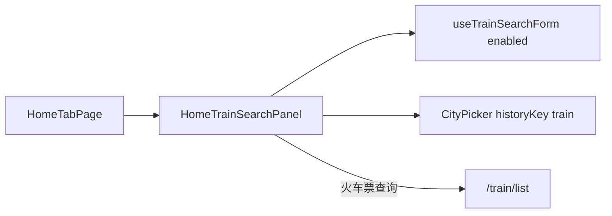

# 首页火车票 Tab 搜索迁移

## 目标

- 点击 [`HomeHeroSection`](apps/h5/src/components/home/HomeHeroSection.tsx) 的「火车票」时**留在首页**，展示设计稿布局（与 [`HomeHotelSearchPanel`](apps/h5/src/components/home/HomeHotelSearchPanel.tsx) 同结构：白卡片 + 三角指针 + 灰色输入行 + 渐变按钮）。
- 复用 [`useTrainSearchForm`](apps/h5/src/hooks/useTrainSearchForm.ts) 与车站选择器；查询仍跳转 `/train/list`。
- **不做**「只看高铁」勾选（本次跳过）。

## 设计决策

### 与酒店「双入口」不对称（已明确）

| 品类           | 首页面板                         | 独立搜索页                                                                                                          |
| -------------- | -------------------------------- | ------------------------------------------------------------------------------------------------------------------- |
| 酒店           | `HomeHotelSearchPanel` @ `/home` | [`HotelSearchPage`](apps/h5/src/pages/hotel/HotelSearchPage.tsx) @ `/hotel`（含 `SearchPassengerButton`、完整卡片） |
| 火车（本计划） | `HomeTrainSearchPanel` @ `/home` | **不保留** — `/train` index → redirect `/home?product=train`                                                        |

**意图**：产品侧选择「火车票从首页 Tab 统一搜索」，减少重复入口；[`TrainSearchPage`](apps/h5/src/pages/train/TrainSearchPage.tsx) 的 `SearchPassengerButton`、大卡片布局**不在首页复刻**，留到列表/填单阶段接入（与计划原 §4 一致）。

若后续需要与酒店完全对称，可再恢复 `/train` 独立页并抽取共享 `TrainSearchFormCore` — **不在本次范围**。

## 数据流（迁移后）



## 实现步骤

### 1. 新增 `HomeTrainSearchPanel`

文件：[`apps/h5/src/components/home/HomeTrainSearchPanel.tsx`](apps/h5/src/components/home/HomeTrainSearchPanel.tsx)

镜像 `HomeHotelSearchPanel` 的 layout token：

| 区域   | 内容                                                                                                                                                  |
| ------ | ----------------------------------------------------------------------------------------------------------------------------------------------------- |
| 第一行 | 出发站 / 互换按钮 / 到达站（`text-[17px] font-medium`）                                                                                               |
| 第二行 | 出发日期：`formatHotelDateShort` + `relativeDayLabel`（函数名含 Hotel 但实现通用，仅格式 `M月D日` 与今天/明天/周X，火车直接复用并在调用处加英文注释） |
| 底部   | 「火车票查询」渐变按钮                                                                                                                                |
| 校验   | `validationError` 行内展示                                                                                                                            |

不复用 [`CityPairField`](apps/h5/src/components/search/CityPairField.tsx)（独立页 `text-2xl` 样式与首页 Figma 不符）。

### 2. Hook：按需加载车站数据

文件：[`apps/h5/src/hooks/useTrainSearchForm.ts`](apps/h5/src/hooks/useTrainSearchForm.ts)

- `useTrainStations({ enabled })`：`useQuery` 增加 `enabled`（默认 `true` 保持 [`TrainSearchPage`](apps/h5/src/pages/train/TrainSearchPage.tsx) 兼容至删除前）。
- `useTrainSearchForm({ enabled })`：向下传递 `enabled`。
- **Hooks 规则**：`HomeTabPage` 仍无条件调用 hook，但通过 `enabled: activeProduct === "train"` 避免未切 Tab 时发起 `getStations` 请求。

（酒店 `useHotelSearchForm` 同样无条件 fetch — 可后续统一优化，**本次仅改火车**。）

### 3. 改造 `HomeTabPage`

文件：[`apps/h5/src/pages/home/HomeTabPage.tsx`](apps/h5/src/pages/home/HomeTabPage.tsx)

**Tab 切换**

- `handleProductChange`：`train` → `setActiveProduct("train")` + **URL 写回** `navigate({ search: ?product=train }, { replace: true })`；`flight` 仍 `navigate("/flight")`；`hotel` 同理写 `product=hotel`。
- 移除 `train` 分支的 `navigate("/train")`。

**URL 双向同步**（[`apps/h5/src/lib/home-params.ts`](apps/h5/src/lib/home-params.ts) 新建）

- `parseHomeProduct(searchParams)`：读 `?product=`，默认 `hotel`。
- `buildHomeProductSearch(product)`：写 query。
- `useSearchParams` 初始化 `activeProduct`；切换 Tab 时 `replace` 更新，避免刷新丢失、支持分享 `/home?product=train`。

**Loading / Error：按 Tab 分离（移除全局 early return）**

```tsx
// 删除页面级 if (form.isLoading) return <Loading />
{activeProduct === "hotel" && (
  hotelForm.isLoading ? <PanelSkeleton /> :
  hotelForm.error ? <PanelError /> :
  <HomeHotelSearchPanel ... />
)}
{activeProduct === "train" && (
  trainForm.isLoading ? <PanelSkeleton /> :
  trainForm.error ? <PanelError /> :
  <HomeTrainSearchPanel ... />
)}
```

Hero、Business、RecentTrip 等区域始终渲染；仅搜索卡片区显示 loading/error。

**CityPicker（火车）**

- `open={trainForm.picker !== null}`，`historyKey={CITY_HISTORY_KEYS.train}`，`{...trainStationPickerAdapter}`。
- 选站后：`setFromStation` / `setToStation`（与 `TrainSearchPage` 相同）；`useTrainSearchForm` 内已有 `persistTrainStations` effect 写 `localStorage`；`CityPicker` 的 `onSelect` 经 `saveCityHistory` 写**浏览历史** — 两套持久化职责不同，**均需保留**。

**指针组件**

- 统一 `<HomeProductTabPointer product={activeProduct} />`（酒店/火车分支内均用动态值，勿硬编码 `"train"`）。

**搜索**

- `handleTrainSearch`：`validate()` → `navigate(\`/train/list?${buildSearchParams()}\`)`。

### 4. 路由与「修改」入口

[`apps/h5/src/app/routes.tsx`](apps/h5/src/app/routes.tsx)：`/train` index → `<Navigate to="/home?product=train" replace />`；保留 `/train/list`。

[`TrainListPage`](apps/h5/src/pages/train/TrainListPage.tsx)：「修改」→ `/home?product=train`。

删除 [`TrainSearchPage.tsx`](apps/h5/src/pages/train/TrainSearchPage.tsx) 的路由挂载（文件可删或留空 redirect 组件）。

## 验证

- 首页切火车 Tab：白卡片 + 指针；未切火车 Tab 时不应发起 `train/stations` 请求（Network 验证）。
- 切酒店 Tab 时火车 loading 不阻塞整页。
- `?product=train` 深链、Tab 切换写 URL、刷新保持火车 Tab。
- 查询 → `/train/list` 参数与原先一致；`/train` redirect 正常。
- `pnpm --filter @ryx/h5 typecheck`

## 不在本次范围

- 「只看高铁」
- 恢复 `/train` 独立完整搜索页（与酒店对称）
- 首页机票内嵌搜索
- `formatHotelDateShort` 重命名为通用名（仅加注释说明可复用）
- 酒店 form 的 lazy `enabled`（可 follow-up）
