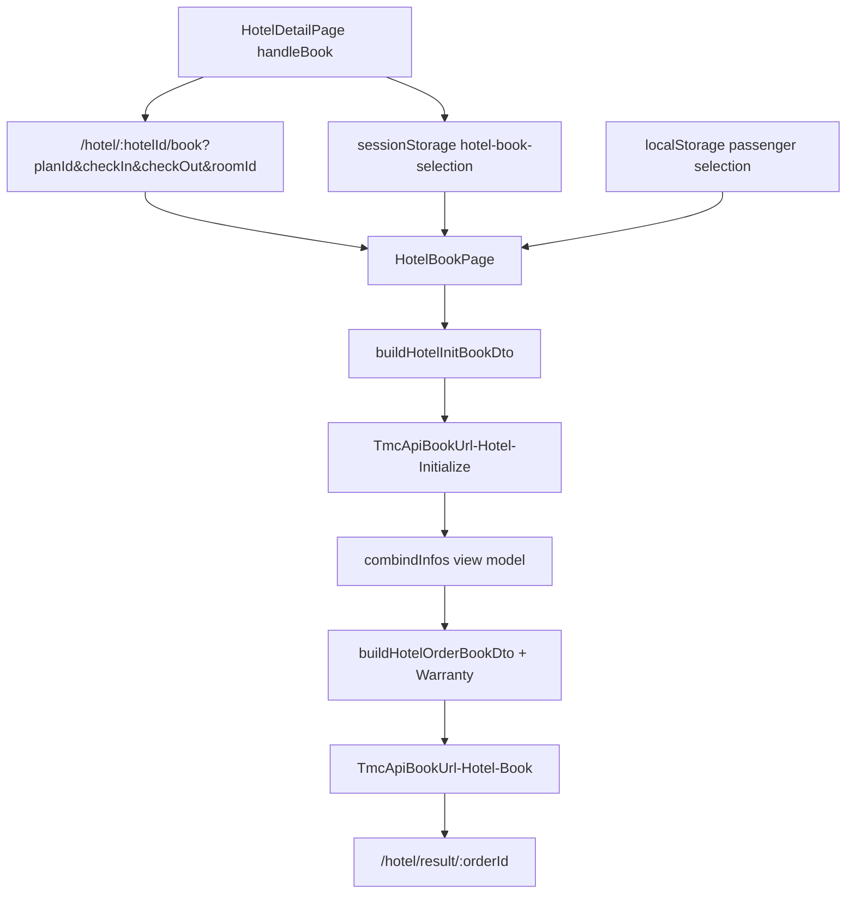
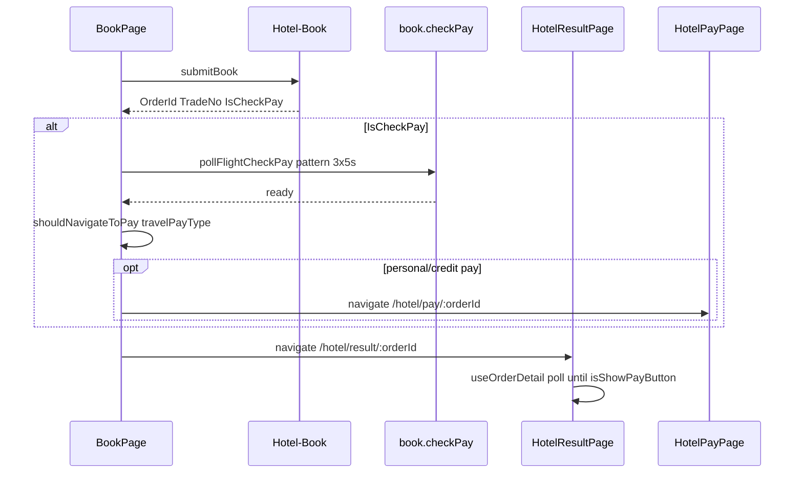

# Hotel Fill-Order Page (`填写订单`) Implementation Plan

## Current gap

| Area          | Today                                                                             | Target                                                                                                                                     |
| ------------- | --------------------------------------------------------------------------------- | ------------------------------------------------------------------------------------------------------------------------------------------ |
| UI            | Minimal cards in [`HotelBookPage.tsx`](apps/h5/src/pages/hotel/HotelBookPage.tsx) | Match [`docs/需求实施/酒店/酒店-填写订单.png`](docs/需求实施/酒店/酒店-填写订单.png)                                                       |
| Context       | URL `planId` + dates only; passengers in localStorage                             | Legacy-style book snapshot: hotel + room + plan per passenger                                                                              |
| API           | CamelCase params passed raw; **init response discarded**                          | `buildHotelInitBookDto` / `buildHotelOrderBookDto` aligned with `OrderBookDto` (mirror [`flight-book.ts`](apps/h5/src/lib/flight-book.ts)) |
| Flow          | init + submit in one click                                                        | **Initialize on mount** → render form → validate → agreement → Book                                                                        |
| Legacy extras | None                                                                              | Approval, illegal reason, expense type, out-numbers, org/cost center, credit card, authorized contacts                                     |

Reference implementations:

- Legacy: [`tmc-hotel-book_ryx.base.page.ts`](file:///Users/liaiguo/private/projects/rongyixing/beeantmobile-main/projects/ryx/src/app/tmc/tmc-hotel/tmc-hotel-book_ryx/tmc-hotel-book_ryx.base.page.ts), [`tmc-hotel_ryx.service.ts`](file:///Users/liaiguo/private/projects/rongyixing/beeantmobile-main/projects/ryx/src/app/tmc/tmc-hotel/tmc-hotel_ryx.service.ts)
- Monorepo template: [`FlightBookPage.tsx`](apps/h5/src/pages/flight/FlightBookPage.tsx) + [`flight-book.ts`](apps/h5/src/lib/flight-book.ts)

---

## Architecture



### 1. Book session (`hotel-book-session.ts`)

New module (pattern: [`flight-book-session.ts`](apps/h5/src/lib/flight-book-session.ts)):

```ts
interface HotelBookSelection {
  hotelId: string;
  hotelName: string;
  checkIn: string;
  checkOut: string;
  room: HotelRoom; // snapshot from detail
  plan: HotelRoomPlan; // selected plan (incl. Variables, Prices, PaymentType)
  policyRules?: string[]; // per-plan exceed rules from detail policy (optional)
  selectedAt: number;
}
```

- **Write** in [`HotelDetailPage.tsx`](apps/h5/src/pages/hotel/HotelDetailPage.tsx) `handleBook` after policy guards pass (find parent room for plan).
- **Read** on book page mount; **early guard** if session or passengers missing (legacy `BackBookPageGuard` equivalent — see below).
- Keep URL query as deep-link fallback; session is source of truth for room/plan fields needed by Initialize.

**BackBookPageGuard equivalent (H5 has no route guard):**

Legacy [`BackBookPageGuard`](file:///Users/liaiguo/private/projects/rongyixing/beeantmobile-main/projects/ryx/src/app/tmc/tmc-hotel/tmc-hotel-book_ryx/tmc-hotel-book_ryx.base.page.ts) checks `getBookInfos().filter(it => it?.bookInfo).length > 0`; on failure calls `CoreHelper.goRoot("")` (**home**, not detail).

H5 implementation in `HotelBookPage` mount (Phase 1 shell):

1. If `loadHotelBookSelection()` is null **or** `usePassengerSelection(Hotel)` is empty → `navigate(..., { replace: true })`.
2. Redirect target: **`/hotel/:hotelId`** when `hotelId` is known from route (better UX than legacy home); fallback `/home` when `hotelId` missing.
3. Render nothing / brief loading while redirecting to avoid flash of empty form.

### 2. Legacy DTO layer (`hotel-book.ts`)

New lib file with pure functions:

| Function                         | Legacy source                                                                                                                |
| -------------------------------- | ---------------------------------------------------------------------------------------------------------------------------- |
| `buildHotelInitBookDto`          | `getInitializeBookDto()` — `OrderBookDto` with `Passengers[].ClientId`, `RoomPlan`, `Credentials`, `Account`, `travelFormId` |
| `buildHotelOrderBookDto`         | `onBook()` + `fillBookPassengers` + `fillBookLinkmans`                                                                       |
| `resolveHotelArrivalTimeOptions` | `initArrivalTimes` — plan `Variables.ArrivalTime` or 30-min slots 12:00–18:00                                                |
| `buildHotelInitRoomPlan`         | Spread session `plan` + `room` into legacy `RoomPlanEntity` wire shape (see field table below)                               |
| `resolveHotelBookDisplayAmount`  | `totalPrice` / nightly breakdown from `plan.RoomPlanPrices` + `ServiceFees`                                                  |
| `resolveHotelPaymentType`        | `HotelPaymentType` from plan (`Prepay` / `SelfPay` / `Settle`)                                                               |
| `validateHotelBookForms`         | Required fields before submit (arrival time, approver, illegal reason, credit card, notify lang)                             |

**Critical wire-format rules** (same discipline as [`docs/需求实施/酒店/api.md`](docs/需求实施/酒店/api.md)):

- Pass full `RoomPlan` via `buildHotelInitRoomPlan` — do not reconstruct from `planId` alone.
- `ClientId` = stable UUID per passenger row (legacy `item.id`).
- Map `CheckinTime`, `MessageLang`, `TravelPayType`, `IllegalReason`, `ExpenseType`, `ApprovalId`, `IsSkipApprove`, `OrderCard`, `Linkmans`.

**`buildHotelInitRoomPlan(plan, room)` field mapping** (legacy `p.RoomPlan = { ...item.bookInfo.roomPlan }`):

| Legacy field            | Source in session snapshot                                         |
| ----------------------- | ------------------------------------------------------------------ |
| `Id`                    | `plan.LegacyId` or `plan.PlanId` (omit when `"0"`)                 |
| `Name`                  | `plan.PlanName`                                                    |
| `TotalAmount`           | `plan.TotalAmount` ?? `plan.Price`                                 |
| `Number`                | `plan.Number` ?? `""`                                              |
| `SupplierNumber`        | `plan.SupplierNumber` (opaque string, never `toPrice`)             |
| `SupplierType`          | `plan.SupplierType`                                                |
| `BeginDate` / `EndDate` | `plan.BeginDate` / `plan.EndDate` with `T00:00:00` if time missing |
| `PaymentType`           | `plan.PaymentType`                                                 |
| `IsPrepay`              | derive from `PaymentType` if needed                                |
| `Variables`             | `JSON.stringify(plan.VariablesObj)` when present                   |
| `RoomPlanPrices`        | `plan.RoomPlanPrices` (nightly bill breakdown)                     |
| `RoomPlanRules`         | from `plan.CancelPolicy` or detail normalization                   |
| `Room.Id`               | `room.RoomId` (numeric when parseable)                             |
| `Room.Name`             | `room.RoomName`                                                    |

Add contract tests in `apps/h5/src/lib/hotel-book.test.ts` using captured legacy Initialize/Book payloads (follow flight proxy fixtures pattern).

### 3. Extend shared types

Update [`packages/shared-types/src/hotel.ts`](packages/shared-types/src/hotel.ts):

- `HotelRoomPlan`: add `RoomPlanPrices?: { Date?: string; Price?: number }[]` (legacy nightly prices for bill sheet; today only used internally in `getPlanAvgPrice`, not mapped — see `mapLegacyRoomPlan` in `packages/api/src/apis/hotel.ts`).
- `HotelInitBookResponse`: add `PayTypes`, `isSkipApprove`, `Staffs` (approver flags), `OutNumberFields` / grouped out-number metadata if returned by API; extend `HotelBookResponse` with `TradeNo`, `IsCheckPay`, `HasTasks` for post-submit flow.
- `HotelBookPassengerDto` (internal wire shape): `ClientId`, `RoomPlan`, `Credentials`, `CheckinTime`, `MessageLang`, `TravelPayType`, `IllegalReason`, `ExpenseType`, `ApprovalId`, `IsSkipApprove`, `OrderCard`, `OutNumbers`, etc.
- Keep existing `HotelInitBookParams` for backward compat or deprecate in favor of DTO builders.

Normalize Initialize response in [`packages/api/src/apis/hotel.ts`](packages/api/src/apis/hotel.ts) (`normalizeHotelInitBookResponse`) — mirror flight init normalization.

---

## UI — section map (mockup + legacy)

Use hotel chrome consistent with detail: `#F5F6F9` page bg, white rounded cards, blue `#2768FA` actions, gradient header via immersive layout or `PickerShell`-style top bar titled **填写订单**.

| #   | Mockup / legacy block                                                             | Component                                                          | Notes                                                                                                                                                                      |
| --- | --------------------------------------------------------------------------------- | ------------------------------------------------------------------ | -------------------------------------------------------------------------------------------------------------------------------------------------------------------------- |
| 1   | Hotel summary + dates + room + breakfast + pay badge + `*不可取消` + **订房必读** | `HotelBookSummaryCard` + `HotelBookNoticeSheet`                    | Rules from `plan.Variables.RoomRateRule`; check-in/out from hotel detail fields                                                                                            |
| 2   | Yellow remind bar (legacy)                                                        | `HotelBookReminderBar`                                             | "下单前与酒店确认接待政策"                                                                                                                                                 |
| 3   | **到店时间**                                                                      | `HotelBookArrivalTimeSheet`                                        | Required; shared across all rooms (`combindInfos[0]`)                                                                                                                      |
| 4   | **通知语言**                                                                      | Reuse/adapt `FlightBookNotifyLanguageSheet`                        | `cn` / `en` / `""`; gated by TMC flag                                                                                                                                      |
| 5   | **审批人** + skip approval                                                        | Reuse `FlightBookApproverSheet` + checkbox                         | Driven by `initBook.Staffs` + `shouldShowApproverPicker` logic (extract shared helper or hotel wrapper)                                                                    |
| 6   | **房间 N** guest card                                                             | `HotelBookRoomCard`                                                | Name + masked ID (`maskCredentialNumber` for 身份证); expand **全部信息** for phone/email/org/cost center/roommate                                                         |
| 7   | Policy exceed banner                                                              | `HotelBookPolicyBanner`                                            | Red `超标：{rules}` when plan has policy rules                                                                                                                             |
| 8   | Travel section (collapsible)                                                      | `HotelBookTravelSection`                                           | **超标原因**, **费用类别**, **出差单号** (`HotelOutNumber` fields) — adapt [`FlightBookTravelSection`](apps/h5/src/components/flight/FlightBookTravelSection.tsx) patterns |
| 9   | **服务费**                                                                        | `HotelBookServiceFeeRow`                                           | From `initBook.ServiceFees[clientId]`                                                                                                                                      |
| 10  | Credit card (conditional)                                                         | `HotelBookCreditCardSection`                                       | When arrival time in guarantee window (legacy `fillCredicardInfo`)                                                                                                         |
| 11  | **授权账号查看订单**                                                              | Reuse `FlightBookAuthorizedContacts` + `FlightBookAddContactSheet` | Map to `Linkmans` via shared `buildAuthorizedLinkmans`                                                                                                                     |
| 12  | Agent picker (if multiple)                                                        | `HotelBookAgentPicker`                                             | Reuse flight agent picker pattern; re-init on change                                                                                                                       |
| 13  | **支付方式**                                                                      | `HotelBookPayTypes`                                                | Parse `initBook.PayTypes`; labels for 公付/个付 + hold minutes                                                                                                             |
| 14  | Sticky footer                                                                     | `HotelBookFooter`                                                  | Checkbox + **购票须知** sheet (legacy `WarrantyComponent`) + `¥{total}` + **账单明细** + **生成订单**                                                                      |
| 15  | Bill drawer                                                                       | `HotelBookBillSheet`                                               | Nightly prices from `plan.RoomPlanPrices` (legacy `initDayPrice`); service fee line                                                                                        |

**Per-passenger room model:** 1 selected passenger → 1 `房间1` card (legacy `combindInfos` length = passengers with `bookInfo`). Multi-passenger = `房间1..N`.

---

## Page orchestration (`HotelBookPage` rewrite)

Replace current MVP with FlightBookPage-style state machine:

1. `useHotelBookSelection()` — session guard + redirect.
2. `usePassengerSelection(Hotel)` — passengers (already selected on detail).
3. **`useHotelInitBook` as `useQuery`** on mount — rewrite [`apps/h5/src/hooks/useHotelBook.ts`](apps/h5/src/hooks/useHotelBook.ts) (today lines 6–9 are `useMutation`; must mirror [`useFlightInitBook`](apps/h5/src/hooks/useFlightBook.ts)):
   - Signature: `useHotelInitBook(params: HotelInitBookParams | null)` where `params` is built from `buildHotelInitBookDto({ selection, passengers, travelFormId, agentId })`.
   - Returns `data` / `isLoading` / `error` / `refetch` (not `mutate` / `mutateAsync` / `isPending`).
   - `enabled: Boolean(params?.Passengers?.length)`.
   - Add `useHotelBookSelection()` in same file (mirror `useFlightBookSelection`).
4. `useHotelBookPassengerForms` hook — per-room form state (phones, emails, org, cost center, illegal reason, expense type, out-numbers, credit card, contacts).
5. `useBookOrgCostVisibility()` — org/cost center visibility (reuse flight hook).
6. `useIdentity()` — agent / TMC flags for service fee & notify language.
7. Submit: validate → open `HotelBookAgreementSheet` (Warranty) → `submitBook` → post-submit chain (step 8) → cleanup → navigate.
8. **Post-submit `checkPay` chain (Phase 4 — not optional for legacy parity):**



- Reuse [`pollFlightCheckPay`](apps/h5/src/lib/flight-book-check-pay.ts) + [`shouldNavigateToPay`](apps/h5/src/lib/flight-book-check-pay.ts) from flight (calls `getApi().book.checkPay`).
- Legacy: `checkPayCount = 3`, interval `5s` — same constants in new `hotel-book-check-pay.ts` or shared `book-check-pay.ts`.
- [`HotelResultPage`](apps/h5/src/pages/hotel/HotelResultPage.tsx) **second-stage** poll (`useOrderDetail` every 3s until `isShowPayButton`) remains; it complements but does not replace pre-navigation `checkPay` when `IsCheckPay` is true.

Remove generic `usePageHeader`; use fixed immersive header matching mockup (back + centered title).

---

## Detail page changes

In [`HotelDetailPage.tsx`](apps/h5/src/pages/hotel/HotelDetailPage.tsx) `handleBook`:

1. Resolve `room` containing `plan`.
2. `saveHotelBookSelection({ hotelId, hotelName, checkIn, checkOut, room, plan, policyRules })`.
3. Navigate with `planId`, `roomId`, `checkIn`, `checkOut` in query (for refresh/deep link).

---

## API & mock updates

| File                                                                                 | Change                                                                                                             |
| ------------------------------------------------------------------------------------ | ------------------------------------------------------------------------------------------------------------------ |
| [`packages/api/src/apis/hotel.ts`](packages/api/src/apis/hotel.ts)                   | `normalizeHotelInitBookResponse`; optional request logging in dev                                                  |
| [`packages/mock/src/handlers/hotel.ts`](packages/mock/src/handlers/hotel.ts)         | Richer INIT: `PayTypes`, per-client `ServiceFees`, `IllegalReasons`, `ExpenseTypes`, sample `Staffs` with approver |
| [`packages/mock/src/fixtures/hotel.ts`](packages/mock/src/fixtures/hotel.ts)         | Plan `Variables.ArrivalTime`, `RoomRateRule`, `RoomPlanPrices[]`                                                   |
| [`apps/h5/src/hooks/useHotelBook.ts`](apps/h5/src/hooks/useHotelBook.ts)             | Rewrite `useHotelInitBook` → `useQuery`; add `useHotelBookSelection`                                               |
| [`apps/h5/src/lib/hotel-book-check-pay.ts`](apps/h5/src/lib/hotel-book-check-pay.ts) | Reuse or thin-wrap `pollFlightCheckPay` for hotel submit path                                                      |

Add `packages/api/src/apis/hotel-book.test.ts` for init/submit payload builders (or keep in h5 lib tests).

---

## Reuse vs new (minimize duplication)

| Reuse from flight                                     | Hotel-specific new                                 |
| ----------------------------------------------------- | -------------------------------------------------- |
| `FlightBookFooter` pattern → `HotelBookFooter`        | `HotelBookSummaryCard`, arrival time, credit card  |
| `FlightBookNotifyLanguageSheet`                       | `hotel-book.ts` DTO builders                       |
| `FlightBookApproverSheet` + `flight-book-approval.ts` | `HotelBookRoomCard` + expand panel                 |
| `FlightBookAuthorizedContacts` + contact sheets       | `HotelBookNoticeSheet` / `HotelBookAgreementSheet` |
| `FlightBookPayTypes` pattern                          | `HotelBookBillSheet` (nightly hotel prices)        |
| `useBookOrgCostVisibility`                            | Policy exceed banner                               |

Extract shared pieces to `packages/ui` or `apps/h5/src/components/book/` only if duplication becomes painful; start under `apps/h5/src/components/hotel/`.

---

## Implementation phases

### Phase 1 — Foundation (blocking)

- `hotel-book-session.ts` + detail `handleBook` wiring
- `hotel-book.ts` DTO builders + unit tests
- Extend types + API normalize + mock INIT enrichment
- Book page shell: loading / error / **empty-guard** — missing session or passengers → redirect to `/hotel/:hotelId` (fallback `/home`)
- Rewrite `useHotelInitBook` as `useQuery` in `useHotelBook.ts`

### Phase 2 — Mockup core UI

- Summary, arrival time, notify language, room guest cards, service fee, footer + bill sheet
- Init-driven amounts; ID masking via existing `maskCredentialNumber`

### Phase 3 — Full legacy form fields

- Approval + skip approval
- Illegal reason + expense type + hotel out-numbers
- Org / cost center / roommate / expanded guest info
- Credit card section (guarantee window)
- Authorized contacts → `Linkmans`

### Phase 4 — Submit & polish

- Pay type selection + agent re-init
- Warranty / 购票须知 agreement sheet on submit
- Validation messages (reuse `PassengerSelectAlertDialog` style for field errors)
- Post-submit: `IsCheckPay` → `pollFlightCheckPay(TradeNo)` (3×5s) → optional direct `/hotel/pay/:orderId` → `/hotel/result/:orderId`
- Map `HotelBookResponse.TradeNo` / `IsCheckPay` from API normalize

### Phase 5 — Verification

- Manual checklist against `http://app.rtesp.com/rl/#/tmc-hotel-book_ryx` and design PNG
- `pnpm test` / `typecheck` for new lib + API tests
- Update [`docs/api/domains/hotel.md`](docs/api/domains/hotel.md) book section with DTO notes

---

## Risks & mitigations

| Risk                                      | Mitigation                                                                                  |
| ----------------------------------------- | ------------------------------------------------------------------------------------------- |
| Initialize expects full legacy `RoomPlan` | Always pass detail snapshot from session; never reconstruct from `planId` alone             |
| Missing captured Book payload             | Capture one real `Hotel-Initialize` + `Hotel-Book` from proxy during Phase 1 and lock tests |
| Scope creep in credit card / out-numbers  | Implement behind init flags (`isShowCreditCard`, `OutNumberFields`); hide when API omits    |
| Flight component coupling                 | Import flight components initially; extract shared `book/` later if needed                  |

---

## Success criteria

- Book page visually matches [`酒店-填写订单.png`](docs/需求实施/酒店/酒店-填写订单.png) structure and hotel design tokens.
- Entering without session or passengers redirects safely.
- `Hotel-Initialize` runs on load; UI reflects `OrderAmount`, service fees, pay types.
- Submit sends legacy-shaped `OrderBookDto`; order reaches existing result/pay flow.
- Full legacy fields (approval, exceed travel info, contacts, credit card) validated before submit when required by init/TMC flags.
