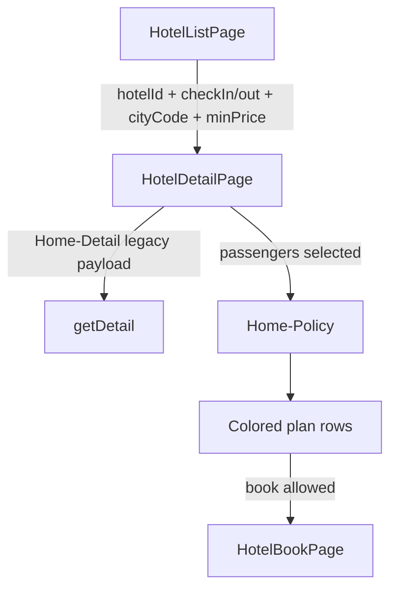

# Hotel Detail Page Implementation

## Problem

[`HotelDetailPage.tsx`](apps/h5/src/pages/hotel/HotelDetailPage.tsx) is a minimal stub that:

- Ignores URL query (`checkIn`, `checkOut`, `cityCode`) and uses hardcoded dates
- Calls `hotel.getDetail()` with wrong legacy field names (`CheckInDate` instead of `BeginDate`/`EndDate`, missing `MinPrice`, `CityCode`)
- Shows backend error「缺少必要的参数」raw on screen
- Has no UI parity with legacy `tmc-hotel-detail_ryx` or the provided design (hero, date bar, collapsible rooms)



## Files touched (explicit)

| Layer          | Files                                                                                                                                                                                                                        |
| -------------- | ---------------------------------------------------------------------------------------------------------------------------------------------------------------------------------------------------------------------------- |
| API / types    | [`packages/api/src/apis/hotel.ts`](packages/api/src/apis/hotel.ts), [`packages/api/src/apis/hotel.test.ts`](packages/api/src/apis/hotel.test.ts), [`packages/shared-types/src/hotel.ts`](packages/shared-types/src/hotel.ts) |
| Hooks          | [`apps/h5/src/hooks/useHotelList.ts`](apps/h5/src/hooks/useHotelList.ts) — **update `useHotelDetail` + add `useHotelPolicy`**                                                                                                |
| Utils / policy | [`apps/h5/src/utils/hotel-detail.ts`](apps/h5/src/utils/hotel-detail.ts), [`apps/h5/src/lib/hotel-book-policy.ts`](apps/h5/src/lib/hotel-book-policy.ts)                                                                     |
| UI             | `apps/h5/src/components/hotel/HotelDetail*.tsx`, [`HotelDetailPage.tsx`](apps/h5/src/pages/hotel/HotelDetailPage.tsx), [`HotelListPage.tsx`](apps/h5/src/pages/hotel/HotelListPage.tsx)                                      |
| Mock           | [`packages/mock/src/handlers/hotel.ts`](packages/mock/src/handlers/hotel.ts), [`packages/mock/src/fixtures/hotel.ts`](packages/mock/src/fixtures/hotel.ts)                                                                   |

## Phase 1 — API & data (unblock loading)

### 1.1 Legacy request builder for detail

In [`packages/api/src/apis/hotel.ts`](packages/api/src/apis/hotel.ts), mirror `buildHotelListRequest`:

```ts
// Target Home-Detail Data shape (legacy)
{
  HotelId, CityCode, BeginDate, EndDate,
  IsLoadDetail: true, MinPrice, hotelType: "Normal",
  travelformid: "" // optional from URL later
}
```

- Extend [`HotelDetailParams`](packages/shared-types/src/hotel.ts) with optional `CityCode`, `CityName`, `MinPrice`, `HotelType`, `TravelFormId`
- Change `getDetail` to `buildHotelDetailRequest()` + `normalizeHotelDetailResponse()`

### 1.2 Legacy response normalizer

Map `Data.Hotel` tree to current `HotelDetailResponse` and extend types as needed:

| Legacy field                     | New field                                                                                           |
| -------------------------------- | --------------------------------------------------------------------------------------------------- |
| `Hotel.Id/Name/Address/Category` | `HotelId`, `HotelName`, `Address`, `Star`                                                           |
| `Hotel.HotelImages[]`            | `ImageUrls[]` (each item's image URL)                                                               |
| `Hotel.Phone`, `Lat`, `Lng`      | `Phone`, `Lat`, `Lng`                                                                               |
| `Rooms[].Id/Name` + image        | `RoomId`, `RoomName`, `ImageUrl`                                                                    |
| `RoomPlans[]` + `Variables` JSON | `Plans[]` with `Price`, `Breakfast`, `CancelPolicy`, `RoomPlanUniqueId`, `VariablesObj`, legacy ids |

Reuse existing helpers in `hotel.ts`: `toPrice`, `parseVariablesObject`, `parseHotelStar`.

### 1.3 Hooks — update `useHotelDetail` (required)

Current signature only passes `hotelId`, `checkIn`, `checkOut`. Replace with params object aligned to `HotelDetailParams`:

```ts
export function useHotelDetail(params: HotelDetailParams | null) {
  return useQuery({
    queryKey: ["hotel", "detail", params],
    queryFn: () => getApi().hotel.getDetail(params!),
    enabled: Boolean(
      params?.HotelId && params?.CheckInDate && params?.CheckOutDate && params?.CityCode,
    ),
  });
}
```

`HotelDetailPage` builds params from URL: `HotelId`, `CheckInDate`, `CheckOutDate`, `CityCode`, `MinPrice`, optional `CityName`, `HotelType`.

### 1.4 List → detail navigation

In [`HotelListPage.tsx`](apps/h5/src/pages/hotel/HotelListPage.tsx) `openDetail()`:

```ts
params.set("minPrice", String(hotel.MinPrice ?? ""));
params.set("cityName", resolvedCity?.Name ?? cityName);
```

### 1.5 Detail page query contract

`/hotel/:hotelId?checkIn=&checkOut=&cityCode=&cityName=&minPrice=`

- Missing `checkIn/checkOut/cityCode` → redirect to `/hotel` (same guard pattern as list page)
- Pass all params into `useHotelDetail`

### 1.6 Tests

Add `getDetail` tests in [`packages/api/src/apis/hotel.test.ts`](packages/api/src/apis/hotel.test.ts) (request mapping + legacy `Data.Hotel` normalization), following existing list tests.

---

## Phase 2 — Detail UI (current H5 style)

Hide global header (`usePageHeader({ visible: false })`) and build immersive layout like [`HotelListPage`](apps/h5/src/pages/hotel/HotelListPage.tsx) + design screenshot.

### Dependencies

**`HotelStayDatePickerSheet` is already implemented** at [`apps/h5/src/components/hotel/HotelStayDatePickerSheet.tsx`](apps/h5/src/components/hotel/HotelStayDatePickerSheet.tsx) and used by [`HotelListPage`](apps/h5/src/pages/hotel/HotelListPage.tsx), [`HotelSearchCard`](apps/h5/src/components/hotel/HotelSearchCard.tsx), and [`HomeHotelSearchPanel`](apps/h5/src/components/home/HomeHotelSearchPanel.tsx). No blocker from `hotel_stay_date_picker_08f09469.plan.md` — detail page reuses this wrapper directly.

### New components under `apps/h5/src/components/hotel/`

| Component             | Responsibility                                                                                                      |
| --------------------- | ------------------------------------------------------------------------------------------------------------------- |
| `HotelDetailHero`     | Hero image area (see §2.1); floating circular back button                                                           |
| `HotelDetailInfoCard` | Name, address, star rating, map + phone actions (see §2.2)                                                          |
| `HotelDetailDateBar`  | Lavender bar: `入住` / `共N晚` pill / `离店`; tap opens `HotelStayDatePickerSheet`; on confirm update URL + refetch |
| `HotelDetailToolbar`  | 「添加旅客」badge link +「过滤差标」popover (see §3.4)                                                              |
| `HotelDetailRoomCard` | Collapsed row: thumbnail, room name, lowest「¥xxx 起」,「详情」placeholder, chevron; expand shows plans             |
| `HotelDetailPlanRow`  | Plan name, breakfast/cancel, price, colored「预订」button                                                           |

**Style tokens** (match existing hotel list): `#F5F6F9` page bg, white cards, `#2768FA` accents, `#E72932` price, HarmonyOS/PingFang fonts, subtle `rounded-lg` + light shadow.

### 2.1 Hero images (no Swiper dependency)

Monorepo H5 has no Swiper usage today. For MVP:

- Use **horizontal CSS scroll-snap** on `ImageUrls[]` (full-width slides, dot indicators optional)
- Fallback: single static image when only one URL or on load error
- Tap hero → future gallery route (out of scope); MVP can no-op or `window.open` first image

Legacy `HotelImages[]` maps to flat `ImageUrls: string[]` in normalizer.

### 2.2 Map / phone actions

| Action | H5 behavior                                                                                                                                                    |
| ------ | -------------------------------------------------------------------------------------------------------------------------------------------------------------- |
| Phone  | `tel:${Phone}` when `Phone` present                                                                                                                            |
| Map    | External link: `https://uri.amap.com/marker?position=${lng},${lat}&name=${encodeURIComponent(name)}` when `Lat`/`Lng` present; hide button when coords missing |

Legacy used `CoreHelper.openMap`; amap URI is appropriate for domestic users. No in-app map page in MVP.

### Page structure in [`HotelDetailPage.tsx`](apps/h5/src/pages/hotel/HotelDetailPage.tsx)

```
[Hero + back]
[Info card overlapping hero bottom]
[Date bar]
[Toolbar: passengers + policy filter]
[Section title: 房型信息]
[Room cards...]
```

**States:** skeleton, `formatApiError(error, "hotel")` + retry, empty rooms message.

### Utils: [`apps/h5/src/utils/hotel-detail.ts`](apps/h5/src/utils/hotel-detail.ts)

- `parseHotelDetailQuery(searchParams)`
- `buildHotelDetailUrl(hotelId, params)` for date changes
- `getRoomLowestPrice(room)`, `isRoomFullyBooked(room, policyColors)`

---

## Phase 3 — Policy + passengers (user requested)

Follow flight cabins pattern ([`FlightCabinsPage`](apps/h5/src/pages/flight/FlightCabinsPage.tsx) + [`flight-book-policy.ts`](apps/h5/src/lib/flight-book-policy.ts)).

### 3.1 Policy API adapter — `RoomPlans` field mapping (critical)

Legacy builds `arr: RoomPlanEntity[]` in `getHotelPolicyAsync` (`tmc-hotel_ryx.service.ts` ~L1076–1098) **before** `JSON.stringify`. H5 must match exactly or policy returns empty and buttons stay uncolored.

**Step A — collect plans from all rooms**, attach parent room:

```ts
for each room in detail.Rooms:
  for each plan in room.Plans:
    plan.Room = { Id: room.RoomId }  // legacy attaches full RoomEntity; Id is required
```

**Step B — dedupe by `RoomPlanUniqueId`** (legacy only sends one entry per unique id):

```ts
uniquePlans = dedupe by VariablesObj.RoomPlanUniqueId (parse Variables JSON if needed)
```

**Step C — map each plan to legacy payload object:**

| Output field     | Source / rule                                                                                                                      |
| ---------------- | ---------------------------------------------------------------------------------------------------------------------------------- |
| `TotalAmount`    | plan `TotalAmount` or computed total from prices                                                                                   |
| `Number`         | plan `Number`                                                                                                                      |
| `SupplierNumber` | plan `SupplierNumber`                                                                                                              |
| `BeginDate`      | detail `CheckInDate`                                                                                                               |
| `EndDate`        | detail `CheckOutDate`                                                                                                              |
| `Room.Id`        | parent room id when `plan.Room` set                                                                                                |
| `Id`             | plan legacy `Id` when present and **not** `"0"` / empty                                                                            |
| `SupplierType`   | when `Id` is `"0"` or empty → use `SupplierType`; **also** when `SupplierType == 4` (protocol hotel) always include `SupplierType` |

**Request body:**

```ts
{
  RoomPlans: JSON.stringify(arr),           // arr from table above
  Passengers: "accountId1,accountId2",      // whitelist staff AccountIds, deduped
  CityCode: string,
  TravelFromId?: "tf1,tf2"                  // optional, from passenger travelFormIds
}
```

**Response normalize** to per-passenger plan colors:

- `success` / `warning` / `danger_disabled` / `danger_full` / `danger_nopermission`
- Match `HotelPolicies[].UniqueIdId` ↔ `VariablesObj.RoomPlanUniqueId`

Add unit tests for `buildHotelPolicyRoomPlansPayload()` with edge cases: `Id === "0"`, `SupplierType === 4`, duplicate `RoomPlanUniqueId` across rooms.

### 3.2 `RoomPlanUniqueId` matching strategy

Legacy behavior (confirmed in `filterPassengerPolicy`):

1. **API payload**: dedupe plans by `RoomPlanUniqueId` before stringify (one row per unique rate plan).
2. **UI coloring**: iterate **every** plan in **every** room; lookup color by `getRoomPlanUniqueId(plan)` — same `UniqueIdId` → **same color across rooms** (intentional: one rate plan reused on multiple room types).
3. **Storage**: `colors: Record<RoomPlanUniqueId, PolicyColor>` — not keyed by `planId + roomId`.

`resolvePlanPolicyColor(plan, colors)` → `colors[plan.RoomPlanUniqueId] ?? default`.

`isRoomFullyBooked(room, colors)` → all plans in room have `danger_full`.

### 3.3 Hooks

[`useHotelList.ts`](apps/h5/src/hooks/useHotelList.ts):

- `useHotelDetail(params)` — see §1.3
- `useHotelPolicy(params)` — enabled when detail loaded **and** `selectedPassengers.length > 0`; queryKey includes passenger ids + dates

### 3.4「过滤差标」popover UX (legacy-aligned)

Legacy: toolbar text button `onFilteredPassenger()` → Ionic popover with `FilterPassengersPolicyComponent`.

| Aspect               | Behavior                                                                                             |
| -------------------- | ---------------------------------------------------------------------------------------------------- |
| **Trigger**          | Tap「过滤差标」text button in `HotelDetailToolbar` (not long-press)                                  |
| **Content**          | Radio list of selected passengers (name + masked credential); extra option「不过滤差标」             |
| **Selection**        | **Single-select** passenger; confirm button「确定」                                                  |
| **Default**          | On load: passenger with `isFilterPolicy` flag, else **first passenger** in list (`initFilterPolicy`) |
| **Effect**           | Sets `filterPassengerId` state → recomputes `colors` map for that passenger's `PassengerKey` only    |
| **Empty passengers** | Hide or disable「过滤差标」until at least one passenger selected                                     |

H5 implementation: small bottom sheet or anchored popover (match existing filter sheet patterns); no multi-select.

### 3.5 Other UI behavior

- Expand room → if no passengers and not self-book mode, toast「请先添加旅客」+ link to passenger select
- After policy loads, color each plan「预订」button; block book on `danger_full` / `danger_nopermission` (agent override via `hasAgentIdentity` like flight)
- On passenger count change or date change → refetch detail + policy

New lib: [`apps/h5/src/lib/hotel-book-policy.ts`](apps/h5/src/lib/hotel-book-policy.ts)

- `buildHotelPolicyRoomPlansPayload(detail)` — §3.1 table
- `buildHotelPolicyParams(detail, passengers, cityCode, dates)`
- `buildPolicyColorMap(policyResults, filterPassengerId, detail, isFull, isNoPermission)`
- `resolvePlanPolicyColor(plan, colors)`
- `isHotelPlanBookable(color, isAgent)`
- `formatHotelPolicyBlockMessage(...)`

### 3.6 Book navigation

Keep existing [`HotelBookPage`](apps/h5/src/pages/hotel/HotelBookPage.tsx) entry via:

`/hotel/:hotelId/book?planId=&checkIn=&checkOut=`

Optionally persist selected room/plan context in session (`hotel-book-session.ts`) — not required for MVP.

### 3.7 Mock

Enhance [`packages/mock/src/handlers/hotel.ts`](packages/mock/src/handlers/hotel.ts) `POLICY` handler:

- Return `HotelPassengerModel[]` with `PassengerKey` + `HotelPolicies[].UniqueIdId` matching mock plan `RoomPlanUniqueId` values
- Include at least one `IsAllowBook: false` and one `danger_full` scenario for QA

---

## Out of scope (follow-up)

- `tmc-hotel-room-detail_ryx` sub-route (room detail modal/page)
- Full image gallery page, in-app map page, hotel info accordion / traffic tab
- `OrderHotelDetailPage` placeholder

---

## Verification

1. Mock: list → detail loads with hero + rooms (no「缺少必要的参数」)
2. Change dates on detail → URL updates + detail refetches
3. Add passenger → policy API called with correct `RoomPlans` JSON → plan buttons colored
4. Switch「过滤差标」passenger → colors update per selected passenger
5. Book allowed plan → reaches `/hotel/:id/book`
6. `pnpm --filter api test` (detail + policy payload tests) + `pnpm --filter h5 test`
