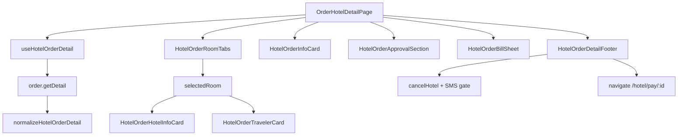

# Hotel Order Detail Page Implementation

## Goal

Replace the placeholder [`OrderHotelDetailPage.tsx`](apps/h5/src/pages/order/OrderHotelDetailPage.tsx) with a full hotel order detail experience that:

- **Functionally mirrors** legacy `tmc-order-hotel-detail_ryx` + list-side actions (cancel, pay, SMS verify)
- **Visually follows** [`docs/需求实施/酒店/酒店-订单详情.png`](docs/需求实施/酒店/酒店-订单详情.png)
- Reuses existing chrome: [`hotel-detail-chrome.ts`](apps/h5/src/components/hotel/hotel-detail-chrome.ts), [`HotelBookHeader`](apps/h5/src/components/hotel/HotelBookHeader.tsx) gradient pattern
- **Bill sheet UI pattern:** [`HotelBookBillSheet`](apps/h5/src/components/hotel/HotelBookBillSheet.tsx) is **already implemented** (hotel book page); order detail adds a separate `HotelOrderBillSheet` that copies its bottom-sheet chrome but renders `OrderItems` lines

## Current gaps (confirmed)

| Area                  | Today                                                                                | Needed                                                            |
| --------------------- | ------------------------------------------------------------------------------------ | ----------------------------------------------------------------- |
| Page                  | "即将上线" placeholder                                                               | Full layout + actions                                             |
| `OrderDetailResponse` | 9 flat fields in [`hotel.ts`](packages/shared-types/src/hotel.ts)                    | Normalized hotel detail model                                     |
| `order.getDetail`     | Raw passthrough, no adapter                                                          | `normalizeHotelOrderDetail()`                                     |
| `cancelHotel`         | `{ OrderId }` only                                                                   | `{ OrderId, OrderHotelId, Channel }` per legacy                   |
| SMS APIs              | Method constants exist in [`order.ts`](packages/api/src/methods/order.ts), not wired | `sendHotelSmsCode` / `confirmHotelSmsCode`                        |
| List navigation       | No card tap, actions toast only                                                      | Navigate to detail / pay                                          |
| Mock                  | Minimal poll fixture; hotel `Variables.isPay` may be unset in detail fixture         | Multi-room + travelers + Histories + `isPay`/`isShowCancelButton` |

## Architecture



## Phase 1 — Types & API adapter

### 1.1 Extend shared types ([`packages/shared-types/src/hotel.ts`](packages/shared-types/src/hotel.ts))

Add normalized models (keep minimal `OrderDetailResponse` fields for backward compat with `HotelResultPage` / `HotelPayPage`):

- `HotelOrderDetail` — top-level view model
- `HotelOrderRoom` — per `OrderHotels[]` entry: `Id` (事务号), `Key`, hotel/room fields, `StatusName`, dates, address, payment, invoice, phone, supplier, `RuleDescription`, `ExceptionMessage`, `Variables` flags (`isBtn`, `btnValue`, `SMSCodeVerifyResultDesc`, `VerifySmsCodeMobile`)
- `HotelOrderBillLine` — from `OrderItems` (`Name`, `Amount`, `Tag`)
- `HotelOrderHistory` — from `Histories` (`TypeName`, approver, `StatusName`, times)
- `HotelOrderActionFlags` — `showPay`, `showCancel`, `showInspurRepush`, SMS state
- `HotelCancelParams` — `{ OrderId, OrderHotelId, Channel }`
- SMS request/response param types

### 1.2 Add adapter ([`packages/api/src/apis/order-detail-map.ts`](packages/api/src/apis/order-detail-map.ts))

Parse legacy `TmcApiOrderUrl-Order-Detail` shape (same raw envelope as list items):

- Reuse `parseVariablesObj`, `readString`, `formatDateOnly` patterns from [`order-list-map.ts`](packages/api/src/apis/order-list-map.ts) — extract shared `legacy-parse.ts` helpers if needed to avoid duplication
- Map `Order.OrderHotels[]` (preserve API order; UI labels use **房间1/2/3** per design, not legacy transaction Id tabs)
- Map `Order.OrderItems[]` grouped by room `Key`; apply legacy bill rules:
  - Room fee: `Tag === "Hotel"`
  - Service fees: `Tag` contains `"Fee"`; hide when `Tmc.IsShowServiceFee === false`
  - Early checkout truncation — see **§1.2.1** below (legacy `HotelOrderPricePopoverComponent` parity)
- Map `Histories[]`, `OrderPassengers[]`, `OrderNumbers[]` (tag `TmcOutNumber`), `TravelPayType`, `SelfPayAmount`
- Derive action flags from `Order.Variables` / selected room `Variables`:
  - `showPay`: `isPay && Status !== "WaitHandle"`
  - `showCancel`: `isShowCancelButton`
  - SMS: `isBtn === 1` + `btnValue` exact match ("获取短信验证码" / "短信验证码校验")
- Status display: map "等待处理" → "等待审批" (legacy)

Wire in [`packages/api/src/apis/order.ts`](packages/api/src/apis/order.ts):

```ts
getDetail(params) {
  const raw = await proxy.send<unknown>({ method: ORDER_FLOW_METHODS.DETAIL, data: params });
  return normalizeHotelOrderDetail(raw);
}
```

Add methods:

- `cancelHotel(params: HotelCancelParams)` — full legacy payload; `Channel` default `"客户H5"` via [`resolveAppChannel`](apps/h5/src/lib/app-channel.ts)
- `sendHotelOrderSmsCode({ Mobile, OrderHotelId })`
- `confirmHotelOrderSmsCode({ SmsCode, OrderHotelId })` — legacy `ProductId` = `OrderHotelId`
- `checkInspurRepush({ OrderId })` — optional footer action

#### 1.2.1 Bill line filtering algorithm (`filterBillLinesForRoom`)

Input: `OrderItems` for one room `Key`, `showServiceFee` flag.

1. Filter by `Key == roomKey`.
2. If `!showServiceFee`, drop items whose `Tag` ends with `"Fee"`.
3. Scan in API order for the **first** item where `Amount < 0` **and** `Name` does not contain `"取消"` → treat as early-checkout marker.
4. If marker found at index `i`:
   - Keep only items `[0 .. i)` (lines **before** the marker).
   - **Do not** include the negative marker line itself.
5. If marker not found: keep all filtered lines.
6. If result is empty after step 4–5: show empty-state copy **「暂无明细」** in the sheet (do not fall back to unfiltered lines).
7. Multiple negative non-cancel lines: only the **first** triggers truncation; later negatives are ignored (legacy scans once).

Unit-test cases: no marker; marker at index 0 → empty; marker mid-list; fee hidden; multiple negatives.

#### 1.2.2 Cancel granularity (legacy parity)

**Cancel is per-order, not per-room tab.**

- Room tabs (`房间1/2/3`) only switch **display** (酒店信息 / 旅客信息 / 账单明细 per `Key`).
- `cancelHotel` payload always uses `OrderHotels[0].Id` as `OrderHotelId` — same as legacy list `abolishHotelsOrder`.
- SMS verify flags also read from `OrderHotels[0].Variables` (legacy list behavior); tabs do not change SMS/cancel targets.
- Footer **取消** cancels the whole order; no per-room cancel in this iteration.

## Phase 2 — Pure helpers & hooks

### 2.1 [`apps/h5/src/lib/hotel-order-detail.ts`](apps/h5/src/lib/hotel-order-detail.ts)

- `formatHotelPaymentType(code)` — 1=预付, 2=到店付, else 月结/公付
- `maskCredentialNumber(num, type)` — `410889******999999身份证` style
- `computeStayNights(begin, end)`
- `filterBillLinesForRoom(items, roomKey, showServiceFee)` — implements §1.2.1
- `resolveFooterActions(detail)` — pay/cancel/SMS visibility from **order-level** `Variables` + `OrderHotels[0]` SMS flags (not selected tab)
- `formatApprovalExpiredTime` — blank if starts with `1800` (legacy)

### 2.2 Hooks ([`apps/h5/src/hooks/useHotelOrderDetail.ts`](apps/h5/src/hooks/useHotelOrderDetail.ts))

- `useHotelOrderDetail(orderId)` — `useQuery`, no polling unless status is transitional (Booking/WaitHandle); refetch after cancel/SMS
- `useCancelHotelOrder()` — mutation wrapping `order.cancelHotel`
- `useHotelOrderSms()` — send + confirm mutations
- `useInspurRepush(orderId)` — optional query for footer

Keep existing `useOrderDetail` in [`useHotelBook.ts`](apps/h5/src/hooks/useHotelBook.ts) working: normalized response should still expose `OrderId`, `TotalAmount`, `isShowPayButton` (map from `showPay`).

## Phase 3 — UI components

New folder: [`apps/h5/src/components/order/hotel/`](apps/h5/src/components/order/hotel/)

| Component                   | Responsibility                                                                                                                                                                                              |
| --------------------------- | ----------------------------------------------------------------------------------------------------------------------------------------------------------------------------------------------------------- |
| `HotelOrderDetailHeader`    | Clone [`HotelBookHeader`](apps/h5/src/components/hotel/HotelBookHeader.tsx) with title **订单详情**                                                                                                         |
| `HotelOrderDetailRow`       | Label left / value right row inside white cards (design-aligned typography)                                                                                                                                 |
| `HotelOrderInfoCard`        | 订单编号, 付款方式, 出票时间, 订单金额 + **账单明细** link, status badge (reuse [`OrderStatusBadge`](apps/h5/src/components/order/OrderStatusBadge.tsx)); also legacy **事务号**, **自付金额** when present |
| `HotelOrderRoomTabs`        | Pill tabs **房间1/2/3**; single room hides tabs                                                                                                                                                             |
| `HotelOrderHotelInfoCard`   | Design fields + expandable **取消政策** (`RuleDescription`), orange notice, tap-to-call phone                                                                                                               |
| `HotelOrderTravelerCard`    | Design fields + legacy extras: 费用类别, 违规原因 (hide when `SelfPayAmount`), 其他入住人, 外部编号                                                                                                         |
| `HotelOrderApprovalSection` | `Histories` timeline in card style (user confirmed in scope)                                                                                                                                                |
| `HotelOrderBillSheet`       | New component; **reuse chrome** from existing [`HotelBookBillSheet`](apps/h5/src/components/hotel/HotelBookBillSheet.tsx), data from `OrderItems` + §1.2.1                                                  |
| `HotelOrderDetailFooter`    | Fixed bar: **取消** (outline) + **立即支付** (gradient); hidden when no actions                                                                                                                             |
| `HotelOrderSmsSheet`        | Modal for send/confirm SMS (legacy `GetsmscodeComponent` flow)                                                                                                                                              |
| `HotelOrderCancelDialog`    | Confirm before cancel                                                                                                                                                                                       |

**Styling tokens:** page bg `#F5F6F9`, cards `rounded-xl bg-white`, primary `#2768FA`, price `#FF4D4F`, policy notice orange tint — match design PNG and book page.

## Phase 4 — Page orchestration

Rewrite [`OrderHotelDetailPage.tsx`](apps/h5/src/pages/order/OrderHotelDetailPage.tsx):

1. `useParams().orderId` + `useHotelOrderDetail`
2. `usePageHeader({ visible: false })` — custom fixed header like book page
3. `scrollH5MainToTop()` on enter ([`scroll-h5-main.ts`](apps/h5/src/lib/scroll-h5-main.ts))
4. Local state: `selectedRoomIndex`, `billOpen`, `cancelOpen`, `smsOpen`
5. Loading / error / empty states
6. SMS gate: if `OrderHotels[0]` requires verification, run send → confirm before `cancelHotel` with `OrderHotelId = OrderHotels[0].Id` (per-order cancel, §1.2.2)
7. Pay → `navigate(/hotel/pay/:orderId)` (existing [`HotelPayPage`](apps/h5/src/pages/hotel/HotelPayPage.tsx))
8. Inspur repush footer button when `checkInspurRepush` truthy (legacy parity; can stub mock initially)

## Phase 5 — Navigation wiring

### List → detail

- [`OrderListCard.tsx`](apps/h5/src/components/order/OrderListCard.tsx): wrap card body in `button`/`onClick` → `/orders/hotel/:orderId` for hotel tab
- [`OrderListPage.tsx`](apps/h5/src/pages/order/OrderListPage.tsx) `handleAction`:
  - `pay` → `/hotel/pay/:orderId`
  - `cancel` → navigate to detail with `state: { action: "cancel" }` or open cancel on detail
  - Remove "功能即将上线" toast for hotel actions

### Post-book (optional, low risk)

Keep current redirect to `/home/orders?tab=hotel` unless user later asks; detail is reachable from list.

## Phase 6 — Mock & tests

### Mock ([`packages/mock/src/fixtures/order.ts`](packages/mock/src/fixtures/order.ts))

Enrich `createMockOrderDetail` / add `createMockHotelOrderDetailFull`:

- 3 `OrderHotels`, passengers, `OrderItems` per room Key, `Histories`, `Variables` with `isPay` / `isShowCancelButton`, SMS scenario variant

Update [`packages/mock/src/handlers/hotel.ts`](packages/mock/src/handlers/hotel.ts) / [`order.ts`](packages/mock/src/handlers/order.ts) to return legacy-shaped raw JSON so adapter is exercised.

### Tests

- [`packages/api/src/apis/order-detail-map.test.ts`](packages/api/src/apis/order-detail-map.test.ts) — normalization, bill filtering, action flags
- [`apps/h5/src/lib/hotel-order-detail.test.ts`](apps/h5/src/lib/hotel-order-detail.test.ts) — formatters, mask, nights

### Docs

- Update [`docs/api/domains/hotel.md`](docs/api/domains/hotel.md) and [`docs/api/PAGE-API-MATRIX.md`](docs/api/PAGE-API-MATRIX.md) — mark detail page APIs as implemented

## Legacy ↔ design field map (reference)

**订单信息 card:** `Order.Id`, `TravelPayType`, `InsertTime`, `TotalAmount`, `StatusName`, `SelfPayAmount`, per-room `Id` (事务号)

**酒店信息 card (per selected room):** `HotelName`, `RoomName`+breakfast, `StatusName`, `ExceptionMessage`, planned/actual dates, `HotelAddress`, `PaymentType`, room fee from items, `HotelInvoice`, `HotelContact`, `SupplierName`, `RuleDescription`

**旅客信息 card:** passenger name/credential/mobile/email, cost center, org, `ExpenseType`, violation fields, `CustomerName` co-guests, `OrderNumbers`

**审批记录:** `Histories[]` with `TypeName`, approver, status, insert/expired times

## Out of scope (this iteration)

- Redesigning [`HotelPayPage`](apps/h5/src/pages/hotel/HotelPayPage.tsx) UI (reuse as-is)
- Flight/train order detail pages
- Agent "发送短信/邮件" on hotel detail (legacy broken for hotel; not in design)

## Verification checklist

- Open `/orders/hotel/ORD-HTL-001` in dev mock — 3 room tabs, all sections render
- **账单明细** shows correct lines per selected room
- **取消** sends `{ OrderId, OrderHotelId: OrderHotels[0].Id, Channel }` (whole order); SMS uses `OrderHotels[0]` flags
- Mock hotel orders set `Variables.isPay` so list **支付** button appears (adapter already handles via `buildActions`)
- **立即支付** navigates to pay page when `showPay`
- Approval section renders when `Histories` non-empty
- List card tap and pay/cancel actions route correctly
- `pnpm typecheck && pnpm test` pass for new adapter/helpers
