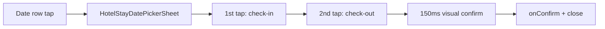

# Hotel Stay Date Range Picker

## Problem

[`HomeHotelSearchPanel.tsx`](apps/h5/src/components/home/HomeHotelSearchPanel.tsx) and [`HotelSearchCard.tsx`](apps/h5/src/components/hotel/HotelSearchCard.tsx) each open **two separate native `<input type="date">`** via `showPicker()`. This breaks range UX (no visual span, no 入住/离店 labels, inconsistent across browsers).

Legacy ryx opens a **full-screen modal calendar** (`TmcCalendarRyxComponent`, title **「请选择入离店日期」**) with two-tap range selection and auto-close.

## Target UX (function from ryx, style from H5)



**Behavior to match legacy** ([`tmc-calendar_ryx.page.ts`](file:///Users/liaiguo/private/projects/rongyixing/beeantmobile-main/projects/ryx/src/app/tmc/components/tmc-calendar_ryx/tmc-calendar_ryx.page.ts)):

- Two-tap range: first = 入住, second (later date) = 离店, highlight in-between days
- Past dates disabled; **yesterday selectable 00:00–05:59** ([`hotelIsCanSelectYesterday`](file:///Users/liaiguo/private/projects/rongyixing/beeantmobile-main/projects/ryx/src/app/tmc/tmc-hotel/tmc-hotel_ryx.service.ts))
- Today shows **「今天」** in red instead of day number
- Week header: 日–六; weekend columns tinted (legacy orange → H5 accent)
- Vertical scroll through months (initial: current + next ~2 months; load more on scroll)
- Top bar: back + title **「请选择入离店日期」** (same pattern as [`FlightModifySearchSheet.tsx`](apps/h5/src/components/flight/FlightModifySearchSheet.tsx))
- **Re-tap guard (hotel):** if user taps a date already in the current draft selection, **ignore** (L325–329) — do not treat as completion

**Visual tokens (replace legacy purple with H5 palette):**

| Element                        | Token                                        |
| ------------------------------ | -------------------------------------------- |
| Selected endpoints (入住/离店) | `#2768FA` fill, white text                   |
| In-range days                  | `#2768FA` at ~12% opacity (`#E8F0FE`)        |
| Primary text                   | `#010101`                                    |
| Secondary text                 | `#666666`                                    |
| Page / weekday bar bg          | `#F5F6F9`                                    |
| Today label                    | `#EF4444`                                    |
| Weekend header                 | `#F59E0B`                                    |
| Disabled day                   | `#D1D5DB`                                    |
| Typography                     | HarmonyOS / PingFang (match existing panels) |

Search row **display stays unchanged** (`6月25日 周四 —— 6月27日 周六 共2晚`); only the picker behind it changes.

---

## Blocking: `reduceHotelDateRangeSelection` state machine

Must mirror legacy `onDaySelected` — **not** a simple swap. Reference: L351–363 (earlier second tap replaces anchor, stays in partial state).

| Current draft state           | User action            | Next state                              | UI hint                                      |
| ----------------------------- | ---------------------- | --------------------------------------- | -------------------------------------------- |
| `{ checkIn: null }`           | tap enabled date A     | `{ checkIn: A, checkOut: null }`        | tooltip「请选择离店日期」                    |
| `{ checkIn: A }`              | tap **later** date B   | `{ checkIn: A, checkOut: B }`           | tooltip「共N晚」→ **confirm**                |
| `{ checkIn: A }`              | tap **earlier** date C | `{ checkIn: C, checkOut: null }`        | reset anchor to C, tooltip「请选择离店日期」 |
| `{ checkIn: A }`              | tap **same** date A    | **no-op** (legacy hotel guard L325–329) | —                                            |
| `{ checkIn: A, checkOut: B }` | any tap                | **no-op** until sheet re-opened         | —                                            |

**Same-day 入住离店 note:** Legacy code at L375–380 sets `topDesc = 入住离店` when timestamps equal, but the hotel re-tap guard (L325–329) makes **double-tap same cell unreachable**. Same-day ranges appear when **re-opening** the sheet with existing `checkIn === checkOut` (restored from `searchHotelModel`). Implementation:

- Opening sheet seeds draft from props `{ checkIn, checkOut }`
- Completing a range always requires two **distinct** dates (later second tap)
- Display restored same-day ranges correctly (label 入住离店, `nightsBetween` → 1)

Unit tests must cover all rows in the table above, including no-op on re-tap and earlier-date reset (not swap).

---

## Blocking: same-day vs `useHotelSearchForm` auto-fix

Current code **blocks** same-day in two places:

```46:49:apps/h5/src/hooks/useHotelSearchForm.ts
  useEffect(() => {
    if (checkOut <= checkIn) {
      setCheckOut(addDays(checkIn, 1));
    }
  }, [checkIn, checkOut]);
```

```84:84:apps/h5/src/lib/hotel-search.ts
  if (checkOut <= checkIn) return "离店日期须晚于入住日期";
```

**Required changes (both):**

- Hook effect: change `<=` to `<` — only auto-bump when `checkOut < checkIn`, allow `checkOut === checkIn`
- `validateHotelSearch`: change to `checkOut < checkIn` — allow same-day stay
- `nightsBetween` already returns `1` when diff is 0

This preserves restored same-day ranges and avoids silent overwrite after sheet `onConfirm`.

---

## Implementation details

### Sheet auto-close timing

Legacy uses `delayBackTime = 100` ms before `modal.dismiss` ([`back()` L541–548](file:///Users/liaiguo/private/projects/rongyixing/beeantmobile-main/projects/ryx/src/app/tmc/components/tmc-calendar_ryx/tmc-calendar_ryx.page.ts)).

Plan: after second tap completes range (`checkOut` set), wait **150 ms** (slightly longer for visual confirmation), then call `onConfirm(checkIn, checkOut)` and close. Do not close on partial selection (only `checkIn` set). Back button closes without confirming (discard draft).

### Yesterday selectable window

Use **client local time** — same as legacy `hotelIsCanSelectYesterday()`:

```ts
const hours = new Date().getHours();
return hours >= 0 && hours <= 5; // then minDate = yesterday, else today
```

No server time. Document in `hotelMinSelectableDate()` JSDoc.

### Date row wiring (two panels)

| Panel                                                                              | Change                                                                                                                                                      |
| ---------------------------------------------------------------------------------- | ----------------------------------------------------------------------------------------------------------------------------------------------------------- |
| [`HomeHotelSearchPanel.tsx`](apps/h5/src/components/home/HomeHotelSearchPanel.tsx) | Remove `checkInRef`/`checkOutRef` + hidden inputs; wrap date row in single `button`/clickable div; keep `formatHotelDateShort` + `relativeDayLabel` + 共N晚 |
| [`HotelSearchCard.tsx`](apps/h5/src/components/hotel/HotelSearchCard.tsx)          | Same sheet trigger; preserve `text-lg` / `text-base` typography differences                                                                                 |

Both mount `<HotelStayDatePickerSheet open={...} checkIn checkOut onConfirm onClose />`.

### Scroll-to-anchor month

On sheet open (`open === true`), after month sections render, `scrollIntoView` the month containing `checkIn` (fallback: today). Legacy `moveToCurMonth()` is commented out in ngAfterViewInit — we still implement scroll for better UX.

### `DateRangeField` cleanup

After wiring, verify with `rg DateRangeField` — currently only exported from [`search/index.ts`](apps/h5/src/components/search/index.ts), no consumers. Remove export + file if still orphaned (verify todo).

---

## Architecture

### 1. Pure date-range logic — [`apps/h5/src/lib/hotel-date-range.ts`](apps/h5/src/lib/hotel-date-range.ts)

- `hotelMinSelectableDate(now = new Date())` — local yesterday/today rule
- `buildMonthWeeks(year, month, minDate)` — 7-column grid
- `getDayCellState(date, draft, minDate)` — disabled | default | today | rangeStart | rangeEnd | inRange | sameDayEndpoint
- `reduceHotelDateRangeSelection(draft, tappedDate, minDate)` — state machine per table above
- `buildInitialMonths(anchorDate, count)` — month list for scroll

Tests: [`hotel-date-range.test.ts`](apps/h5/src/lib/hotel-date-range.test.ts)

### 2. UI components — [`apps/h5/src/components/hotel/`](apps/h5/src/components/hotel/)

| File                           | Role                                                                        |
| ------------------------------ | --------------------------------------------------------------------------- |
| `HotelStayDatePickerSheet.tsx` | Full-screen overlay; draft state; 150 ms delayed confirm; scroll-to-checkIn |
| `HotelStayCalendar.tsx`        | Sticky weekday header + scrollable months + infinite load                   |
| `HotelStayCalendarDay.tsx`     | Cell: 今天 / day number + 入住/离店 sublabel                                |

### 3. Hook / validation updates

- [`useHotelSearchForm.ts`](apps/h5/src/hooks/useHotelSearchForm.ts) — relax auto-fix
- [`hotel-search.ts`](apps/h5/src/lib/hotel-search.ts) — relax `validateHotelSearch`

### 4. Out of scope

- Hotel list page inline picker (still navigates to `/hotel` on date tap)

## Verification

- Manual: home + `/hotel` — date row → sheet → two-tap range → row updates → search URL correct
- Manual: earlier second tap resets to new check-in (not swap)
- Manual: re-tap selected check-in date is ignored
- Manual: open with same-day range displays correctly; submit search succeeds
- Manual: 00:00–05:59 yesterday selectable; after 06:00 disabled
- Manual: sheet opens scrolled to check-in month
- `pnpm --filter @ryx/h5 test -- src/lib/hotel-date-range.test.ts`
- `pnpm --filter @ryx/h5 typecheck`
- `rg DateRangeField apps/h5` — confirm orphan status before delete
