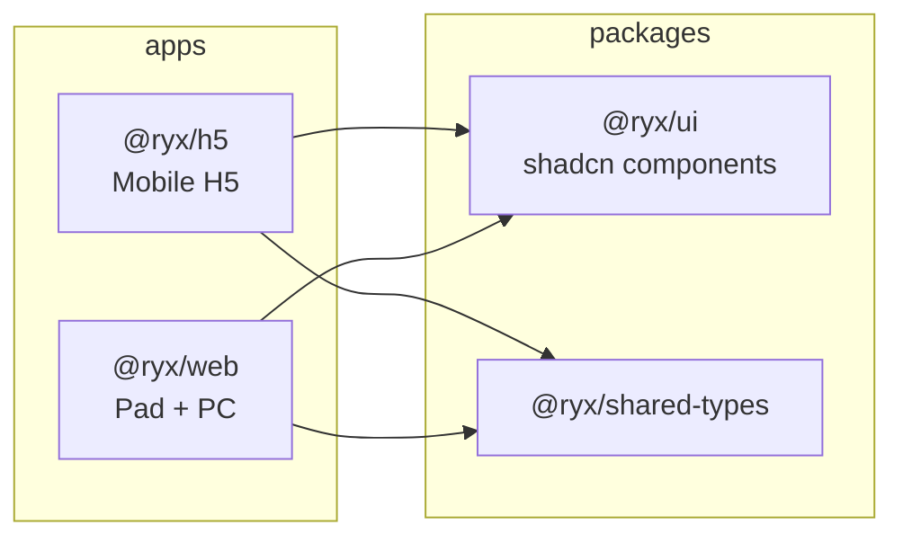

# 融易行 Monorepo 初始框架搭建计划

## Pad 与 PC 是否共用一套代码？

**可以，且推荐共用。** 你已选择 `apps/h5` + `apps/web` 方案，其中：

| 端        | 应用                   | 策略                                         |
| --------- | ---------------------- | -------------------------------------------- |
| 移动端 H5 | [`apps/h5`](apps/h5)   | 独立应用，移动优先 viewport，触摸交互        |
| Pad       | [`apps/web`](apps/web) | 与 PC 共用，`768px`–`1439px` 区间 + 触摸适配 |
| PC        | [`apps/web`](apps/web) | 与 Pad 共用，`≥ 1440px` 宽屏布局             |

MatePad Pro（3:2）与 MatePad Mini（16:10）无需单独应用：在 `apps/web` 内用**流体布局 + 断点 + `aspect-ratio` 媒体查询**即可覆盖。

### 断点与 MatePad CSS 像素对齐

按 **2x DPR** 估算逻辑宽度（实际以浏览器 `window.innerWidth` 为准）：

| 设备              | 方向 | 物理分辨率 | CSS 宽度 |
| ----------------- | ---- | ---------- | -------- |
| MatePad Pro 13.2" | 横屏 | 2880×1920  | ~1440px  |
| MatePad Pro 13.2" | 竖屏 | 1920×2880  | ~960px   |
| MatePad Mini 8.8" | 横屏 | 2560×1600  | ~1280px  |
| MatePad Mini 8.8" | 竖屏 | 1600×2560  | ~800px   |

**设计决策（已修正）**：将 Pad 上界扩展到 `1439px`，PC 从 `≥ 1440px` 开始，确保 MatePad Pro 横屏（~1440px）落入 **Pad 布局**而非 PC 布局。Mini 横屏（~1280px）同样稳定在 Pad 区间。

- Pad 区间：`768px` – `1439px`
- PC 区间：`≥ 1440px`
- Tailwind 自定义断点：`pad: 768px`，`pc: 1440px`（`xl` 默认 1280px 不足以区分 Pro 横屏，需显式定义 `pc`）

### 触摸交互适配（Pad 必备）

两台 MatePad 均为触屏，即使 CSS 宽度进入 PC 区间，`pointer: coarse` 仍可能为 true。宽度断点与输入能力**解耦**：

- **宽度断点**：控制布局结构（单栏 / 双栏 / 宽屏侧栏）
- **`@media (pointer: coarse)`**：强制 `min-h-11 min-w-11`（44px）触摸目标、增大间距
- **`@media (hover: hover)`**：仅在有 hover 能力时启用 hover 样式；触屏设备用 `:active` / `focus-visible` 替代
- 共享 token：在 [`packages/ui`](packages/ui) 或 [`apps/web/src/config/theme.ts`](apps/web/src/config/theme.ts) 定义 `TOUCH_TARGET_MIN = 44`



## 与需求文档的差异说明

需求目录中 `app/`、`sitemap.ts`、`robots.ts` 偏 Next.js App Router 风格，但你指定 **React + Vite**。脚手架将**保留语义化目录**，映射为 Vite 惯例：

| 需求路径                   | Vite 实现                                                                                                    |
| -------------------------- | ------------------------------------------------------------------------------------------------------------ |
| `src/app/`                 | 路由入口、`layouts/`、路由配置（[react-router](https://reactrouter.com/) v7）                                |
| `sitemap.ts` / `robots.ts` | 初期放 [`public/robots.txt`](apps/web/public/robots.txt) + 占位 `src/lib/sitemap.ts`（后续可接构建脚本生成） |
| `src/content/`             | 空目录 + 示例 JSON/MDX 占位                                                                                  |
| `src/config/site.ts`       | 站点元信息、断点常量                                                                                         |
| `src/config/theme.ts`      | 设计 token（颜色、圆角等）                                                                                   |

## 目标目录结构

```
rongyixing-monorepo/
├── apps/
│   ├── h5/                         # @ryx/h5
│   │   ├── src/
│   │   │   ├── app/                # routes, layouts
│   │   │   ├── pages/              # 页面组件
│   │   │   ├── components/
│   │   │   ├── config/{site,theme}.ts
│   │   │   └── lib/env.ts
│   │   ├── index.html
│   │   ├── vite.config.ts          # @vitejs/plugin-react + @tailwindcss/vite
│   │   ├── components.json         # shadcn CLI（见下方 monorepo 小节）
│   │   ├── src/vite-env.d.ts
│   │   ├── .env.example
│   │   └── package.json
│   └── web/                        # @ryx/web（Pad + PC）
│       └── （结构同 h5，另含 responsive layout 示例）
├── packages/
│   ├── ui/                         # @ryx/ui — 共享 shadcn 组件
│   │   ├── src/components/ui/      # Button, Card 等初始组件
│   │   ├── src/lib/utils.ts        # cn() helper
│   │   └── package.json
│   └── shared-types/               # @ryx/shared-types
│       ├── src/index.ts            # 空 DTO 占位 + 导出
│       └── package.json
├── scripts/                        # 可选：kill-port 等
├── docs/
├── pnpm-workspace.yaml
├── .npmrc                          # pnpm monorepo 策略
├── vitest.workspace.ts             # workspace 级测试入口
├── .browserslistrc                 # HarmonyOS / Chromium 目标
├── package.json                    # 根脚本 orchestrate filters
├── tsconfig.base.json
├── .gitignore                      # 基于 gitignore.example，改为 Vite 相关
├── CLAUDE.md
└── README.md
```

## 根配置

### [`pnpm-workspace.yaml`](pnpm-workspace.yaml)

```yaml
packages:
  - "apps/*"
  - "packages/*"
```

### [`.npmrc`](.npmrc)

```ini
shamefully-hoist=false
auto-install-peers=true
strict-peer-dependencies=false
```

- 默认不 hoist，保持 monorepo 依赖隔离
- 若 ESLint/Prettier 解析异常，再按需加 `public-hoist-pattern[]=*eslint*`

### [`package.json`](package.json)（根）

- `private: true`
- `packageManager`: `pnpm@9.x`（pin 具体版本）
- `engines.node`: `>=20`
- 聚合脚本：
  - `dev:h5` → `pnpm --filter @ryx/h5 dev`
  - `dev:web` → `pnpm --filter @ryx/web dev`
  - `build` → `pnpm -r build`（pnpm 9 默认按 workspace 依赖**拓扑序**构建；见下方说明）
  - `lint` / `typecheck` / `test` / `audit`
- `pnpm audit` 作为安全门禁（符合项目 Global Rules）

**构建顺序说明**：`pnpm -r run build` 在 pnpm 9 中已按依赖图拓扑排序（先 `@ryx/ui` 再 apps）。初始阶段不引入 Turborepo；若后续需要构建缓存再评估。

### [`.browserslistrc`](.browserslistrc)

HarmonyOS 浏览器基于 Chromium，初始目标：

```
> 0.5%
last 2 versions
not dead
Chrome >= 90
```

### [`vitest.workspace.ts`](vitest.workspace.ts)

根级 workspace 测试入口，聚合 `packages/*` 与各 app 的 `vitest.config.ts`：

```ts
import { defineWorkspace } from "vitest/config";

export default defineWorkspace(["packages/*/vitest.config.ts", "apps/*/vitest.config.ts"]);
```

### [`tsconfig.base.json`](tsconfig.base.json)

- `strict: true`，`moduleResolution: bundler`，`jsx: react-jsx`
- 各 workspace `extends` 根配置，分别设置 `rootDir` / `outDir`

### [`.gitignore`](.gitignore)

- 从 [`gitignore.example`](参考模板) 复制，将 `.next/` 替换/补充为 Vite 产物：`dist/`、`.vite/`

## 共享包

### [`packages/shared-types`](packages/shared-types)

- 纯 TypeScript 包，`exports` 指向 `dist`
- 初始导出占位类型（如 `ApiResponse<T>`），供后续 T2/T3 后端 DTO 扩展
- `build`: `tsc`，`test`: vitest（空测试通过即可）

### [`packages/ui`](packages/ui)

- shadcn/ui monorepo 模式：组件源码在 `@ryx/ui`，两 app 通过 `workspace:*` 引用
- 初始组件：`Button`、`Card`（验证链路）
- 导出 `cn()` 工具与 `globals.css` 中的 CSS 变量（主题 token）
- **Tailwind v4**：不使用 `tailwind.config.ts`；在 `globals.css` 用 `@import "tailwindcss"` + `@source` 扫描 app 源码

## shadcn/ui Monorepo 三件套（已固化）

依据 [shadcn monorepo 官方文档](https://ui.shadcn.com/docs/monorepo)（Tailwind v4，`tailwind.config` 留空）。

### 1. `packages/ui/package.json`

```json
{
  "name": "@ryx/ui",
  "peerDependencies": {
    "react": "^19.0.0",
    "react-dom": "^19.0.0"
  },
  "imports": {
    "#components/*": "./src/components/*.tsx",
    "#lib/*": "./src/lib/*.ts"
  },
  "exports": {
    "./globals.css": "./src/styles/globals.css",
    "./components/*": "./src/components/*.tsx",
    "./lib/*": "./src/lib/*.ts"
  }
}
```

- `react` / `react-dom` 声明为 **peerDependencies**，避免多份 React 实例与隐式依赖
- Radix 等组件运行时依赖放在 `@ryx/ui` 的 `dependencies`（由 `shadcn add` 自动写入）

### 2. `packages/ui/components.json`

```json
{
  "tailwind": {
    "config": "",
    "css": "src/styles/globals.css",
    "cssVariables": true
  },
  "aliases": {
    "components": "#components",
    "ui": "#components",
    "utils": "#lib/utils",
    "lib": "#lib"
  }
}
```

### 3. `apps/web/components.json`（`apps/h5` 同结构，路径一致）

```json
{
  "tailwind": {
    "config": "",
    "css": "../../packages/ui/src/styles/globals.css",
    "cssVariables": true
  },
  "aliases": {
    "components": "@/components",
    "hooks": "@/hooks",
    "lib": "@/lib",
    "utils": "@ryx/ui/lib/utils",
    "ui": "@ryx/ui/components"
  }
}
```

### 4. Tailwind v4 扫描路径（替代 v3 `content` 数组）

在 `packages/ui/src/styles/globals.css`：

```css
@import "tailwindcss";
/* index.html 位于 app 根目录（非 src/），需单独扫描 */
@source "../../../apps/web/index.html";
@source "../../../apps/web/src/**/*.{ts,tsx}";
@source "../../../apps/h5/index.html";
@source "../../../apps/h5/src/**/*.{ts,tsx}";
@source "../components/**/*.{ts,tsx}";
```

> 注意：`index.html` 在 `apps/*/index.html`，不在 `src/` 下；仅扩 `src/**/*.{ts,tsx,html}` 无法覆盖 `<body class="...">` 中的 Tailwind class。

### 5. `tsconfig` paths（apps/web 示例）

```json
{
  "compilerOptions": {
    "paths": {
      "@/*": ["./src/*"],
      "@ryx/ui/*": ["../../packages/ui/src/*"]
    }
  }
}
```

### 6. Vite 插件与 workspace 依赖（两 app 共用模式）

```ts
import react from "@vitejs/plugin-react";
import tailwindcss from "@tailwindcss/vite";

export default defineConfig({
  plugins: [react(), tailwindcss()],
  // apps 直接 import @ryx/ui 源码 TSX；Vite 默认不预构建 symlinked workspace 包
  // 一般可正常工作；若冷启动慢或 HMR 异常，再启用以下配置之一：
  optimizeDeps: {
    include: ["@ryx/ui"],
  },
  // 备选：optimizeDeps: { exclude: ["@ryx/ui"] } 强制走源码 transform 管线
});
```

**PostCSS 说明**：Tailwind v4 + `@tailwindcss/vite` **不需要** `postcss.config.mjs`（autoprefixer 已内置于 v4）。若未来引入非 Tailwind 的 PostCSS 插件再单独添加。

### 7. shadcn CLI 初始化流程

按 [官方 monorepo 文档](https://ui.shadcn.com/docs/monorepo)，**先 init 再手调 aliases**，不要从零手写全部配置：

1. `cd packages/ui && pnpm dlx shadcn@latest init` — 选择 Vite + Tailwind v4，生成初始 `components.json` 与 `globals.css`
2. 按上文 **§1–§2** 调整 `packages/ui` 的 `package.json` exports 与 `components.json` aliases
3. `cd apps/web && pnpm dlx shadcn@latest init` — 同样选择 Vite + Tailwind v4
4. 按上文 **§3** 调整 app 侧 `components.json`（`css` 路径指向 `packages/ui`，`ui`/`utils` 指向 `@ryx/ui`）
5. `apps/h5` 重复步骤 3–4
6. `pnpm dlx shadcn@latest add button card -c packages/ui`（或在 `packages/ui` 目录执行 `add`）安装共享组件
7. 校验 `globals.css` 的 `@source` 与 `peerDependencies`

## 应用脚手架

### 共同技术选型（已确定版本）

- **React 19** + **Vite 6** + **TypeScript**
- **@vitejs/plugin-react** + **@tailwindcss/vite**
- **react-router-dom v7**（`createBrowserRouter` + layout routes）
- **Tailwind CSS v4** + **@tailwindcss/vite**（CSS-first，`components.json` 中 `tailwind.config` 留空）
- **shadcn/ui** 最新 CLI（`style: new-york` 或官方当前默认，`cssVariables: true`）
- **ESLint 9 flat config** + Prettier，插件：
  - `@eslint/js`、`typescript-eslint`
  - `eslint-plugin-react-hooks`、`eslint-plugin-react-refresh`
  - `eslint-plugin-import`（可选，monorepo import 顺序）
- **Vitest** + **@testing-library/react**（package 级必备；app 级 smoke test）

### [`apps/h5`](apps/h5) — 移动端

- `index.html` 设置 mobile viewport：`width=device-width, initial-scale=1, viewport-fit=cover`
- 默认 layout：底部安全区、`max-w` 不限制（全宽移动）
- 示例页：首页展示「H5」标识 + `@ryx/ui` Button
- `.env.example`：`VITE_APP_NAME`、`VITE_API_BASE_URL`（占位）

### [`apps/web`](apps/web) — Pad + PC

- 示例 responsive layout：
  - `< 768px`：**单列降级布局**（非硬性拒绝；小窗桌面用户仍可使用），顶部轻提示「完整移动体验请访问 H5」
  - `768px – 1439px`：Pad 双栏/侧边栏收起布局
  - `≥ 1440px`：PC 宽屏布局（侧边栏展开）
- 叠加 `@media (pointer: coarse)` 触摸目标与 hover 策略（见上文）
- `src/config/site.ts` 导出 `BREAKPOINTS` 常量（`pad: 768`, `pc: 1440`），与 Tailwind 自定义断点对齐
- `public/robots.txt` 初始内容

### Vite 配置要点（两 app）

```ts
// vite.config.ts 关键项
resolve: {
  alias: { "@": path.resolve(__dirname, "./src") }
}
server: { port: h5=5173, web=5174 }  // 避免端口冲突
```

- `tsconfig` paths：`@/*` → `./src/*`
- 依赖：`@ryx/ui: workspace:*`，`@ryx/shared-types: workspace:*`

## 文档

### [`README.md`](README.md)（英文，符合 Global Rules）

- 项目简介、三端架构说明
- 前置条件：Node 20+、pnpm、corepack
- 命令：`pnpm install`、`pnpm dev:h5`、`pnpm dev:web`、`pnpm build`
- workspace 包说明

### [`CLAUDE.md`](CLAUDE.md)

- monorepo 结构、scope `@ryx`
- 开发约定：代码/注释英文、commit 英文 conventional commits
- 三端路由：H5 改动走 `apps/h5`，Pad/PC 走 `apps/web`
- 共享组件加在 `packages/ui`，类型加在 `packages/shared-types`

## 验证清单（实施完成后执行）

1. `pnpm install` 无错误
2. `pnpm build` 全 workspace 构建通过
3. `pnpm dev:h5` → `localhost:5173` 可访问
4. `pnpm dev:web` → `localhost:5174` 可访问；验证 `768–1439` Pad 与 `≥1440` PC 布局切换，以及 DevTools 模拟 `pointer: coarse`
5. `pnpm audit` 无 critical/high 漏洞（有则升级依赖）
6. `pnpm typecheck`（若配置）通过

## 实施顺序

按依赖关系自下而上搭建，避免 shadcn 路径问题：

1. 根 monorepo 配置（workspace、.npmrc、tsconfig、gitignore、eslint、vitest.workspace）
2. `packages/shared-types`
3. `packages/ui`（Tailwind v4 globals.css + shadcn monorepo 三件套 + 基础组件）
4. `apps/web`（先验证共享包引用 + 断点/触摸示例）
5. `apps/h5`（复制 web 配置并调整为移动布局）
6. 根脚本、README、CLAUDE.md
7. 安装依赖、构建、启动验证、`pnpm audit`

## 后续迭代（初始范围外，已记录）

| 项目                | 说明                                           |
| ------------------- | ---------------------------------------------- |
| 环境变量 Zod 验证   | `src/lib/env.ts` 用 Zod 解析 `import.meta.env` |
| Changesets          | monorepo 包版本发布策略                        |
| Husky + lint-staged | 提交前 lint/typecheck 门禁                     |
| Storybook           | `@ryx/ui` 组件文档与视觉回归                   |
| Turborepo           | 构建缓存（pnpm 拓扑序已够用）                  |

## 刻意不做（初始范围外）

- 后端 API / `lib/api.ts` 实现（仅 `.env.example` 占位）
- 真实业务页面与路由
- CI/CD、Docker
- MDX 内容管线（保留空 `content/` 目录）
- E2E 测试（后续按需添加）
