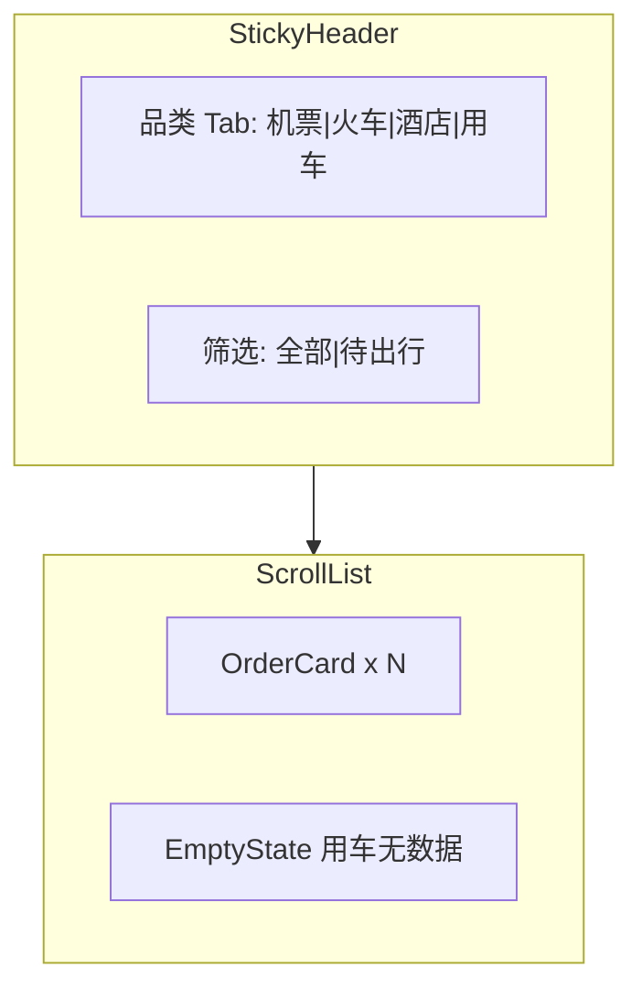

# 订单 Tab UI 实施计划

## 背景与目标

需求文档 [`docs/需求实施/订单tab/订单tab.md`](docs/需求实施/订单tab/订单tab.md) 要求对照 RYX 订单列表页（`tmc-order-list_ryx`，`tabId` 1/2/3/7）并在订单 Tab 还原 [`docs/需求实施/订单tab/设计图/`](docs/需求实施/订单tab/设计图/) 中的效果。

**当前状态**

- 底部 Tab 已指向 [`/home/trips`](apps/h5/src/app/layouts/TabLayout.tsx)，但 [`TripsTabPage.tsx`](apps/h5/src/pages/home/TripsTabPage.tsx) 仍是占位文案。
- API 封装已有：[`packages/api/src/apis/order.ts`](packages/api/src/apis/order.ts) → `TmcApiOrderUrl-Order-List`。
- 共享类型过简：[`packages/shared-types/src/order.ts`](packages/shared-types/src/order.ts) 仅含 `OrderId/StatusName/TotalAmount/ProductName` 等，不足以渲染设计图字段。
- Mock 仅 1 条酒店单：[`packages/mock/src/fixtures/order.ts`](packages/mock/src/fixtures/order.ts)。

**本次范围（用户确认）**

- **UI 还原为主**；支付/取消/退票/改签按钮仅视觉呈现，点击可 `toast` 或 no-op，**不接线**真实 API/路由。
- **不**在本轮实现订单详情页（`/orders/*` 仍留 Wave 4 后续）。

**路由决策**：继续挂在现有 Tab 路由 `/home/trips`，不新增 `/orders`（与 [`PAGE-API-MATRIX`](docs/api/PAGE-API-MATRIX.md) 的 `/orders` 规划可后续加 alias）。

---

## 设计要点（来自 4 张设计图）



| 区域        | 规格                                                                                                                                                                                                      |
| ----------- | --------------------------------------------------------------------------------------------------------------------------------------------------------------------------------------------------------- |
| 页背景      | `#F5F6F9`（与 [`TabLayout`](apps/h5/src/app/layouts/TabLayout.tsx) 一致）                                                                                                                                 |
| 顶栏        | 浅蓝渐变（复用酒店列表思路 `#8EC8FF → #EEF4FC`）                                                                                                                                                          |
| 品类 Tab    | 4 项纯文字 Tab（机票/火车/酒店/用车）；选中项白底圆角 + 蓝色弧线。新建 `OrderTabIndicator`（参数化 `width`，约 42px），**不**直接复用首页 32px 的 `TravelTabIndicator`                                    |
| 二级筛选    | 胶囊容器「全部 / 待出行」，选中项白底                                                                                                                                                                     |
| 卡片        | 白底圆角；左上产品图标（复用 [`HOME_ASSETS.products`](apps/h5/src/config/home-assets.ts)）；订单号 + 主状态色标；内层浅蓝渐变信息区；底部价格 + 操作按钮                                                  |
| 状态色      | **主状态**（卡片右上角 `StatusName`）：待付款/待出票 红；待出行 橙；交易完成 绿；已取消 灰。**子状态**（机票/火车信息区右侧 `TicketStatusName`）：待出票 红；已出票 绿；已退票 灰。两套独立映射，不可混用 |
| 卡片 Footer | `flex justify-between`：价格在左；操作按钮组在右（`ml-auto flex gap-2`），主按钮在最右                                                                                                                    |
| 空状态      | 用车 Tab：居中插图 +「暂无内容」                                                                                                                                                                          |

**品类与 RYX `tabId` 映射**（独立于 `ProductType` 枚举，勿混用）：

| Tab    | tabId |
| ------ | ----- |
| 机票   | 1     |
| 火车票 | 2     |
| 酒店   | 3     |
| 用车   | 7     |

---

## 实现架构

### 1. 扩展共享类型（展示驱动）

更新 [`packages/shared-types/src/order.ts`](packages/shared-types/src/order.ts)：

- `OrderListTabId`：`Flight=1 | Train=2 | Hotel=3 | Car=7`
- `OrderListScope`：`all | pendingTravel`（对应「全部 / 待出行」）
- 扩展 `OrderListParams`：`TabId`, `Scope`, `PageIndex`, `PageSize`
- **采用 discriminated union**（实施前不再摇摆）：
  - `OrderListItemBase`：`OrderId`, `OrderNumber`, `Status`, `StatusName`, `TotalAmount`, `Actions?`
  - `OrderFlightListItem`：`tabId: OrderListTabId.Flight` + `RouteTitle`, `DepartTime`, `PassengerNames`, `TicketStatusName?`
  - `OrderTrainListItem`：`tabId: OrderListTabId.Train` + 同上
  - `OrderHotelListItem`：`tabId: OrderListTabId.Hotel` + `HotelName`, `CheckInDate`, `CheckOutDate`, `Nights`, `RoomType`, `PassengerNames`
  - `OrderCarListItem`：`tabId: OrderListTabId.Car` + 用车字段占位（v1 mock 为空列表，类型先留扩展位）
  - `OrderListItem = OrderFlightListItem | OrderTrainListItem | OrderHotelListItem | OrderCarListItem`
  - 组件通过 `switch (item.tabId)` 缩窄类型
- `OrderAction` 类型：`kind: 'cancel' | 'pay' | 'refund' | 'exchange'` + `label`（供 UI 渲染按钮）

实施时若真实 API 字段名不同，在 `packages/api` 增加轻量 mapper（仅当对接 proxy 时需要）；本轮 Mock 直接返回目标结构。

### 2. 丰富 Mock 数据

更新 [`packages/mock/src/fixtures/order.ts`](packages/mock/src/fixtures/order.ts) 与 [`packages/mock/src/handlers/order.ts`](packages/mock/src/handlers/order.ts)：

- 为 4 个 `TabId` 各准备 2–3 条样例，覆盖设计图状态组合：
  - 机票：待付款+待出票 / 待出行+已出票 / 已取消
  - 火车：待付款 / 待出行（退票+改签）/ 已取消
  - 酒店：待付款 / 交易完成
  - 用车：空列表
- Handler **必须从 `data` 提取参数并过滤**（当前 `handlers/order.ts:21` 忽略 `data`，需修正）：

```ts
// packages/mock/src/fixtures/order.ts
export const MOCK_ORDERS: OrderListItem[] = [ /* 全量样例 */ ];

export function filterOrders(
  orders: OrderListItem[],
  tabId?: OrderListTabId,
  scope?: OrderListScope,
): OrderListItem[] {
  let list = orders.filter((o) => o.tabId === tabId);
  if (scope === "pendingTravel") {
    list = list.filter((o) => PENDING_TRAVEL_STATUSES.has(o.Status));
  }
  return list;
}

// packages/mock/src/handlers/order.ts
[ORDER_FLOW_METHODS.LIST]: (data) => {
  const params = (data ?? {}) as OrderListParams;
  const filtered = filterOrders(MOCK_ORDERS, params.TabId, params.Scope);
  return successResponse({ Orders: filtered, TotalCount: filtered.length });
},
```

- `PENDING_TRAVEL_STATUSES`：与设计图对齐，如 `WaitTravel`, `Issued` 等（实施时对照 mock 状态枚举定稿）

### 3. H5 数据 Hook

新增 [`apps/h5/src/hooks/useOrderList.ts`](apps/h5/src/hooks/useOrderList.ts)：

```ts
useOrderList({ tabId, scope, pageIndex }, (enabled = true));
// queryKey: ["order", "list", tabId, scope, pageIndex]
// queryFn: () => getApi().order.getList({ TabId: tabId, Scope: scope, PageIndex: pageIndex })
// enabled: enabled && tabId != null   // 类比 useHotelList 的 hasRequired；TabId 为必填
```

> 注：不必按 `getApiMode()` 分支——mock/proxy 均需有效 `TabId`；`tabId != null` 即可防止初始化阶段的空请求。

### 4. UI 组件（`apps/h5/src/components/order/`）

| 组件                                                    | 职责                                                                                                                                    |
| ------------------------------------------------------- | --------------------------------------------------------------------------------------------------------------------------------------- |
| `OrderCategoryTabs`                                     | 顶部分类切换 + 渐变背景                                                                                                                 |
| `OrderScopeTabs`                                        | 全部/待出行胶囊                                                                                                                         |
| `OrderListCard`                                         | 卡片骨架：header / gradient body / footer                                                                                               |
| `OrderFlightCard` / `OrderTrainCard` / `OrderHotelCard` | 按品类渲染字段与按钮组合（或单组件 + `variant`）                                                                                        |
| `OrderStatusBadge`                                      | 渲染主状态或子状态；`variant: 'order' \| 'ticket'`                                                                                      |
| `OrderActionBar`                                        | 右对齐按钮组：次要描边 + 主色实心（仅 UI）                                                                                              |
| `OrderEmptyState`                                       | 用车空态                                                                                                                                |
| `OrderTabIndicator`                                     | 4 Tab 弧线指示器（参数化宽度，默认 ~42px）                                                                                              |
| `order-status.ts`                                       | **两套纯函数**：`getOrderStatusStyle(StatusName)` + `getTicketStatusStyle(TicketStatusName)`；另含 `shouldGrayPrice`, `getOrderActions` |

**资产**

- 新建 [`apps/h5/src/config/order-assets.ts`](apps/h5/src/config/order-assets.ts)
- 从设计图导出空状态插图至 `apps/h5/src/assets/order/empty.png`（或从 Figma 导出）
- **卡片内**产品小图标（非顶部分类 Tab）：复用 `HOME_ASSETS.products.{flight,train,hotel}.active`；用车用 `HOME_ASSETS.products.car.active`（v1 无用车卡片，类型预留）。顶部分类 Tab 为纯文字，**不需要** default/active 产品图标

**排版**：`HarmonyOS Sans SC` + PingFang fallback（与首页/酒店列表一致）。

### 5. 页面组装

重写 [`apps/h5/src/pages/home/TripsTabPage.tsx`](apps/h5/src/pages/home/TripsTabPage.tsx)：

- 本地 state 或 URL search params（`?tab=hotel&scope=all`）驱动当前 Tab/筛选
- 默认 Tab：**酒店**（与设计图主展示一致，可改为机票）
- 布局：sticky 头部（品类 + 筛选）+ 可滚动列表 + loading skeleton + error 提示
- 列表项 key：`OrderId`
- 按钮 `onClick`：`toast("功能即将上线")` 或 `preventDefault` 无操作
- **预留分页扩展**：列表容器接受 `onLoadMore?: () => void` + `hasMore?: boolean`（v1 不实现滚动加载，接口先占位）

### 6. 测试

新增 [`apps/h5/src/lib/order-status.test.ts`](apps/h5/src/lib/order-status.test.ts)（正式 todo，非可选）：

- 主状态色：待付款→红、待出行→橙、交易完成→绿、已取消→灰
- 子状态色：待出票→红、已出票→绿、已退票→灰
- `shouldGrayPrice`：已取消为 true
- `getOrderActions`：各状态返回正确按钮数量与 kind

### 7. 验证

```bash
pnpm dev:h5:mock   # 目视核对 4 个品类 + 空态
pnpm typecheck
pnpm test
```

---

## 关键复用参考

- 渐变头部：[`HotelListPage.tsx`](apps/h5/src/pages/hotel/HotelListPage.tsx) `HOTEL_LIST_HEADER_GRADIENT`
- 弧线 Tab 指示器：**参考** [`HomeHeroSection.tsx`](apps/h5/src/components/home/HomeHeroSection.tsx) `TravelTabIndicator` 的 SVG path，但订单页用独立 `OrderTabIndicator`（4 Tab、更宽）
- 卡片内渐变：[`HomeRecentTripPanel.tsx`](apps/h5/src/components/home/HomeRecentTripPanel.tsx) `RECENT_TRIP_CARD_GRADIENT`
- 数据请求模式：[`useHotelList.ts`](apps/h5/src/hooks/useHotelList.ts)

---

## 不在本轮范围

- 订单详情页（酒店/机票/火车）
- 操作按钮真实业务（支付、取消、退票、改签）
- 分页加载 / 下拉刷新（可留 `PageIndex` 参数占位）
- `/orders` 独立路由与「我的 → 我的订单」跳转

---

## 建议提交

```
feat(h5): add orders tab list UI with mock data
```
