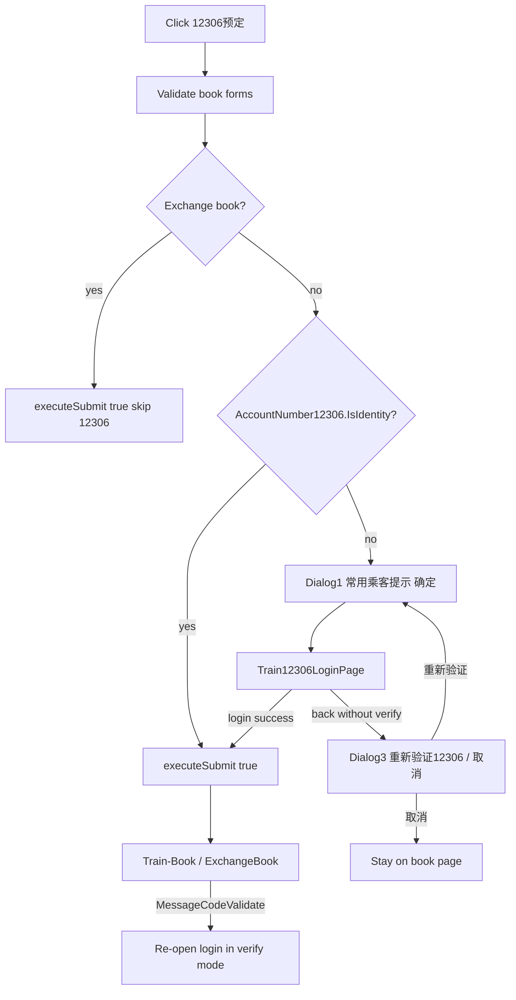

# Train 12306 Booking Flow

## Current gap

[`TrainBookPage.tsx`](apps/h5/src/pages/train/TrainBookPage.tsx) wires **12306预定** directly to `executeSubmit(true)` — no tip/login gate:

```225:236:apps/h5/src/pages/train/TrainBookPage.tsx
  function handleSubmitClick(isOfficialBooked: boolean) {
    // ...
    if (isOfficialBooked) {
      void executeSubmit(true);
      return;
    }
```

Legacy `bookTrainBy12306` → `checkAndBind12306()` → tip dialog → `validate12306` modal → submit with `IsOfficialBooked=true` and `AccountNumber`.

## Target user flow



## Scope decisions (confirmed)

| Item                      | Decision                                                           |
| ------------------------- | ------------------------------------------------------------------ |
| SMS verification sub-flow | **Include** (bind failure → send 666 to 12306 → code input)        |
| Exchange book             | **Skip** 12306 tip/login gate; call `executeSubmit(true)` directly |

## 1. Shared types

Extend [`packages/shared-types/src/train-book.ts`](packages/shared-types/src/train-book.ts):

- `TrainAccountNumber12306`: add `Number?: string` (password — **memory only**, never persist to sessionStorage)
- Request/response DTOs:
  - `TrainBind12306Params` — `{ Name, Number }` (account + password)
  - `TrainAccountValidateParams` — same shape
  - `TrainCodeValidateParams` — `{ Name, Number, Code }` (verify legacy wire names against API when implementing)
  - `TrainBind12306Response` — `{ IsIdentity?: boolean; Name?: string }` + error codes
- Export from [`packages/shared-types/src/index.ts`](packages/shared-types/src/index.ts)

## 2. API layer

Add to [`packages/api/src/apis/train.ts`](packages/api/src/apis/train.ts) using existing method keys in [`packages/api/src/methods/book.ts`](packages/api/src/methods/book.ts):

| Method                                     | Client fn                 |
| ------------------------------------------ | ------------------------- |
| `TmcApiBookUrl-Train-GetBindAccountNumber` | `getBindAccountNumber()`  |
| `TmcApiBookUrl-Train-Bind`                 | `bind12306(params)`       |
| `TmcApiBookUrl-Train-AccountValidate`      | `accountValidate(params)` |
| `TmcApiBookUrl-Train-CodeValidate`         | `codeValidate(params)`    |
| `TmcApiBookUrl-Train-Unbind`               | `unbind12306()`           |

- Extend `TrainApi` interface; wire through [`packages/api/src/index.ts`](packages/api/src/index.ts)
- Normalize legacy response shapes in adapter (mirror existing `AccountNumber12306` mapping in `initializeBook`)
- Add [`packages/api/src/apis/train-12306.test.ts`](packages/api/src/apis/train-12306.test.ts) for payload/response mapping

## 3. Mock handlers

Extend [`packages/mock/src/handlers/train.ts`](packages/mock/src/handlers/train.ts) + [`packages/mock/src/fixtures/train-book.ts`](packages/mock/src/fixtures/train-book.ts):

- `GetBindAccountNumber` — return bound account or empty `IsIdentity: false`
- `Bind` — success path sets identity; optional `?scenario=sms` returns error code triggering SMS mode
- `AccountValidate` / `CodeValidate` — parallel scenarios for login page states
- Default init fixture: `IsIdentity: false` (or separate mock toggle) so the full flow is testable in dev

## 4. H5 lib + hooks

**[`apps/h5/src/lib/train-12306.ts`](apps/h5/src/lib/train-12306.ts)** (new):

- Copy constants from legacy:
  - Tip1: `12306官方规定已通过核验的常用乘客…`
  - Tip3: `您尚未验证12306账户,可能导致无法线上退改签…`
- `shouldSkip12306BindTip({ isExchange, isSelfBook })` — legacy skips tip1 when exchange **or** `isSelfBookType` ([`flight-self-book.ts`](apps/h5/src/lib/flight-self-book.ts))
- `isTrain12306Verified(account?)` — `Boolean(account?.IsIdentity && account?.Name)`
- `isTrain12306SmsRequired(error)` — detect `TrainCheckPassenger` / bind failure codes from API error body
- `isTrain12306RevalidateRequired(error)` — detect `MessageCodeValidate` on book submit

**[`apps/h5/src/hooks/useTrain12306.ts`](apps/h5/src/hooks/useTrain12306.ts)** (new):

- React Query mutations wrapping the five API methods
- `refreshBindAccount()` helper used after successful login

## 5. UI components

### iOS system alerts (screenshots 1 & 3)

**[`apps/h5/src/components/train/Train12306SystemAlertDialog.tsx`](apps/h5/src/components/train/Train12306SystemAlertDialog.tsx)** — generalize pattern from [`HotelPassengerRequiredDialog.tsx`](apps/h5/src/components/hotel/HotelPassengerRequiredDialog.tsx):

- Title: `提示`
- Props: `message`, `primaryLabel`, optional `secondaryLabel`
- Screenshot 1: single **确定**
- Screenshot 3: **重新验证12306** (left) + **取消** (right), vertical divider

### Login page (screenshot 2)

**[`apps/h5/src/pages/train/Train12306LoginPage.tsx`](apps/h5/src/pages/train/Train12306LoginPage.tsx)** + route in [`apps/h5/src/app/routes.tsx`](apps/h5/src/app/routes.tsx):

```
/train/12306-login
```

Layout per screenshot:

- Header: back + `登录12306账号`
- Inputs: account, password (bottom-border style)
- Checkbox + `同意《账户授权协议》` (link opens sheet)
- Primary button: `登录12306` (disabled until agreement checked + fields filled)

**Two modes** (single page, state machine):

| Mode       | UI                                                        | API                                               |
| ---------- | --------------------------------------------------------- | ------------------------------------------------- |
| `password` | Account + password                                        | `bind12306` → on SMS-required error → switch mode |
| `sms`      | Instruction “发送 666 至 12306” + verification code input | `codeValidate`                                    |

On success: `navigate('/train/book', { replace: true, state: { train12306Verified: true, account: { Name, IsIdentity: true } } })`

On back without success: `navigate('/train/book', { replace: true, state: { train12306LoginCancelled: true } })`

**[`apps/h5/src/components/train/Train12306AgreementSheet.tsx`](apps/h5/src/components/train/Train12306AgreementSheet.tsx)** — bottom sheet for authorization agreement text (static copy or fetched later; start with static Chinese legal copy matching legacy title)

## 6. Orchestration in TrainBookPage

Replace `onOfficialBook={() => handleSubmitClick(true)}` with `handleOfficialBookClick()`:

1. Run existing `resolveSubmitValidationError()` — unchanged
2. **If exchange session** (`exchangeSession?.ticketId`): `void executeSubmit(true)` — no 12306 gate
3. **If verified** (`local account12306` or `initBook.data.AccountNumber12306`): `void executeSubmit(true)` using verified `Name` as `accountNumber12306`
4. Else `start12306VerificationFlow()`:
   - Unless `shouldSkip12306BindTip`: open Tip1 dialog
   - On Tip1 confirm → `navigate('/train/12306-login')`
5. `useLocation()` effect:
   - `train12306LoginCancelled` → open Tip3
   - Tip3 **重新验证12306** → `start12306VerificationFlow()` (Tip1 again)
   - `train12306Verified` → update local state, `void executeSubmit(true)`, clear location state
6. In `executeSubmit` catch: if `isTrain12306RevalidateRequired(error)` → reset `IsIdentity`, reopen login (optionally skip Tip1 per legacy `bookTrainBy12306(event, true)`)

Local state:

```ts
const [account12306, setAccount12306] =
  useState<TrainAccountNumber12306 | null>(null);
// sync from initBook on load; override after login
```

Pass `accountNumber12306: account12306?.Name ?? initBook.data?.AccountNumber12306?.Name` into `buildTrainOrderBookDto`.

## 7. Optional follow-up (not blocking MVP)

Legacy book page shows **切换12306账号** when already bound. Not in the three screenshots — defer unless you want it in the same PR. If added later: row on book page → `unbind12306()` → restart flow.

## 8. Tests

| File                                                               | Coverage                             |
| ------------------------------------------------------------------ | ------------------------------------ |
| `apps/h5/src/lib/train-12306.test.ts`                              | tip skip rules, error code detection |
| `packages/api/src/apis/train-12306.test.ts`                        | API adapter                          |
| `apps/h5/src/components/train/Train12306SystemAlertDialog.test.ts` | optional smoke                       |

## 9. Verification

```bash
pnpm --filter @ryx/h5 test train-12306
pnpm --filter @ryx/api test train-12306
pnpm lint && pnpm typecheck
```

Manual (mock):

1. Set init `AccountNumber12306.IsIdentity = false`
2. `/train/book` → 12306预定 → Tip1 → login → success → submits
3. Login back without submit → Tip3 → 重新验证 → Tip1 again
4. Exchange book → 12306预定 skips login
5. Mock bind failure → SMS mode → code validate → success

## Key files to touch

| Layer  | Files                                                                            |
| ------ | -------------------------------------------------------------------------------- |
| Types  | `packages/shared-types/src/train-book.ts`                                        |
| API    | `packages/api/src/apis/train.ts`                                                 |
| Mock   | `packages/mock/src/handlers/train.ts`, `fixtures/train-book.ts`                  |
| Logic  | `apps/h5/src/lib/train-12306.ts`, `hooks/useTrain12306.ts`                       |
| UI     | `Train12306SystemAlertDialog`, `Train12306LoginPage`, `Train12306AgreementSheet` |
| Wiring | `TrainBookPage.tsx`, `routes.tsx`                                                |
