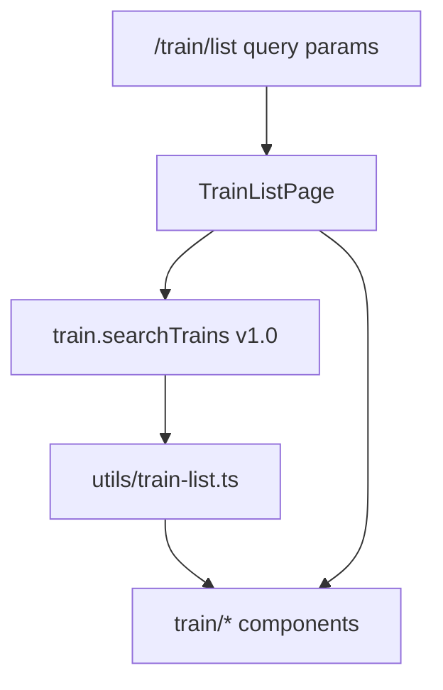

# Train Ticket List Page Implementation

## Goal

Implement the train search results screen at [`apps/h5/src/pages/train/TrainListPage.tsx`](apps/h5/src/pages/train/TrainListPage.tsx) per [`docs/需求实施/火车票/火车票查询列表.png`](docs/需求实施/火车票/火车票查询列表.png) and legacy [`docs/ryx/火车票模块.md`](docs/ryx/火车票模块.md) (`tmc-train-list_ryx`).

**Confirmed scope (from you):**

- Skip **transfer / 推荐中转** section in v1 (direct trains only).
- Card expands to show seat rows; **预订** is disabled or shows “功能开发中” (no `/train/book` yet).

## Current gaps

| Issue                                         | Root cause                                                                                                                                                                                                                  |
| --------------------------------------------- | --------------------------------------------------------------------------------------------------------------------------------------------------------------------------------------------------------------------------- |
| Page shows generic shadcn cards +「修改」link | Stub UI only (~80 lines)                                                                                                                                                                                                    |
| API error「缺少必要的参数」                   | [`packages/api/src/apis/train.ts`](packages/api/src/apis/train.ts) omits `version: "1.0"` and 60s timeout that legacy `Home-Search` requires (compare [`packages/api/src/apis/flight.ts`](packages/api/src/apis/flight.ts)) |
| No train list components                      | No `apps/h5/src/components/train/` folder yet                                                                                                                                                                               |

## Architecture (mirror flight list)



Reference pattern: [`apps/h5/src/pages/flight/FlightListPage.tsx`](apps/h5/src/pages/flight/FlightListPage.tsx) — hide shell header (`usePageHeader({ visible: false })`), custom gradient header + date strip, client filter/sort, fixed bottom toolbar.

## Phase 1 — Fix data layer

### 1.1 API client

Update [`packages/api/src/apis/train.ts`](packages/api/src/apis/train.ts) `searchTrains`:

```ts
return proxy.send<TrainSearchResponse>({
  method: TRAIN_FLOW_METHODS.HOME_SEARCH,
  data: {
    Date: params.Date,
    FromStation: params.FromStation,
    ToStation: params.ToStation,
  },
  version: "1.0",
  requestTimeout: 60,
  timeoutMs: 60_000,
});
```

Verify mock mode still works via [`packages/mock/src/fixtures/train.ts`](packages/mock/src/fixtures/train.ts).

**Mock fixture extension (required for type-filter QA):** add at least one regular train (e.g. `K101`) alongside existing `G1`/`G3`, so `applyTrainTypeFilter(..., "regular")` and「只看普通列车」can be verified in mock mode.

### 1.2 List query guard

Align with flight list:

- Redirect to `/home?product=train` when `date` / `fromCode` / `toCode` missing or invalid.
- Clamp past dates to `todayDateString()` via URL replace.
- Sync form state from URL via existing `useTrainSearchForm().resetFromQuery`.

## Phase 2 — Pure list logic (`utils/train-list.ts`)

New file with unit tests [`apps/h5/src/utils/train-list.test.ts`](apps/h5/src/utils/train-list.test.ts):

| Function                                   | Purpose                                                                          |
| ------------------------------------------ | -------------------------------------------------------------------------------- |
| `parseTrainTimestamp` / `formatTrainClock` | Parse `StartTime` / `ArrivalTime`, display `HH:mm` + station names               |
| `isHighSpeedTrain(code)`                   | `G/D/C` prefix → 高铁/动车 (legacy filter)                                       |
| `isRegularTrain(code)`                     | `K/T/Z` etc. → 普通列车                                                          |
| `applyTrainTypeFilter(trains, mode)`       | Top chips: `all` / `highSpeed` / `regular`                                       |
| `applyTrainFilters(trains, condition)`     | Bottom sheet: time windows, seat types, tickets-only                             |
| `sortTrains(trains, kind, asc)`            | `duration` / `time` / `price` when toolbar active                                |
| `getDefaultSortedTrains(trains)`           | **Default = departure time ascending** (legacy-aligned); tie-break arrival time  |
| `markLowestPrice(trains)`                  | Green「价格最低」badge only — does **not** reorder list (same pattern as flight) |
| `formatSeatAvailability(count)`            | Map count →「有票」/「无票」/「剩N张」(design red badge when low)                |
| `buildFilterOptions(trains)`               | Derive seat-type checkboxes from `Seats[].SeatTypeName`                          |

Types: add minimal filter/sort types in [`packages/shared-types/src/train.ts`](packages/shared-types/src/train.ts) (e.g. `TrainFilterCondition`, `TrainSortTab`) — same pattern as flight types.

## Phase 3 — UI components (`apps/h5/src/components/train/`)

| Component                    | Design / legacy mapping                                 | Reuse                                                                                                                                                                                                                                                                    |
| ---------------------------- | ------------------------------------------------------- | ------------------------------------------------------------------------------------------------------------------------------------------------------------------------------------------------------------------------------------------------------------------------ |
| `TrainListHeader.tsx`        | Back + 北京→上海 + passenger +                          | Copy structure from [`FlightListHeader.tsx`](apps/h5/src/components/flight/FlightListHeader.tsx); wire `usePassengerSelection(ProductType.Train)` + `buildPassengerSelectPath`                                                                                           |
| `TrainListDateStrip.tsx`     | Horizontal dates + calendar icon                        | Reuse logic from [`FlightListDateStrip.tsx`](apps/h5/src/components/flight/FlightListDateStrip.tsx); `days={14}` matches existing [`TRAIN_CALENDAR_CONFIG`](apps/h5/src/lib/calendar-picker.ts) (`calendarMaxSelectableDate` = today + 14)                               |
| `TrainTypeFilterBar.tsx`     | 不限 / 只看高铁动车 / 只看普通列车                      | Mutually exclusive chips;「不限」= show all                                                                                                                                                                                                                              |
| `TrainListItemCard.tsx`      | Times, duration arrow, train no., price, seat row, tags | Visual reference: [`FlightSegmentCard.tsx`](apps/h5/src/components/flight/FlightSegmentCard.tsx); see **Card expand rules** below                                                                                                                                        |
| `TrainSeatRow.tsx`           | 二等/一等/商务/无座 + 有票                              | Collapsed: availability text only; expanded: same row + disabled「预订」                                                                                                                                                                                                 |
| `TrainListToolbar.tsx`       | Fixed bottom: 筛选 / 耗时 / 时间 / 价格 (4 cols)        | Extend flight toolbar pattern; reuse filter/time/price PNG assets; duration icon as inline SVG                                                                                                                                                                           |
| `TrainFilterSheet.tsx`       | 时段 / 席别 / 只看有票                                  | Simpler than flight filter; confirm/cancel sheet                                                                                                                                                                                                                         |
| `TrainSortSheet.tsx`         | Toggle asc/desc for time/price/duration                 | Same UX as [`FlightSortSheet.tsx`](apps/h5/src/components/flight/FlightSortSheet.tsx)                                                                                                                                                                                    |
| `TrainModifySearchSheet.tsx` | In-page modify stations + date                          | Reuse existing [`CalendarPickerSheet`](apps/h5/src/components/calendar/CalendarPickerSheet.tsx) + [`TRAIN_CALENDAR_CONFIG`](apps/h5/src/lib/calendar-picker.ts) from shared calendar work; `CityPicker` + [`trainStationPickerAdapter`](apps/h5/src/lib/train-search.ts) |

### Card expand / accordion rules

| Scenario                                | Behavior                                                                                                                                              |
| --------------------------------------- | ----------------------------------------------------------------------------------------------------------------------------------------------------- |
| Collapsed card                          | Full summary per design: dep/arr time + station, duration + train no. arrow, price (+「剩N张」if scarce), **seat availability row** (no book buttons) |
| Tap card                                | Toggle expand; **accordion** — opening train B collapses previously expanded train A                                                                  |
| Filter / sort / type chip / date change | Reset `expandedTrainId` to `null`                                                                                                                     |
| Expanded card                           | Seat rows show availability + disabled「预订」(toast「功能开发中」)                                                                                   |

### Modify-search sheet loading

- Mount `TrainModifySearchSheet` only when `modifyOpen === true` (conditional render), **or** pass `enabled: modifyOpen` into `useTrainSearchForm` so station fetch does not run on initial list load.
- Prefer conditional mount to avoid duplicate station queries when home tab already loaded stations in the same session.

**Layout tokens** (match design + flight list):

- Page bg `#F5F6F9`, header gradient `#5099fe → #6aabff`, selected date pill `#5099fe`, card white rounded-xl shadow.
- Lowest price: green badge + green price; others red/orange price.
- Bottom toolbar fixed with safe-area padding; list `pb-20`.

## Phase 4 — Rewrite `TrainListPage`

Replace stub with full page composition:

1. Parse URL → list params; guards + form sync.
2. `useTrainList(params)` (keep hook in [`useTrainSearchForm.ts`](apps/h5/src/hooks/useTrainSearchForm.ts) or extract to `useTrainList.ts` if page grows).
3. State: `trainTypeFilter`, `filterDraft`/`filterApplied`, `sortSheet`, `activeTab`, sort directions, `expandedTrainId` (single, accordion), `calendarOpen`, `modifyOpen`, station picker target.
4. Pipeline: raw trains → type filter → client filters → sort (`getDefaultSortedTrains` when no toolbar tab active) → `markLowestPrice` → render cards.
5. Reset `expandedTrainId` when filters, sort tab, type chip, or `date` changes.
6. Header actions: tap route → open modify sheet; passenger icon → passenger select; date strip / calendar → update `date` query param.
7. Loading skeleton / empty「暂无车次」/ error via `formatApiError`.
8. Remove「修改」link to home; in-page modify instead.

## Phase 5 — Deferred (not in v1)

- **Transfer section** — skipped per your choice.
- **`Home-Policy`** — no API wrapper yet; skip policy filtering / violation badges until `policyAsync` is added to `@ryx/api`.
- **`Home-Schedule`** — no stopover modal yet.
- **`/train/book`** — 预订 button shows toast or disabled state only.

## Verification

```bash
pnpm --filter @ryx/h5 test train-list
pnpm typecheck
pnpm --filter @ryx/h5 dev:h5
```

Manual checklist:

- Home train search → `/train/list` with valid params loads list (mock + real API).
- Date strip + calendar updates URL and refetches.
- Top type filters and bottom filter/sort work client-side.
- Lowest-price tag appears on cheapest train.
- Card expand shows seats; 预订 does not navigate away.
- Missing params redirect to `/home?product=train`.

## File touch summary

| Action       | Path                                                                                    |
| ------------ | --------------------------------------------------------------------------------------- |
| Fix          | `packages/api/src/apis/train.ts`, `packages/mock/src/fixtures/train.ts` (add K/T/Z row) |
| Extend types | `packages/shared-types/src/train.ts`                                                    |
| New          | `apps/h5/src/utils/train-list.ts`, `train-list.test.ts`                                 |
| New          | `apps/h5/src/components/train/*.tsx` (+ optional small CSS if needed)                   |
| Rewrite      | `apps/h5/src/pages/train/TrainListPage.tsx`                                             |
