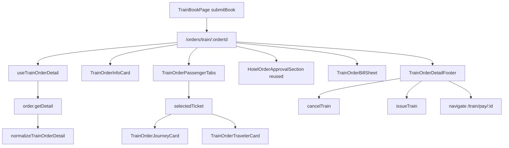

# Train Order Detail Page

## Goal

After train booking succeeds, navigate to **`/orders/train/:orderId`** (not the orders list). Build a full detail page that:

- **UI**: follows [`docs/需求实施/火车票/火车票-订单详情.png`](docs/需求实施/火车票/火车票-订单详情.png) — card layout matching flight/hotel detail (订单信息 → 乘车人 tabs → 车次卡片 → 旅客信息 → fixed footer)
- **Behavior**: mirrors legacy `tmc-order-train-detail_ryx` — order detail fetch, pay-hold countdown, **取消** (`CancelTrain`), **确认出票** (`IssueTrain`), **立即支付** (person/credit pay), approval history, bill breakdown
- **Multi-passenger**: one tab per `OrderTrainTicket`; selected tab drives journey + traveler + bill lines



---

## Files to change (explicit)

| File                                                                                                   | Change                                                                                                                                                                                       |
| ------------------------------------------------------------------------------------------------------ | -------------------------------------------------------------------------------------------------------------------------------------------------------------------------------------------- |
| [`apps/h5/src/app/routes.tsx`](apps/h5/src/app/routes.tsx)                                             | Import `OrderTrainDetailPage`; add `{ path: "train/:orderId", element: <OrderTrainDetailPage /> }` under `/orders`; add `{ path: "pay/:orderId", element: <TrainPayPage /> }` under `/train` |
| [`packages/api/src/methods/order-flow.ts`](packages/api/src/methods/order-flow.ts)                     | Add `CANCEL_TRAIN` / `ISSUE_TRAIN` entries (see §1.3)                                                                                                                                        |
| [`packages/api/src/apis/order.ts`](packages/api/src/apis/order.ts)                                     | `cancelTrain` / `issueTrain` on `OrderApi`                                                                                                                                                   |
| [`packages/api/src/apis/order-detail-map.ts`](packages/api/src/apis/order-detail-map.ts)               | `normalizeTrainOrderDetail`, `shouldNormalizeTrainDetail`                                                                                                                                    |
| [`packages/shared-types/src/train-order.ts`](packages/shared-types/src/train-order.ts)                 | Train detail DTOs + action params                                                                                                                                                            |
| [`apps/h5/src/pages/order/OrderTrainDetailPage.tsx`](apps/h5/src/pages/order/OrderTrainDetailPage.tsx) | New page                                                                                                                                                                                     |
| [`apps/h5/src/pages/train/TrainPayPage.tsx`](apps/h5/src/pages/train/TrainPayPage.tsx)                 | New pay wrapper                                                                                                                                                                              |
| [`apps/h5/src/lib/order-routes.ts`](apps/h5/src/lib/order-routes.ts)                                   | `getOrderPayPath` for train tab                                                                                                                                                              |
| [`apps/h5/src/pages/train/TrainBookPage.tsx`](apps/h5/src/pages/train/TrainBookPage.tsx)               | Post-book nav → detail (page already exists; see §4.2)                                                                                                                                       |
| [`apps/h5/src/pages/order/OrderListPage.tsx`](apps/h5/src/pages/order/OrderListPage.tsx)               | Train cancel deep-link                                                                                                                                                                       |
| [`packages/mock/src/fixtures/order.ts`](packages/mock/src/fixtures/order.ts)                           | Train detail fixture + routing                                                                                                                                                               |
| [`packages/mock/src/handlers/order.ts`](packages/mock/src/handlers/order.ts)                           | Mock `CancelTrain` / `IssueTrain` handlers                                                                                                                                                   |

---

## Current gaps

| Area          | Today                                                                                   | Needed                                                                                                                |
| ------------- | --------------------------------------------------------------------------------------- | --------------------------------------------------------------------------------------------------------------------- |
| Route         | No `train/:orderId` in [`routes.tsx`](apps/h5/src/app/routes.tsx)                       | `OrderTrainDetailPage` + route                                                                                        |
| Post-book nav | [`TrainBookPage`](apps/h5/src/pages/train/TrainBookPage.tsx) → `/home/orders?tab=train` | Always `replace` → `/orders/train/:orderId` (same as [`FlightBookPage`](apps/h5/src/pages/flight/FlightBookPage.tsx)) |
| `getDetail`   | Summary only via [`mapTrainDetail`](packages/api/src/apis/order-detail-map.ts)          | Full `normalizeTrainOrderDetail`                                                                                      |
| Types         | No train-order models                                                                   | `TrainOrderTicket` / `TrainOrderTrip` + action params                                                                 |
| APIs          | `IssueTrain` / `CancelTrain` constants only                                             | Wire on `OrderApi` + mock handlers                                                                                    |
| Mock          | `ORD-TRN-*` detail falls through to hotel fixture                                       | Legacy-shaped train fixture + routing                                                                                 |
| Pay path      | [`getOrderPayPath`](apps/h5/src/lib/order-routes.ts) defaults train → hotel pay         | `/train/pay/:orderId` via thin `TrainPayPage`                                                                         |
| List actions  | Train cancel shows “功能即将上线”                                                       | Deep-link to detail with `{ action: "cancel" }`                                                                       |

---

## Phase 1 — Types and API adapter

### 1.1 Shared types — [`packages/shared-types/src/train-order.ts`](packages/shared-types/src/train-order.ts)

- `TrainOrderTrip` — from `OrderTrainTrips[]`: `TrainCode`, `FromStationName`, `ToStationName`, `StartTime`, `ArrivalTime`, `RunTime`/`Duration`, seat fields (`CoachNo`, `SeatNo`, `SeatName`, `SeatTypeName`, `Price`), `Explain` (退改签)
- `TrainOrderTicket` — per `OrderTrainTickets[]`: `Id`, `Key`, `StatusName`, `FullTicketNo`, `Explain`, `Trips[]`, `Traveler` (reuse `HotelOrderTraveler`), `PassengerTypeName`
- `TrainCancelParams` — `{ OrderId, Channel }` (verify against legacy `tmc-order.service.ts` during impl; align with flight cancel shape)
- `TrainIssueParams` — `{ OrderId }` (legacy sends order id)

Extend [`HotelOrderActionFlags`](packages/shared-types/src/hotel.ts) with optional **`showIssue: boolean`** (train-only; false for flight/hotel).

Extend [`FlightOrderDetailFields`](packages/shared-types/src/flight-order.ts) or add `TrainOrderDetailFields` — train tickets reuse the existing **`Tickets`** array (discriminated by `ProductType === "Train"` in hooks).

### 1.2 `normalizeTrainOrderDetail` — [`order-detail-map.ts`](packages/api/src/apis/order-detail-map.ts)

Mirror [`mapLegacyFlightDetail`](packages/api/src/apis/order-detail-map.ts) / [`normalizeFlightOrderDetail`](packages/api/src/apis/order-detail-map.ts):

- Parse `Order`, `OrderTrainTickets`, `OrderTrainTrips`, `OrderPassengers`, `OrderTravels`, `OrderItems`, `Histories`, `VariablesObj`
- **Ticket tabs**: one per `OrderTrainTicket`, sorted by `Id` desc; reuse existing `mapTraveler` join via ticket `Key`
- **Trip mapping**: station names, times (`StartTime` / `ArrivalTime` / `GoDate`), seat/coach fields from trip or ticket variables
- **Actions** (`buildTrainActionFlags`):
  - `showPay`: `variables.isPay` + person/credit pay type (`TravelPayType` 2/4) + active `OrderPayHoldTime`
  - `showCancel`: `variables.isShowCancelButton` OR pay-hold window (same as flight pay-hold cancel)
  - `showIssue`: ticket/order status includes **待出票** AND legacy issue button flag (`variables.isShowIssueButton` or `isBtn`/`btnValue === "确认出票"` — confirm exact key from real API response during impl)
- `PayHoldMinutes` from `OrderPayHoldTime` or `TrainHoldMinute`
- Export `shouldNormalizeTrainDetail` — true when `ProductType === "Train"` or `OrderTrainTickets.length > 0`

Wire in [`order.ts`](packages/api/src/apis/order.ts) `getDetail` **before** hotel branch:

```ts
if (shouldNormalizeTrainDetail(raw, summary)) return normalizeTrainOrderDetail(raw);
if (shouldNormalizeFlightDetail(raw, summary)) return normalizeFlightOrderDetail(raw);
```

### 1.3 Order mutations

**Constants gap (confirmed):** [`ORDER_METHODS`](packages/api/src/methods/order.ts) already defines `ORDER_CANCELTRAIN` and `ORDER_ISSUETRAIN`, but [`ORDER_FLOW_METHODS`](packages/api/src/methods/order-flow.ts) does **not** expose them yet (only `CANCEL_HOTEL` today). Add before wiring API:

```ts
// packages/api/src/methods/order-flow.ts
CANCEL_TRAIN: ORDER_METHODS.ORDER_CANCELTRAIN,
ISSUE_TRAIN: ORDER_METHODS.ORDER_ISSUETRAIN,
```

Then add to [`OrderApi`](packages/api/src/apis/order.ts):

- `cancelTrain(params: TrainCancelParams)` → `ORDER_FLOW_METHODS.CANCEL_TRAIN` (`TmcApiOrderUrl-Order-CancelTrain`)
- `issueTrain(params: TrainIssueParams)` → `ORDER_FLOW_METHODS.ISSUE_TRAIN` (`TmcApiOrderUrl-Order-IssueTrain`)

Both invalidate `["order", "detail", orderId]` and list queries on success. Register matching handlers in [`packages/mock/src/handlers/order.ts`](packages/mock/src/handlers/order.ts).

---

## Phase 2 — Lib, hooks, pay route

### 2.1 Helpers — [`apps/h5/src/lib/train-order-detail.ts`](apps/h5/src/lib/train-order-detail.ts)

Mirror [`flight-order-detail.ts`](apps/h5/src/lib/flight-order-detail.ts):

- `coerceTrainOrderDetail`, `getSelectedTicket`, `filterBillLinesForTicket`
- `shouldPollTrainOrderDetail` — poll every 3s while order/ticket in transitional states (`待出票`, `出票中`, `WaitPay`, `Booking`, etc.)
- `shouldShowTrainFooter` — show footer when any of `showPay | showCancel | showIssue` and pay-hold not expired (issue/cancel may apply without pay countdown)
- Reuse `formatPayHoldCountdownZh`, `formatTravelPayType`, `formatOrderDateTime` from flight lib

### 2.2 Hooks — [`apps/h5/src/hooks/useTrainOrderDetail.ts`](apps/h5/src/hooks/useTrainOrderDetail.ts)

- `useTrainOrderDetail(orderId)` — query + 3s polling
- `useTrainPayHoldCountdown(payHoldMinutes)` — reuse flight countdown hook or thin alias
- `useCancelTrainOrder`, `useIssueTrainOrder` — mutations with cache invalidation

### 2.3 Pay route (minimal) — ship atomically

These three changes **must land in the same PR/commit** (otherwise list/detail pay buttons 404):

1. Create [`TrainPayPage.tsx`](apps/h5/src/pages/train/TrainPayPage.tsx) — wrapper around [`OrderPayPage`](apps/h5/src/pages/order/OrderPayPage.tsx), `successPath=/orders/train/:orderId`
2. Register route `{ path: "pay/:orderId", element: <TrainPayPage /> }` under `/train` in [`routes.tsx`](apps/h5/src/app/routes.tsx)
3. Fix [`getOrderPayPath`](apps/h5/src/lib/order-routes.ts) for `OrderListTabId.Train` → `/train/pay/${orderId}` (today falls through to hotel pay)

---

## Phase 3 — UI components

Create [`apps/h5/src/components/order/train/`](apps/h5/src/components/order/train/) following flight/hotel chrome ([`hotel-detail-chrome.ts`](apps/h5/src/components/hotel/hotel-detail-chrome.ts)):

| Component                 | Responsibility                                                                                                                                                                                                                                                    |
| ------------------------- | ----------------------------------------------------------------------------------------------------------------------------------------------------------------------------------------------------------------------------------------------------------------- |
| `TrainOrderInfoCard`      | 订单信息: countdown + status badge, 订单编号, 付款方式, **出票时间** (`InsertTime`), 订单金额 + **账单明细** link                                                                                                                                                 |
| `TrainOrderPassengerTabs` | Pill tabs by passenger name; **hidden when `tickets.length <= 1`**                                                                                                                                                                                                |
| `TrainOrderJourneyCard`   | Route header (站名 + ticket status), date/train line, timeline (reuse [`train-list`](apps/h5/src/utils/train-list.ts) formatters + [`TrainBookSummary`](apps/h5/src/components/train/TrainBookSummary.tsx) arrow assets), seat class + price, **退改签说明** link |
| `TrainOrderTravelerCard`  | Same rows as design: 旅客姓名, 证件, 电话, 邮箱, 成本中心, 组织架构, 费用类别, 违规内容                                                                                                                                                                           |
| `TrainOrderBillSheet`     | Bottom sheet for `OrderItems` filtered by ticket `Key` (copy flight bill sheet)                                                                                                                                                                                   |
| `TrainOrderExplainSheet`  | Plain-text / pre-wrap policy from trip/ticket `Explain`                                                                                                                                                                                                           |
| `TrainOrderDetailFooter`  | **取消** (outline) + **立即支付** (gradient) when `showPay`; **取消订单** + **确认出票** when `showIssue` (train-specific primary action)                                                                                                                         |
| `TrainOrderCancelDialog`  | Confirm before `cancelTrain`                                                                                                                                                                                                                                      |

Reuse across page: [`HotelOrderDetailHeader`](apps/h5/src/components/order/hotel/HotelOrderDetailHeader.tsx), [`HotelOrderApprovalSection`](apps/h5/src/components/order/hotel/HotelOrderApprovalSection.tsx), [`HotelOrderDetailRow`](apps/h5/src/components/order/hotel/HotelOrderDetailRow.tsx).

---

## Phase 4 — Page, navigation, mock

### 4.1 [`OrderTrainDetailPage.tsx`](apps/h5/src/pages/order/OrderTrainDetailPage.tsx)

Structure mirrors [`OrderFlightDetailPage.tsx`](apps/h5/src/pages/order/OrderFlightDetailPage.tsx):

- `useParams().orderId`, loading/error states
- `selectedTicketIndex` state; reset on `orderId` change
- Open cancel dialog when navigated with `state: { action: "cancel" }` from list
- Footer padding offset when actions visible
- Toast feedback on cancel/issue success

### 4.2 Navigation updates

- [`TrainBookPage.tsx`](apps/h5/src/pages/train/TrainBookPage.tsx): after successful `submitBook`, **always** `navigate(\`/orders/train/${orderId}\`, { replace: true })`— remove interim`/home/orders?tab=train`redirect (including checkPay branch; payment from detail footer like flight). **Note:**`TrainBookPage`is already implemented in the repo; this is a small nav-target change in`executeSubmit`, not blocked by the train-list policy plan.
- [`OrderListPage.tsx`](apps/h5/src/pages/order/OrderListPage.tsx): train `cancel` → `/orders/train/:id` with cancel state (remove toast)
- [`routes.tsx`](apps/h5/src/app/routes.tsx): register `train/:orderId` route (required for card tap via [`getOrderDetailPath`](apps/h5/src/lib/order-routes.ts), which already returns the correct path)

### 4.3 Mock fixtures

In [`packages/mock/src/fixtures/order.ts`](packages/mock/src/fixtures/order.ts):

- `createMockTrainOrderDetailLegacy(orderId)` with:
  - **`ORD-TRN-001`**: 待付款, 2 passengers, `OrderPayHoldTime`, `isPay`, multi-ticket
  - **`ORD-TRN-002`**: 待出行 / 已出票, single passenger
  - **`ORD-TRN-pending-issue`** (or `mock-train-order-001` from book mock): **待出票**, `showIssue` + `showCancel`, seat/coach populated
- Update `resolveOrderDetailPayload` to route `ORD-TRN` / `mock-train-order` ids to train fixture (stop falling through to hotel)

In [`packages/mock/src/handlers/order.ts`](packages/mock/src/handlers/order.ts): mock `CancelTrain` → success; `IssueTrain` → flip ticket status to 已出票.

Update [`createMockTrainBookResponse`](packages/mock/src/fixtures/train-book.ts) `OrderId` to align with mock detail id for E2E dev flow.

---

## Phase 5 — Tests and docs

- Adapter tests in [`order-detail-map.test.ts`](packages/api/src/apis/order-detail-map.ts): legacy train payload → normalized tickets, actions (`showPay` / `showIssue`), multi-passenger
- Lib tests in `train-order-detail.test.ts`: footer visibility, bill filter, polling guard
- Update [`docs/api/PAGE-API-MATRIX.md`](docs/api/PAGE-API-MATRIX.md) train detail row to in-progress/done

---

## Out of scope (defer)

- **退票 / 改签** from detail or list (keep “功能即将上线” toast on list refund/exchange)
- **12306** bind flows on detail
- Full parity with legacy ryx **layout** (blue header + pink banner) — design mock uses unified detail chrome instead
- Inspur repush for train (not in legacy train matrix)

---

## Verification

```bash
pnpm test --filter order-detail-map --filter train-order-detail
pnpm typecheck
```

Manual (mock mode):

1. List → book → submit → lands on `/orders/train/:id`
2. Single passenger: no tabs; journey + traveler render
3. `ORD-TRN-001`: 2 tabs switch traveler/bill; pay countdown + 取消/立即支付
4. Pending-issue fixture: 确认出票 mutates status; 取消 works
5. Orders list cancel on train item opens detail cancel dialog
