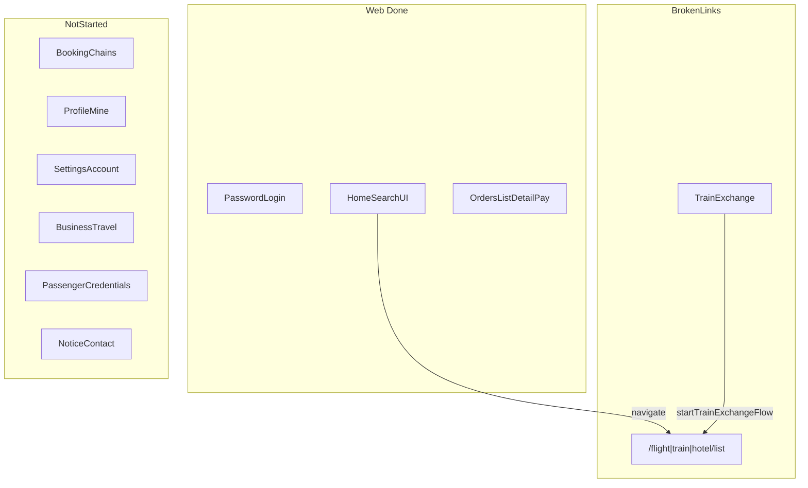
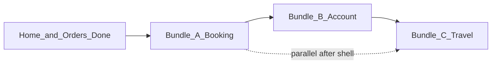
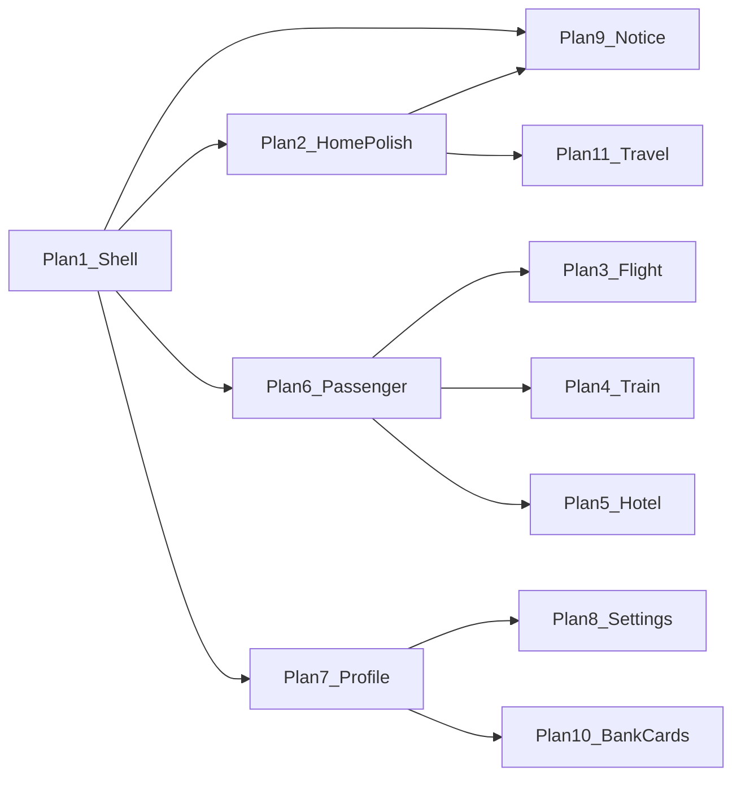

# Web vs H5 Feature Gap & Migration Roadmap

## Current State Summary

| Domain                  | H5                                             | Web                                           | Status             |
| ----------------------- | ---------------------------------------------- | --------------------------------------------- | ------------------ |
| Routes (user-facing)    | ~45                                            | 10                                            | ~22% page coverage |
| Auth                    | Splash + password + mobile + device login      | Password login only                           | Partial            |
| App shell               | Bottom Tab (首页/订单/我的)                    | Left sidebar (≥768px); mobile shows H5 banner | Partial            |
| Home                    | Search + notice + business shortcuts + banners | Search + banners + business UI (no links)     | Partial            |
| Flight booking          | 6 pages + 15+ sheets                           | 0 pages; hooks/libs partially copied          | **Missing**        |
| Train booking           | 3 pages + sheets                               | 0 pages; exchange flow broken (`/train/list`) | **Missing**        |
| Hotel booking           | 9 pages + sheets                               | 0 pages; list/detail hooks exist unused       | **Missing**        |
| Orders                  | List + 3 details + pay                         | **Complete** (list/detail/pay/售后弹窗)       | **Done**           |
| Profile / Mine          | Full tab + center                              | `/mine` placeholder                           | **Missing**        |
| Settings / account      | 7 pages                                        | 0                                             | **Missing**        |
| Business travel         | 4 routes + iframe                              | UI shell only                                 | **Missing**        |
| Passenger / credentials | 3 routes                                       | lib only (train exchange)                     | **Missing**        |
| Bank cards              | 3 routes                                       | 0                                             | **Missing**        |
| Notices / contact       | 4 routes                                       | 0                                             | **Missing**        |
| Car (用车)              | Type stub only                                 | Explicitly excluded                           | Out of scope       |

**Already delivered** (see [web_pad_pc_home plan](.cursor/plans/web_pad_pc_home_ade48bb4.plan.md), [web_orders_migration plan](.cursor/plans/web_orders_migration_377e4e0e.plan.md)):

- [`apps/web/src/app/routes.tsx`](apps/web/src/app/routes.tsx) — auth-gated shell + home + orders
- [`WebOrderListPage`](apps/web/src/pages/order/WebOrderListPage.tsx) — channel (因公/因私) × product × scope (全部/待出行)
- Order detail/pay for flight/train/hotel with H5-aligned actions (cancel/refund/exchange/issue/Inspur repush)
- [`WebHomePage`](apps/web/src/pages/home/WebHomePage.tsx) — search forms navigate to `/flight|train|hotel/list` (**404 today**)



---

## Full H5 Route → Web Status Matrix

### Auth & bootstrap

| H5 route                    | H5 page                            | Web status                                    |
| --------------------------- | ---------------------------------- | --------------------------------------------- |
| `/`                         | `SplashPage`                       | **Missing** — web goes straight to login/home |
| `/login/password`           | `PasswordLoginPage`                | **Done**                                      |
| Mobile / device login hooks | `useMobileLogin`, `useDeviceLogin` | **Missing** — Pad/PC may defer                |

### Home

| H5 feature                    | Web status  | Gap detail                                                                                                           |
| ----------------------------- | ----------- | -------------------------------------------------------------------------------------------------------------------- |
| Product tabs + search panels  | **Done**    | [`WebHomeTopCard`](apps/web/src/components/home/WebHomeTopCard.tsx)                                                  |
| Banner carousel + `core-jump` | **Partial** | Jump only resolves routes that exist; most legacy paths warn → `/`                                                   |
| Notice strip → `/notice`      | **Missing** | H5: [`HomeNoticeStrip`](apps/h5/src/components/home/HomeNoticeStrip.tsx) + notice API                                |
| Business shortcuts (4)        | **UI only** | [`WebBusinessPanel`](apps/web/src/components/home/WebBusinessPanel.tsx) has no `onClick` / `to` (H5 has `/travel/*`) |
| 近期出行 / workbench          | **Missing** | Mentioned in home plan, never built                                                                                  |
| Search submit                 | **Broken**  | [`WebHomePage`](apps/web/src/pages/home/WebHomePage.tsx) lines 60–70 navigate to missing list routes                 |

### Flight booking (全缺)

| H5 route                   | H5 page                | Web libs/hooks already copied?                                             |
| -------------------------- | ---------------------- | -------------------------------------------------------------------------- |
| `/flight/select-city`      | `FlightSelectCityPage` | Partial — `flight-city-picker.ts`, home uses `CityPickerDialog`            |
| `/flight/list`             | `FlightListPage`       | `useFlightList`, `flight-list-refresh.ts` — **no page**                    |
| `/flight/:flightId/cabins` | `FlightCabinsPage`     | `useFlightDetail`, `useFlightPolicy`, `flight-detail.ts` — **no page**     |
| `/flight/book`             | `FlightBookPage`       | **Not copied** — need `flight-book*.ts`, `useFlightBook*`                  |
| `/flight/result/:orderId`  | `FlightResultPage`     | **Not copied**                                                             |
| `/flight/pay/:orderId`     | `FlightPayPage`        | Order pay exists at `/orders/flight/:id/pay`; booking pay path **missing** |

**Missing H5 components to port (flight):** `FlightFilterSheet`, `FlightModifySearchSheet`, `FlightListTimeoutDialog`, `FlightPolicyAlertDialog`, `FlightPolicyFilterSheet`, `FlightFareRulesSheet`, `FlightBookBillSheet`, `FlightBook*Sheet` (org/cost/approver/credential/contact/insurance/notify), `FlightOrderBillSheet` (book context)

### Train booking (全缺)

| H5 route              | H5 page         | Web status                                                                               |
| --------------------- | --------------- | ---------------------------------------------------------------------------------------- |
| `/train/list`         | `TrainListPage` | **Missing** — blocks [`startTrainExchangeFlow`](apps/web/src/lib/train-order-actions.ts) |
| `/train/book`         | `TrainBookPage` | **Missing** — need `train-book*.ts`, `useTrainBook*`                                     |
| `/train/pay/:orderId` | `TrainPayPage`  | Booking pay **missing**                                                                  |

**Missing components:** `TrainFilterSheet`, `TrainSortSheet`, `TrainModifySearchSheet`, `TrainScheduleSheet`, `TrainBookBillSheet`

### Hotel booking (全缺)

| H5 route                       | H5 page                  | Web hooks copied?                                    |
| ------------------------------ | ------------------------ | ---------------------------------------------------- |
| `/hotel`                       | `HotelSearchPage`        | Home panel covers most; standalone page **missing**  |
| `/hotel/list`                  | `HotelListPage`          | `useHotelList`, `useInfiniteHotelList` — **no page** |
| `/hotel/keyword`               | `HotelKeywordSearchPage` | `useHotelKeywordSearch` — **no page**                |
| `/hotel/:hotelId`              | `HotelDetailPage`        | `useHotelDetail` — **no page**                       |
| `/hotel/:hotelId/images`       | `HotelShowImagesPage`    | **Missing** — `hotel-gallery-session.ts` not copied  |
| `/hotel/:hotelId/room/:roomId` | `HotelRoomDetailPage`    | **Missing**                                          |
| `/hotel/:hotelId/book`         | `HotelBookPage`          | **Missing** — need `hotel-book*.ts`, `useHotelBook*` |
| `/hotel/result/:orderId`       | `HotelResultPage`        | **Missing**                                          |
| `/hotel/pay/:orderId`          | `HotelPayPage`           | Booking pay **missing**                              |

**Missing components:** `HotelListFilterSheet`, `HotelPolicyFilterSheet`, `HotelPolicyAlertDialog`, `HotelBookBillSheet`, `HotelBookNoticeSheet`, `HotelBookArrivalTimeSheet`, `HotelBookGuaranteeAgreementSheet`, `HotelBookWarmReminderDialog`, `HotelPassengerRequiredDialog`

### Orders (已完成 — 细项核对)

| H5 route                  | Web route                        | Status                                                                |
| ------------------------- | -------------------------------- | --------------------------------------------------------------------- |
| `/orders`, `/home/orders` | `/orders`                        | **Done**                                                              |
| `/orders/flight/:orderId` | `/orders/flight/:orderId`        | **Done**                                                              |
| `/orders/train/:orderId`  | `/orders/train/:orderId`         | **Done**                                                              |
| `/orders/hotel/:orderId`  | `/orders/hotel/:orderId`         | **Done**                                                              |
| Pay from list/detail      | `/orders/{product}/:orderId/pay` | **Done**                                                              |
| Car orders                | —                                | **Excluded** (both sides)                                             |
| H5 `/home/trips` tab      | —                                | **N/A** — redirects to orders; web uses scope `pendingTravel` instead |

### Passenger & credentials (全缺)

| H5 route                | Purpose                                 | Web status                                  |
| ----------------------- | --------------------------------------- | ------------------------------------------- |
| `/passenger/select`     | Shared passenger picker for book/search | **Missing** — libs copied for exchange only |
| `/passenger/credential` | Add/edit credential in booking flow     | **Missing**                                 |
| `/credentials`          | Credential list management              | **Missing**                                 |

**Libs to copy:** `credential-form.ts`, `credential-name.ts`, `passenger-credential-nav.ts` + hooks `usePassenger*`, `useCredentialList`

### Profile / Mine (全缺)

| H5 route          | H5 page             | Web status                                                            |
| ----------------- | ------------------- | --------------------------------------------------------------------- |
| `/home/mine`      | `ProfileTabPage`    | `/mine` → [`PlaceholderPage`](apps/web/src/pages/PlaceholderPage.tsx) |
| `/profile/center` | `ProfileCenterPage` | **Missing**                                                           |

**Features in H5 profile tab:** header (avatar/balance/messages), service grid (shortcut to orders by product), menu (credentials/bank-card/contact/settings)

**Libs/hooks to copy:** `useMemberProfile`, `useAccount`, `useProfileCenter`, `avatar.ts`, `profile-menu.tsx`, `profile-assets`

### Settings & account security (全缺)

| H5 route                     | H5 page                   |
| ---------------------------- | ------------------------- |
| `/settings`                  | `SettingsPage`            |
| `/settings/security`         | `AccountSecurityPage`     |
| `/settings/mobile`           | `BindMobilePage`          |
| `/settings/password`         | `ChangePasswordPage`      |
| `/settings/devices`          | `LoginDevicesPage`        |
| `/settings/notifications`    | `MessageNotificationPage` |
| `/settings/account-deletion` | `AccountDeletionPage`     |

**Libs to copy:** `account-settings.ts`, `account-deletion.ts`, `message-notification-settings.ts` (partial copy exists for banner filtering only), hooks `useAccountSettings`, `useAccountSecurity`, `useAccountDeletion`, `useLoginDevices`

### Bank cards (全缺)

| H5 route                                 | H5 page               |
| ---------------------------------------- | --------------------- |
| `/bank-cards`                            | `AccountCardListPage` |
| `/bank-cards/new`, `/bank-cards/:cardId` | `AccountCardFormPage` |

**Hook:** `useAccountCards`

### Business travel (全缺)

| H5 route           | H5 page                   | Web status                                                                                 |
| ------------------ | ------------------------- | ------------------------------------------------------------------------------------------ |
| `/travel/apply`    | `TravelApplyPage`         | **Missing** — wire [`WebBusinessPanel`](apps/web/src/components/home/WebBusinessPanel.tsx) |
| `/travel/approval` | `TravelApprovalPage`      | **Missing**                                                                                |
| `/travel/task`     | `TravelTaskPage` (iframe) | **Missing**                                                                                |
| `/open-url`        | `OpenUrlPage`             | **Missing**                                                                                |

**Libs to copy:** `travel-apply.ts`, `travel-form-list.ts`, `workflow-embed.ts` + hooks `useTravelApply`, `useApprovalTasks`  
**Partial copy already in web:** `approval-task-url.ts`

### Notices & contact (全缺)

| H5 route            | H5 page            |
| ------------------- | ------------------ |
| `/notice`           | `NoticeListPage`   |
| `/notice/:noticeId` | `NoticeDetailPage` |
| `/contact`          | `ContactUsPage`    |

**Lib:** `contact-us.ts`

### Shell / navigation gaps (cross-cutting)

| Item                    | H5            | Web gap                                                                   |
| ----------------------- | ------------- | ------------------------------------------------------------------------- | -------------- | ------------------------------------------------------------------------------------ |
| Primary nav             | 3 bottom tabs | Sidebar only at `pad:`; **no mobile nav**                                 |
| Mobile UX               | Full app      | Banner: "visit H5 app" [`WebShell`](apps/web/src/components/WebShell.tsx) |
| 404 / unknown routes    | —             | **Missing** catch-all                                                     |
| `legacy-route-registry` | ~40 paths     | Only ~6 paths mapped                                                      |
| Booking pay URL         | `/flight      | train                                                                     | hotel/pay/:id` | Web standardized on `/orders/*/pay` — booking flow must align on save-order redirect |

---

## Pad/PC UI Design Reference (mandatory per domain)

H5 and Web layouts differ significantly (mobile full-screen sheets vs Pad/PC wide layout + Dialog). **Do not port H5 page JSX or visual structure verbatim.**

| Layer | Source | Rule |
|-------|--------|------|
| Business logic | H5 `hooks/` + `lib/` | Copy into `apps/web/src/`, keep API calls and state machines aligned |
| UI layout & visuals | `docs/需求实施/pad-pc/` PNG mockups | **Primary spec** — match spacing, columns, card structure, typography |
| Interaction pattern | Existing Web patterns | Dialog/side-panel (orders migration), `pad:`/`pc:` breakpoints, `WebShell` inset |

### Mockup inventory → plan mapping

| Mockup path | Pages / scope | Plan |
|-------------|---------------|------|
| [`docs/需求实施/pad-pc/首页.png`](docs/需求实施/pad-pc/首页.png) | Home shell, search card, travel-mode tabs | Done ([`web_pad_pc_home`](.cursor/plans/web_pad_pc_home_ade48bb4.plan.md)) |
| [`docs/需求实施/pad-pc/切图/`](docs/需求实施/pad-pc/切图/) | Calendar, search icons (shared assets) | Reuse across booking plans |
| [`docs/需求实施/pad-pc/机票/机票查询.png`](docs/需求实施/pad-pc/机票/机票查询.png) | Flight list (+ filter/modify-search) | Plan 3 |
| [`docs/需求实施/pad-pc/机票/飞机票填写订单.png`](docs/需求实施/pad-pc/机票/飞机票填写订单.png) | Flight book (+ cabins step if split) | Plan 3 |
| [`docs/需求实施/pad-pc/机票/机票订单详情.png`](docs/需求实施/pad-pc/机票/机票订单详情.png) | Flight order detail | Done ([`web_orders_migration`](.cursor/plans/web_orders_migration_377e4e0e.plan.md)) |
| [`docs/需求实施/pad-pc/火车票/火车票查询.png`](docs/需求实施/pad-pc/火车票/火车票查询.png) | Train list (+ filter/sort/schedule) | Plan 4 |
| [`docs/需求实施/pad-pc/火车票/火车票填写订单.png`](docs/需求实施/pad-pc/火车票/火车票填写订单.png) | Train book | Plan 4 |
| [`docs/需求实施/pad-pc/火车票/火车票订单详情.png`](docs/需求实施/pad-pc/火车票/火车票订单详情.png) | Train order detail | Done |
| [`docs/需求实施/pad-pc/酒店/酒店查询.png`](docs/需求实施/pad-pc/酒店/酒店查询.png) | Hotel list (+ keyword/filter) | Plan 5 |
| [`docs/需求实施/pad-pc/酒店/酒店下单.png`](docs/需求实施/pad-pc/酒店/酒店下单.png) | Hotel detail / room / book | Plan 5 |
| [`docs/需求实施/pad-pc/酒店/酒店订单详情.png`](docs/需求实施/pad-pc/酒店/酒店订单详情.png) | Hotel order detail | Done |
| [`docs/需求实施/pad-pc/订单tab/`](docs/需求实施/pad-pc/订单tab/) | Order list cards (3-col grid) | Done |
| [`docs/需求实施/pad-pc/我的tab/我的.png`](docs/需求实施/pad-pc/我的tab/我的.png) | Profile tab (`/mine`) | Plan 7 |

**Gaps in mockups (no PNG yet):** flight cabins-only screen, hotel gallery/room sub-pages, settings sub-pages, travel approval — use closest mockup + H5 flow for behavior only; flag for design if layout unclear.

### Per-plan UI workflow (repeat for Plans 3–7)

1. Open domain mockup(s) before coding; list screen regions (header, filters, list columns, footer actions).
2. Copy H5 hooks/lib; write **new** `Web*` page components (do not rename H5 pages into web).
3. Convert H5 bottom sheets → `Dialog` / inline panels; list pages use multi-column grid where mockup shows it.
4. Manual visual check at **768px (pad)** and **1440px (pc)** against PNG.
5. Acceptance: behavior matches H5; **layout matches mockup**, not H5 screenshots.

---

## Executable Bundle Plans (3 files)

The 11 workstreams below are consolidated into **3 independent plan files**. Execute in order A → B → C (C may overlap B once booking shell is done).

| Bundle | Plan file | Includes (old Plan #) | Priority |
|--------|-----------|----------------------|----------|
| **A — Booking** | [`web_booking_bundle.plan.md`](web_booking_bundle.plan.md) | 1 shell, 6 passenger, 3 flight, 4 train, 5 hotel | **P0** — fixes home search 404 + train exchange |
| **B — Account** | [`web_account_bundle.plan.md`](web_account_bundle.plan.md) | 7 profile, 8 settings, 9 notice/contact, 10 bank cards | **P1** |
| **C — Travel** | [`web_travel_bundle.plan.md`](web_travel_bundle.plan.md) | 2 home polish, 11 business travel | **P1** |



**Already completed (separate plans):**

- [`web_pad_pc_home`](web_pad_pc_home_ade48bb4.plan.md) — home search UI
- [`web_orders_migration`](web_orders_migration_377e4e0e.plan.md) — orders list/detail/pay

---

## Workstream Reference (maps to bundles)

Each item below maps to a bundle plan above. **UI spec = Pad/PC mockup; logic spec = H5.**

### Plan 1 — `web-shell-nav` → **Bundle A**

**Goal:** Pad/PC shell completeness without new business domains.

- Add catch-all 404 route
- Optional: bottom tab bar for `<768px` (or keep H5-only mobile policy — **decide upfront**)
- Expand [`legacy-route-registry.ts`](apps/web/src/lib/legacy-route-registry.ts) as routes land
- Delete dead [`HomePage.tsx`](apps/web/src/pages/HomePage.tsx) scaffold

**Depends on:** nothing  
**Blocks:** banner jumps, business shortcuts

---

### Plan 2 — `web-home-polish` → **Bundle C**

**Goal:** Close home plan leftovers.

- [`WebBusinessPanel`](apps/web/src/components/home/WebBusinessPanel.tsx): add `navigate` targets matching H5 (`/travel/apply`, `/travel/approval?tab=*`)
- Notice strip: copy `HomeNoticeStrip` + notice query → `/notice` (can stub notice pages initially)
- Optional: 近期出行 workbench section (API + empty state per home plan)
- Verify banner `core-jump` after Plan 1 registry updates

**Depends on:** Plan 1 (routes), Plan 9 for notice destination  
**H5 reference:** [`HomeTabPage`](apps/h5/src/pages/home/HomeTabPage.tsx), [`HomeBusinessPanel`](apps/h5/src/components/home/HomeBusinessPanel.tsx)

---

### Plan 3 — `web-flight-booking` → **Bundle A**

**Goal:** End-to-end flight search → book → pay → order.

**Routes to add:**

```
/flight/list
/flight/select-city  (or keep dialog-only if Pad UX prefers)
/flight/:flightId/cabins
/flight/book
/flight/result/:orderId
/flight/pay/:orderId   (or redirect to /orders/flight/:id/pay after unify)
```

**Copy from H5:** `pages/flight/*`, `components/flight/*` (list/book sheets), `lib/flight-book*.ts`, hooks `useFlightBook`, `useFlightBookPassengerForms`, `useFlightListPageEffects`, `useFlightPriceTimeout`, `useBookOrgCostVisibility`

**UI spec (Pad/PC mockups — not H5 layout):**
- List / filters: [`docs/需求实施/pad-pc/机票/机票查询.png`](docs/需求实施/pad-pc/机票/机票查询.png)
- Book / passenger / bill: [`docs/需求实施/pad-pc/机票/飞机票填写订单.png`](docs/需求实施/pad-pc/机票/飞机票填写订单.png)
- Icons: [`docs/需求实施/pad-pc/切图/`](docs/需求实施/pad-pc/切图/) where applicable
- Cabins step: no dedicated PNG — extend list mockup layout or two-column master-detail on `pc:`

**UI pattern:** Dialog/side-panel instead of full-screen sheets (same as orders migration). Rebuild `WebFlight*` components; do not copy H5 `FlightListPage` JSX structure.

**Depends on:** Plan 6 (passenger select) for book flow; Plan 1 for 404  
**Unblocks:** home flight search button

---

### Plan 4 — `web-train-booking` → **Bundle A**

**Goal:** Train list → book → pay; fix exchange broken link.

**Routes:**

```
/train/list
/train/book
/train/pay/:orderId
```

**Copy:** `pages/train/*`, `components/train/*` (filter/sort/schedule sheets), `lib/train-book*.ts`, hooks `useTrainBook`, `useTrainBookPassengerForms`

**UI spec (Pad/PC mockups — not H5 layout):**
- List / filters: [`docs/需求实施/pad-pc/火车票/火车票查询.png`](docs/需求实施/pad-pc/火车票/火车票查询.png)
- Book: [`docs/需求实施/pad-pc/火车票/火车票填写订单.png`](docs/需求实施/pad-pc/火车票/火车票填写订单.png)
- Schedule / sort / filter: Dialog on web (H5 uses bottom sheets — adapt to mockup spacing)

**Critical:** `/train/list?exchange=1` must work for [`WebOrderTrainDetailPage`](apps/web/src/pages/order/WebOrderTrainDetailPage.tsx) exchange flow

**Depends on:** Plan 6  
**Unblocks:** home train search, train order exchange

---

### Plan 5 — `web-hotel-booking` → **Bundle A**

**Goal:** Full hotel discovery → book → pay.

**Routes:**

```
/hotel/list
/hotel/keyword
/hotel/:hotelId
/hotel/:hotelId/images
/hotel/:hotelId/room/:roomId
/hotel/:hotelId/book
/hotel/result/:orderId
/hotel/pay/:orderId
```

Optional: `/hotel` standalone search page (home already covers search)

**Copy:** `pages/hotel/*`, `components/hotel/*`, `lib/hotel-book*.ts`, `lib/hotel-list-filters.ts`, `lib/hotel-gallery-session.ts`, hooks `useHotelBook`, `useHotelBookPassengerForms`, `useHotelDetailSections`

**UI spec (Pad/PC mockups — not H5 layout):**
- List / search header: [`docs/需求实施/pad-pc/酒店/酒店查询.png`](docs/需求实施/pad-pc/酒店/酒店查询.png)
- Detail / room / book: [`docs/需求实施/pad-pc/酒店/酒店下单.png`](docs/需求实施/pad-pc/酒店/酒店下单.png) (may cover detail + book in one wide layout)
- Keyword / gallery / room sub-routes: no separate PNGs — derive from 酒店下单 layout regions

**Depends on:** Plan 6  
**Unblocks:** home hotel search

---

### Plan 6 — `web-passenger-credentials` → **Bundle A**

**Goal:** Shared sub-flow for all booking chains + profile entry.

**Routes:**

```
/passenger/select
/passenger/credential
/credentials
```

**Copy:** `pages/passenger/*`, `pages/credential/*`, `components/passenger/*`, credential libs/hooks

**Depends on:** Plan 1  
**Blocks:** Plans 3, 4, 5 (book pages), Plan 7 (profile menu link)

---

### Plan 7 — `web-profile-mine` → **Bundle B**

**Goal:** Replace `/mine` placeholder.

**Routes:**

```
/mine          → WebProfilePage (port ProfileTabPage)
/profile/center
```

**Copy:** `pages/home/ProfileTabPage` logic, `pages/profile/*`, `components/profile/*`, `config/profile-assets`, hooks `useMemberProfile`, `useAccount`, `useProfileCenter`, `avatar.ts`

**UI spec (Pad/PC mockups — not H5 layout):**
- Primary: [`docs/需求实施/pad-pc/我的tab/我的.png`](docs/需求实施/pad-pc/我的tab/我的.png)
- Profile center (`/profile/center`): no dedicated PNG — extend 我的 mockup patterns (avatar block, form rows)
- H5 bottom-tab profile uses stacked mobile layout; web uses `WebShell` main area with wider service grid

**Depends on:** Plan 6 (credentials link), Plan 8/10/11 (menu targets can stub initially)

---

### Plan 8 — `web-settings-account` → **Bundle B**

**Goal:** Settings hub + account security suite.

**Routes:** all `/settings/*` (7 pages)

**Copy:** `pages/settings/*`, `components/settings/*` if any, libs `account-settings.ts`, `account-deletion.ts`, related hooks

**Note:** [`account_deletion_feature` plan](.cursor/plans/account_deletion_feature_00b59b9a.plan.md) is H5-only today — include `AccountDeletionPage` here for web

**Depends on:** Plan 7 (entry from profile menu)

---

### Plan 9 — `web-notice-contact` → **Bundle B**

**Goal:** Notices + contact us.

**Routes:**

```
/notice
/notice/:noticeId
/contact
```

**Copy:** `pages/notice/*`, `pages/contact/*`, `contact-us.ts`

**Depends on:** Plan 2 (home notice strip destination)

---

### Plan 10 — `web-bank-cards` → **Bundle B**

**Goal:** Bank card CRUD.

**Routes:** `/bank-cards`, `/bank-cards/new`, `/bank-cards/:cardId`

**Copy:** `pages/account-card/*`, `useAccountCards`

**Depends on:** Plan 7

---

### Plan 11 — `web-business-travel` → **Bundle C**

**Goal:**出差申请 + 审批 + BPM iframe.

**Routes:**

```
/travel/apply
/travel/approval
/travel/task
/open-url
```

**Copy:** `pages/travel/*`, `pages/open-url/*`, `lib/travel-apply.ts`, `lib/travel-form-list.ts`, `lib/workflow-embed.ts`, hooks `useTravelApply`, `useApprovalTasks`

**Depends on:** Plan 2 (home shortcuts), Plan 1 (`open-url` for embedded workflows)

---

## Suggested Execution Order

See bundle plans for detailed todos. Summary:

1. **[web_booking_bundle](web_booking_bundle.plan.md)** — P0
2. **[web_account_bundle](web_account_bundle.plan.md)** — P1
3. **[web_travel_bundle](web_travel_bundle.plan.md)** — P1 (can start after booking shell; best after account bundle for `/notice`)

<details>
<summary>Legacy 11-plan dependency diagram (reference)</summary>



</details>

**Priority tiers (bundles):**

- **P0:** Bundle A (booking)
- **P1:** Bundle B (account), Bundle C (travel)

---

## Explicit Out of Scope (do not add unless product asks)

- **用车 (Car):** no H5 booking flow; excluded in [orders plan](.cursor/plans/web_orders_migration_377e4e0e.plan.md)
- **Splash screen:** low value on Pad/PC web
- **Mobile login / device login:** H5-only auth variants; Pad/PC can stay password-only
- **Extracting shared package** from duplicated H5→Web copy (follow existing copy strategy per project rules)

---

## Verification Checklist (per plan)

Reuse orders migration gates:

```bash
pnpm --filter web typecheck
pnpm --filter web test
pnpm --filter web build
pnpm audit
```

Manual: Pad (768px) + PC (1440px) layout; 因公/因私 channel; mock + proxy smoke where applicable.

**Visual:** Side-by-side check against domain mockup in `docs/需求实施/pad-pc/{机票|火车票|酒店|我的tab}/` — layout fidelity is a release criterion for Plans 3–7.

---

## Codebase Anchors

| Area          | Web entry                                                    | H5 reference (logic)                                       | UI reference (layout)                                      |
| ------------- | ------------------------------------------------------------ | ---------------------------------------------------------- | ---------------------------------------------------------- |
| Router        | [`apps/web/src/app/routes.tsx`](apps/web/src/app/routes.tsx) | [`apps/h5/src/app/routes.tsx`](apps/h5/src/app/routes.tsx) | —                                                          |
| Home          | [`WebHomePage`](apps/web/src/pages/home/WebHomePage.tsx)     | [`HomeTabPage`](apps/h5/src/pages/home/HomeTabPage.tsx)    | [`docs/需求实施/pad-pc/首页.png`](docs/需求实施/pad-pc/首页.png) |
| Orders        | [`pages/order/`](apps/web/src/pages/order/)                  | [`pages/order/`](apps/h5/src/pages/order/)                 | [`docs/需求实施/pad-pc/订单tab/`](docs/需求实施/pad-pc/订单tab/) |
| Flight book   | (Plan 3)                                                     | `pages/flight/`                                            | [`docs/需求实施/pad-pc/机票/`](docs/需求实施/pad-pc/机票/)       |
| Train book    | (Plan 4)                                                     | `pages/train/`                                             | [`docs/需求实施/pad-pc/火车票/`](docs/需求实施/pad-pc/火车票/)     |
| Hotel book    | (Plan 5)                                                     | `pages/hotel/`                                             | [`docs/需求实施/pad-pc/酒店/`](docs/需求实施/pad-pc/酒店/)       |
| Profile       | (Plan 7)                                                     | `ProfileTabPage`                                           | [`docs/需求实施/pad-pc/我的tab/`](docs/需求实施/pad-pc/我的tab/)   |
| Copy strategy | duplicate hooks/lib into `apps/web/src/`                     | source of truth for **behavior**                           | mockups are source of truth for **UI**                     |

**Web lib count:** ~49 files vs H5 ~159 — gap is mostly booking, profile, settings, travel modules not yet copied.
