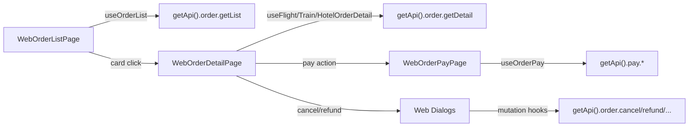

# Web Orders Migration Plan

Migrate the complete H5 order flow for flight/train/hotel (business + personal) to `apps/web`, following the Pad/PC design mockups in `docs/需求实施/pad-pc/订单tab/`. Scope: order list, order detail, payment, and all action dialogs (cancel/refund/exchange/bill/explain). Car tab is excluded.

## Phase 1 — Foundation: Copy Hooks, Libs, Assets, Routes

Copy H5 order logic to web (rewrite web-specific navigation, keep business logic intact). API layer in `packages/api` is already complete and shared.

### 1.1 Copy order libs (H5 → web)

Copy these from `apps/h5/src/lib/` to `apps/web/src/lib/`:

- `order-list-params.ts` — URL param parsing (channel/tab/scope)
- `order-status.ts` — status color maps, `shouldGrayPrice`, `getOrderActions`
- `order-routes.ts` — rewrite path helpers: `getOrderDetailPath` → `/orders/flight|train|hotel/:orderId`; `getOrderPayPath` → `/orders/flight|train|hotel/:orderId/pay`; `getOrderListPath` → `/orders?channel=&tab=&scope=`
- `order-pay.ts` — payment flow (`executeOrderPayFlow`, `buildLegacyH5PayUrl`)
- `flight-order-detail.ts` — `coerceFlightOrderDetail`, cancel/refund helpers
- `train-order-detail.ts` — `coerceTrainOrderDetail`, footer merge, polling
- `hotel-order-detail.ts` — `coerceHotelOrderDetail`, room/bill filters
- `train-order-actions.ts` — `mergeTrainFooterActions`, `startTrainExchangeFlow`
- `train-order-seat.ts`, `flight-order-explain.ts` — display helpers

### 1.2 Copy order hooks (H5 → web)

Copy from `apps/h5/src/hooks/` to `apps/web/src/hooks/`:

- `useOrderList.ts` — `useInfiniteQuery` for list
- `useFlightOrderDetail.ts` — detail + cancel/refund mutations
- `useTrainOrderDetail.ts` — detail + cancel/refund/issue/exchange
- `useHotelOrderDetail.ts` — detail + cancel/SMS
- `useOrderPay.ts` — pay total/channels/create/process

These use `getApi()` which is already set up in web's `lib/api.ts`.

### 1.3 Copy order config + assets

Create `apps/web/src/config/order-assets.ts` from H5 version — keep `ORDER_CATEGORY_TABS` (flight/train/hotel only, drop car), `ORDER_TYPE_TABS`, `ORDER_FONT`, gradients. Remove car-related entries. Copy `apps/h5/src/assets/order/empty.png` to `apps/web/src/assets/order/empty.png`.

### 1.4 Routes (`apps/web/src/app/routes.tsx`)

Replace the `/orders` placeholder **inside the existing `RequireAuth` → `RootLayout` children block** (same as home). Order pages require login; do not mount them outside `RequireAuth`.

```tsx
{
  element: <RequireAuth />,
  children: [
    {
      path: "/",
      element: <RootLayout />,
      children: [
        // ... index, mine ...
        {
          path: "orders",
          children: [
            { index: true, element: <WebOrderListPage /> },
            { path: "flight/:orderId", element: <WebOrderFlightDetailPage /> },
            { path: "train/:orderId", element: <WebOrderTrainDetailPage /> },
            { path: "hotel/:orderId", element: <WebOrderHotelDetailPage /> },
            { path: "flight/:orderId/pay", element: <WebOrderPayPage productType="Flight" /> },
            { path: "train/:orderId/pay", element: <WebOrderPayPage productType="Train" /> },
            { path: "hotel/:orderId/pay", element: <WebOrderPayPage productType="Hotel" /> },
          ],
        },
      ],
    },
  ],
}
```

### 1.5 Session / API bootstrap (pre-flight)

- Web already exports `getTicket` from [`apps/web/src/lib/session.ts`](apps/web/src/lib/session.ts); [`apps/web/src/lib/api.ts`](apps/web/src/lib/api.ts) imports it for `createApi` bootstrap (same pattern as H5).
- Copied **order hooks** (`useOrderList`, detail hooks, `useOrderPay`) only import `getApi()` — no direct `@/lib/session` in hooks.
- Copied **pay page** logic (from H5 `OrderPayPage`) does call `getTicket()` / `getTicketName()` — keep `@/lib/session` and `@/lib/request-context` imports; do not point hooks at inline helpers in `api.ts`.
- When copying pages/components, grep for `@/lib/session` and verify each symbol exists on web before typecheck.

## Phase 2 — Order List Page (Web Pad/PC Grid)

Build `apps/web/src/pages/order/WebOrderListPage.tsx` per design mockup.

### 2.1 Layout structure

```
WebShell main area (#F5F6F9)
└── WebOrderListPage
    ├── Header (sticky, white)
    │   ├── Product tabs: 机票 | 火车票 | 酒店  (underline style like WebHomeTopCard)
    │   └── Filter bar: [全部 | 待出行] segmented + [因公 | 因私] pill (right-aligned)
    └── Scroll area
        └── 3-column grid (pc:grid-cols-3, pad:grid-cols-2)
            └── WebOrderListCard[]
```

Design specifics from mockup:

- Product tabs: bold text + blue underline indicator on active (reuse `WebHomeTopCard` underline tab pattern)
- Filter pills: rounded segmented control, active = white on light-blue track
- Cards: white `rounded-2xl`, subtle shadow, 3-per-row grid with `gap-4`
- Empty state: illustration + "暂无内容" centered

### 2.2 WebOrderListCard (`apps/web/src/components/order/WebOrderListCard.tsx`)

Adapt H5 `OrderListCard` to the mockup's card structure:

```
┌─────────────────────────────────┐
│ [icon] 订单编号: xxx    [状态]  │  ← header row
├─────────────────────────────────┤
│ RouteTitle / HotelName   [票态]  │  ← main info (bold)
│ 起飞/发车/入住时间: ...         │  ← detail rows (gray)
│ 旅客姓名: ...                   │
├─────────────────────────────────┤
│ ¥589              [取消] [支付]  │  ← footer (price + actions)
└─────────────────────────────────┘
```

Key differences from H5:

- No gradient body background — plain white card body
- Flight/train: show first ticket's info as the card body (not per-ticket blocks); per-ticket actions are accessible on detail page
- Price: `text-[24px] font-medium`, red `#FF383C` or gray `#8E8E93` (cancelled)
- Actions: reuse `OrderActionBar` logic (primary = solid blue, secondary = outlined)

### 2.3 Supporting components (copy + adapt)

- `WebOrderProductIcon` — 20×20 rounded icon, reuse `HOME_ASSETS.products.*.active`
- `WebOrderStatusBadge` — status text with color from `order-status.ts`
- `WebOrderActionBar` — primary (solid gradient) + secondary (outlined) buttons
- `WebOrderEmptyState` — illustration + "暂无内容"
- `WebOrderListSkeleton` — 3 skeleton cards

### 2.4 Data + interactions

- `useOrderList({ tabId, scope, channel })` for infinite query
- URL sync: `?channel=tmc&tab=flight&scope=all` (reuse `order-list-params.ts`)
- Infinite scroll: `IntersectionObserver` sentinel (adapted from H5)
- Card click → `getOrderDetailPath(item)`
- Action handlers: pay → navigate pay route; cancel/refund → open dialogs (reuse H5 dialog components, adapt to Dialog)

## Phase 3 — Order Detail Pages

Build three detail pages under `apps/web/src/pages/order/`. All share a web detail shell.

### 3.1 Web detail shell

`WebOrderDetailShell` (`apps/web/src/components/order/WebOrderDetailShell.tsx`):

- White card container, max-width ~960px, centered
- Header: back button + "订单详情" title + status badge
- Scrollable content area
- Sticky footer for actions (when applicable)
- No full-screen gradient (H5 pattern); use web's white card on `#F5F6F9` pattern

### 3.2 WebOrderFlightDetailPage (`apps/web/src/pages/order/WebOrderFlightDetailPage.tsx`)

Sections (top → bottom):

1. `WebFlightOrderInfoCard` — order number, amount, pay-hold countdown, bill link
2. `WebFlightOrderPassengerTabs` — ticket tabs (hidden if single)
3. `WebFlightOrderSegmentCard` — route timeline, ticket no, explain link
4. `WebFlightOrderTravelerCard` — passenger + policy
5. `WebFlightOrderContactCard` — contact info
6. `WebOrderApprovalSection` — approval history (shared)
7. Footer: `WebFlightOrderDetailFooter` — pay/cancel/refund

Dialogs (web Dialog instead of H5 bottom Sheet):

- `WebFlightOrderBillDialog` — bill lines
- `WebFlightOrderCancelDialog` — cancel confirm
- `WebFlightOrderRefundDialog` — voluntary/non-voluntary refund
- `WebFlightOrderExplainDialog` — fare rules

### 3.3 WebOrderTrainDetailPage (`apps/web/src/pages/order/WebOrderTrainDetailPage.tsx`)

Sections:

1. `WebTrainOrderHoldBanner` — countdown (sticky, if active)
2. `WebTrainOrderInfoCard` — order info + external number + bill link
3. `WebTrainOrderPassengerTabs` — ticket tabs with "原票" labels
4. `WebTrainOrderJourneyCard` — train route, seat, schedule + explain links
5. `WebTrainOrderTravelerCard`
6. `WebFlightOrderContactCard` (reused)
7. `WebOrderApprovalSection`
8. Footer: `WebTrainOrderDetailFooter` — two-row (refund/exchange + cancel/pay/issue)

Dialogs:

- `WebTrainOrderBillDialog`, `WebTrainOrderCancelDialog`, `WebTrainOrderIssueDialog`, `WebTrainOrderRefundDialog`, `WebTrainOrderExplainDialog`, `WebTrainScheduleDialog`

### 3.4 WebOrderHotelDetailPage (`apps/web/src/pages/order/WebOrderHotelDetailPage.tsx`)

Sections:

1. `WebHotelOrderInfoCard` — order info + self-pay amount
2. `WebHotelOrderRoomTabs` — room selector
3. `WebHotelOrderHotelInfoCard` — hotel name, room, dates, address, rules
4. `WebHotelOrderTravelerCard` — guest info
5. `WebOrderApprovalSection`
6. Footer: `WebHotelOrderDetailFooter` — pay/cancel

Dialogs:

- `WebHotelOrderBillDialog`, `WebHotelOrderCancelDialog`, `WebHotelOrderSmsDialog`

### 3.5 Copy + adapt detail components

Copy H5 components from `apps/h5/src/components/order/{flight,train,hotel}/` to `apps/web/src/components/order/{flight,train,hotel}/`. Adaptations:

- Replace bottom Sheet patterns with `Dialog`/`DialogContent` from `@ryx/ui`
- Wider layouts (use `max-w-*` and multi-column where space allows)
- Replace `active:opacity-*` touch feedback with `hover:*` for pointer
- Keep `ORDER_FONT` (HarmonyOS Sans SC) consistent
- Reuse shared: `OrderTravelerCredentialRow`, `HotelOrderDetailRow`, `HotelOrderApprovalSection`, `OrderStatusBadge`

## Phase 4 — Payment Page

`WebOrderPayPage` (`apps/web/src/pages/order/WebOrderPayPage.tsx`):

- Props: `productType: "Flight" | "Train" | "Hotel"`, `orderId`
- White card layout (not full-screen like H5)
- Amount card + pay-hold countdown
- Payment channel radio list
- "确认支付" button (sticky footer or inline)
- Success: navigate to detail page (`/orders/{product}/:orderId`) with success toast
- Reuse `useOrderPay` hooks + `executeOrderPayFlow` from `lib/order-pay.ts`

## Phase 5 — Verification

1. `pnpm --filter web typecheck` — must pass
2. `pnpm --filter web test` — add tests for web order routes/params (mirror H5 `order-list-params.test.ts`, `order-routes.test.ts`)
3. `pnpm --filter h5 typecheck && pnpm --filter h5 test` — confirm no H5 regression (shared `packages/api` unchanged)
4. Manual: `pnpm dev:web` → login → `/orders` → switch tabs (机票/火车票/酒店) → switch 因公/因私 → open detail → pay flow → cancel/refund dialogs

## Key Files

| Purpose                  | Path                                                                                                                                  |
| ------------------------ | ------------------------------------------------------------------------------------------------------------------------------------- |
| Routes                   | `apps/web/src/app/routes.tsx`                                                                                                         |
| List page                | `apps/web/src/pages/order/WebOrderListPage.tsx`                                                                                       |
| List card                | `apps/web/src/components/order/WebOrderListCard.tsx`                                                                                  |
| Flight detail            | `apps/web/src/pages/order/WebOrderFlightDetailPage.tsx`                                                                               |
| Train detail             | `apps/web/src/pages/order/WebOrderTrainDetailPage.tsx`                                                                                |
| Hotel detail             | `apps/web/src/pages/order/WebOrderHotelDetailPage.tsx`                                                                                |
| Pay page                 | `apps/web/src/pages/order/WebOrderPayPage.tsx`                                                                                        |
| Detail shell             | `apps/web/src/components/order/WebOrderDetailShell.tsx`                                                                               |
| Order libs               | `apps/web/src/lib/order-*.ts`, `flight-order-detail.ts`, `train-order-detail.ts`, `hotel-order-detail.ts`                             |
| Order hooks              | `apps/web/src/hooks/useOrderList.ts`, `useFlightOrderDetail.ts`, `useTrainOrderDetail.ts`, `useHotelOrderDetail.ts`, `useOrderPay.ts` |
| Order config             | `apps/web/src/config/order-assets.ts`                                                                                                 |
| Shared API (unchanged)   | `packages/api/src/apis/order.ts`, `pay.ts`                                                                                            |
| Shared types (unchanged) | `packages/shared-types/src/order.ts`, `flight-order.ts`, `train-order.ts`, `hotel.ts`                                                 |

## Data Flow



## Design Adapters (H5 → Web)

| H5 Pattern                | Web Pattern                                  |
| ------------------------- | -------------------------------------------- |
| Bottom Sheet (`*Sheet`)   | Centered `Dialog`/`DialogContent`            |
| Full-screen gradient page | White card on `#F5F6F9`                      |
| Single-column list        | 3-column grid (pc) / 2-column (pad)          |
| `active:opacity` touch    | `hover:` pointer feedback                    |
| TabLayout embedded        | WebShell + `RequireAuth`                     |
| `usePullToRefresh`        | Scroll container (no pull-to-refresh on web) |
| `env(safe-area-inset-*)`  | Not needed on web                            |

## Phased delivery (recommended)

Full scope remains the target; ship in reviewable slices:

| Phase  | Deliverable                                                         | Exit criteria                                                  |
| ------ | ------------------------------------------------------------------- | -------------------------------------------------------------- |
| **P0** | Foundation (libs, hooks, assets, routes) + list page + hotel detail | `/orders` grid works; hotel card → detail; hotel cancel dialog |
| **P1** | Flight + train detail pages + product-specific dialogs              | All three product tabs navigate to working detail pages        |
| **P2** | Pay page + remaining dialogs (refund, exchange, bill, explain)      | End-to-end pay + all footer actions per mockup                 |

Each phase ends with `pnpm --filter web typecheck` and no `apps/h5` changes.

## Todos

- Copy order libs from H5 to web (order-list-params, order-status, order-routes, order-pay, flight/train/hotel-order-detail, train-order-actions, train-order-seat, flight-order-explain)
- Copy order hooks from H5 to web (useOrderList, useFlightOrderDetail, useTrainOrderDetail, useHotelOrderDetail, useOrderPay)
- Create web order-assets config + copy empty.png asset
- Add order routes to web router (list, 3 detail pages, 3 pay pages)
- Build WebOrderListPage with product tabs, filter bar, 3-column grid, infinite scroll
- Build WebOrderListCard per design mockup (header/body/footer structure)
- Build WebOrderDetailShell (web detail layout)
- Build WebOrderFlightDetailPage + flight detail components + dialogs
- Build WebOrderTrainDetailPage + train detail components + dialogs
- Build WebOrderHotelDetailPage + hotel detail components + dialogs
- Build WebOrderPayPage
- Run typecheck + tests for web; confirm h5 unaffected
