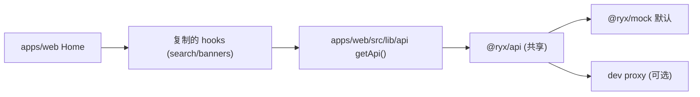

# Pad/PC 首页适配（apps/web）

## 决策（已确认）

- **核心原则：功能不改动，只适配 Pad/PC 的 UI**。通过「复制 h5 业务逻辑（hook/lib）」保证行为逐字一致，仅重建 UI 层（宽屏布局 + 居中 Dialog 替代全屏 sheet）。不新增/删改任何搜索、校验、Banner、因公私、URL 参数逻辑。
- 架构：Pad/PC 全部建在 [`apps/web`](apps/web)，`apps/h5` **零改动**（符合项目规则「Pad + PC UI → apps/web」）。
- 复用策略：首页所需 hook/lib **复制**进 `apps/web/src/`（不抽包、不改 h5 import）。
- 断点：沿用 `pad:` ≥768px、`pc:` ≥1440px（已定义于 [`packages/ui/src/styles/globals.css`](packages/ui/src/styles/globals.css) 与 [`apps/web/src/config/site.ts`](apps/web/src/config/site.ts)）。MatePad 横屏（~1440px CSS）按 Pad 布局；高分屏由 devicePixelRatio 缩放，无需按机型适配。

## 本次交付范围

**做**：Pad/PC 首页（左侧导航壳 + Banner + 因公/因私 + 产品 Tab + 搜索面板 + 出差申请 + 近期出行），搜索表单可交互（选城市/车站/日期、校验）。
**边界（本次不做，后续阶段）**：搜索按钮跳转的 `/flight/list`、`/hotel/list`、`/train/list` 列表页；订单/我的 Tab 的完整页面（先占位）；Banner 跳转的 legacy 页面（先无跳转）。

## 现状差距（apps/web 缺失项）

- 无 `@tanstack/react-query`（首页 hook 依赖）与 Provider
- 无 dev 源码 alias 到 `@ryx/*`（[`apps/h5/vite.config.ts`](apps/h5/vite.config.ts) 有，web 无）→ 改包需重编
- 无 dev proxy（mock 模式不需要；proxy/direct 需要）
- `lib/env.ts` 精简，缺 `getTicket` / `formatApiError`
- 首页 UI 仅占位 [`apps/web/src/pages/HomePage.tsx`](apps/web/src/pages/HomePage.tsx)

## 数据流

## 实施步骤

### 1. Web 基础设施对齐 → verify: `pnpm --filter @ryx/web dev` 起得来、mock 模式有数据

- [`apps/web/package.json`](apps/web/package.json)：加 `@tanstack/react-query`（版本对齐 h5 的 `^5.80.7`）
- [`apps/web/src/main.tsx`](apps/web/src/main.tsx)：包一层 `QueryClientProvider`（`@ryx/ui/globals.css` 已在 :5 import，无需处理）
- [`apps/web/vite.config.ts`](apps/web/vite.config.ts)：加 `@ryx/*` dev 源码 alias + `optimizeDeps.exclude`（对齐 h5）；加 `/Home/Proxy`、`/Home/Setting`、`/__ryx/*` proxy（从 h5 复制，供 proxy 模式）
- 新增 [`apps/web/src/lib/session.ts`](apps/web/src/lib/session.ts)（`getTicket`）、[`apps/web/src/lib/formatApiError.ts`](apps/web/src/lib/formatApiError.ts)（复制 h5）
- **重构** [`apps/web/src/lib/api.ts`](apps/web/src/lib/api.ts):8-10 内联的 `getTicket()` → 改为从 `@/lib/session` import，统一数据源

### 2. 复制首页业务逻辑到 apps/web/src → verify: `pnpm --filter @ryx/web typecheck`

从 `apps/h5/src/` 复制（保持路径结构，import 用 `@/`）：

- hooks：`useHomeBanners`、`useHotelSearchForm`、`useFlightSearchForm`、`useTrainSearchForm`，及其子依赖 `useHotelList`(→`useHotelCities`)、`useFlight`(→`useFlightAirports`)、train stations 部分
- lib：`home-banners`、`home-params`、`flight-travel-mode`、`flight-search`、`hotel-search`、`train-search`、`date-search`、`geolocation`、`city-picker`（仅数据逻辑，供 web 版 Dialog 复用；不复制 H5 的 `PickerShell`/`CityPicker`/日历 sheet 组件）
- Banner 跳转 `core-jump`：**本次 Banner 不做跳转**，故不复制 `core-jump`；如后续要接，需一并复制其依赖 `@/lib/request-context`（`getTicketName`）
- config + 资源：[`apps/h5/src/config/home-assets.ts`](apps/h5/src/config/home-assets.ts) → web；整目录 `apps/h5/src/assets/home/*` → `apps/web/src/assets/home/`

**注意（复制后的行为差异）**：

- 复制的 hooks 只调用 `getApi().tmc/hotel/flight/train.*` 域方法，不直接引用 `getTicketName/getDomain/...`，因此**无类型/编译冲突**（`getApi` 为 app 本地）。
- web 版 `getApi()` 比 h5 精简（无 tourist-context 代理、domain、签名扩展字段）。**mock 模式数据完全一致**；**proxy 模式下因私(tourist)/签名类请求可能行为不同**，本次以 mock 为主验证，proxy 完整性属后续增强。

### 3. Web 导航壳（左侧栏，参考 首页.png） → verify: pad/pc 下侧栏与内容区布局正确

- 改造 [`apps/web/src/components/WebShell.tsx`](apps/web/src/components/WebShell.tsx)：左侧竖向导航（图标+文案）首页/订单/我的；`pad:` 常显、`pc:` 加宽；`<768px` 保留软提示不阻断
- 新增 `apps/web/src/app/layouts/` 下 Tab 导航（复用 `HOME_ASSETS.tabBar.*` 图标），路由高亮
- [`apps/web/src/app/routes.tsx`](apps/web/src/app/routes.tsx)：`/` → Home；`/orders`、`/mine` 先占位页

### 4. Web 首页 UI（Pad/PC 宽屏） → verify: 与 首页.png 视觉一致、搜索表单可交互

新增 `apps/web/src/pages/home/WebHomePage.tsx` + `apps/web/src/components/home/*`（web 专用，宽屏布局，复用 token 与 HarmonyOS 字体）：

- Banner 轮播（宽屏多图 peek）
- 因公出行 / 因私出行 分段切换（写 `saveHomeTravelMode`）
- 产品 Tab：国内机票 / 火车票 / 国内酒店
- 搜索面板（三选一，**单行横向**布局）：出发地/目的地/交换/出发时间/查询按钮
- 城市/车站/日期选择器（**已确认：新建 Pad/PC 居中 Dialog，不用全屏 sheet**）：
  1. `@ryx/ui` 目前只有 button/card，**无 Dialog 原语** → 先 `shadcn add dialog`（落到 `packages/ui/src/components/ui/dialog.tsx`，依赖 `@radix-ui/react-dialog`）
  2. 新增 web 组件 `apps/web/src/components/search/CityPickerDialog.tsx`：基于 `@ryx/ui` Dialog 包裹城市/车站列表（搜索框 + 热门 + 首字母分组 + 历史），复用复制来的 `city-picker` lib（`filterPickerItems`/`groupByFirstLetter`/`loadCityHistory` 等）与各 form hook 的 `cities`/`stations`
  3. 日期选择：Pad/PC 用居中 Dialog 版日历（基于同一 Dialog 原语），复用 `date-search` 逻辑；不复用 H5 的 `CalendarPickerSheet`/`HotelStayDatePickerSheet`（移动端 sheet）
  4. 触屏适配：Dialog 内可点区域 `min-h-11`，`pointer-coarse:` 增大间距
- 出差申请 4 列（`travelMode==="business"`）：出差申请/我的审批/待我审批/已审任务
- 近期出行列表：presentational 面板；接共享 order API（best-effort），无数据显示空态
- 搜索按钮：调用 `form.validate()` 通过后 `navigate("/flight/list?...")` 等（目标列表页本次不实现）

### 5. 验证 → verify: 全绿

- `pnpm --filter @ryx/web typecheck`
- `pnpm --filter @ryx/web build`
- `pnpm --filter @ryx/web test`（如新增纯函数补最小单测）
- 手动：`pnpm dev:web`（:5174）mock 模式检查 pad（~1024/1280）与 pc（≥1440）两档；确认 `apps/h5` 未被修改

## 风险 / 说明

- 复制会带来 h5/web 双份逻辑；本次按你选择的「copy」策略，后续若维护成本上升可再抽 `packages/core`。
- 搜索按钮跳转目标（list 页）与 Banner legacy 跳转本次不建，属后续阶段。
- 近期出行若 order API 形态复杂，先空态占位，不阻塞首页交付。
