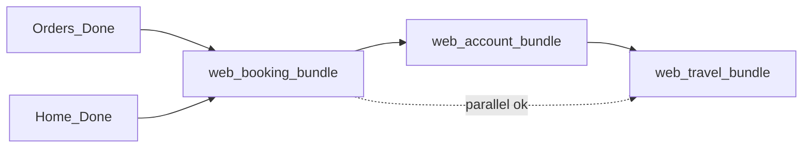

# Web Travel Bundle Plan

**Parent:** [web_h5_gap_roadmap](web_h5_gap_roadmap_bfb8aee6.plan.md) — Bundle C (P1, can run after booking bundle)

**Goal:** Wire home business shortcuts and deliver出差申请 / 审批 / BPM iframe flows on Pad/PC.

## Principles

| Layer | Source |
|-------|--------|
| Behavior | H5 `pages/travel/*`, `pages/open-url/*`, travel libs/hooks |
| Home UI | [`docs/需求实施/pad-pc/首页.png`](docs/需求实施/pad-pc/首页.png) for notice strip + business panel placement |
| Travel forms / approval | No dedicated Pad mockups — wide form layout, table/list for approval tabs |

## Phase 1 — Home integration

### 1.1 Business panel links

Update [`WebBusinessPanel`](apps/web/src/components/home/WebBusinessPanel.tsx) to match H5 [`HomeBusinessPanel`](apps/h5/src/components/home/HomeBusinessPanel.tsx):

| Button | Route |
|--------|-------|
| 出差申请 | `/travel/apply` |
| 我的申请 | `/travel/approval?tab=mine` |
| 待我审批 | `/travel/approval?tab=pending` |
| 已审任务 | `/travel/approval?tab=done` |

### 1.2 Notice strip

- Copy [`HomeNoticeStrip`](apps/h5/src/components/home/HomeNoticeStrip.tsx) → `WebHomeNoticeStrip`
- Add notice query to [`WebHomePage`](apps/web/src/pages/home/WebHomePage.tsx) (same API as H5 `HomeTabPage`)
- Click → `/notice?bulletinType=agentNotice`

**Dependency:** [web_account_bundle](web_account_bundle.plan.md) notice routes, or temporary stub page until account bundle lands.

### 1.3 Optional workbench

- 近期出行 block from [`web_pad_pc_home`](web_pad_pc_home_ade48bb4.plan.md) — deferred in v1 home; implement here if product requires

## Phase 2 — Travel pages

### Routes

```
/travel/apply
/travel/approval
/travel/task
/open-url?url=&title=
```

Legacy redirect: `/travel/workflow` → `/travel/approval?tab=mine` (match H5)

### Copy from H5

- `pages/travel/TravelApplyPage.tsx`, `TravelApprovalPage.tsx`, `TravelTaskPage.tsx`
- `pages/open-url/OpenUrlPage.tsx`
- `lib/travel-apply.ts`, `travel-form-list.ts`, `workflow-embed.ts`
- hooks: `useTravelApply`, `useApprovalTasks`
- Partial copy already in web: [`approval-task-url.ts`](apps/web/src/lib/approval-task-url.ts)

### Web UI notes

- **Apply:** multi-section form in `max-w-[1280px]` centered column; pickers as Dialog
- **Approval:** tab bar + data table or card list (Pad/PC width)
- **Task / open-url:** iframe full main area below `WebShell` header; handle auth cookies / proxy base URL same as H5

## Phase 3 — Shell / registry

If [web_booking_bundle](web_booking_bundle.plan.md) shell phase not done:

- Register `/travel/*`, `/open-url` in [`legacy-route-registry.ts`](apps/web/src/lib/legacy-route-registry.ts)
- Banner `core-jump` may route to travel pages after registry update

## Verification

```bash
pnpm --filter web typecheck && pnpm --filter web test && pnpm --filter web build && pnpm audit
```

Manual:

- 因公 mode on home → business panel → each of 4 destinations
- Notice strip visible when API returns data → `/notice`
- Approval task opens in iframe without mobile-only layout bugs
- `apps/h5` unchanged

## Dependencies

| Depends on | Reason |
|------------|--------|
| [web_account_bundle](web_account_bundle.plan.md) (soft) | `/notice` destination for home strip |
| [web_booking_bundle](web_booking_bundle.plan.md) (soft) | `legacy-route-registry` / 404 if not already done |

## Suggested execution order across bundles



1. **web_booking_bundle** — highest priority (fixes 404 from home search)
2. **web_account_bundle** — profile + settings
3. **web_travel_bundle** — can start after booking shell; best after account bundle for `/notice`

## Out of scope

- Flight/train/hotel booking pages
- Car / 用车
