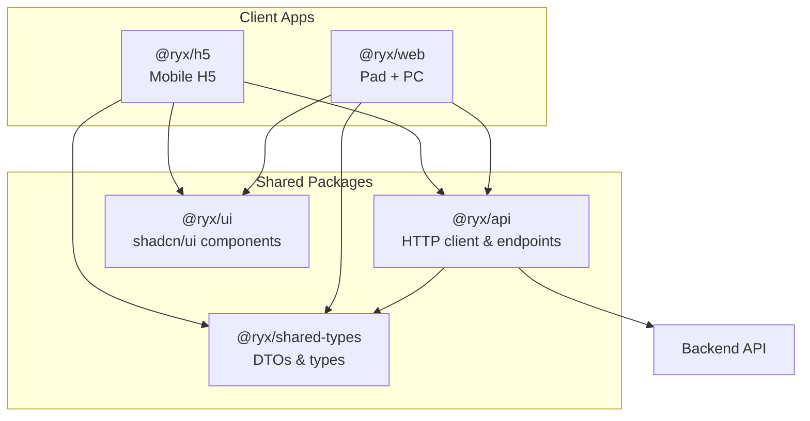

# RongYiXing Monorepo

pnpm workspace monorepo for the RongYiXing platform. Three client surfaces share the same backend APIs and design system while keeping UI tailored per device.

## Client Surfaces

| Surface   | Package    | Port | Description                                       |
| --------- | ---------- | ---- | ------------------------------------------------- |
| Mobile H5 | `@ryx/h5`  | 5173 | Mobile-first app with touch and safe-area support |
| Pad + PC  | `@ryx/web` | 5174 | Responsive web app for tablets and desktops       |

Pad and PC share one codebase (`apps/web`). Mobile H5 is a separate app (`apps/h5`) for distinct mobile UX.

## Architecture Overview



### Layer Responsibilities

| Layer           | Location                | Responsibility                             |
| --------------- | ----------------------- | ------------------------------------------ |
| Pages & layouts | `apps/h5`, `apps/web`   | Routes, responsive shells, product UI      |
| API client      | `packages/api`          | `fetch` wrapper, auth, domain endpoints    |
| UI primitives   | `packages/ui`           | shadcn/ui components, Tailwind tokens      |
| DTOs            | `packages/shared-types` | Request/response TypeScript types          |
| App bootstrap   | `apps/*/src/lib/`       | `env.ts` (Vite env), `api.ts` (`getApi()`) |

### Data Flow

```
Page / Hook  →  getApi()  →  @ryx/api  →  Backend
                  ↑
         apps/*/src/lib/api.ts  (baseUrl, token, onUnauthorized)
```

- **Do not** call `fetch` directly in pages — use `getApi()` from `@/lib/api`.
- **Do not** duplicate DTOs or endpoint logic across apps.

### Package Dependencies

```
apps/h5, apps/web
  ├── @ryx/api
  ├── @ryx/ui
  └── @ryx/shared-types

@ryx/api
  └── @ryx/shared-types

@ryx/ui
  └── react, react-dom (peer)
```

Apps must not import from each other. `packages/ui` must not depend on `@ryx/api`.

## Tech Stack

| Category   | Choice                                     |
| ---------- | ------------------------------------------ |
| Runtime    | React 19, TypeScript 5                     |
| Build      | Vite 6, pnpm workspaces                    |
| Routing    | react-router-dom v7                        |
| Styling    | Tailwind CSS v4 (`@tailwindcss/vite`)      |
| Components | shadcn/ui (monorepo mode in `packages/ui`) |
| Testing    | Vitest                                     |

## Responsive Layout (Web)

Breakpoints are aligned with MatePad CSS widths at 2x DPR:

| Device                 | CSS width (approx.) | Layout       |
| ---------------------- | ------------------- | ------------ |
| MatePad Mini portrait  | ~800px              | Pad          |
| MatePad Pro portrait   | ~960px              | Pad          |
| MatePad Mini landscape | ~1280px             | Pad          |
| MatePad Pro landscape  | ~1440px             | Pad (not PC) |

| Breakpoint      | Range          | Tailwind variant             |
| --------------- | -------------- | ---------------------------- |
| Mobile fallback | &lt; 768px     | single column (soft H5 hint) |
| Pad             | 768px – 1439px | `pad:`                       |
| PC              | ≥ 1440px       | `pc:`                        |

Touch devices use `pointer-coarse:` for 44px minimum targets. Hover styles use `hover-hover:` so Pad touch input is not relied on for critical actions.

Canonical constants: `apps/web/src/config/site.ts` (`BREAKPOINTS`). Tailwind variants: `packages/ui/src/styles/globals.css`.

## Repository Structure

```
rongyixing-monorepo/
├── apps/
│   ├── h5/                    # @ryx/h5 — mobile H5
│   │   └── src/
│   │       ├── app/           # routes, layouts
│   │       ├── pages/
│   │       ├── components/
│   │       ├── config/        # site.ts, theme.ts
│   │       └── lib/           # env.ts, api.ts
│   └── web/                   # @ryx/web — Pad + PC
│       └── src/               # same layout as h5
├── packages/
│   ├── api/                   # @ryx/api — HTTP client & endpoints
│   ├── ui/                    # @ryx/ui — shadcn components + globals.css
│   └── shared-types/          # @ryx/shared-types — DTOs
├── docs/
├── .cursor/rules/             # Cursor coding standards
├── pnpm-workspace.yaml
├── package.json
├── CLAUDE.md                  # Agent & contributor guide
└── README.md
```

## Prerequisites

- Node.js 20+
- pnpm 9 (`corepack enable`)

## Getting Started

```bash
# Install dependencies
pnpm install

# Copy env files
cp apps/h5/.env.example apps/h5/.env
cp apps/web/.env.example apps/web/.env

# Start dev servers
pnpm dev:h5    # http://localhost:5173
pnpm dev:web   # http://localhost:5174
```

### Environment Variables

| Variable            | Description                   |
| ------------------- | ----------------------------- |
| `VITE_APP_NAME`     | Display name in the app shell |
| `VITE_API_BASE_URL` | Backend API base URL          |

Read env vars only in `apps/*/src/lib/env.ts`. Extend `src/vite-env.d.ts` when adding new variables.

### Using the API Client

```typescript
import { getApi } from "@/lib/api";

const { auth } = getApi();
const result = await auth.login({ username: "demo", password: "secret" });
```

## Scripts

| Command          | Description                                      |
| ---------------- | ------------------------------------------------ |
| `pnpm dev:h5`    | Start H5 dev server (:5173)                      |
| `pnpm dev:web`   | Start Web dev server (:5174)                     |
| `pnpm build`     | Build all workspace packages (topological order) |
| `pnpm test`      | Run tests across workspaces                      |
| `pnpm typecheck` | Type-check all packages                          |
| `pnpm lint`      | Lint the repository                              |
| `pnpm audit`     | Security audit (run before merging)              |

## Workspace Packages

| Package             | Description                                          |
| ------------------- | ---------------------------------------------------- |
| `@ryx/h5`           | Mobile H5 application                                |
| `@ryx/web`          | Pad + PC responsive application                      |
| `@ryx/api`          | Shared HTTP client (`createApi`, `createAuthApi`, …) |
| `@ryx/ui`           | Shared shadcn/ui component library                   |
| `@ryx/shared-types` | Shared TypeScript DTOs                               |

## Development Conventions

- Code and comments: **English**
- Git commits: **English**, [Conventional Commits](https://www.conventionalcommits.org/) (`feat(web): add sidebar`)
- Mobile UI changes → `apps/h5`
- Pad/PC UI changes → `apps/web`
- New shadcn components → `packages/ui` (`pnpm dlx shadcn@latest add <name>` in ui package)
- New API endpoints → DTO in `shared-types`, module in `packages/api`

Detailed standards: [`.cursor/rules/`](.cursor/rules/) and [`CLAUDE.md`](CLAUDE.md).

## Security

Run `pnpm audit` before committing. Resolve critical and high severity vulnerabilities before merging PRs.
