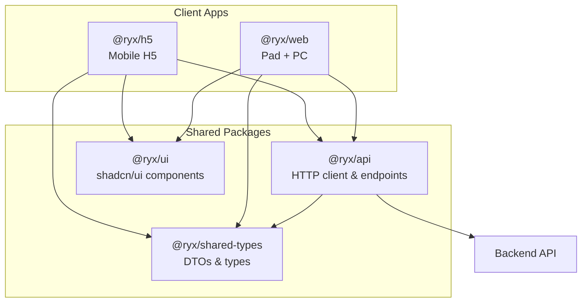

# RongYiXing Monorepo

pnpm workspace monorepo for the RongYiXing platform. Three client surfaces share the same backend APIs and design system while keeping UI tailored per device.

## Client Surfaces

| Surface   | Package    | Port | Description                                       |
| --------- | ---------- | ---- | ------------------------------------------------- |
| Mobile H5 | `@ryx/h5`  | 5173 | Mobile-first app with touch and safe-area support |
| Pad + PC  | `@ryx/web` | 5174 | Responsive web app for tablets and desktops       |

Pad and PC share one codebase (`apps/web`). Mobile H5 is a separate app (`apps/h5`) for distinct mobile UX.

## Architecture Overview


```mermaid
flowchart TB
  subgraph clients [Client Apps]
    H5["@ryx/h5\nMobile H5"]
    Web["@ryx/web\nPad + PC"]
  end

  subgraph packages [Shared Packages]
    API["@ryx/api\nHTTP client & endpoints"]
    UI["@ryx/ui\nshadcn/ui components"]
    Types["@ryx/shared-types\nDTOs & types"]
  end

  Backend["Backend API"]

  H5 --> API
  H5 --> UI
  H5 --> Types
  Web --> API
  Web --> UI
  Web --> Types
  API --> Types
  API --> Backend
```

### Layer Responsibilities

| Layer           | Location                | Responsibility                             |
| --------------- | ----------------------- | ------------------------------------------ |
| Pages & layouts | `apps/h5`, `apps/web`   | Routes, responsive shells, product UI      |
| API client      | `packages/api`          | `fetch` wrapper, auth, domain endpoints    |
| UI primitives   | `packages/ui`           | shadcn/ui components, Tailwind tokens      |
| DTOs            | `packages/shared-types` | Request/response TypeScript types          |
| App bootstrap   | `apps/*/src/lib/`       | `env.ts` (Vite env), `api.ts` (`getApi()`) |

### Data Flow

```
Page / Hook  →  getApi()  →  @ryx/api  →  Backend
                  ↑
         apps/*/src/lib/api.ts  (baseUrl, token, onUnauthorized)
```

- **Do not** call `fetch` directly in pages — use `getApi()` from `@/lib/api`.
- **Do not** duplicate DTOs or endpoint logic across apps.

### Package Dependencies

```
apps/h5, apps/web
  ├── @ryx/api
  ├── @ryx/ui
  └── @ryx/shared-types

@ryx/api
  └── @ryx/shared-types

@ryx/ui
  └── react, react-dom (peer)
```

Apps must not import from each other. `packages/ui` must not depend on `@ryx/api`.

## Tech Stack

| Category   | Choice                                     |
| ---------- | ------------------------------------------ |
| Runtime    | React 19, TypeScript 5                     |
| Build      | Vite 6, pnpm workspaces                    |
| Routing    | react-router-dom v7                        |
| Styling    | Tailwind CSS v4 (`@tailwindcss/vite`)      |
| Components | shadcn/ui (monorepo mode in `packages/ui`) |
| Testing    | Vitest                                     |

## Responsive Layout (Web)

Breakpoints are aligned with MatePad CSS widths at 2x DPR:

| Device                 | CSS width (approx.) | Layout       |
| ---------------------- | ------------------- | ------------ |
| MatePad Mini portrait  | ~800px              | Pad          |
| MatePad Pro portrait   | ~960px              | Pad          |
| MatePad Mini landscape | ~1280px             | Pad          |
| MatePad Pro landscape  | ~1440px             | Pad (not PC) |

| Breakpoint      | Range          | Tailwind variant             |
| --------------- | -------------- | ---------------------------- |
| Mobile fallback | &lt; 768px     | single column (soft H5 hint) |
| Pad             | 768px – 1439px | `pad:`                       |
| PC              | ≥ 1440px       | `pc:`                        |

Touch devices use `pointer-coarse:` for 44px minimum targets. Hover styles use `hover-hover:` so Pad touch input is not relied on for critical actions.

Canonical constants: `apps/web/src/config/site.ts` (`BREAKPOINTS`). Tailwind variants: `packages/ui/src/styles/globals.css`.

## Repository Structure

```
rongyixing-monorepo/
├── apps/
│   ├── h5/                    # @ryx/h5 — mobile H5
│   │   └── src/
│   │       ├── app/           # routes, layouts
│   │       ├── pages/
│   │       ├── components/
│   │       ├── config/        # site.ts, theme.ts
│   │       └── lib/           # env.ts, api.ts
│   └── web/                   # @ryx/web — Pad + PC
│       └── src/               # same layout as h5
├── packages/
│   ├── api/                   # @ryx/api — HTTP client & endpoints
│   ├── ui/                    # @ryx/ui — shadcn components + globals.css
│   └── shared-types/          # @ryx/shared-types — DTOs
├── docs/
├── .cursor/rules/             # Cursor coding standards
├── pnpm-workspace.yaml
├── package.json
├── CLAUDE.md                  # Agent & contributor guide
└── README.md
```

## Prerequisites

- Node.js 20+
- pnpm 9 (`corepack enable`)

## Getting Started

```bash
# Install dependencies
pnpm install

# Optional: copy local override files when you need private overrides.
# Committed env files already cover development/test/prod modes.
cp apps/h5/.env.example apps/h5/.env
cp apps/web/.env.example apps/web/.env
```

## Run, Release & Deployment Quick Reference

Full deployment details live in [docs/deployment-readme.md](docs/deployment-readme.md), and the access matrix lives in [docs/deployment-access-map.md](docs/deployment-access-map.md). The most commonly used commands and URLs are summarized here.

### One-Shot Release

```bash
pnpm release:all
```

This builds all release artifacts under `deploy/release/out/`:

| Artifact | Usage | Static base |
| --- | --- | --- |
| `rongyixing-business-h5-test/` | Customer test H5 delivery | `/rl/` |
| `rongyixing-business-h5-prod/` | Customer prod H5 delivery | `/www/` |
| `rongyixing-business-web-test/` | Customer test Web delivery | `/web/` |
| `rongyixing-business-web-prod/` | Customer prod Web delivery | `/web/` |
| `rongyixing-h5-web-dist-test/` | Local/self-hosted Nginx test validation | `/` |
| `rongyixing-h5-web-dist-prod/` | Local/self-hosted Nginx prod validation | `/` |

Optional switches:

```bash
CREATE_ARCHIVE=1 pnpm release:all       # also create tar.gz archives
BUILD_INTERNAL=0 pnpm release:all       # only build customer packages
BUILD_BUSINESS_WWW=0 pnpm release:all   # only build internal Nginx validation packages
```

### Access Matrix

| Scenario | H5 Test | Web Test | H5 Prod | Web Prod |
| --- | --- | --- | --- | --- |
| Local Vite | `http://localhost:5173/` | `http://localhost:5174/` | `http://localhost:5175/` | `http://localhost:5176/` |
| Local/self-hosted Nginx IP | `http://<ip>:18080/` | `http://<ip>:18081/` | `http://<ip>:18088/` | `http://<ip>:18089/` |
| Self-hosted prod domain | - | - | `http://h5.songguoren.site/` | `http://web.songguoren.site/` |
| Customer same-origin | `https://app.rongtrip.cn/rl/index.html` | `https://app.rongtrip.cn/web/index.html` | `https://app.rongtrip.cn/www/index.html` | `https://app.rongtrip.cn/web/index.html` |
| Backend env | `rtesp.com` | `rtesp.com` | `rongtrip.cn` | `rongtrip.cn` |

Ticket direct-entry examples:

```text
http://localhost:5173/?ticket=xxxx
http://<ip>:18088/?ticket=xxxx
http://h5.songguoren.site/?ticket=xxxx
https://app.rongtrip.cn/rl/index.html?ticket=xxxx       # customer test
https://app.rongtrip.cn/www/index.html?ticket=xxxx      # customer prod
```

### Local Vite Commands

```bash
pnpm dev:h5:test   # http://localhost:5173/ -> rtesp test
pnpm dev:web:test  # http://localhost:5174/ -> rtesp test
pnpm dev:h5:prod   # http://localhost:5175/ -> rongtrip prod
pnpm dev:web:prod  # http://localhost:5176/ -> rongtrip prod
```

One-shot local prod validation:

```bash
pnpm local:prod       # starts H5/Web Vite prod + H5/Web Nginx prod
pnpm local:prod:stop  # stops the local prod servers above
```

This command serves:

```text
H5 Vite:   http://localhost:5175/
Web Vite:  http://localhost:5176/
H5 Nginx:  http://localhost:18088/
Web Nginx: http://localhost:18089/
```

### Local or Self-Hosted Nginx Validation

Use the internal validation packages:

```bash
cd deploy/release/out/rongyixing-h5-web-dist-test
sudo ./install-dist.sh

cd deploy/release/out/rongyixing-h5-web-dist-prod
sudo ./install-dist.sh
```

Default ports:

| Package | H5 | Web |
| --- | --- | --- |
| `rongyixing-h5-web-dist-test` | `18080` | `18081` |
| `rongyixing-h5-web-dist-prod` | `18088` | `18089` |

### Customer Server Deployment

Customer delivery uses the `rongyixing-business-*` packages. Replace the corresponding static directories under:

```text
/data/beeant/www/websites/Beeant.Presentation.Client.App/wwwroot/
```

| Package content | Customer target |
| --- | --- |
| `rongyixing-business-h5-test/rl` | `wwwroot/rl` |
| `rongyixing-business-h5-prod/www` | `wwwroot/www` |
| `rongyixing-business-web-*/web` | `wwwroot/web` |

Customer packages are same-origin builds: they request `/Home/Setting` on the current host, then call the legacy backend URLs returned by that setting response.

### Mobile H5 (`@ryx/h5`)

```bash
pnpm dev:h5          # http://localhost:5173
pnpm dev:h5:mock     # same, with VITE_API_MODE=mock
pnpm dev:h5:test     # http://localhost:5173/  -> rtesp test
pnpm dev:h5:prod     # http://localhost:5175/  -> rongtrip prod
```

H5 builds workspace packages (`shared-types`, `api`, `mock`) before starting Vite.

### Pad + PC Web (`@ryx/web`)

```bash
pnpm dev:web         # http://localhost:5174
pnpm dev:web:test    # http://localhost:5174/ -> rtesp test
pnpm dev:web:prod    # http://localhost:5176/ -> rongtrip prod
```

Open [http://localhost:5174](http://localhost:5174) in the browser. Use DevTools device mode or a wide window to exercise layout:

| Viewport       | What to expect                                 |
| -------------- | ---------------------------------------------- |
| &lt; 768px     | Single column; soft hint to use H5 on phones   |
| 768px – 1439px | Pad layout — icon sidebar, main content column |
| ≥ 1440px       | PC layout — wider sidebar with labels          |

**Mock API (no backend):**

```bash
pnpm build:workspace
VITE_API_MODE=mock pnpm --filter @ryx/web dev
```

**Proxy API (default):** set `VITE_API_MODE=proxy` (or omit it). Vite proxies `/Home/Proxy`, `/Home/Setting`, `/Jyx`, `/Identity`, and `/__ryx/*` to the environment selected by `VITE_API_BASE_URL` + `VITE_API_DOMAIN`. Shared proxy mapping lives in `tooling/vite/ryx-dev-proxy.ts`.

Log in at `/login/password` before using home, orders, or booking flows.

### Local Vite Environment Matrix

The release package has test/prod dist directories, and local Vite now mirrors that split:

| Command | URL | Env file | Gateway | Legacy service suffix |
| --- | --- | --- | --- | --- |
| `pnpm dev:h5:test` | `http://localhost:5173/` | `apps/h5/.env.test` | `http://app.rtesp.com` | `rtesp.com` |
| `pnpm dev:web:test` | `http://localhost:5174/` | `apps/web/.env.test` | `http://app.rtesp.com` | `rtesp.com` |
| `pnpm dev:h5:prod` | `http://localhost:5175/` | `apps/h5/.env.prod` | `https://app.rongtrip.cn` | `rongtrip.cn` |
| `pnpm dev:web:prod` | `http://localhost:5176/` | `apps/web/.env.prod` | `https://app.rongtrip.cn` | `rongtrip.cn` |

`VITE_BASE_PATH` is set to `/` by these scripts so local Vite mirrors release and Docker delivery:
each application is served from its own IP port or fixed domain root.

### Single-IP Test Deployment

When a test environment has only one IP and no domain names, deploy H5 and Web as two
root-path services behind different server Nginx ports:

```text
http://<server-ip>:18080/  -> @ryx/h5
http://<server-ip>:18081/  -> @ryx/web
```

The apps are built with a root `VITE_BASE_PATH`:

```bash
VITE_BASE_PATH=/ pnpm --filter @ryx/h5 build
VITE_BASE_PATH=/ pnpm --filter @ryx/web build
```

For Docker-based test deployment, use:

```bash
deploy/scripts/deploy-ip-prefix.sh
```

This builds `ryx-h5` on `127.0.0.1:18080`, `ryx-web` on `127.0.0.1:18081`, and installs
`deploy/nginx/ip-prefix.conf` so the public IP can route H5 and Web through ports `80` and `81`.

### Dist-Only Delivery

For customer delivery without source code, build a static H5/Web package:

```bash
deploy/release/build-dist-package.sh
```

The generated directories are:

```text
deploy/release/out/rongyixing-h5-web-dist-test/
deploy/release/out/rongyixing-h5-web-dist-prod/
```

Each directory contains only `h5/dist`, `web/dist`, Nginx template, and install helpers. See `deploy/release/README.md`.

### Environment Variables

| Variable              | App    | Description                             |
| --------------------- | ------ | --------------------------------------- |
| `VITE_APP_NAME`       | h5/web | Display name in the app shell           |
| `VITE_APP_ID`         | h5/web | App id for `/Home/Setting` bootstrap    |
| `VITE_BASE_PATH`      | h5/web | Browser base path, e.g. `/h5/`, `/web/` |
| `VITE_API_BASE_URL`   | h5/web | Backend / proxy gateway base URL        |
| `VITE_API_DOMAIN`     | h5/web | Legacy service suffix and signed domain |
| `VITE_API_MODE`       | h5/web | `mock`, `proxy` (default), or `direct`  |
| `VITE_API_MOCK_DELAY` | h5/web | Artificial delay (ms) in mock mode      |
| `VITE_DEV_PORT`       | h5/web | Local Vite dev server port              |

Read env vars only in `apps/*/src/lib/env.ts`. Extend `src/vite-env.d.ts` when adding new variables.

### Using the API Client

```typescript
import { getApi } from "@/lib/api";

// Proxy 业务接口（融易行主路径）
const list = await getApi().hotel.getList({ CityCode: "010" });
const login = await getApi().authProxy.login({ Name: "demo", Password: "123456" });
```

## API Migration Status

> **目标**：H5 ryx → `apps/h5` · [app.rtesp.com/rl](http://app.rtesp.com/rl/index.html)  
> **页面迁移 ≈28%**（6 done + 4 partial / 29 页）  
> **下一批**：Wave 2 Tab 壳 + 首页工作台

| 阶段            | 进度 | 说明                        |
| --------------- | ---- | --------------------------- |
| P0–P2 基础设施  | ✅   | METHODS 字典 + Proxy + Mock |
| 页面矩阵        | ✅   | 29 页 × Wave 1–8            |
| Wave 3 酒店     | [~]  | mock 可跑 `/hotel`          |
| Wave 2 首页/Tab | [ ]  | 建议下一批                  |

| 文档                                                         | 说明                    |
| ------------------------------------------------------------ | ----------------------- |
| [docs/api/PAGE-API-MATRIX.md](docs/api/PAGE-API-MATRIX.md)   | **页面→接口（主文档）** |
| [docs/api/task-list.md](docs/api/task-list.md)               | 执行看板                |
| [docs/api/H5-RYX-MIGRATION.md](docs/api/H5-RYX-MIGRATION.md) | 路由/Tab 对照           |
| [docs/接口迁移方案.md](docs/接口迁移方案.md)                 | 接口层方案              |

---

| Command                    | Description                                      |
| -------------------------- | ------------------------------------------------ |
| `pnpm dev:h5`              | Start H5 dev server (:5173)                      |
| `pnpm dev:h5:mock`         | H5 dev with `VITE_API_MODE=mock`                 |
| `pnpm dev:h5:test`         | H5 dev against test env (:5173, `/`)             |
| `pnpm dev:h5:prod`         | H5 dev against prod env (:5175, `/`)             |
| `pnpm dev:web`             | Start Web dev server (:5174)                     |
| `pnpm dev:web:test`        | Web dev against test env (:5174, `/`)            |
| `pnpm dev:web:prod`        | Web dev against prod env (:5176, `/`)            |
| `pnpm local:prod`          | Start H5/Web prod Vite and Nginx validation URLs |
| `pnpm local:prod:stop`     | Stop local prod Vite and Nginx validation URLs   |
| `pnpm build:workspace`     | Build shared-types, api, mock (for mock mode)    |
| `pnpm analyze-ryx-scope`   | ryx 迁移范围分析 → METHODS-RYX-SCOPE.md          |
| `pnpm analyze-ryx-pages`   | 页面→接口矩阵 → PAGE-API-MATRIX.md               |
| `pnpm check:mock-coverage` | Verify mock handlers for flow Methods            |
| `pnpm verify:mock`         | Smoke-test domain APIs in mock mode              |
| `pnpm build`               | Build all workspace packages (topological order) |
| `pnpm test`                | Run tests across workspaces                      |
| `pnpm typecheck`           | Type-check all packages                          |
| `pnpm lint`                | Lint the repository                              |
| `pnpm audit`               | Security audit (run before merging)              |

## Workspace Packages

| Package             | Description                                 |
| ------------------- | ------------------------------------------- |
| `@ryx/h5`           | Mobile H5 application                       |
| `@ryx/web`          | Pad + PC responsive application             |
| `@ryx/api`          | Proxy client, domain APIs, Method constants |
| `@ryx/mock`         | Mock registry & handlers (S1–S5)            |
| `@ryx/ui`           | Shared shadcn/ui component library          |
| `@ryx/shared-types` | Shared TypeScript DTOs                      |

## Development Conventions

- Code and comments: **English**
- Git commits: **English**, [Conventional Commits](https://www.conventionalcommits.org/) (`feat(web): add sidebar`)
- Mobile UI changes → `apps/h5`
- Pad/PC UI changes → `apps/web`
- New shadcn components → `packages/ui` (`pnpm dlx shadcn@latest add <name>` in ui package)
- New API endpoints → DTO in `shared-types`, module in `packages/api`

Detailed standards: [`.cursor/rules/`](.cursor/rules/) and [`CLAUDE.md`](CLAUDE.md).

## Documentation

| Document                                                       | Description                              |
| -------------------------------------------------------------- | ---------------------------------------- |
| [docs/需求.md](docs/需求.md)                                   | Product requirements                     |
| [docs/接口迁移方案.md](docs/接口迁移方案.md)                   | beeantmobile → rongyixing 迁移方案与进度 |
| [docs/api/task-list.md](docs/api/task-list.md)                 | 模块级迁移看板（P0–P7、M1–M9）           |
| [docs/api/domains/hotel.md](docs/api/domains/hotel.md)         | Hotel domain API & routes                |
| [docs/api/METHODS.json](docs/api/METHODS.json)                 | Auto-extracted Method inventory          |
| [docs/api/METHODS-RYX-SCOPE.md](docs/api/METHODS-RYX-SCOPE.md) | ryx 实际迁移范围（354 vs 159）           |

## Security

Run `pnpm audit` before committing. Resolve critical and high severity vulnerabilities before merging PRs.
