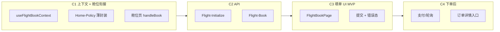

# 机票填单页迁移策略（`tmc-flight-book_ryx` → `/flight/book`）

> **Legacy 路由**：`#/tmc-flight-book_ryx`（由舱位页 / 已选行程汇总页进入）  
> **新 H5 路由（规划）**：`/flight/book`  
> **上游页面**：`/flight/:flightId/cabins`（Phase B 已完成）  
> **业务域总览**：[机票模块.md](../../ryx/机票模块.md)  
> **页面矩阵**：[PAGE-API-MATRIX.md](../PAGE-API-MATRIX.md) Wave 5  
> **列表/舱位策略**：[flight-list-migration-strategy.md](./flight-list-migration-strategy.md)  
> **Legacy 原则**：仅对照行为与 API，不照搬 Angular/Ionic 实现

---

## 1. 目标

在 H5 中交付与 Legacy **单程国内正常预订**对齐的填单链路：

```
舱位页选「预订」 → 预订上下文 → 填单页 Initialize → 用户确认 → Flight-Book → 订单详情/支付
```

**Phase B 已完成**：列表 → 舱位（`Home-Detail`）、舱位卡片、退改签弹层。  
**Phase C 交付**：让「预订」按钮真正进入填单并完成下单，而不是 `window.alert` 占位。

### 1.1 产品决策（已确认）

| 决策 | 结论 |
|------|------|
| **行程类型** | **仅单程**。Legacy ryx 国内往返在搜索页 UI 已关闭（`暂时关闭机票个人预定往返`） |
| **汇总页** | **不迁** `tmc-flight-selected-bookinfos_ryx`。舱位页点「预订」直达 `/flight/book` |
| **多人模式** | 1～N 出行人 **共用同一航班/舱位**（非「每人独立选航班」） |
| **Policy** | C1-min 先通自用路径；企业差标（`Home-Policy`）与 C2 并行，企业验收前合入 |

### 1.2 可复用能力（monorepo 已有）

| 能力 | 参考 |
|------|------|
| 填单 Hook 模式 | `useHotelInitBook` / `useHotelSubmitBook` |
| 出行人 | `usePassengerSelection(Flight)` |
| 出差单 | `useTravelForms("Flight")` |
| 支付/轮询 | `useOrderDetail` / `useOrderPays` / `usePayCreate`（酒店 Pay 页） |

---

## 2. 现状对照

| 维度 | Legacy | 新 H5 现状 |
|------|--------|------------|
| 舱位页点预订 | `onBookTicket` → Policy → `onBook` → 已选汇总页 → 填单 | ❌ `window.alert` 占位 |
| 预订上下文 | `TmcFlightService.bookInfos[]` | ⚠️ 仅有 `usePassengerSelection(Flight)`，无航段+舱位绑定 |
| 差标 Policy | `Home-Policy` + `getPolicyCabinBookInfo` | ❌ 未接 |
| 填单初始化 | `Flight-Initialize` → `InitialBookDtoModel` | ❌ API 未封装 |
| 填单 UI | `tmc-flight-book_ryx`（2200+ 行 base） | ❌ 无 `/flight/book` 路由 |
| 提交订单 | `Flight-Book` → `checkPay` → 订单详情 | ❌ |
| 10 分钟超时 | `checkIfTimeout` / `showTimeoutPop` | ⚠️ 列表/舱位有概念，填单链未串 |
| 已选汇总页 | `tmc-flight-selected-bookinfos_ryx` | ❌ **不在范围**（单程直达填单） |
| 改签填单 | `ExchangeBook` / `isExchange` | ❌ 延期 |

矩阵标注：**填单 `[ ]` API / Mock / H5 均未做**（见 PAGE-API-MATRIX Wave 5）。

---

## 3. Legacy 单程链路（对照基准）

Legacy 舱位页 `onBookTicket` 实际步骤：

1. 校验 10 分钟超时
2. 确保 `bookInfos` 有出行人（无则弹选乘客）
3. 拉 `Home-Policy`（`initFlightSegmentCabinsPolicy`）
4. `getPolicyCabinBookInfo` 为每位乘客绑定航段+舱位
5. 校验超标不可订（`isDontAllowBook`）
6. 跳转 **已选汇总页** → 用户确认 → **填单页** `initializeBookDto` → `Flight-Initialize` → 提交 `Flight-Book`

**新 H5 简化**：步骤 6 跳过汇总页，舱位页完成 1～5 的等价逻辑后直接进填单。

```mermaid
flowchart TB
  subgraph Legacy["Legacy 单程"]
    L1[舱位 onBookTicket] --> L2[Policy + bookInfo]
    L2 --> L3[selected-bookinfos]
    L3 --> L4[book Initialize]
    L4 --> L5[Book → 支付/订单]
  end

  subgraph H5["新 H5 Phase C"]
    H1[舱位 handleBook] --> H2[useFlightBookContext]
    H2 --> H3["/flight/book"]
    H3 --> H4[Initialize]
    H4 --> H5[Book → 支付/订单]
  end
```

### 3.1 Initialize payload 要点

Legacy `getInitializeBookDto` 在发请求前 **strip 大字段**（`detailResultForVerify`、`flightListResult`、`FlightFareBasics.flightAndTaxFeesInfos` 等）。新 H5 adapter 必须对齐，否则 Initialize 易失败或 payload 过大。

填单页 `initializeBookDto` 组装 `OrderBookDto.Passengers[]`：

- `ClientId` = 出行人 id
- `FlightSegments` = 选中航段
- `FlightCabin` = 选中舱位（含 Rules）
- `Credentials` / `Policy` = 来自出行人与 Policy 结果

---

## 4. 工作方式（Proxy 优先，Mock 最后）

与列表/舱位/出行人模块一致：

```
Legacy 行为对照 → Gap 清单 → API 封装（Proxy 抓包金标准）
  → H5 增量 → Proxy 验收 → Mock 对齐 → 更新矩阵
```

| 阶段 | 环境 | 目的 |
|------|------|------|
| 联调 | `VITE_API_MODE=proxy` | Initialize/Book 以 Legacy Network 为金标准 |
| 离线 | `mock` | **最后**用 Proxy 实测补 fixture |
| CI | `mock` | 稳定 fixture + Vitest |

**验收顺序**：

1. Proxy：选同条件舱位 → Initialize 200 → 填单页字段与 Legacy 可比  
2. Proxy：提交 Book → 拿到 `OrderId` / `TradeNo`  
3. Mock：复现相同 UI 状态  

---

## 5. 职责拆分（Phase C 子阶段）

避免一次搬完 `tmc-flight-book_ryx.base.page.ts`（2200+ 行）。



### C1 — 预订上下文 + 舱位「预订」打通

- [ ] `useFlightBookContext`（`sessionStorage` + hook）
  - 写入：选中 `FlightFare` + `FlightSegment` + cabins query 快照
  - 读取：填单页组装 `OrderBookDto`
  - 无 selection 时 redirect 回 cabins/list
- [ ] `FlightCabinsPage.handleBook`：超时校验 →（可选 Policy）→ `setSelection` → `navigate("/flight/book")`
- [ ] **C1-min**：Policy 失败时 agent 可继续、普通用户拦截（对齐 Legacy `isAgent`）
- [ ] **C1-full**：`Home-Policy` + `getPolicyCabinBookInfo` 等价逻辑（企业差标、违标 Rules）

### C2 — API 层

- [ ] `@ryx/shared-types`：`FlightInitBookParams`、`FlightInitBookResponse`、`FlightBookParams`、`FlightBookResponse`
- [ ] `packages/api`：扩展 `FlightApi` 或 `createFlightBookApi`
  - `initializeBook(params)` → `TmcApiBookUrl-Flight-Initialize`
  - `submitBook(params)` → `TmcApiBookUrl-Flight-Book`
- [ ] Initialize payload adapter：对齐 Legacy strip 逻辑
- [ ] Method 常量已在 `packages/api/src/methods/book.ts`（`FLIGHT_INITIALIZE` / `FLIGHT_BOOK`）
- [ ] Proxy 单测 + KN5977 等实测 fixture

### C3 — 填单页 UI（MVP）

- [ ] 路由：`/flight/book`（`routes.tsx`）
- [ ] `FlightBookPage` + `useFlightInitBook` / `useFlightSubmitBook`
- [ ] **MVP 必显**：
  - 航班摘要（时间/机场/舱位/价格）
  - 出行人（context + `usePassengerSelection`）
  - 联系人（姓名/手机，默认可取自首个出行人）
  - 出差单（可选，`useTravelForms("Flight")`）
  - 底部总价 +「提交订单」
- [ ] **MVP 明确不做**（Legacy 有、Phase C 不处理）：
  - 通知语言（`MessageLang` / `IsDisplayNotifyLanguage`）
  - 服务费展示与计入合计（`ServiceFees` / `IsShowServiceFee`）
  - 授权账号查看订单（`addContacts`）
- [ ] **MVP 可后置**：保险、费用类型、审批人、购票协议 HTML、保存订单、友好提醒

### C4 — 下单后

- [ ] Book 成功 → 清 `bookContext` + `clearPassengerSelection(Flight)`
- [ ] 跳转：`/orders/flight/:orderId`（页未迁则临时 `/orders?tab=flight` + toast）
- [x] 支付：复用 `pay.getTotalPayAmount` / `getOrderPays` / `create` / `process` → [flight-pay-migration-strategy.md](./flight-pay-migration-strategy.md)

---

## 6. 状态设计

Legacy 用 `TmcFlightService.bookInfos[]` 贯穿列表→舱位→填单。新 H5 **不**搬 god service。

| 状态 | 存放 | 说明 |
|------|------|------|
| 搜索条件 | URL query | 已有（list/cabins） |
| 已选出行人 | `usePassengerSelection(Flight)` | 已有 |
| **选中舱位 + 航段** | `useFlightBookContext` | **Phase C 新增** |
| Policy 结果 | context 或 Initialize 返回 | C1-full |
| Initialize 结果 | mutation cache | 填单页 |
| 填单表单草稿 | 页面 `useState` | 联系人等 |

### 6.1 `FlightBookSelection`（草案）

```ts
interface FlightBookSelection {
  cabinsQuery: FlightCabinsQuery;
  segment: FlightSegment;
  fare: FlightFare;
  detailSnapshot?: FlightDetailResult;
  selectedAt: number;
}
```

舱位页 `handleBook(fare)` → `setFlightBookSelection({…})` → `navigate("/flight/book")`。

---

## 7. 与酒店填单对照

| 能力 | 酒店（已有） | 机票 Phase C |
|------|--------------|--------------|
| Initialize | `hotel.initBook` | `flight.initializeBook` |
| Submit | `hotel.submitBook` | `flight.submitBook` |
| 出行人 | `toHotelBookPassenger` | `toFlightBookPassenger`（或 inline DTO） |
| 出差单 | `useTravelForms("Hotel")` | `useTravelForms("Flight")` |
| 结果页 | `/hotel/result/:orderId` | `/orders/flight/:id`（待建） |
| Hook | `useHotelInitBook` / `useHotelSubmitBook` | `useFlightInitBook` / `useFlightSubmitBook` |

---

## 8. 执行顺序

### 8.1 第 0 步：对照与抓包

1. Legacy Proxy：单程 1 人，选 KN5977 Z 舱 → 填单 → 抓 **Initialize / Book** 请求体与响应  
2. 读 Legacy：
   - `tmc-flight-item-cabins_ryx.base.page.ts`（`onBookTicket` / `onBook`）
   - `tmc-flight-book_ryx.base.page.ts`（`initializeBookDto` / `bookFlight`）
   - `tmc-flight.service.ts`（`getInitializeBookDto` / `getPolicyCabinBookInfo`）
3. 输出 Gap 表补入 §2

### 8.2 推荐 PR 切分

| PR | 内容 | 验收 |
|----|------|------|
| **PR-1** | C1-min + C2 + 舱位跳转 | Proxy：舱位 → book 页，Initialize 200 |
| **PR-2** | C3 MVP UI + 提交 | Proxy：完整下单拿到 OrderId |
| **PR-3** | C4 下单后 + Mock fixture | mock 可跑通；CI 绿 |
| **PR-4** | C1-full Policy | 企业账号差标/违标与 Legacy 可比 |

### 8.3 文档同步

- 更新 [PAGE-API-MATRIX.md](../PAGE-API-MATRIX.md) 填单行  
- 更新 [机票模块.md §6](../../ryx/机票模块.md#6-与新-monorepo-对照)  

---

## 9. MVP 边界（Phase C v1）

**包含**：

- 单程、国内、1～N 出行人（同一航班/舱位）
- 舱位页 → 填单 → `Flight-Initialize` → `Flight-Book`
- 出行人 + 联系人 + 可选出差单
- Proxy 真环境可下单（测试环境至少 1 条航线验通）

**不包含**：

- **往返**（已确认不做）
- 改签、`selected-bookinfos` 汇总页
- 多人按乘客分别选不同航班
- Policy 完整色标/审批链、保险、保存订单、NDC 协议弹层
- **通知语言、服务费、授权账号查看订单**（填单页不展示、DTO 不传 `MessageLang`）
- 机票订单详情页完整 UI（可先用订单列表兜底）

---

## 10. 风险与对策

| 风险 | 对策 |
|------|------|
| Initialize payload 过大 | 严格 port Legacy strip 逻辑 |
| Policy 未接导致企业账号无法订 | C1-min 先通自用；C1-full 并行 |
| `OrderBookDto` 字段繁 | 先 port 最小 Passengers 结构，报错缺字段再增量 |
| 10 分钟超时 | cabins → book 跳转前校验；submit 前再验 |
| 填单页复杂度 | MVP 只实现 Legacy **80% 用户路径** |

---

## 11. 关键文件索引

| 用途 | Legacy | 新 H5 |
|------|--------|-------|
| 舱位预订 | `tmc-flight-item-cabins_ryx.base.page.ts` | `FlightCabinsPage.tsx` |
| 填单 | `tmc-flight-book_ryx.base.page.ts` | `FlightBookPage.tsx`（待建） |
| Service | `tmc-flight.service.ts` | `useFlightBookContext` + `@ryx/api` |
| 酒店参考 | — | `HotelBookPage.tsx`, `useHotelBook.ts` |
| API Method | `packages/api/src/methods/book.ts` | 待扩 `apis/flight-book.ts` |
| 出行人 | — | `usePassengerSelection`, [passenger-module-design.md](./passenger-module-design.md) |

---

## 12. 已拍板

| 决策 | 结论 |
|------|------|
| **单程 vs 往返** | **仅单程**；往返、`selected-bookinfos`、双段 `bookInfos` 均不在 Phase C 及近期规划内 |
| **汇总页** | **跳过**；舱位直达 `/flight/book` |
| **Policy 与填单 UI** | API + context 先通（C1-min）；Policy 与企业 UI 与 C2 并行 |

**执行路径**：单程舱位直达填单 + C1-min 先通 Proxy 自用路径 → C3 MVP → C4 下单后 → C1-full Policy。
