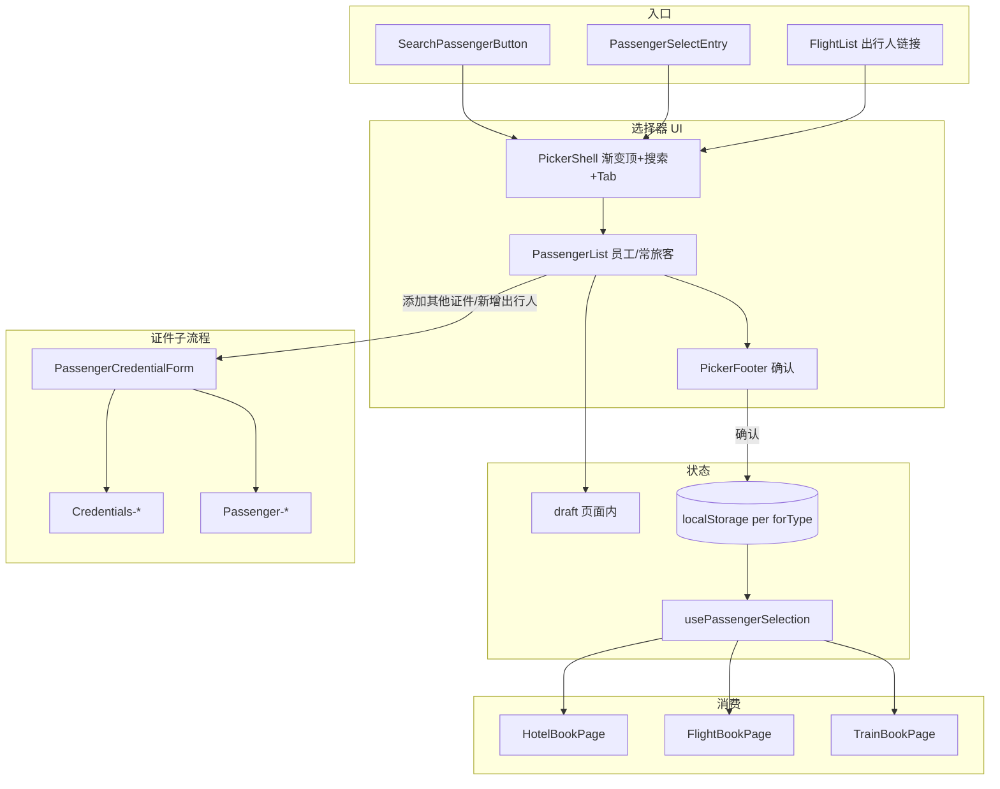
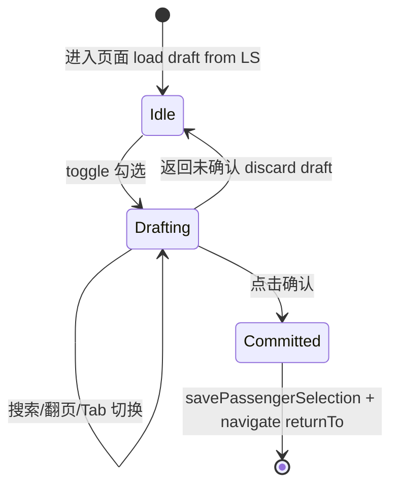

# 出行人模块 — 技术方案（H5）

> **业务域文档**：[passenger.md](./passenger.md)  
> **UI 规范**：[picker-design-system.md](../../h5/ui/picker-design-system.md)  
> **设计稿**：机票 — 选择出行人 — 公司员工（与 CityPicker 同系渐变 + 搜索条）

---

## 1. 目标与范围

### 1.1 目标

在 H5 中交付与 Legacy `tmc-select-passenger_ryx` 行为对齐、与 **CityPicker 视觉同系** 的出行人模块，覆盖：

- 多选出行人（按 `forType` 隔离）
- 公司员工 / 非公司员工双 Tab
- 证件维度选择、校验、持久化
- 预订各流程消费（酒店 → 机票 → 火车）
- 证件维护 / 新增常旅客（分阶段）
- 生命周期清理（下单成功、登出）

### 1.2 范围外（本方案 Phase 3+）

- 国际机票 Policy / 国籍选择
- 出差单内出行人带入（依赖 Wave 7 出差单）
- `/me/credentials` 个人中心证件列表（复用表单组件，独立入口）

---

## 2. 总体架构



### 2.1 分层

| 层 | 职责 | 路径 |
|----|------|------|
| Page | 路由、query、draft、确认返回 | `pages/passenger/` |
| Picker UI | 视觉壳层、Tab、底栏 | `components/search/PickerShell` + `components/passenger/*` |
| 业务逻辑 | 勾选规则、证件过滤 | `lib/passenger-select-logic.ts` |
| 持久化 | localStorage、事件 | `lib/passenger-selection.ts` |
| 数据 | React Query 列表 | `hooks/usePassenger.ts` |
| API | Staff / Passenger / Credentials | `packages/api` |
| 类型 | ProductType、规则 | `packages/shared-types/src/passenger.ts` |

---

## 3. UI 方案（对齐 CityPicker）

> 细节见 [picker-design-system.md](../../h5/ui/picker-design-system.md)

### 3.1 页面结构重构

**现状**：`PassengerSelectPage` 使用蓝色 `AppHeader` + 普通 input + shadcn Button。  
**目标**：全屏 **PickerShell**（与 `CityPicker` 相同渐变顶栏 + 圆角搜索条），路由页 `fixed inset-0` 或 overlay 等价体验。

```
PassengerSelectPage
├── PickerShell
│   ├── title="选择出行人"
│   ├── searchPlaceholder="请输入姓名、手机号"
│   ├── tabs=[公司员工, 非公司员工]   // allowExternal
│   ├── body
│   │   ├── ExternalAddButton         // 仅非员工 Tab
│   │   ├── EmployeePassengerCard[]
│   │   └── ExternalPassengerCard[]
│   └── footer
│       └── PassengerPickerFooter     // 已选 N 人 + 确认（或设计稿单按钮）
├── SelectedPassengersSheet
└── （Phase 2）CredentialFormSheet / 子路由
```

### 3.2 员工卡片（对齐设计稿）

| 能力 | 现状 | 目标 |
|------|------|------|
| 布局 | `rounded-lg border` 通用 card | `rounded-xl shadow-sm bg-white mx-4` |
| 选择 | 方形 checkbox | **圆形** 选中态 `#5099fe` |
| 部门/证件/手机 | 有 | 字号颜色对齐 Token |
| 添加其他证件 | 无 | 链到证件表单 `staffId` |
| 其他证件展开 | 有，无编辑删除 | 展开 + **编辑/删除** 图标 |
| 缺证件 | disabled checkbox | + toast「请先维护证件信息」 |

### 3.3 非员工 Tab

| 元素 | 行为 |
|------|------|
| 顶部按钮「新增出行人」 | `navigate` → `/passenger/credential?mode=external&addNew=1&returnTo=...` |
| 列表行 | 同员工主行样式 + 行内编辑/删除 |
| API | `Passenger-Add/Modify/Remove`（`noEmFlag`） |

### 3.4 提取 PickerShell（与城市复用）

```typescript
// components/search/PickerShell.tsx（新建）

interface PickerShellProps {
  title: string
  searchPlaceholder: string
  keyword: string
  onKeywordChange: (v: string) => void
  onBack: () => void
  tabs?: { key: string; label: string }[]
  activeTab?: string
  onTabChange?: (key: string) => void
  footer?: ReactNode
  children: ReactNode
}
```

**Refactor 计划**：`CityPicker` 与 `PassengerSelectPage` 均改用 `PickerShell`，避免渐变/搜索条 duplication。

---

## 4. 路由设计

| 路由 | 页面 | 说明 |
|------|------|------|
| `/passenger/select` | `PassengerSelectPage` | 已有；`forType`, `returnTo` |
| `/passenger/credential` | `PassengerCredentialPage` | Phase 2；证件新增/编辑 |
| `/me/credentials` | `MemberCredentialListPage` | Phase 3；个人中心，复用表单 |

### 4.1 `/passenger/credential` Query

| 参数 | 说明 |
|------|------|
| `mode` | `external` \| `staff` \| `self` |
| `staffId` | 员工添加其他证件 |
| `passengerId` | 编辑常旅客 |
| `addNew` | `1` 新建 |
| `returnTo` | 保存后返回（encode URI） |

保存 API 分支见 [passenger.md §6.6](./passenger.md#66-证件维护出行人-vs-个人信息)。

---

## 5. 数据流与状态

### 5.1 选择页状态机



### 5.2 Hook 契约

```typescript
// 已有 — 保持不变
usePassengerSelection(forType: ProductType): {
  selected: PassengerBookInfo[]
  setSelected: (items: PassengerBookInfo[]) => void
}

// 待增强
useAllowExternalPassengers(): boolean  // 接 TMC AllowAddingNonTmcUser

// Phase 2
usePassengerCredentialForm(mode, ids): { save, remove, ... }
```

### 5.3 列表查询

| Tab | queryKey | API | 分页 |
|-----|----------|-----|------|
| 员工 | `['passenger','staff', keyword]` | `getStaffList` | infinite 20 |
| 非员工 | `['passenger','external', keyword]` | `getPassengerList` | infinite 20 |

搜索：debounce 300ms，与 Legacy `ion-searchbar debounce="300"` 一致。

---

## 6. 业务规则（不变更）

沿用 `packages/shared-types/src/passenger.ts` + `passenger-select-logic.ts`：

- `blockedCredentialTypes(forType)`
- `maxPassengersForProduct(forType)` — **火车需改为 5**（Legacy 对齐）
- 同 `AccountId` 单证件、credentialKey 去重
- 非员工 `isNotWhitelist: true`

详见 [passenger.md §6](./passenger.md#6-选择规则)。

---

## 7. 生命周期集成

在以下节点调用 `clearPassengerSelection(forType)` / `clearAllPassengerSelections()`：

| 节点 | 产品 | 文件（计划） |
|------|------|--------------|
| 酒店下单成功 | Hotel | `HotelResultPage` / submit 回调 |
| 机票下单成功 | Flight | `FlightBookPage` |
| 火车下单成功 | Train | `TrainBookPage` |
| 登出 | 全部 | `auth` / session 清除处 |
| 出差单重选 | 全部 | 各 SearchPage（Phase 3） |

详见 [passenger.md §8](./passenger.md#8-生命周期管理)。

---

## 8. API 扩展（Phase 2）

| 能力 | Method | 封装 |
|------|--------|------|
| 员工证件列表 | `Staff-Credentials` | `passenger.getStaffCredentials(staffId)` |
| 员工证件增改删 | `Credentials-Add/Modify/Remove` | `credentialsApi.*`（带 `StaffId`） |
| 常旅客增改删 | `Passenger-*` | 已有 `addPassenger` / `removePassenger` + 待封装 `modifyPassenger` |
| TMC 配置 | `getTmc()` | `AllowAddingNonTmcUser` |

---

## 9. 组件清单与职责

| 组件 | 职责 | Phase |
|------|------|-------|
| `PickerShell` | 渐变顶、搜索、Tab 槽、footer 槽 | 1 |
| `PassengerSelectPage` | 路由页、draft、queries | 1（ refactor UI） |
| `EmployeePassengerCard` | 员工主证件 + 展开 + 操作 | 1 |
| `ExternalPassengerCard` | 常旅客行 | 1 |
| `PassengerAddExternalButton` | 新增出行人 | 2 |
| `PassengerPickerFooter` | 已选 N 人 + 确认 | 1 |
| `SelectedPassengersSheet` | 已选列表预览/移除 | 1 |
| `PassengerCredentialForm` | 共用证件表单 fields | 2 |
| `PassengerCredentialPage` | 表单页 + API 分支 | 2 |
| `SearchPassengerButton` | Header 入口 + badge | 已有 |
| `PassengerSelectEntry` | 填单嵌入入口 | 已有 |

---

## 10. 实施分期

### Phase 1 — UI 对齐 + 核心选择（当前迭代）

- [ ] 抽取 `PickerShell`，`PassengerSelectPage` 改用渐变 + 搜索条
- [ ] 员工/非员工 Tab 改为胶囊 Segment（设计稿）
- [ ] `EmployeePassengerCard` / `ExternalPassengerCard` 视觉对齐 Token
- [ ] 圆形多选控件；底栏主按钮 `#5099fe`
- [ ] 火车 `maxPassengers` 改为 5
- [ ] 酒店下单成功 `clearPassengerSelection(Hotel)`

**交付标准**：与设计稿 / CityPicker 并排对比视觉一致；酒店链端到端不变。

### Phase 2 — 证件与常旅客维护

- [ ] `/passenger/credential` 路由 + `PassengerCredentialForm`
- [ ] 非员工：新增出行人、编辑、删除
- [ ] 员工：添加其他证件、编辑/删除其他证件
- [ ] API：`Staff-Credentials`、`Passenger-Modify`、Credentials 封装
- [ ] `useAllowExternalPassengers` 接 TMC 配置

### Phase 3 — 预订消费 + 生命周期

- [ ] `FlightBookPage` / `TrainBookPage` 读取 `usePassengerSelection`
- [ ] 机票/火车下单成功清理
- [ ] 登出 `clearAllPassengerSelections`
- [ ] 出差单带入（先清后写）

### Phase 4 — 个人中心（可选）

- [ ] `/me/credentials` 列表 + 复用 `PassengerCredentialForm`（`mode=self`）

---

## 11. 文件变更计划

```
apps/h5/src/
  components/search/
    PickerShell.tsx                 # 新建
    CityPicker.tsx                  # refactor 使用 PickerShell
  components/passenger/
    PassengerSegmentTabs.tsx        # 新建
    PassengerPickerFooter.tsx       # 新建
    PassengerAddExternalButton.tsx  # Phase 2
    EmployeePassengerCard.tsx       # 改版
    ExternalPassengerCard.tsx       # 从 NonEmployeePassengerRow 演进
    PassengerCredentialForm.tsx     # Phase 2
    PassengerSelectCircle.tsx       # 圆形 checkbox 控件
  pages/passenger/
    PassengerSelectPage.tsx         # refactor
    PassengerCredentialPage.tsx     # Phase 2
  lib/
    passenger-selection.ts          # + clearAllPassengerSelections
  hooks/
    usePassenger.ts                 # + useStaffCredentials, TMC config

packages/api/src/
  apis/passenger.ts                 # + getStaffCredentials, modifyPassenger
  apis/credentials.ts               # Phase 2 可选独立模块
```

---

## 12. 测试要点

| 场景 | 验证 |
|------|------|
| UI | 渐变顶、搜索条、Tab、卡片与 CityPicker 同系 |
| 多选 | 上限、证件类型过滤、同账号替换 |
| draft | 返回不保存、确认写入 LS |
| forType | 机/酒/火互不影响 |
| 生命周期 | 酒店下单后 LS 清空 |
| 证件表单 | 三支 API 分支 mock 覆盖 |
| 非员工 Tab | 配置 false 时隐藏 |

---

## 13. 相关文档

| 文档 | 说明 |
|------|------|
| [passenger.md](./passenger.md) | 业务规则、API、生命周期、证件分支 |
| [picker-design-system.md](../../h5/ui/picker-design-system.md) | UI Token、布局、组件样式 |
| [PAGE-API-MATRIX.md](../PAGE-API-MATRIX.md) | Wave 7 进度 |
