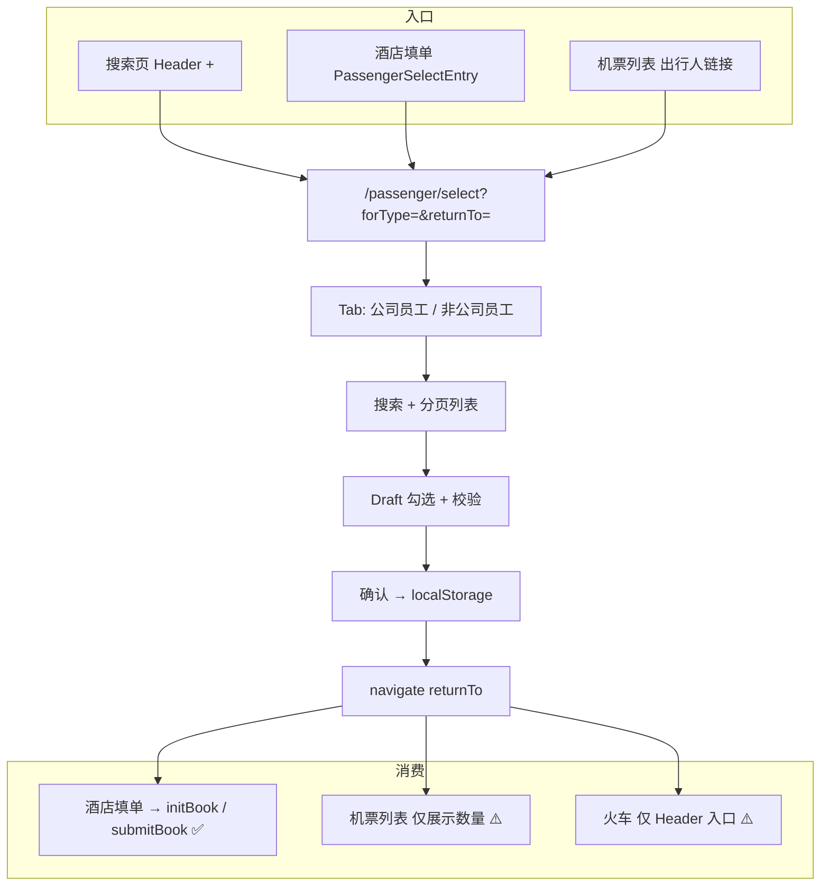
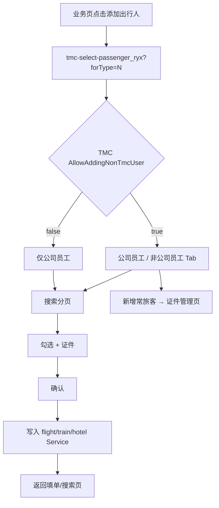
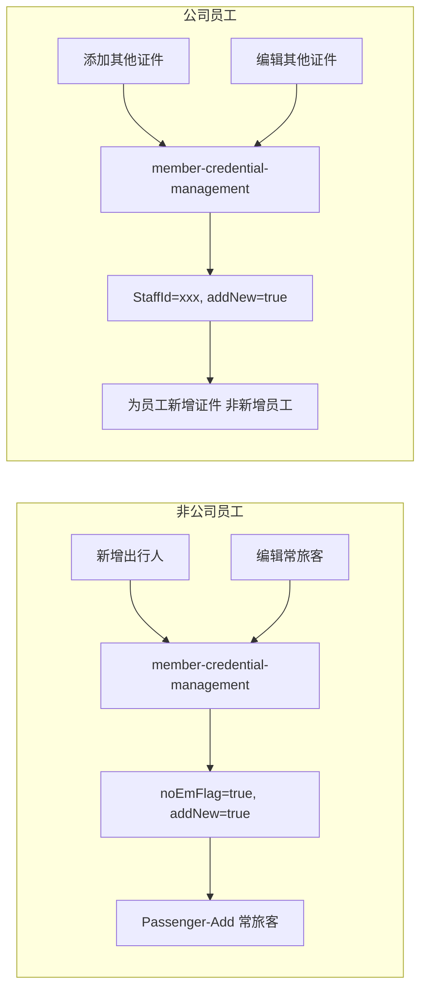
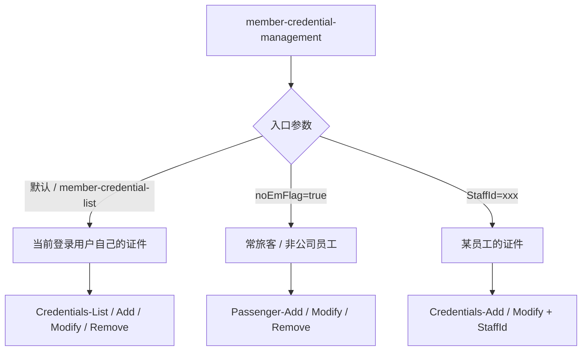
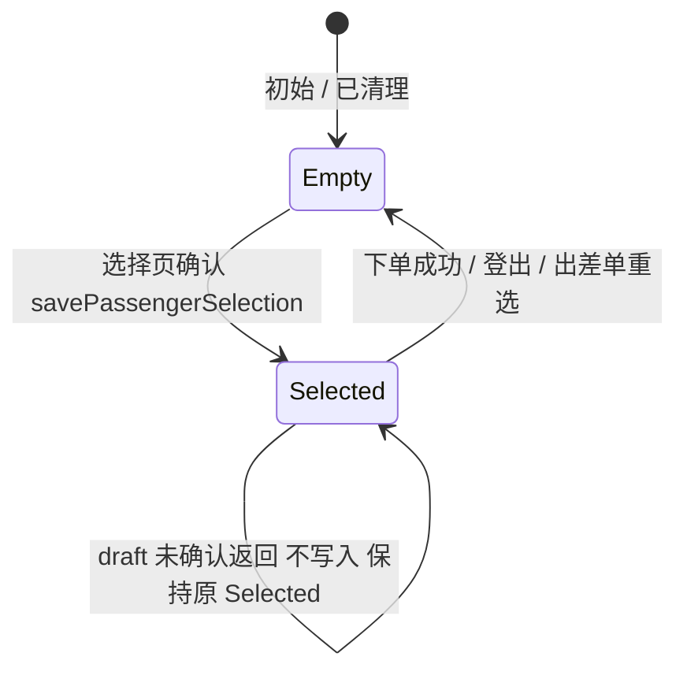

# 出行人模块（S4 / Wave 7）

> 页面矩阵：[PAGE-API-MATRIX.md](../PAGE-API-MATRIX.md) · Wave 7 出差 + 常旅客  
> Legacy 入口：[tmc-select-passenger_ryx](http://app.rtesp.com/rl/#/tmc-select-passenger_ryx?forType=3)（`forType` 见下文）  
> 源码参考：`beeantmobile-main/projects/ryx/src/app/tmc/tmc-select-passenger_ryx/`  
> **技术方案**：[passenger-module-design.md](./passenger-module-design.md)  
> **UI 规范**：[picker-design-system.md](../../h5/ui/picker-design-system.md)（与 CityPicker 同系）

## 1. 模块定位

出行人模块是 **机票 / 酒店 / 火车** 等预订流程共用的子系统，负责：

1. 从 **公司员工**（`Staff-List`）、**常旅客 / 非员工**（`Passenger-List`）池中 **搜索与分页加载** — 两类人员来源不同，「新增出行人」仅指后者
2. 按产品类型（`forType`）应用 **证件过滤、人数上限、去重规则**
3. 用户确认后将「人 + 证件」写入 **持久化存储**
4. 填单 / 下单页 **读取已选出行人** 并提交给后端

Legacy 通过各产品线 Service（`TmcFlightService`、`TmcTrainService`、`TmcHotelRyxService` 等）保存状态；新 H5 使用 **按 `ProductType` 分 key 的 localStorage** + React 订阅同步。

---

## 2. 路由与入口

### 2.1 Legacy

| 项 | 值 |
|----|-----|
| 路由 | `#/tmc-select-passenger_ryx` |
| 核心参数 | `forType` — 对应 `FlightHotelTrainType` |
| 示例 | `?forType=3` → 火车场景选择出行人 |

### 2.2 新 H5

| 项 | 值 |
|----|-----|
| 路由 | `/passenger/select` |
| 参数 | `forType`（必填）、`returnTo`（确认后返回路径，默认 `/home`） |
| 示例 | `/passenger/select?forType=3&returnTo=/train` |

### 2.3 业务入口一览

| 业务 | 入口组件 | 路径 / 场景 |
|------|----------|-------------|
| 机票搜索 | `SearchPassengerButton` | `/flight` Header「+」 |
| 机票列表 | 工具栏链接 | `/flight/list`「出行人(N)」 |
| 酒店搜索 | `SearchPassengerButton` | `/hotel` Header「+」 |
| 酒店填单 | `PassengerSelectEntry` | `/hotel/:hotelId/book`「选择入住人」 |
| 火车搜索 | `SearchPassengerButton` | `/train` Header「+」 |

---

## 3. `forType` / `ProductType`

与 Legacy `FlightHotelTrainType` 一一对应，定义于 `packages/shared-types/src/passenger.ts`。

| 值 | 枚举 | 产品 | 最多可选 | 禁用证件类型 |
|----|------|------|----------|--------------|
| 1 | `Flight` | 机票 | 9 | 港澳通行证、台湾通行证、台胞证、居住证 |
| 2 | `Hotel` | 酒店 | 3 | 无 |
| 3 | `Train` | 火车 | 5（Legacy / H5 已对齐） | 港澳通行证、台湾通行证、台胞证 |
| 4 | `HotelInternational` | 国际酒店 | 3（Legacy 填单逻辑有 1 人限制分支） | 身份证 |
| 5 | `InternationalFlight` | 国际机票 | 9 | 身份证（另有国籍、Policy 等 Legacy 逻辑） |
| 6 | `RentalCar` | 租车 | 9（默认） | 无 |

`forType` 影响：

- localStorage key：`ryx_passenger_selection_{forType}`
- 证件可选范围：`blockedCredentialTypes(forType)`
- 人数上限：`maxPassengersForProduct(forType)`
- UI 副标题：`PRODUCT_TYPE_LABEL[forType]`

H5 当前仅接入 **机票(1)、酒店(2)、火车(3)**；国际/租车类型在类型层已定义，页面未接。

---

## 4. 架构与文件地图

> UI 目标结构见 [passenger-module-design.md §3](./passenger-module-design.md#3-ui-方案对齐-citypicker)；共用 Picker 视觉见 [picker-design-system.md](../../h5/ui/picker-design-system.md)。

### 4.1 当前实现

```
apps/h5/src/
├── pages/passenger/PassengerSelectPage.tsx   # 主选择页
├── components/passenger/
│   ├── EmployeePassengerCard.tsx             # 员工（多证件展开）
│   ├── NonEmployeePassengerRow.tsx           # 常旅客行
│   ├── PassengerSelectEntry.tsx              # 填单内嵌入口
│   ├── SelectedPassengersSheet.tsx           # 已选底部 Sheet
│   └── index.ts
├── components/search/SearchPassengerButton.tsx
├── hooks/usePassenger.ts                     # 列表 + 已选 hook
├── lib/passenger-select-logic.ts             # 勾选校验
└── lib/passenger-selection.ts                # 持久化、URL 构建

packages/
├── shared-types/src/passenger.ts             # 类型、枚举、规则函数
├── api/src/apis/passenger.ts                 # API 封装
├── api/src/methods/passenger-flow.ts         # Method 常量
└── mock/src/handlers/passenger.ts            # Mock
```

### 4.2 目标增量（Phase 1–2）

```
components/search/PickerShell.tsx             # 渐变顶+搜索条（City/Passenger 共用）
components/passenger/PassengerSegmentTabs.tsx
components/passenger/PassengerPickerFooter.tsx
components/passenger/PassengerCredentialForm.tsx
pages/passenger/PassengerCredentialPage.tsx    # /passenger/credential
```

---

## 5. 用户流程

### 5.1 总览



### 5.2 Legacy 对照流程



### 5.3 Draft 与确认

选择页内修改的是 **draft** 状态；仅点击「确认」才调用 `setSelected` → `savePassengerSelection`。直接返回（Header 返回）**不保存** draft 变更，行为与 Legacy「未确认即丢弃」一致。

---

## 6. 选择规则

实现：`apps/h5/src/lib/passenger-select-logic.ts`  
类型规则：`packages/shared-types/src/passenger.ts`

### 6.1 勾选（toggle on）

| 规则 | 说明 |
|------|------|
| 证件类型 | 当前 `forType` 下 `blockedCredentialTypes` 内的类型不可选 |
| 证件号 | 无 `Number` 且无 `HideNumber` 时不可选，提示「请先维护证件信息」 |
| 去重 | 同一 `credentialKey`（`Number:Type`）不可重复 |
| 同账号 | 同一 `AccountId` 只保留一个证件（新选替换旧选） |
| 人数上限 | 超过 `maxPassengersForProduct` 时提示「最多选择 N 位出行人」 |

### 6.2 员工多证件

- 主证件：卡片主行 checkbox
- 其他证件：展开「其他证件 (N)」后分别勾选
- 可选证件列表：`staffSelectableCredentials(staff, forType)`
- Legacy 还可 **「添加其他证件」** 为员工补新证件 — 这是证件维护，不是「新增出行人」（见 [§6.5](#65-新增出行人与证件维护)）

### 6.3 常旅客（非员工）

- 数据来源：`ApiMemberUrl-Passenger-List`
- 勾选时 `isNotWhitelist: true`（Legacy `NOT_WHITE_LIST`）；H5 下游暂未消费该标记
- **「新增出行人」仅出现在本 Tab** — 见 [§6.5](#65-新增出行人与证件维护)

### 6.4 确认校验

- 至少选择 1 人，否则「请至少选择一位出行人」

### 6.5 新增出行人与证件维护

Legacy 选择页（`tmc-select-passenger_ryx`）对 **公司员工** 与 **非公司员工** 的能力不同，不可混为一谈。

#### 对照表

| 操作 | 公司员工 Tab | 非公司员工 Tab |
|------|--------------|----------------|
| **新增出行人** | ❌ 无此入口 | ✅ 「新增出行人」按钮 |
| 人员来源 | `Staff-List`（组织已有员工，只搜选） | `Passenger-List`（常旅客库） |
| 添加证件 | ✅ 「添加其他证件」（针对**已有**员工） | —（新建人即带证件） |
| 编辑 / 删除证件 | ✅ 展开其他证件后可编辑、删除 | ✅ 列表行内编辑、删除常旅客 |
| Tab 显隐 | 始终有 | 受 `AllowAddingNonTmcUser` 控制 |

**结论**：文案「新增出行人」在 Legacy 中 **专指新增非公司员工（常旅客）**；公司员工不能在页面上「新增人」，只能从 HR 员工池勾选，或为已有员工 **补证件**。

#### Legacy 跳转



| Legacy 方法 | 场景 | 目标路由参数 |
|-------------|------|--------------|
| `handleNoEmAdd()` | 非员工 · **新增出行人** | `noEmFlag=true`, `addNew=true` |
| `handelNoEmCreEdit()` | 非员工 · 编辑 | `noEmFlag=true`, `data=...` |
| `handleNoEmCreRemove()` | 非员工 · 删除 | `Passenger-Remove` |
| `handleAddOtherCre(staffId)` | 员工 · **添加其他证件** | `StaffId`, `addNew=true` |
| `handelOtherCreEdit()` | 员工 · 编辑其他证件 | `data=...`（含 `StaffId`） |
| `handleOtherCreRemove()` | 员工 · 删除其他证件 | 员工证件 API |

源码：`tmc-select-passenger_ryx.base.page.ts`（注释 `// 非公司员工-新增出行人`、`// 公司员工-添加其他证件`）。

#### 新 H5 现状与实现约定

| 能力 | H5 |
|------|-----|
| 勾选公司员工 / 常旅客 | ✅ 选择页双 Tab |
| **新增出行人**（常旅客） | ❌ 无按钮；`addPassenger()` 已封装 |
| 编辑 / 删除常旅客 | ❌ |
| 员工「添加其他证件」 | ❌ 选择页仅展开已有 `Credentials[]` |
| 非员工 Tab 配置 | ⚠️ `useAllowExternalPassengers()` 写死 `true` |

**H5 后续实现须与 Legacy 一致**：

1. 「新增出行人」按钮只放在 **非公司员工** Tab，对接 `addPassenger` / 证件管理页。
2. 公司员工 Tab **不提供**「新增出行人」；如需补证件，走 `Staff-Credentials` 或跳转证件管理（`StaffId`），不改变人员池来源。
3. `AllowAddingNonTmcUser === false` 时隐藏非员工 Tab，同时隐藏「新增出行人」入口。

### 6.6 证件维护：出行人 vs 个人信息

> **常见问题**：出行人里的证件维护，和个人中心「我的证件」是同一功能吗？

#### 总结

**不完全是同一套，但 Legacy 共用同一个编辑页和表单。**

| 层面 | 是否相同 | 说明 |
|------|----------|------|
| **编辑页面 / 表单 UI** | ✅ 相同 | 均进入 `member-credential-management`，共用 `CredentialsComponent` |
| **后端 API / 数据对象** | ❌ 分三条线 | 取决于入口参数、维护的是谁 |

**怎么理解：**

- **看起来一样** — 都是同一套证件表单（类型、姓名、号码、有效期等）。
- **本质上不同** — 存到哪里、调哪个接口、维护的是谁，按场景分三支：

| 分支 | 场景 | 维护对象 | API 域 |
|------|------|----------|--------|
| ① | 个人信息 · **我的证件** | 当前登录用户本人 | `Credentials-List/Add/Modify/Remove` |
| ② | 出行人 · **非公司员工**（「新增出行人」） | 常旅客 | `Passenger-Add/Modify/Remove`（`noEmFlag=true`） |
| ③ | 出行人 · **员工「添加其他证件」** | 指定员工（本人或同事） | `Credentials-Add/Modify` + `StaffId`；列表用 `Staff-Credentials` |

**H5 实现**：可复用 **同一证件表单组件**；提交时按 `self` / `noEmFlag` / `staffId` 分支调用不同 API，与 Legacy 一致。

---

#### 共用部分（Legacy）

| 项 | 说明 |
|----|------|
| 编辑页 | Legacy 均跳转 **`member-credential-management`** |
| 表单组件 | 共用 **`CredentialsComponent`**（证件类型、姓名、号码、有效期等字段） |
| 校验框架 | 同一套 `handleFormValids`；**非员工**（`noEmFlag`）校检更严（如必填手机号） |

#### 三条分支（详表）



| 场景 | 入口 | 列表 API | 增删改 API | 维护对象 |
|------|------|----------|------------|----------|
| **个人信息 · 我的证件** | `member-detail` → `member-credential-list` | `Credentials-List`（当前 `accountId`） | `Credentials-Add/Modify/Remove` | **登录用户本人** |
| **出行人 · 非公司员工** | 选择页「新增出行人」/ 编辑常旅客 | `Passenger-List` | `Passenger-Add/Modify/Remove` | **常旅客**（`noEmFlag`） |
| **出行人 · 员工其他证件** | 选择页「添加其他证件」 | `Staff-Credentials`（按员工查） | `Credentials-Add/Modify`（带 `StaffId`） | **指定员工**（可为本人或同事） |

#### 关键差异

| 维度 | 个人信息证件 | 出行人 · 非员工 | 出行人 · 员工其他证件 |
|------|--------------|-----------------|----------------------|
| 是否同一张 CRUD 表 | Credentials 域 | **Passenger 域** | Credentials 域 |
| 手机号校验 | 身份证：姓名+号码；护照等更全 | **非员工额外必填 Mobile** | 与证件管理一致，身份证不要求 Mobile |
| 与选择页关系 | 独立「我的」模块 | 维护后直接出现在常旅客 Tab | 维护后出现在该员工 `Credentials[]` |
| H5 路由规划 | `/me/credentials`（P2，未做） | 选择页非员工 Tab 跳转 | 选择页员工「添加其他证件」 |

#### 结论对照

| 问题 | 答案 |
|------|------|
| 表单 UI 是否同一套？ | ✅ 是 — `member-credential-management` + `CredentialsComponent` |
| API 是否同一套？ | ❌ 否 — 常旅客走 **Passenger**；本人/员工证件走 **Credentials** |
| 「我的证件」与「给员工加证件」API 是否相同？ | ⚠️ 同属 **Credentials** 族，但后者带 **StaffId**，对象可能是其他员工 |
| 非员工为何校验更严？ | `noEmFlag=true` 时常旅客 **必填手机号** 等（见 Legacy `handleFormValids` 注释） |

Legacy 源码：`member-credential-management.page.ts`（`noEmFlag` / `StaffId` / 默认三分支）、`member.service.ts`（`addCredentials` vs `noEmAddCredentials`）。

---

## 7. 持久化

| 项 | 说明 |
|----|------|
| 存储 | `localStorage` |
| Key | `ryx_passenger_selection_{ProductType}` |
| 结构 | `PassengerBookInfo[]` — `{ id, passenger, credential, isNotWhitelist? }` |
| 读取 | `loadPassengerSelection(forType)` |
| 写入 | `savePassengerSelection(forType, items)` + 派发 `ryx-passenger-selection-change` |
| 订阅 | `usePassengerSelection(forType)` — `useSyncExternalStore`，支持跨 Tab `storage` 事件 |
| 清除 | `clearPassengerSelection(forType)` — 见 [§8 生命周期管理](#8-生命周期管理) |

Legacy 各产品线独立 Service + Observable；H5 统一 localStorage，按 `forType` 隔离（机票/酒店/火车互不影响）。

**已选出行人不是全局、也不是永久有效** — 跟随「当前产品的一次预订会话」，在订单结束、换账号等节点应清空。

---

## 8. 生命周期管理

### 8.1 设计原则

| 原则 | 说明 |
|------|------|
| **按产品隔离** | 机票 / 酒店 / 火车各存一份，互不共享（与 Legacy 各 Service 一致） |
| **跟预订会话走** | 选完会跨搜索 → 列表 → 填单保留；**一单结束后应清空** |
| **非人员池** | 公司员工 / 常旅客列表是全局数据源；「已选出行人」是会话态 |
| **确认即覆盖** | 选择页点「确认」= 用 draft **整批替换** 当前 `forType` 下的已选列表 |



### 8.2 Legacy：何时清理（`removeAllBookInfos`）

Legacy 状态在各产品线 **内存 Service** 中；以下为典型清空时机。

#### 下单成功后（主路径）

| 产品 | 触发位置 | 说明 |
|------|----------|------|
| 酒店 | `tmc-hotel-book_ryx` 跳转订单列表后 | 本单结束，下一单重选入住人 |
| 机票 | `tmc-flight-book_ryx` `bookFlight` 成功且 `TradeNo` 有效 | 同上 |
| 火车 | `tmc-train-book_ryx` 下单成功 | 同上 |

#### 账号 / 身份变化

各产品 Service 订阅 `identityService.getIdentitySource()`，身份切换时在 `disposal()` 内调用 `removeAllBookInfos()`（登出、换账号）。

#### 出差单（TravelForm）带入

| 场景 | 行为 |
|------|------|
| 进入搜索页，已选中含 `travelFormId` | 非改签时先 **清空**，再按出差单乘客重写 |
| 搜索前勾选出差单内出差人 | 先 **清空**，再写入出差人 |

涉及：`tmc-flight-search_ryx`、`tmc-hotel-search_ryx`、`tmc-train-search_ryx`。

#### 选择页批量确认

`tmc-select-passenger_ryx` 的 `onAddPassengerNew`：先 `handleRemoveAllPassengerBookInfos()`，再逐条 `addBookInfo`，最后返回 — 等价于 H5 的 `setSelected(draft)` 整批覆盖。

#### 其他

| 场景 | 产品 | 行为 |
|------|------|------|
| 搜索页返回首页 | 机票 | `back()` → `removeAllBookInfos()` |
| 放弃改签离开列表 | 机票 | 用户确认放弃 → 清空 |
| 移除单人 | 全部 | `removeBookInfo(info)` — **只删一人**，不全清 |

#### 通常 **不** 清理

- 搜索 ↔ 列表 ↔ 填单 同一次预订流程内跳转
- 选择页 **未点确认** 直接返回
- 仅修改城市 / 日期 / 车次重新搜索
- 选择页 Sheet 内取消勾选（仅 draft，确认后才写入）

### 8.3 新 H5：当前 vs 目标

| 场景 | Legacy | H5 当前 | 应对齐 |
|------|--------|---------|--------|
| 选择页确认 | 整批覆盖 Service | ✅ `setSelected(draft)` | — |
| 选择页返回未确认 | 不保存 | ✅ draft 丢弃 | — |
| 同流程搜索↔填单 | 保留 | ✅ 保留 | — |
| 酒店下单成功 | ✅ 清空 | ❌ 未调用 `clearPassengerSelection` | ✅ |
| 机票 / 火车下单成功 | ✅ 清空 | ❌ 填单未接 | ✅ |
| 登出 / 换账号 | ✅ `disposal()` | ❌ 未接 | ✅ |
| 出差单带入 | ✅ 先清再写 | ❌ 未接 | ✅ |

**现状**：`clearPassengerSelection(forType)` 已导出，**尚无调用点**；localStorage 会保留到用户改选或清浏览器数据。

### 8.4 H5 目标接入点（待实现）

| 接入位置 | 调用 | 对齐 Legacy |
|----------|------|-------------|
| 酒店提交成功 / 结果页 | `clearPassengerSelection(ProductType.Hotel)` | hotel-book → 订单列表 |
| 机票填单提交成功 | `clearPassengerSelection(ProductType.Flight)` | flight-book |
| 火车填单提交成功 | `clearPassengerSelection(ProductType.Train)` | train-book |
| 登出 / session 清除 | 清空 Flight + Hotel + Train 三个 key | Service `disposal()` |
| 出差单搜索（接入后） | 先 `clear*` 再写入出差人 | search_* + travelForm |

建议扩展 `clearAllPassengerSelections()` 供登出一次性清理；清除时需派发 `ryx-passenger-selection-change` 以更新 Header 角标。

### 8.5 与「常旅客库」的边界

| 数据 | 生命周期 | 存储 |
|------|----------|------|
| 员工 / 常旅客 **列表** | 长期有效，随 API 刷新 | 服务端 + React Query |
| **已选出行人** | 单次预订会话（或至下次整批覆盖） | Legacy：内存 Service；H5：localStorage 按 `forType` |

---

## 9. API

### 9.1 已封装（`@ryx/api` → `getApi().passenger`）

| 用途 | Method | H5 方法 | 选择页 |
|------|--------|---------|--------|
| 公司员工列表 | `TmcApiHomeUrl-Staff-List` | `getStaffList()` | ✅ |
| 常旅客列表 | `ApiMemberUrl-Passenger-List` | `getPassengerList()` | ✅ |
| 新增常旅客 | `ApiMemberUrl-Passenger-Add` | `addPassenger()` | ❌ 无 UI（仅非员工 Tab，见 [§6.5](#65-新增出行人与证件维护)） |
| 删除常旅客 | `ApiMemberUrl-Passenger-Remove` | `removePassenger()` | ❌ 无 UI（仅非员工 Tab） |

列表请求：`PageSize=20`，姓名/手机号 keyword，无限滚动「加载更多」。

`getStaffList` 默认带 `IsRyx: true`。

### 9.2 Legacy 使用、H5 未接

| Method | Legacy 用途 |
|--------|-------------|
| `TmcApiHomeUrl-Staff-Passengers` | 旧版 select-passenger |
| `TmcApiHomeUrl-Staff-Credentials` | 员工 **添加/维护其他证件**（非新增员工） |
| `TmcApiTrainUrl-Home-GetTrainPassenger` | 火车填单乘客 |
| `ApiMemberUrl-Passenger-Modify` | Mock 有 handler，API 未封装 |

### 9.3 非员工 Tab 与「新增出行人」显隐

| 配置 / 行为 | Legacy | H5 |
|-------------|--------|-----|
| 非员工 Tab | `Tmc.AllowAddingNonTmcUser` | ⚠️ `useAllowExternalPassengers()` 写死 `true` |
| 「新增出行人」按钮 | 仅非员工 Tab；配置关闭则整 Tab 隐藏 | ❌ 未实现 |

关闭非员工 Tab 时，用户只能从公司员工池选出行人，**不能**在本页新增常旅客。

---

## 10. 核心业务数据结构

```typescript
// packages/shared-types/src/passenger.ts（摘要）

interface PassengerBookInfo {
  id: string;
  passenger: StaffPassenger | MemberPassenger;
  credential: PassengerCredential;
  isNotWhitelist?: boolean;
}

interface PassengerCredential {
  Id: string;
  AccountId?: string;
  Name: string;
  Mobile?: string;
  CredentialsType?: number | string;
  Number?: string;
  HideNumber?: string;
  // ...
}
```

酒店填单映射：`toHotelBookPassenger(info)` → `HotelBookPassenger`（姓名、手机、证件号、证件类型）。

---

## 11. 各业务线接入状态

| 业务 | 选择页 | 持久化 | 填单/下单消费 | 说明 |
|------|--------|--------|---------------|------|
| 酒店 | ✅ | ✅ | ✅ | `HotelBookPage` → `toHotelBookPassenger` → `initBook` / `submitBook` |
| 机票 | ✅ | ✅ | ❌ | 列表页展示人数；无填单页 |
| 火车 | ✅ | ✅ | ❌ | 搜索 Header 入口；无填单页 |
| 国际机票 | — | — | ❌ | 类型已定义 |
| 国际酒店 | — | — | ❌ | 类型已定义 |
| 租车 | — | — | ❌ | 类型已定义 |

---

## 12. Legacy 能力对照（Gap）

| 功能 | Legacy | 新 H5 |
|------|--------|-------|
| 独立选择页 | ✅ | ✅ `/passenger/select` |
| 员工 / 非员工 Tab | ✅ 配置控制 | ⚠️ Tab 有，配置写死 true |
| 搜索 + 分页 | ✅ | ✅ |
| 员工多证件 | ✅ | ✅ |
| 产品证件过滤 | ✅ | ✅ |
| 人数上限 | ✅ 各产品不同 | ⚠️ 火车 Legacy 5 人，H5 为 9 |
| 新增出行人（常旅客） | ✅ 仅非员工 Tab | ❌ |
| 编辑 / 删除常旅客 | ✅ 非员工 Tab | ❌ |
| 员工添加其他证件 | ✅ 非「新增出行人」 | ❌ 仅展开已有证件 |
| 国际机票 Policy / 国籍 | ✅ | ❌ |
| 删除已选二次确认 | ✅ | Sheet 内直接移除 draft |
| 写入预订流 | ✅ 各 Service | ⚠️ 仅酒店 |
| Modal 内嵌打开 | ✅ | ❌ 仅路由页 |
| 生命周期 / 下单后清理 | ✅ 多节点 `removeAllBookInfos` | ❌ `clearPassengerSelection` 未接 |

---

## 13. 后续优先级（建议）

实施分期详见 [passenger-module-design.md §10](./passenger-module-design.md#10-实施分期)。

1. **Phase 1 UI 对齐**：`PickerShell` + 出行人页渐变/搜索/卡片/底栏（与 CityPicker 同系）
2. **生命周期对齐 Legacy**：下单成功、登出 `clearPassengerSelection`
3. **Phase 2 证件/常旅客**：`/passenger/credential`、新增出行人、添加其他证件
4. **Phase 3 填单消费**：火车/机票填单 + 出差单带入
5. **火车上限** 改为 5 人；**TMC 配置** 控制非员工 Tab

---

## 14. 调用示例

```typescript
import { ProductType } from '@ryx/shared-types'
import { usePassengerSelection } from '@/hooks/usePassenger'
import {
  buildPassengerSelectPath,
  clearPassengerSelection,
} from '@/lib/passenger-selection'

// 跳转选择页（火车）
const path = buildPassengerSelectPath(ProductType.Train, '/train')

// 读取已选（酒店填单）
const { selected } = usePassengerSelection(ProductType.Hotel)

// 清除（生命周期 — 待接入下单成功 / 登出等节点）
clearPassengerSelection(ProductType.Hotel)

// API
const staff = await getApi().passenger.getStaffList({ Name: '张', PageIndex: 0, PageSize: 20 })
const external = await getApi().passenger.getPassengerList({ Name: '李', PageIndex: 0, PageSize: 20 })
```

---

## 15. Mock

- Fixtures：`packages/mock/src/fixtures/passenger.ts`（`MOCK_STAFF`）
- 常旅客列表复用：`packages/mock/src/fixtures/member.ts`（`MOCK_PASSENGERS`）
- Handlers：`packages/mock/src/handlers/passenger.ts`

---

## 16. 相关文档

| 文档 | 说明 |
|------|------|
| [passenger-module-design.md](./passenger-module-design.md) | H5 技术方案、组件、分期 |
| [picker-design-system.md](../../h5/ui/picker-design-system.md) | Picker UI Token（城市/出行人） |
| [PAGE-API-MATRIX.md](../PAGE-API-MATRIX.md) | Wave 7 页面矩阵 |
| [task-list.md](../task-list.md) | 迁移勾选看板 |
| [H5-RYX-MIGRATION.md](../H5-RYX-MIGRATION.md) | 路由与 Wave 规划 |
| [hotel.md](./hotel.md) | 酒店填单消费出行人示例 |
| [PAGE-API-MATRIX.md §Wave 8](../PAGE-API-MATRIX.md) | 个人信息「我的证件」`/me/credentials`（与 §6.6 共用编辑页、不同 API） |
