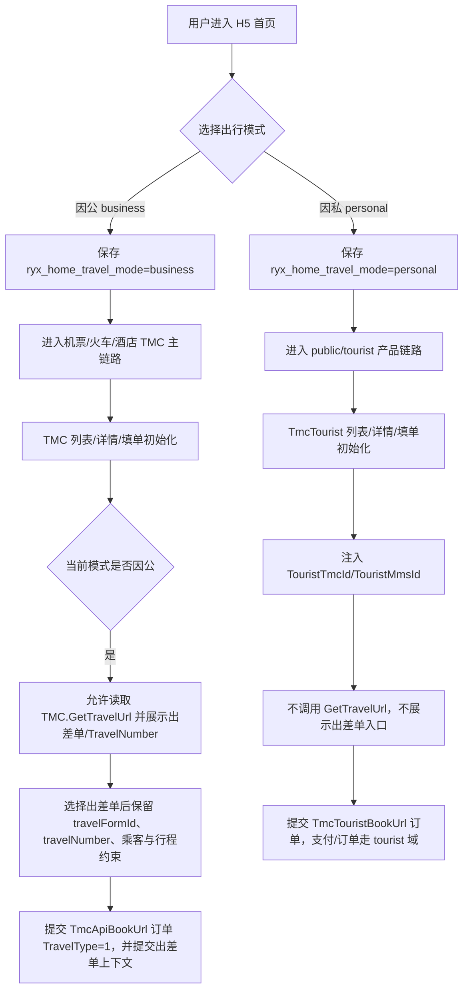
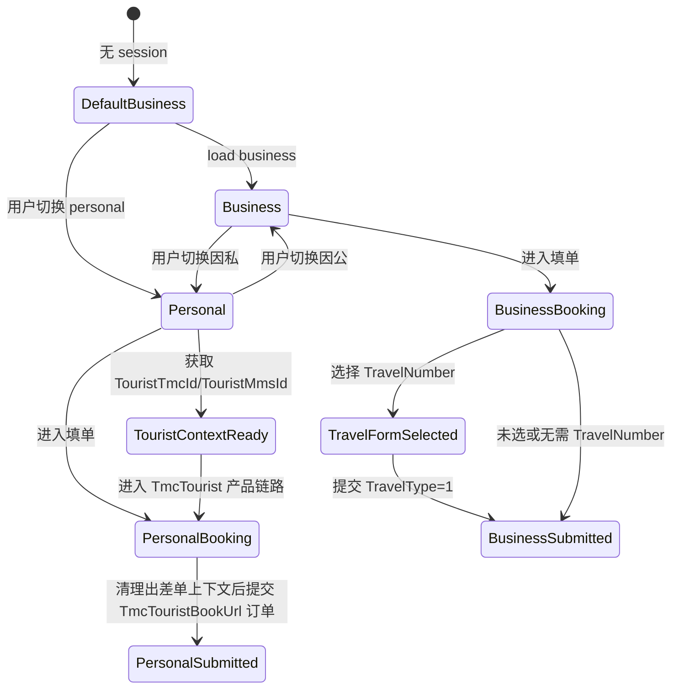

# 技术设计文档
## 1. 需求基础信息
- Jira 号：r-001
- 涉及代码工程：`rongyixing-monorepo/apps/h5`、`rongyixing-monorepo/packages/api`、`rongyixing-monorepo/packages/shared-types`
- 需求文档地址：[prd.md](prd.md)
- 涉及领域模块：首页出行模式、因公 TMC 产品链路、因私 public/tourist 产品链路、tourist 上下文、机票填单、火车填单、酒店填单、出差单选择、乘客选择、订单提交 DTO、支付 / 订单 API 封装

## 2. 项目背景和目标
当前 H5 已有「因公出行 / 因私出行」Tab，并在机票、火车、酒店订单 DTO 中写入 `TravelType`，但 legacy ryx 中因公和因私并不是单一字段差异，而是入口、路由、接口域、出差单上下文、支付与审批能力的组合差异。

本次需求的目标是在当前 H5 已有页面和新 UI 体系上，完成因公 TMC 链路与因私 public/tourist 接口链路的真实隔离。因公继续走 `TmcApi*` / `TmcApiBookUrl` / `TmcApiOrderUrl`，因私在 H5 页面内切换到 legacy public 等价的 `TmcTouristFlightUrl` / `TmcTouristTrainUrl` / `TmcTouristHotelUrl` / `TmcTouristBookUrl` / `TmcTouristOrderUrl`，并注入 `TouristTmcId` / `TouristMmsId` 上下文。`TravelType=2` 只能作为订单字段之一，不能作为因私迁移完成标准。

本期目标：
- 首页模式选择稳定保存并传递到机票、火车、酒店填单链路。
- 因公模式订单默认 `TravelType=1`，允许调用 `TmcApiBookUrl-Home-GetTravelUrl` 并提交出差单上下文。
- 因私模式走 public/tourist 搜索、详情、初始化、下单、支付、订单链路；禁止调用 `GetTravelUrl`，禁止展示 `TravelNumber`，禁止提交 `TravelFormId`、`travelFormId`、`travelNumber`。
- 因私模式同步迁移 public 公共填单能力，包括证件、国家、CheckPay、12306、订单支付，以及当前 H5 已有订单 / 售后入口对应 Method，不把 tourist 链路简化为“只替换搜索和下单接口”。
- 不迁移 legacy Angular/Ionic `public-*` 路由和视觉结构；交互按 H5 规范微调，UI 重新实现。
- Staff `BookType` 仅用于本人预订 / 代订权限，不参与因公 / 因私模式判断。
- 不新增待办角标、审批列表 / 详情、Workbench 动态入口 / 权限显隐。

## 3. 总的业务流程


业务流程说明：
1. 首页负责产生当前出行模式，模式保存到 `sessionStorage`，刷新后在同一会话内继续生效；无 session 时默认因公。
2. 因公产品搜索、列表、详情、填单继续走当前 H5 TMC 主链路。
3. 因私产品搜索、列表、详情、填单必须切换到 public/tourist 链路，Method 首段 UrlKey 必须是 `TmcTourist*`。
4. 填单初始化后，根据当前模式决定是否启用出差单能力。
5. 因公模式下，若 TMC 开启 `GetTravelUrl`，按产品类型 `Flight` / `Train` / `Hotel` 拉取出差单并把选择结果写入乘客及订单 DTO。
6. 因私模式下，即使 URL、localStorage 或历史乘客数据残留 `travelFormId`，也必须在 UI 展示、API 调用、提交 DTO 三层清理，并确保请求注入 tourist `TmcId/MmsId`。

## 4. 领域模型设计
### 4.1 领域模型设计
| 领域对象 | 字段 / 属性 | 说明 |
|----------|-------------|------|
| `HomeTravelMode` | `business` / `personal` | H5 首页选择的出行模式，当前存储键为 `ryx_home_travel_mode` |
| `OrderTravelType` | `1` / `2` | legacy 订单出行类型：`Business=1`、`Person=2` |
| `OrderTravelPayType` | `1` / `2` / `3` / `4` | 支付类型，与出行类型独立，不可用来判断因公 / 因私 |
| `BookPermission` | `BookType` | 员工本人预订 / 代订能力，只影响乘客选择限制 |
| `TravelFormContext` | `TravelFormId`、`travelFormId`、`travelNumber`、`TravelNumber` | 因公出差单上下文，仅因公模式可生成、展示、提交 |
| `TravelUrlProductType` | `Flight` / `Train` / `Hotel` | `GetTravelUrl` 查询的产品类型 |
| `PublicProductContext` | `TouristTmcId`、`TouristMmsId`、`TmcTourist*` | legacy 因私 public 链路上下文，本期必须实现 |
| `TouristUrlKey` | `TmcTouristFlightUrl` / `TmcTouristTrainUrl` / `TmcTouristHotelUrl` / `TmcTouristBookUrl` / `TmcTouristOrderUrl` | 因私请求域名族，不能与因公 `TmcApi*` 混用 |

建议在 `apps/h5/src/lib/flight-travel-mode.ts` 或新建通用模块中收敛以下领域函数，避免各产品散落判断：
- `isBusinessTravelMode(mode): boolean`
- `isPersonalTravelMode(mode): boolean`
- `resolveOrderTravelType(mode): 1 | 2`
- `shouldEnableTravelForm(mode, tmcGetTravelUrl): boolean`
- `sanitizePersonalTravelContext(dto): dto`
- `resolveProductChannel(mode): "tmc" | "tourist"`
- `injectTouristContext(request): request`

### 4.2 数据库表设计
本次需求为 H5 前端与 API DTO 行为调整，不新增数据库表，不修改后端表结构，不涉及数据迁移。

### 4.3 状态机设计


状态约束：
- `TravelFormSelected` 只能由 `BusinessBooking` 进入。
- `PersonalBooking` 不允许进入 `TravelFormSelected`。
- `PersonalBooking` 必须先具备 tourist 上下文；若 URL 未带 tourist ids，则调用 `TmcApiHomeUrl-Home-Tourist` 获取。
- `PersonalSubmitted` 的 payload 不允许出现 `TravelFormId`、乘客 `travelFormId`、乘客 `travelNumber`、`OutNumbers.TravelNumber`。
- `PersonalSubmitted` 的请求 Method 必须属于 `TmcTourist*` 域名族。

## 5. 系统交互设计（按功能点拆分至接口/Handler）
### 功能点 1：首页出行模式领域化
- 涉及领域模块：首页、出行模式、产品入口
- 原有接口改造概述：不改接口；复用现有 `sessionStorage` 模式存储。
- 新增接口概述：无新增 HTTP 接口。
- 核心实现逻辑&业务流程：
  1. 保留 `HomeTabPage` 的模式切换与 `saveHomeTravelMode(mode)`。
  2. 将 `resolveFlightTravelType()` 泛化为订单出行类型解析，命名上避免只指向 flight。
  3. 所有产品填单 builder 优先使用显式传入的 `travelMode` / `travelType`，缺省时才读取 session。
  4. 单元测试覆盖默认因公、切换因私、刷新保持模式、非法 session 回退因公。

### 功能点 2：因公限定 GetTravelUrl 和 TravelNumber 展示
- 涉及领域模块：出差单选择、外部编号、机票填单、酒店填单、火车填单、Travel API
- 原有接口改造概述：保留 `packages/api/src/apis/travel.ts` 的 `getTravelUrl()` / `getTravelForms()`，调用方增加模式门禁。
- 新增接口概述：无新增 HTTP 接口。
- 核心实现逻辑&业务流程：
  1. `TmcApiBookUrl-Home-GetTravelUrl` 仅在 `mode=business` 且初始化返回 `Tmc.GetTravelUrl=true` 时允许调用。
  2. `buildPassengerOutNumberFields` 等 UI 配置函数增加 `travelMode` 入参，因私时返回不可选择或直接过滤 `TravelNumber` 字段。
  3. `fetchTravelUrlOptions` 调用前必须校验当前模式；产品类型按调用页传入 `Flight` / `Train` / `Hotel`，不能固定为 `Flight`。
  4. 因私模式不展示「选择申请单预订 / 继续查询」等出差单必选提示。
  5. GetTravelUrl 失败只影响因公出差单选择，不阻断普通填单返回和页面其它字段。

### 功能点 3：tourist 上下文与请求注入
- 涉及领域模块：API Proxy、public context、首页 personal 模式、三产品 tourist API
- 原有接口改造概述：复用 `resolveUrl()` 的 UrlKey 解析能力；新增 tourist context 注入逻辑。
- 新增接口概述：封装 `TmcApiHomeUrl-Home-Tourist` 获取 `TouristTmcId` / `TouristMmsId`。
- 核心实现逻辑&业务流程：
  1. 新增 `tourist-context`：优先从 URL query 读取 `TouristTmcId` / `TouristMmsId`，缺失时按 legacy 调用 `TmcApiHomeUrl-Home-Tourist`，请求 `Data.AppId`。
  2. 新增 tourist 请求包装器或 `ProxySendOptions` 扩展：调用 tourist Method 前删除原 TMC `TmcId`，写入顶层 `TmcId/MmsId`，并在 `Data.TmcId` 写入 tourist TMC。
  3. 增加 `resolve-url` 测试，覆盖 `TmcTouristFlightUrl`、`TmcTouristHotelUrl`、`TmcTouristBookUrl`、`TmcTouristOrderUrl` 在 dev proxy 和真实 URL 下的解析。
  4. tourist context 不替代因公 TMC 身份；模式切回 business 后不得污染 TMC 请求。

### 功能点 4：因私机票 public/tourist 链路
- 涉及领域模块：机票搜索、机票列表、机票详情、机票填单、常旅客、支付 / 订单
- 原有接口改造概述：personal 模式下不再使用 `TmcApiFlightUrl-*` / `TmcApiBookUrl-Flight-*`。
- 新增接口概述：新增 tourist 机票 flow alias 与 API 封装。
- 核心实现逻辑&业务流程：
  1. 搜索 / 列表走 `TmcTouristFlightUrl-Home-Index`。
  2. 航班详情 / 舱位走 `TmcTouristFlightUrl-Home-Detail`。
  3. 填单初始化走 `TmcTouristBookUrl-Flight-Initialize`，下单前校验走 `TmcTouristBookUrl-Flight-Validate`，提交走 `TmcTouristBookUrl-Flight-Book`。
  4. 改签能力若本期覆盖，则使用 `TmcTouristFlightUrl-Home-Exchange`、`TmcTouristFlightUrl-Home-ExchangeDetail`、`TmcTouristBookUrl-Flight-ExchangeInitialize`、`TmcTouristBookUrl-Flight-ExchangeBook`。
  5. public 乘客按常旅客体系处理，证件走 `TmcTouristBookUrl-Home-Credentials`，不走因公员工乘客和出差单锁定。
  6. 若下单返回 `IsCheckPay=true`，使用 `TmcTouristBookUrl-Flight-CheckPay` 做支付前检查。
  7. 支付 / 订单详情 / 取消 / 退票进入 `TmcTouristOrderUrl-*`，机票退票使用 `TmcTouristOrderUrl-Order-RefundFlight`。

### 功能点 5：因私火车 public/tourist 链路
- 涉及领域模块：火车搜索、火车列表、火车填单、12306、支付 / 订单
- 原有接口改造概述：personal 模式下不再使用 `TmcApiTrainUrl-*` / `TmcApiBookUrl-Train-*`。
- 新增接口概述：新增 tourist 火车 flow alias 与 API 封装。
- 核心实现逻辑&业务流程：
  1. 搜索走 `TmcTouristTrainUrl-Home-Search`，时刻表走 `TmcTouristTrainUrl-Home-Schedule`。
  2. 填单初始化走 `TmcTouristBookUrl-Train-Initialize`，提交走 `TmcTouristBookUrl-Train-Book`。
  3. 12306 绑定 / 解绑 / 校验 / 联系人使用 `TmcTouristBookUrl-Train-Bind`、`Unbind`、`AccountValidate`、`CodeValidate`、`GetContacts`、`GetBindAccountNumber`。
  4. 证件走 `TmcTouristBookUrl-Home-Credentials`；若下单返回 `IsCheckPay=true`，使用 `TmcTouristBookUrl-Train-CheckPay`。
  5. 改签 / 退票能力若本期覆盖，则使用 tourist train 和 tourist book 对应 Method。
  6. 支付 / 订单详情 / 取消 / 出票进入 `TmcTouristOrderUrl-*`，出票 / 取消出票使用 `TmcTouristOrderUrl-Order-IssueTrain` / `CancelTrain`。

### 功能点 6：因私酒店 public/tourist 链路
- 涉及领域模块：酒店城市、酒店条件、酒店关键字、酒店列表、酒店详情、酒店填单、入住人、支付 / 订单
- 原有接口改造概述：personal 模式下不再使用 `TmcApiHotelUrl-*` / `TmcApiBookUrl-Hotel-*`。
- 新增接口概述：新增 tourist 酒店 flow alias 与 API 封装。
- 核心实现逻辑&业务流程：
  1. 城市 / 条件走 `TmcTouristHotelUrl-City-Gets`、`TmcTouristHotelUrl-Condition-Gets`、`TmcTouristHotelUrl-City-GetCityByMap`。
  2. 关键字搜索走 `TmcTouristHotelUrl-Home-SearchHotel`，列表走 `TmcTouristHotelUrl-Home-List`，详情走 `TmcTouristHotelUrl-Home-Detail`。
  3. 填单初始化走 `TmcTouristBookUrl-Hotel-Initialize`，提交走 `TmcTouristBookUrl-Hotel-Book`。
  4. public 入住人使用 public frequent passenger 体系，证件走 `TmcTouristBookUrl-Home-Credentials`，不走因公员工和出差单乘客锁定。
  5. 若下单返回 `IsCheckPay=true`，使用 `TmcTouristBookUrl-Hotel-CheckPay`。
  6. 酒店支付优先兼容 legacy `TmcTouristHotelUrl-Pay-Create` / `TmcTouristHotelUrl-Pay-Process` 特例；订单详情 / 短信核验 / 取消进入 `TmcTouristOrderUrl-*`。

### 功能点 6.5：因私公共填单辅助能力
- 涉及领域模块：public 常旅客、证件、国家 / 国籍、支付检查、资源数据
- 原有接口改造概述：personal 模式下不能仅复用 TMC 因公员工证件与支付检查。
- 新增接口概述：封装 tourist book 公共能力。
- 核心实现逻辑&业务流程：
  1. 国家 / 国籍数据走 `TmcTouristBookUrl-Home-Country`。
  2. 乘客 / 入住人证件走 `TmcTouristBookUrl-Home-Credentials`，按 accountId 批量获取并缓存。
  3. 机票 / 火车 / 酒店下单后如需检查支付状态，分别走 `TmcTouristBookUrl-Flight-CheckPay`、`TmcTouristBookUrl-Train-CheckPay`、`TmcTouristBookUrl-Hotel-CheckPay`。
  4. 国内机场、国际机场等资源在 legacy public 中复用 `TmcApiHomeUrl-Resource-Airport` / `InternationalAirport`，本期仅在机票迁移必要时复用，不视为因公下单域泄漏。

### 功能点 7：因公专属字段和出差单隔离
- 涉及领域模块：订单 DTO、审批、组织、成本中心、支付、政策、出差单
- 原有接口改造概述：因公沿用 TMC DTO；因私 tourist DTO 禁止携带因公字段。
- 新增接口概述：无新增 HTTP 接口。
- 核心实现逻辑&业务流程：
  1. 因公选择出差单后，乘客必须保留 `travelFormId`、`travelNumber` 和行程约束。
  2. 出差单带入的乘客与外部编号按 legacy 限制普通新增、删除、重选；具体提示文案沿用现有 H5 文案风格。
  3. 因私模式读取乘客时忽略乘客对象上历史残留的 `travelFormId` / `travelNumber`。
  4. 因私模式默认不携带审批人、组织、成本中心、差旅政策、违规原因、出差单号；支付类型来自 tourist 初始化 `PayTypes` 或 public 默认规则。
  5. 下单成功或切换模式时，不能把因公出差单上下文污染到因私会话。

### 功能点 8：因私订单与支付域切换
- 涉及领域模块：订单详情、支付，以及当前 H5 已有订单列表、待出行、取消、退改签入口
- 原有接口改造概述：personal 模式下不再使用 `TmcApiOrderUrl-*`。
- 新增接口概述：新增 tourist order / pay flow alias 与 API 封装。
- 核心实现逻辑&业务流程：
  1. 因私订单详情使用 `TmcTouristOrderUrl-Order-Detail`；若 H5 已有订单列表入口，使用 `TmcTouristOrderUrl-Order-List`。
  2. 若 H5 已有待出行入口，使用 `TmcTouristOrderUrl-Travel-List`。
  3. 通用支付使用 `TmcTouristOrderUrl-Pay-GetTotalPayAmount`、`TmcTouristOrderUrl-Order-GetOrderPays` 或 `TmcTouristOrderUrl-Pay-GetOrderPays`、`TmcTouristOrderUrl-Pay-Create`、`TmcTouristOrderUrl-Pay-Process`。
  4. 若 H5 已有火车出票 / 取消出票入口，使用 `TmcTouristOrderUrl-Order-IssueTrain` / `TmcTouristOrderUrl-Order-CancelTrain`。
  5. 若 H5 已有机票退票入口，使用 `TmcTouristOrderUrl-Order-RefundFlight`。
  6. 若 H5 已有酒店短信核验 / 取消入口，使用 `TmcTouristOrderUrl-Order-SendVerifyOrderHotelSMSCode`、`ConfirmVerifyOrderHotelSMSCode`、`CancelOrderHotel`。
  7. 若 H5 已有订单废单 / 废票入口，使用 `TmcTouristOrderUrl-Order-AbolishOrder` / `AbolishTicket`。
  8. 酒店 public 支付兼容 `TmcTouristHotelUrl-Pay-Create` / `TmcTouristHotelUrl-Pay-Process`。
  9. 支付完成后的订单跳转进入 public order detail，而不是 TMC order detail。
  10. 当前 H5 未覆盖的 legacy public 订单 / 售后独立页面不在本设计中强制新增。

## 6. 本次需求对外接口汇总
### 1.1 无新增对外接口
**接口路径**：`N/A`

**接口说明**：本次需求不新增 H5 对外 HTTP 接口，不新增后端 Controller，不变更外部系统可调用 API。所有改动限定在 H5 页面、DTO builder、API 调用门禁与测试。

**请求参数**：
| 参数名 | 类型 | 必填 | 说明 |
|--------|------|------|------|
| N/A | N/A | 否 | 本次无新增请求参数 |

**返回值**：
```json
{
  "code": 0,
  "message": "no new public api",
  "data": {}
}
```

**返回值说明**：
| 字段 | 类型 | 说明 |
|------|------|------|
| code | number | 占位说明，本次无新增接口 |
| message | string | 占位说明 |
| data | object | 占位说明 |

---

## 7. 依赖外部接口汇总
| 接口名称 | 依赖系统 | 调用方式 | 用途 |
|----------|----------|----------|------|
| `TmcApiBookUrl-Home-GetTravelUrl` | TMC Proxy | `packages/api.travel.getTravelUrl/getTravelForms` | 因公模式查询出差单 / TravelNumber；因私模式禁止调用 |
| `TmcApiBookUrl-Flight-Initialize` / `TmcApiBookUrl-Flight-Book` | TMC Proxy | 现有机票填单初始化 / 下单封装 | 机票 TMC 主链路，按模式写入并清理 DTO |
| `TmcApiBookUrl-Train-Initialize` / `TmcApiBookUrl-Train-Book` | TMC Proxy | 现有火车填单初始化 / 下单封装 | 火车 TMC 主链路，按模式写入并清理 DTO |
| `TmcApiBookUrl-Hotel-Initialize` / `TmcApiBookUrl-Hotel-Book` | TMC Proxy | 现有酒店填单初始化 / 下单封装 | 酒店 TMC 主链路，按模式写入并清理 DTO |
| `TmcApiHomeUrl-Home-Tourist` | TMC Home | tourist context API | 获取 `TouristTmcId` / `TouristMmsId` |
| `TmcTouristBookUrl-Home-Country` / `Home-Credentials` | TMC Tourist Book | tourist common book API | 因私国家 / 国籍、乘客 / 入住人证件 |
| `TmcTouristBookUrl-Flight-CheckPay` / `Train-CheckPay` / `Hotel-CheckPay` | TMC Tourist Book | tourist check pay API | 因私下单后的支付状态检查 |
| `TmcTouristFlightUrl-Home-Index` / `Detail` | TMC Tourist Flight | tourist flight API | 因私机票列表 / 详情 |
| `TmcTouristBookUrl-Flight-Initialize` / `Validate` / `Book` | TMC Tourist Book | tourist book API | 因私机票初始化 / 校验 / 下单 |
| `TmcTouristTrainUrl-Home-Search` / `Schedule` | TMC Tourist Train | tourist train API | 因私火车搜索 / 时刻表 |
| `TmcTouristBookUrl-Train-Initialize` / `Book` / `Bind` / `AccountValidate` / `CodeValidate` | TMC Tourist Book | tourist book API | 因私火车初始化 / 下单 / 12306 |
| `TmcTouristHotelUrl-Condition-Gets` / `Home-SearchHotel` / `Home-List` / `Home-Detail` | TMC Tourist Hotel | tourist hotel API | 因私酒店条件 / 关键字 / 列表 / 详情 |
| `TmcTouristBookUrl-Hotel-Initialize` / `Book` | TMC Tourist Book | tourist book API | 因私酒店初始化 / 下单 |
| `TmcTouristOrderUrl-Order-List` / `Order-Detail` | TMC Tourist Order | tourist order API | 因私订单列表 / 详情；列表按 H5 已有入口迁移 |
| `TmcTouristOrderUrl-Travel-List` | TMC Tourist Order | tourist trip API | 因私待出行；按 H5 已有入口迁移 |
| `TmcTouristOrderUrl-Pay-GetTotalPayAmount` / `Order-GetOrderPays` / `Pay-GetOrderPays` / `Pay-Create` / `Pay-Process` | TMC Tourist Order | tourist pay API | 因私支付金额、支付方式、支付创建与处理 |
| `TmcTouristOrderUrl-Order-IssueTrain` / `CancelTrain` | TMC Tourist Order | tourist train order API | 因私火车出票 / 取消出票 |
| `TmcTouristOrderUrl-Order-RefundFlight` | TMC Tourist Order | tourist flight order API | 因私机票退票 |
| `TmcTouristOrderUrl-Order-SendVerifyOrderHotelSMSCode` / `ConfirmVerifyOrderHotelSMSCode` / `CancelOrderHotel` | TMC Tourist Order | tourist hotel order API | 因私酒店短信核验 / 取消 |
| `TmcTouristOrderUrl-Order-AbolishOrder` / `AbolishTicket` | TMC Tourist Order | tourist order API | 因私订单废单 / 废票 |
| `TmcTouristHotelUrl-Pay-Create` / `Pay-Process` | TMC Tourist Hotel | tourist hotel pay API | legacy public 酒店支付特例 |

## 8. 期初方案
本次需求不涉及期初数据构造和数据库迁移。

兼容逻辑：
1. 已有用户 session 中若存在 `ryx_home_travel_mode=personal`，刷新后继续按因私处理。
2. 若 session 值非法或不存在，默认回退因公，保持 TMC 主流程兼容。
3. 因私模式遇到 URL、localStorage 或乘客对象残留的因公出差单字段时，在进入 tourist DTO 前清理，不依赖用户手动清空。
4. 首次进入因私链路时，若 URL 未带 `TouristTmcId/TouristMmsId`，调用 `TmcApiHomeUrl-Home-Tourist` 初始化 tourist context。
5. tourist context 缺失或初始化失败时，因私产品页必须显示可恢复错误状态，不得降级到 TMC 因公域继续下单。

## 9. 任务拆分
任务拆分按出行模式、tourist context、public API alias、三产品 tourist 链路、订单支付域、出差单隔离和测试矩阵组织。执行顺序建议先完成 tourist context 与 Method alias，再按酒店、机票、火车推进页面分支和 DTO，最后补支付 / 订单与回归测试。

任务清单文档：[task-list.md](task-list.md)

## 10. 设计确认状态
【未锁定】

## 11. 变更记录
| 版本 | 变更日期 | 修改人 | 变更内容 |
|------|----------|--------|----------|
| V1.0 | 2026-06-30 | Codex | 基于 PRD 生成初始技术设计 |
| V1.1 | 2026-06-30 | Codex | 根据补充分析将 `public-*` / `TmcTourist*` 因私链路调整为本期必做，补充 tourist context、三产品 tourist Method、支付 / 订单域设计 |
| V1.2 | 2026-06-30 | Codex | 补充 legacy public 公共填单、证件、CheckPay、待出行、订单支付售后具体 Method 与任务范围 |
| V1.3 | 2026-06-30 | Codex | 按需求移除对外消息、ETCD、数据监控、灰度方案等非必要模板章节 |
| V1.4 | 2026-06-30 | Codex | 重新校准为基于现有 H5 页面迁移 legacy 接口与业务差异，不强制复刻 legacy 路由、视觉和未覆盖的订单售后页面 |
