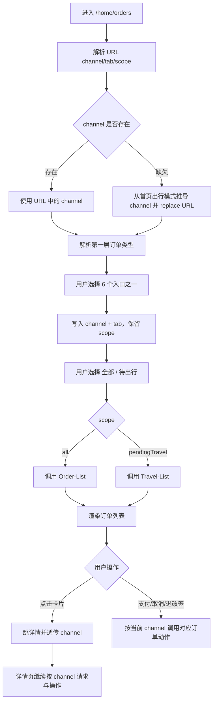
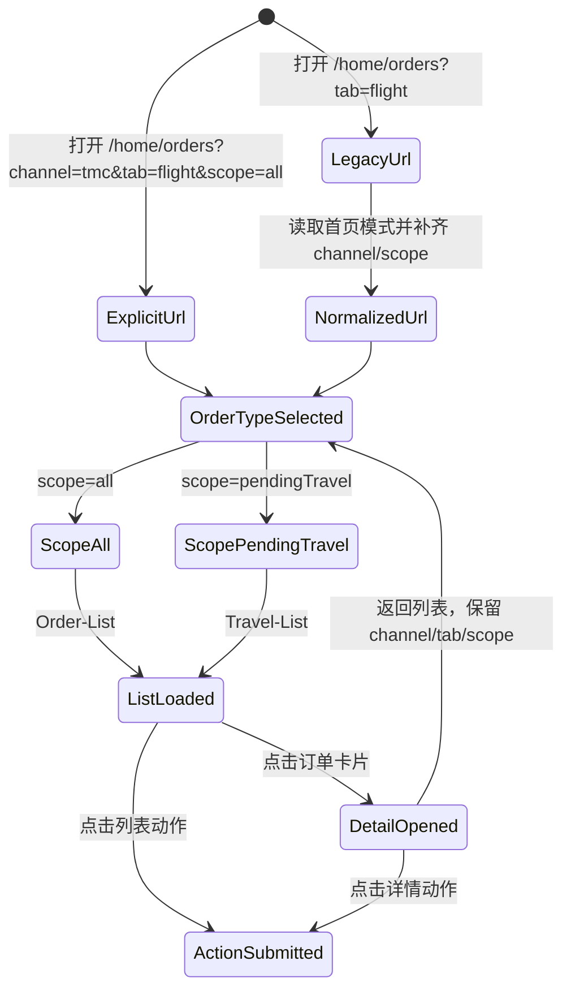

# 技术设计文档
## 1. 需求基础信息
- Jira 号：r-002
- 涉及代码工程：`rongyixing-monorepo/apps/h5`、`rongyixing-monorepo/packages/api`、`rongyixing-monorepo/packages/shared-types`
- 需求文档地址：[prd.md](prd.md)
- 涉及领域模块：订单中心、订单列表、待出行列表、订单详情、订单支付、订单售后动作、因公 TMC 订单链路、因私 tourist 订单链路、H5 URL 状态管理

## 2. 项目背景和目标
R-001 已完成因私 public/tourist 主链路迁移，但订单中心当前仍以单一 `/home/orders` 入口承载列表展示。现有页面通过 session 中的首页出行模式隐式推导 `channel`，缺少 URL 层面的订单归属表达，也没有在视觉上把因公订单池与因私订单池拆开。

订单列表是详情、支付、取消、退改签等后续流程的入口。如果入口没有明确 `channel`，则后续流程容易发生以下问题：
- 因私列表项进入详情后丢失 `channel=tourist`，重新调用因公订单详情。
- 列表动作按因公接口提交，导致 tourist 订单操作失败。
- 订单列表缓存只按品类和范围隔离，公私切换后复用错误数据。
- 用户无法判断当前看到的是因公订单还是因私订单。

本次目标是把订单中心调整为“六个订单类型入口 + 全部/待出行 + 列表”的结构，使 UI、URL、接口、缓存、详情后续操作全部围绕 `channel + tab + scope` 这组三元状态展开。

## 3. 总的业务流程


业务流程说明：
1. 页面状态以 `channel + tab + scope` 为唯一来源。
2. `channel=tmc` 表示因公订单域，`channel=tourist` 表示因私订单域。
3. 第一层 6 个入口同时决定 `channel` 和 `tab`。
4. 第二层只决定 `scope`，不修改 `channel` 和 `tab`。
5. 列表进入详情、支付页或售后动作时必须继续传递当前 `channel`。
6. 历史 URL 缺少 `channel` 时只允许兼容解析一次，并通过 `replace` 规范化为显式 URL。

## 4. 领域模型设计
### 4.1 领域模型设计
| 领域对象 | 字段 / 属性 | 说明 |
|----------|-------------|------|
| `ProductChannel` | `tmc` / `tourist` | 订单归属。`tmc` 为因公，`tourist` 为因私 |
| `OrderCategoryId` | `flight` / `train` / `hotel` | 产品品类 |
| `OrderListScope` | `all` / `pendingTravel` | 列表范围：全部订单 / 待出行 |
| `OrderTypeTab` | `channel`、`categoryId`、`label`、`tone` | 第一层 6 个入口的视图模型 |
| `OrderListRouteState` | `channel`、`tab`、`scope` | URL query 与页面请求状态 |
| `OrderActionContext` | `channel`、`orderId`、`ticketId`、`tabId`、`scope` | 列表与详情后续动作上下文 |

建议新增或调整以下纯函数：
- `parseOrderChannel(searchParams, fallbackMode): ProductChannel`
- `parseOrderListRouteState(searchParams, fallbackMode): OrderListRouteState`
- `buildOrderListSearchParams(nextState): URLSearchParams`
- `orderTypeTabs: OrderTypeTab[]`
- `resolveOrderTypeTab(channel, categoryId): OrderTypeTab`
- `withOrderChannel(path, channel): string`

### 4.2 数据库表设计
本次需求为 H5 前端、API 调用域与 URL 状态调整，不新增数据库表，不修改后端表结构，不涉及数据迁移。

### 4.3 状态机设计


状态约束：
- `LegacyUrl` 必须转换为 `NormalizedUrl`，不长期停留在缺少 `channel` 的状态。
- `OrderTypeSelected` 的 `channel` 和 `tab` 必须同时有效。
- `ActionSubmitted` 的接口域由当前 `channel` 唯一决定。
- 因私详情、支付、退改签不得降级到因公接口域。

## 5. 系统交互设计（按功能点拆分至接口/Handler）
### 功能点 1：订单列表第一层六入口建模与 UI
- 涉及领域模块：订单中心、订单分类组件、URL 状态
- 原有接口改造概述：不改后端接口；调整现有 `OrderCategoryTabs` 的数据模型和展示结构。
- 新增接口概述：无新增 HTTP 接口。
- 核心实现逻辑&业务流程：
  1. 将当前机票 / 火车 / 酒店三品类 tab 扩展为 6 个订单类型入口。
  2. 每个入口包含 `channel`、`categoryId`、`label`、`tone`，例如 `{ channel:"tourist", categoryId:"train", label:"因私火车" }`。
  3. 因公与因私使用不同文字颜色。选中态使用更强的背景、边框或下划线，必须清晰表达当前公私与品类。
  4. 移动端 375px 下第一层可横向滚动，按钮尺寸稳定，文字不得重叠。
  5. 切换第一层时保留 `scope`，同时写入 `channel` 和 `tab`。

### 功能点 2：URL 状态显式化与历史链接兼容
- 涉及领域模块：订单列表参数解析、路由状态、首页出行模式
- 原有接口改造概述：复用 `loadHomeTravelMode()` 作为历史 URL 缺少 `channel` 时的兜底。
- 新增接口概述：无新增 HTTP 接口。
- 核心实现逻辑&业务流程：
  1. `OrderListPage` 优先读取 URL `channel`，合法值为 `tmc` / `tourist`。
  2. URL 缺少 `channel` 时，根据首页出行模式推导默认值，并使用 `setSearchParams(..., { replace:true })` 写回。
  3. URL 缺少 `scope` 时默认 `all`，并可一并写回。
  4. 保持历史 `tabId` 兼容，转换为 `tab=flight/train/hotel`。
  5. 所有订单列表跳转、详情返回、下单成功返回都必须带回完整 `channel + tab + scope`。

### 功能点 3：订单列表与待出行请求按 channel 隔离
- 涉及领域模块：`useOrderList`、`packages/api/src/apis/order.ts`、query key、列表标准化
- 原有接口改造概述：现有 API 已支持 `channel` 分支，需确保页面状态显式传入，并保证缓存 key 包含 `channel`。
- 新增接口概述：无新增 HTTP 接口。
- 核心实现逻辑&业务流程：
  1. `useOrderList({ tabId, scope, channel })` 必须使用 URL 解析出的 channel。
  2. query key 保持或调整为包含 `tabId + scope + channel`，避免公私列表缓存串用。
  3. `scope=all` 时调用 `order.getList`，API 层按 channel 选择 `ORDER_FLOW_METHODS.LIST` 或 `TOURIST_ORDER_FLOW_METHODS.LIST`。
  4. `scope=pendingTravel` 时调用 `Travel-List`，API 层按 channel 选择 TMC 或 tourist travel list。
  5. 切换第一层或第二层时重置分页，从第一页重新请求。

### 功能点 4：列表进入详情、支付和动作链路透传 channel
- 涉及领域模块：订单路由、列表动作、订单支付、订单详情
- 原有接口改造概述：复用现有 `withOrderChannel` 思路，但需要支持 `tmc` 也能作为显式状态保留在列表 URL 中。
- 新增接口概述：无新增 HTTP 接口。
- 核心实现逻辑&业务流程：
  1. 列表卡片点击进入 `/orders/{product}/{orderId}?channel={channel}`。
  2. 列表支付跳转 `/flight/pay/{orderId}?channel={channel}`、`/train/pay/{orderId}?channel={channel}`、`/hotel/pay/{orderId}?channel={channel}`。
  3. 列表取消、退票、改签等动作调用 mutation 时必须传当前 channel。
  4. 详情页返回列表时，fallback URL 必须包含原来的 `channel + tab + scope`，不能只回 `/home/orders?tab=train`。
  5. 下单成功返回订单列表时，按下单 channel 写入对应第一层入口。

### 功能点 5：因私火车订单详情动作补齐
- 涉及领域模块：火车订单详情、火车票级动作、tourist train / order API
- 原有接口改造概述：当前 H5 已有订单级支付、取消、确认出票、退票、改签入口，但 tourist 退票 / 改签辅助接口和票级取消仍需按 legacy public 链路补齐。
- 新增接口概述：不新增后端接口；补齐 H5 API 封装对既有 Method 的调用。
- 核心实现逻辑&业务流程：
  1. 订单级支付：`showPay` 时跳因私支付页，支付域为 `TmcTouristOrderUrl-Pay-*`。
  2. 订单级取消 / 确认出票：`showCancel` / `showIssue` 时走 `TmcTouristOrderUrl-Order-CancelTrain` / `IssueTrain`。
  3. 票级退票：`ticket.Variables.isShowRefundButton` 时先调用 `TmcTouristTrainUrl-Home-GetTrainPassenger`，提交退票走 `TmcTouristTrainUrl-Home-Refund`。
  4. 票级改签：`ticket.Variables.isShowExchangeButton` 时调用 `TmcTouristTrainUrl-Home-GetExchangeInfo`，后续初始化 / 下单走 tourist book exchange Method。
  5. 票级取消 / 废票：`ticket.Variables.isShowCancelButton` 时展示票级取消按钮，调用 `TmcTouristOrderUrl-Order-AbolishTicket`，参数包含 `OrderId`、`TicketId`、`Tag=train`、`Channel`。
  6. business 通道保持当前 TMC 订单接口，不使用 tourist train/book/order Method。

### 功能点 6：订单详情页通用 channel 回传
- 涉及领域模块：机票详情、火车详情、酒店详情、支付页、取消 / 退改签弹窗
- 原有接口改造概述：各详情页已能读取 `channel=tourist`，需要确保返回路径、弹窗动作、辅助接口全部使用当前 channel。
- 新增接口概述：无新增 HTTP 接口。
- 核心实现逻辑&业务流程：
  1. 详情页读取 `channel` 后向所有 query / mutation 传递。
  2. 详情页 fallback 列表 URL 增加当前 `channel`、对应 `tab` 和可选 `scope`。
  3. 支付页、酒店取消短信、机票退票、火车退改签等均不得重新从首页模式推导 channel，而应使用 URL 或调用上下文显式 channel。
  4. 对没有 `channel` 的历史详情 URL 保持现有 TMC 默认。

## 6. 本次需求对外接口汇总
本次需求不新增后端 HTTP 接口。以下为 H5 页面仍使用的既有页面路由与 query 约定。

### 1.1 订单列表页面
**接口路径**：`GET /home/orders`
**接口说明**：H5 订单中心页面，使用 query 表达订单归属、产品品类和范围。

**请求参数**：
| 参数名 | 类型 | 必填 | 说明 |
|--------|------|------|------|
| channel | string | 否 | `tmc` 因公，`tourist` 因私；历史链接可缺省，页面会兼容补齐 |
| tab | string | 否 | `flight` / `train` / `hotel`，缺省默认 `flight` |
| scope | string | 否 | `all` / `pendingTravel`，缺省默认 `all` |
| tabId | number | 否 | 历史兼容参数，转换为 `tab` |

**返回值**：
```json
{
  "page": "OrderListPage",
  "state": {
    "channel": "tourist",
    "tab": "train",
    "scope": "all"
  }
}
```

**返回值说明**：
| 字段 | 类型 | 说明 |
|------|------|------|
| page | string | H5 页面组件 |
| state.channel | string | 当前订单归属 |
| state.tab | string | 当前产品品类 |
| state.scope | string | 当前列表范围 |

---

### 1.2 订单详情页面
**接口路径**：`GET /orders/{product}/{orderId}`
**接口说明**：H5 订单详情页面，按 query channel 选择因公或因私订单详情与后续动作链路。

**请求参数**：
| 参数名 | 类型 | 必填 | 说明 |
|--------|------|------|------|
| product | string | 是 | `flight` / `train` / `hotel` |
| orderId | string | 是 | 订单 ID |
| channel | string | 否 | `tmc` / `tourist`，缺省按 TMC 兼容 |

**返回值**：
```json
{
  "page": "OrderDetailPage",
  "state": {
    "product": "train",
    "orderId": "44880000000028",
    "channel": "tourist"
  }
}
```

**返回值说明**：
| 字段 | 类型 | 说明 |
|------|------|------|
| page | string | H5 详情页面组件 |
| state.product | string | 产品品类 |
| state.orderId | string | 订单 ID |
| state.channel | string | 当前订单归属 |

---

## 7. 依赖外部接口汇总
| 接口名称 | 依赖系统 | 调用方式 | 用途 |
|----------|----------|----------|------|
| `TmcApiOrderUrl-Order-List` | TMC Order | H5 API proxy | 因公全部订单列表 |
| `TmcTouristOrderUrl-Order-List` | Tourist Order | H5 API proxy | 因私全部订单列表 |
| `TmcApiOrderUrl-Travel-List` | TMC Order | H5 API proxy | 因公待出行列表 |
| `TmcTouristOrderUrl-Travel-List` | Tourist Order | H5 API proxy | 因私待出行列表 |
| `TmcApiOrderUrl-Order-Detail` | TMC Order | H5 API proxy | 因公订单详情 |
| `TmcTouristOrderUrl-Order-Detail` | Tourist Order | H5 API proxy | 因私订单详情 |
| `TmcTouristOrderUrl-Order-IssueTrain` | Tourist Order | H5 API proxy | 因私火车确认出票 |
| `TmcTouristOrderUrl-Order-CancelTrain` | Tourist Order | H5 API proxy | 因私火车取消出票 / 取消订单 |
| `TmcTouristOrderUrl-Order-AbolishTicket` | Tourist Order | H5 API proxy | 因私票级取消 / 废票 |
| `TmcTouristTrainUrl-Home-GetTrainPassenger` | Tourist Train | H5 API proxy | 因私火车退票前旅客信息 |
| `TmcTouristTrainUrl-Home-Refund` | Tourist Train | H5 API proxy | 因私火车退票提交 |
| `TmcTouristTrainUrl-Home-GetExchangeInfo` | Tourist Train | H5 API proxy | 因私火车改签信息 |

## 8. 对外消息设计
| 消息 Topic | 消息体 | 生产时机 | 消费方 |
|------------|--------|----------|--------|
| 无 | 无 | 本次需求不新增消息 | 无 |

## 9. ETCD 配置设计
| 配置 Key | 默认值 | 配置说明 | 灰度控制 |
|----------|--------|----------|----------|
| 无 | 无 | 本次需求不新增 ETCD 配置 | 否 |

## 10. 期初方案
1. 不需要期初数据迁移。
2. 历史 URL `/home/orders?tab=flight`、`/orders/train/{id}` 继续可用；缺少 `channel` 的列表 URL 按首页模式推导并写回，缺少 `channel` 的详情 URL 按 TMC 默认兼容。
3. 已存在的订单详情 URL `?channel=tourist` 保持不变。
4. 列表缓存通过 query key 中的 `channel` 自然隔离，无需清理本地存储。

## 11. 数据监控
| 监控项 | 监控指标 | 告警阈值 | 告警方式 |
|--------|----------|----------|----------|
| 订单列表接口域 | 因私列表误调用 `TmcApiOrderUrl-*` 次数 | 开发 / 测试环境出现 1 次即阻断 | 单元测试、联调抓包 |
| 详情接口域 | 因私详情误调用 `TmcApiOrderUrl-Order-Detail` 次数 | 开发 / 测试环境出现 1 次即阻断 | 单元测试、联调抓包 |
| 火车退票链路 | 因私火车退票误调用 `CancelTrain` 次数 | 开发 / 测试环境出现 1 次即阻断 | 单元测试、联调抓包 |
| URL 状态 | 切换入口后 URL 缺少 `channel` 次数 | 自动化测试不通过 | 单元测试、页面测试 |

## 12. 灰度方案
本次为 H5 前端行为调整，不新增后端灰度开关。上线策略：
1. 优先在测试环境验证 6 个入口全部可请求。
2. 验证历史 URL 兼容后再合并。
3. 若出现问题，可回滚前端版本恢复原订单列表三品类 tab。
4. 回滚不涉及数据库和服务端配置。

## 13. 任务拆分
任务按“状态建模、UI、列表请求、路由透传、详情动作、测试验收”拆分，详见 [task-list.md](task-list.md)。

任务清单文档：[task-list.md](task-list.md)

## 14. 设计确认状态
【已锁定】

## 15. 变更记录
| 版本 | 变更日期 | 修改人 | 变更内容 |
|------|----------|--------|----------|
| V1.0 | 2026-07-03 | Codex | 初始版本生成，明确订单中心六入口、channel/tab/scope 状态、列表与详情后续动作链路 |
| V1.0-Locked | 2026-07-03 | Codex | 设计文档已锁定，禁止修改 |
| V1.1-Implemented | 2026-07-03 | Codex | 已完成订单中心六入口、显式 channel 状态、详情后续动作和因私火车售后接口补齐 |
