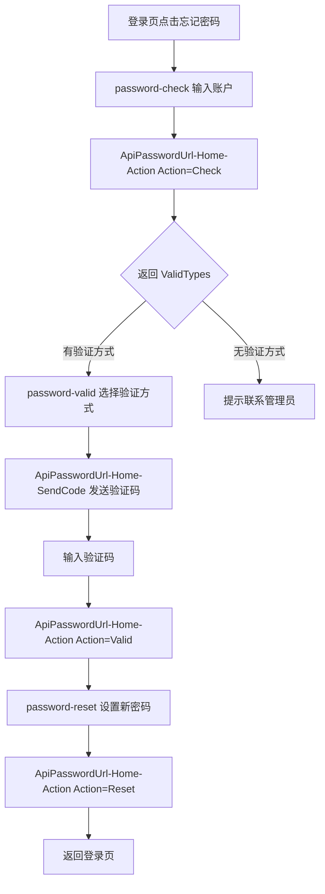

# 技术设计文档

## 1. 需求基础信息
- Jira 号：r-003
- 涉及代码工程：`rongyixing-monorepo/apps/h5`、`rongyixing-monorepo/apps/web`、`rongyixing-monorepo/packages/api`、`rongyixing-monorepo/packages/shared-types`
- 需求文档地址：[prd.md](prd.md)
- 涉及领域模块：登录、忘记密码、账号安全 API、H5 登录前路由、Web/Pad 登录前路由

## 2. 项目背景和目标
迁移后的项目已实现登录后修改密码 `/settings/password`，并封装 `ApiPasswordUrl-Password-Modify`。但 legacy 的“忘记密码”不是修改密码，而是登录前找回流程。当前 H5 只有入口没有路由，Web/Pad 只有“联系管理员”提示，功能不完整。

本次目标是在 H5 和 Web/Pad 增加登录前忘记密码流程，并严格沿用 legacy 的接口语义。

## 3. Legacy 流程梳理
legacy 源码位置：
- `/Users/jiangjiankang/work/self/rongyixing/beeantmobile-main/projects/ryx/src/app/password/password-check/password-check.page.ts`
- `/Users/jiangjiankang/work/self/rongyixing/beeantmobile-main/projects/ryx/src/app/password/password-valid/password-valid.page.ts`
- `/Users/jiangjiankang/work/self/rongyixing/beeantmobile-main/projects/ryx/src/app/password/password-reset/password-reset.page.ts`

legacy 链路：


接口 payload：
- 账号校验：`{ Name, Action: "Check" }`
- 发送验证码：`{ Name, ValidateType }`
- 验证码校验：`{ Name, ValidateType, ValidateValue, Action: "Valid" }`
- 重置密码：`{ Name, Password, SurePassword, Action: "Reset" }`

区别确认：
- 忘记密码：`ApiPasswordUrl-Home-Action` / `ApiPasswordUrl-Home-SendCode`
- 修改密码：`ApiPasswordUrl-Password-Modify`
- `/web/settings/password` 与 H5 `/settings/password` 只能用于登录后修改密码，不能作为找回密码入口。

## 4. 领域模型设计
| 对象 | 字段 | 说明 |
| --- | --- | --- |
| `ForgotPasswordStep` | `check` / `valid` / `reset` / `done` | 找回密码页面内部步骤 |
| `ForgotPasswordValidType` | `Name`、`Type`、`Value` | legacy 返回的验证方式，通常为手机号或邮箱 |
| `ForgotPasswordCheckParams` | `Name`、`Action` | 账号校验请求 |
| `ForgotPasswordSendCodeParams` | `Name`、`ValidateType` | 验证码发送请求 |
| `ForgotPasswordValidParams` | `Name`、`ValidateType`、`ValidateValue`、`Action` | 验证码校验请求 |
| `ForgotPasswordResetParams` | `Name`、`Password`、`SurePassword`、`Action` | 重置密码请求 |

不新增数据库表，不修改后端结构。

## 5. 系统交互设计
### 功能点 1：API 封装
- 在 `packages/shared-types` 增加忘记密码 DTO。
- 在 `packages/api/src/methods/password-flow.ts` 增加 `HOME_ACTION` 和 `HOME_SENDCODE`。
- 在 `packages/api/src/apis/account-security.ts` 增加 `checkForgotPasswordAccount`、`sendForgotPasswordCode`、`validateForgotPasswordCode`、`resetForgotPassword`。
- 保持 `modifyPassword` 调用 `PASSWORD_MODIFY` 不变。

### 功能点 2：H5 页面
- 新增 `/login/forgot-password` 路由。
- 页面采用 H5 登录前独立页面，不进入 `RootLayout` 和登录后鉴权。
- 交互分三步：输入账号、选择验证方式并发送验证码、设置新密码。
- 密码规则采用 legacy 找回密码规则：8-30 位，必须包含大小写字母；同时阻止两次输入不一致。
- 重置成功后跳回 `/login/password`。

### 功能点 3：Web/Pad 页面
- 新增 `/login/forgot-password` 路由，保持登录前可访问。
- 登录页“忘记密码请联系管理员”替换为可点击“忘记密码”。
- 页面视觉对齐当前 Web/Pad 登录页的融易蓝背景和卡片风格。
- 重置成功后跳回 `/login/password`。

### 功能点 4：错误处理
- 接口失败优先展示后端 `Message`。
- 无 `ValidTypes` 时展示“您尚未绑定邮箱或者手机号，请联系管理员找回密码”。
- 发送验证码使用后端返回的 `SendInterval` 控制倒计时，缺省回退 60 秒。

## 6. 本次需求对外接口汇总
### 接口名称：忘记密码账号校验
- 接口路径：POST `ApiPasswordUrl-Home-Action`
- 接口说明：校验账号并返回可用验证方式。
- 请求参数：
| 参数 | 类型 | 必填 | 说明 |
| --- | --- | --- | --- |
| Name | string | 是 | 登录账号 |
| Action | string | 是 | 固定 `Check` |
- 返回值：
```json
{
  "ValidTypes": [
    { "Name": "手机", "Type": "Mobile", "Value": "138****0000" }
  ],
  "AccountId": "10001"
}
```

### 接口名称：忘记密码发送验证码
- 接口路径：POST `ApiPasswordUrl-Home-SendCode`
- 接口说明：按选择的验证方式发送验证码。
- 请求参数：
| 参数 | 类型 | 必填 | 说明 |
| --- | --- | --- | --- |
| Name | string | 是 | 登录账号 |
| ValidateType | string | 是 | 验证方式 |
- 返回值：
```json
{
  "SendInterval": 60,
  "ExpiredInterval": 300
}
```

### 接口名称：忘记密码验证码校验
- 接口路径：POST `ApiPasswordUrl-Home-Action`
- 接口说明：校验验证码。
- 请求参数：
| 参数 | 类型 | 必填 | 说明 |
| --- | --- | --- | --- |
| Name | string | 是 | 登录账号 |
| ValidateType | string | 是 | 验证方式 |
| ValidateValue | string | 是 | 验证码 |
| Action | string | 是 | 固定 `Valid` |
- 返回值：
```json
true
```

### 接口名称：忘记密码重置密码
- 接口路径：POST `ApiPasswordUrl-Home-Action`
- 接口说明：设置新密码。
- 请求参数：
| 参数 | 类型 | 必填 | 说明 |
| --- | --- | --- | --- |
| Name | string | 是 | 登录账号 |
| Password | string | 是 | 新密码 |
| SurePassword | string | 是 | 确认密码 |
| Action | string | 是 | 固定 `Reset` |
- 返回值：
```json
true
```

## 7. 依赖外部接口汇总
- `ApiPasswordUrl-Home-Action`
- `ApiPasswordUrl-Home-SendCode`

## 8. 对外消息设计
无。

## 9. ETCD 配置设计
无。

## 10. 期初方案
无。

## 11. 数据监控
本期不新增埋点。可通过接口日志观察 `Action=Check/Valid/Reset` 成功率。

## 12. 灰度方案
仅新增登录前页面与入口，不影响已登录主流程。若接口不可用，页面展示接口错误并保留原无验证方式联系管理员提示。

## 13. 任务拆分
见 [task-list.md](task-list.md)。

## 14. 设计确认状态
状态：待实现。

## 15. 变更记录
| 版本 | 日期 | 修改人 | 内容 |
| --- | --- | --- | --- |
| v1 | 2026-07-16 | Codex | 梳理 legacy 忘记密码流程，明确 H5/Web 迁移方案。 |
