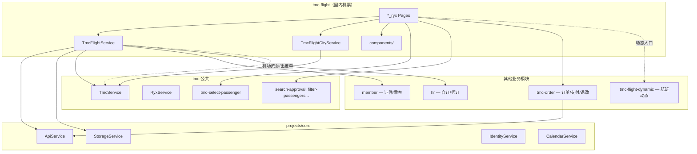
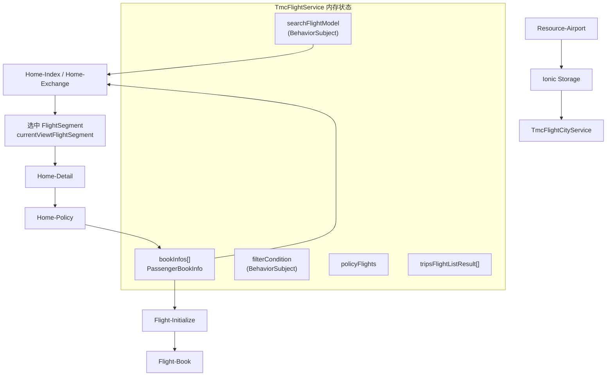

# 机票模块（Legacy ryx）

> **源码路径**：`beeantmobile-main/projects/ryx/src/app/tmc/tmc-flight/`  
> **范围**：国内机票（融易行主线为 `*_ryx` 变体）；国际机票见独立模块 `tmc-international-flight`；航班动态见 `tmc-flight-dynamic`  
> **迁移对照**：[PAGE-API-MATRIX.md](../api/PAGE-API-MATRIX.md)、[H5-RYX-MIGRATION.md](../api/H5-RYX-MIGRATION.md)

本文档描述旧版融易行 **国内机票** 模块的职责、文件结构、依赖关系、数据流与 API，供 H5 迁移时对照业务行为与接口字段。

> **使用原则**：仅作业务与接口对照，不可照搬技术架构、编码规范或 UI 实现（见 [`.cursor/rules/legacy-ryx-reference.mdc`](../../.cursor/rules/legacy-ryx-reference.mdc)）。

---

## 1. 模块主要职责

**企业因公国内机票预订全流程**，覆盖：

| 职责     | 说明                                                                                  |
| -------- | ------------------------------------------------------------------------------------- |
| 搜索条件 | 出发/到达城市、日期、单程/往返、城市 vs 机场级查询（`FromAsAirport` / `ToAsAirport`） |
| 航班列表 | 拉取航班、客户端筛选/排序（直飞、协议价、航司、起降机场、时段、价格）                 |
| 舱位选择 | 航班详情、舱位列表、差标 Policy 校验                                                  |
| 多人预订 | 每位乘客独立选航班/舱位（`bookInfos`），支持往返两段                                  |
| 改签换开 | `Home-Exchange` / `Home-ExchangeDetail` 改签专用流                                    |
| 填单下单 | Initialize → Book，含出差单、审批、联系人、保险、支付类型                             |
| 本地缓存 | 机场/城市资源（`LastUpdateTime` 增量）、上次选中的出发日期                            |

核心状态集中在单例 **`TmcFlightService`**（融易行与通用 TMC 共用，无单独的 `*_ryx.service`），各 Page 通过 Service + RxJS `BehaviorSubject` 共享数据。

---

## 2. 关键文件与职责

### 2.1 模块入口与路由

| 文件                           | 职责                                  |
| ------------------------------ | ------------------------------------- |
| `tmc-flight.module.ts`         | 模块入口                              |
| `tmc-flight.routing.module.ts` | **全部机票路由**（含 `_ryx` / `_en`） |

**融易行页面路由（`tmc-flight.routing.module.ts`）**

| 路由                                | 页面     | 职责                                    |
| ----------------------------------- | -------- | --------------------------------------- |
| `tmc-flight-search_ryx`             | 搜索首页 | 选城市/日期、单程往返、选乘客、发起查询 |
| `tmc-flight-list_ryx`               | 航班列表 | 列表展示、筛选排序、选航班              |
| `tmc-flight-item-cabins_ryx`        | 舱位页   | 某航班的舱位/价格、Policy、选舱         |
| `tmc-flight-selected-bookinfos_ryx` | 已选汇总 | 多乘客/往返已选航班确认                 |
| `tmc-flight-book_ryx`               | 填单下单 | 联系人、出差单、审批、Initialize + Book |

**通用/辅助页面**

| 路由                        | 职责                                                               |
| --------------------------- | ------------------------------------------------------------------ |
| `tmc-flight-select-city`    | 独立选城**路由页**：搜索 + 无限滚动 + 热门/历史（**无**字母 rail） |
| `TmcFlightCityService` 浮层 | 搜索页内嵌选城：**DOM CityPage**，含字母索引、国内/国际 Tab        |
| `tmc-flight-search` 等      | 非 ryx 皮肤或英文 `_en` 变体                                       |

> **路由解析说明**：搜索页跳转列表时使用 `CoreHelper.go(['tmc-flight-list'])`，实际页面由 `CoreHelper.getRoutePath()` 按 App Style（`ryx`）解析到对应 `_ryx` 变体。

**关联但不在 `tmc-flight/` 目录**

| 路由                          | 模块                  | 职责                         |
| ----------------------------- | --------------------- | ---------------------------- |
| `tmc-select-passenger`        | `tmc/`                | 选择乘机人                   |
| `tmc-order-flight-detail_ryx` | `tmc-order/`          | 机票订单详情、退改           |
| `tmc-order-list`              | `tmc-order/`          | 订单列表（退改入口）         |
| `tmc-flight-dynamic`          | `tmc-flight-dynamic/` | 航班动态查询（舱位页可跳转） |

### 2.2 核心 Service

| 文件                                  | 职责                                                                                         |
| ------------------------------------- | -------------------------------------------------------------------------------------------- |
| **`tmc-flight.service.ts`**           | **业务中枢**（~2200 行）：搜索模型、乘客预订信息、列表/详情/Policy/Initialize/Book、超时机制 |
| **`tmc-flight-city.service.ts`**      | 城市/机场选择浮层（见下方 CityPage 说明）                                                    |
| `tmc.service.ts`                      | 机场资源 `Resource-Airport`、出差单 `GetTravelUrl`、支付轮询 `checkPay`、Channel             |
| `tmc-order.service.ts`                | 订单详情、`payOrder`、退票/改签（`RefundFlight`、`ExchangeFlightInitalize` 等）              |
| `member.service.ts` / `hr.service.ts` | 乘客证件、自订/代订类型                                                                      |
| `tmc-flight-dynamic.service.ts`       | 航班动态 Search/Detail（独立模块）                                                           |

> **CityPage 浮层实现**：`tmc-flight-city.service.ts` 内的 `CityPage` 与酒店模块相同模式——通过原生 DOM API 动态创建节点并插入 `<body>`，**不走 Angular Router**；含字母索引、国内/国际 Tab。融易行搜索页主要走此浮层。独立路由页 `tmc-flight-select-city` 则是 Angular 组件，UI 为搜索 + 无限滚动 + 热门/历史 fab，**无**右侧字母 rail。

### 2.3 页面结构（Base + 壳）

每个页面通常为 **`*.base.page.ts`（逻辑）+ `*.page.ts/html/scss`（融易行 UI）**：

```
tmc-flight-search_ryx/
  tmc-flight-search_ryx.base.page.ts   ← 搜索、选城、跳转列表
  tmc-flight-search_ryx.page.ts/html

tmc-flight-list_ryx/
  tmc-flight-list_ryx.base.page.ts     ← 列表、筛选、选航班 → 舱位页
  tmc-flight-list_ryx.page.ts/html

tmc-flight-item-cabins_ryx/
  tmc-flight-item-cabins_ryx.base.page.ts  ← 舱位、Policy、选舱 → 汇总页/填单
  tmc-flight-item-cabins_ryx.page.ts/html

tmc-flight-selected-bookinfos_ryx/
  tmc-flight-selected-bookinfos_ryx.base.page.ts  ← 多乘客已选确认
  tmc-flight-selected-bookinfos_ryx.page.ts/html

tmc-flight-book_ryx/
  tmc-flight-book_ryx.base.page.ts     ← Initialize、Book、支付、跳订单详情
  tmc-flight-book_ryx.page.ts/html
```

### 2.4 共享组件（`tmc-flight/components/`）

| 组件                                        | 职责                                   |
| ------------------------------------------- | -------------------------------------- |
| `fly-list-item` / `flight-segment-item_ryx` | 列表航班卡片                           |
| `fly-filter`                                | 筛选（航司、机场、时段、直飞、协议价） |
| `select-flightsegment-cabin`                | 舱位选择                               |
| `select-flight-passenger`                   | 按乘客选航班                           |
| `price-detail`                              | 价格明细                               |
| `flight-transfer`                           | 中转展示                               |
| `ticketchanging`                            | 改签相关                               |
| `flight-outnumber`                          | 出差单号                               |
| `flightbook-addcontacts`                    | 联系人                                 |
| `select-and-replacebookinfo`                | 替换/重选预订信息                      |
| `flight-dynamic`                            | 航班动态入口                           |

### 2.5 数据模型（`@ear/models` + Service 内）

| 模型                                       | 说明                                                                 |
| ------------------------------------------ | -------------------------------------------------------------------- |
| `SearchFlightModel`                        | 搜索条件（出发/到达 Code、日期、往返、城市实体、`FromAsAirport` 等） |
| `PassengerBookInfo<IFlightSegmentInfo>`    | 乘客 + 已选航段/舱位/Policy                                          |
| `FilterConditionModel`                     | 列表筛选与排序状态                                                   |
| `FlightListResult` / `FlightSegmentEntity` | 列表 API 返回                                                        |
| `FlightPolicy` / `FlightCabinEntity`       | 舱位与差标                                                           |
| `OrderBookDto` / `InitialBookDtoModel`     | 提交订单 / Initialize 返回 DTO                                       |
| `TrafficlineEntity`                        | 机场/城市资源实体                                                    |

### 2.6 目录结构一览

```
projects/ryx/src/app/tmc/tmc-flight/
├── tmc-flight.service.ts           ★ 业务中枢
├── tmc-flight-city.service.ts      城市/机场选择浮层
├── tmc-flight.routing.module.ts    路由
├── tmc-flight-search_ryx/          搜索
├── tmc-flight-list_ryx/            列表
├── tmc-flight-item-cabins_ryx/     舱位
├── tmc-flight-selected-bookinfos_ryx/  已选汇总
├── tmc-flight-book_ryx/            填单
├── tmc-flight-select-city/         独立选城页
├── components/                     列表项、筛选、舱位等
├── pipes/                          舱位类型等管道
└── （另有 _en / 无 _ryx 通用页面变体）

projects/ryx/src/app/tmc/tmc-flight-dynamic/   ← 航班动态（独立子模块）
```

---

## 3. 与其他模块的依赖关系



| 依赖                          | 用途                                           |
| ----------------------------- | ---------------------------------------------- |
| **core/ApiService**           | 所有 `RequestEntity` → Beeant Proxy            |
| **core/StorageService**       | 机场缓存、搜索历史                             |
| **core/IdentityService**      | 登录态；Identity 变更时重置预订                |
| **core/CalendarService**      | 日期选择                                       |
| **TmcService**                | 国内/国际机场资源、出差单、Channel、`checkPay` |
| **MemberService / HrService** | 乘客证件、自订/代订类型                        |
| **TmcOrderService**           | 支付 `payOrder`、订单详情、退票/改签           |
| **TmcFlightCityService**      | 搜索页内嵌选城浮层                             |
| **tmc-select-passenger**      | 搜索页/列表页添加乘机人                        |
| **tmc-flight-dynamic**        | 舱位页跳转航班动态                             |
| **tmc-order**                 | 下单后进机票订单详情                           |

---

## 4. 数据流向

### 4.1 端到端主流程（单程 / 多人）

```mermaid
flowchart LR
  A["搜索<br/>tmc-flight-search_ryx"] --> B["选城市<br/>TmcFlightCityService 浮层"]
  B --> C["选乘客<br/>tmc-select-passenger"]
  C --> D["列表<br/>tmc-flight-list_ryx"]
  D --> E["选航班"]
  E --> F["舱位<br/>tmc-flight-item-cabins_ryx"]
  F --> G["Policy 校验"]
  G --> H["已选汇总<br/>selected-bookinfos_ryx"]
  H --> I["填单<br/>tmc-flight-book_ryx"]
  I --> J["Initialize + Book"]
  J --> K["支付轮询"]
  K --> L["订单详情<br/>tmc-order-flight-detail_ryx"]
```



### 4.2 Service 内状态流



### 4.3 各阶段数据载体

| 阶段       | 写入                                                   | 读取                                      | API                                             |
| ---------- | ------------------------------------------------------ | ----------------------------------------- | ----------------------------------------------- |
| 启动搜索页 | —                                                      | Storage 机场缓存                          | `Resource-Airport`（经 `TmcService`）           |
| 选城市     | `searchFlightModel.fromCity/toCity`, `FromCode/ToCode` | `TmcFlightCityService` 浮层               | —                                               |
| 查列表     | `filterCondition`                                      | `searchFlightModel` + `bookInfos` 乘客 ID | `Home-Index` v2.0                               |
| 选航班     | `currentViewtFlightSegment`                            | Service 内存                              | —                                               |
| 舱位详情   | `FlightSegment.Cabins`                                 | 选中航段                                  | `Home-Detail` v2.0                              |
| 政策校验   | `policyFlights`, `RoomPlan.Rules`                      | 乘客 + 舱位 + TravelFormId                | `Home-Policy`                                   |
| 填单初始化 | `initialBookDto`                                       | `OrderBookDto`                            | `Flight-Initialize`                             |
| 提交订单   | —                                                      | 完整 `OrderBookDto` + Channel             | `Flight-Book`                                   |
| 支付       | —                                                      | `TradeNo`                                 | `TmcService.checkPay` → `orderService.payOrder` |

### 4.4 往返票补充流程

```
去程选舱完成 → bookInfos[tripType = departureTrip]
            → 切换 searchFlightModel 为返程（from/to 互换）
            → 再查 Home-Index → 选返程航班/舱位
            → bookInfos[tripType = returnTrip]
            → tmc-flight-selected-bookinfos_ryx 汇总
            → tmc-flight-book_ryx 填单
```

### 4.5 改签流程（从订单进入）

```
订单列表/详情 → onExchangeFlightTicket
             → TmcOrderService.getExchangeFlightTrip (ExchangeFlightInitalize)
             → 设置 searchFlightModel.isExchange = true
             → Home-Exchange（改签航班列表）
             → Home-ExchangeDetail（改签详情）
             → 后续与正常预订类似:
               舱位 → 填单 → Flight-Book / Flight-ExchangeBook
```

### 4.6 下单后路径（融易行）

```
onBook() → flightService.bookFlight(bookDto)
         → TradeNo 有效
         → checkPay(TradeNo) 轮询（TmcService.checkPay）
         → orderService.payOrder({ orderId })
         → CoreHelper.goRoot('tmc-order-flight-detail', { orderId })
         → flightService.removeAllBookInfos()
```

> 注：机票融易行下单后**直接进机票订单详情页**，不走 `tmc-checkout-success`（与酒店走订单列表不同）。

### 4.7 列表页超时机制

- 列表/详情拉取后启动 **10 分钟** `pagePopTimeout`（`pagePopTimeoutTime = 10 * 60 * 1000`）
- 超时后弹窗要求刷新（`showTimeoutPop`），防止价格失效
- `checkIfTimeout()` 在选舱/填单前也会校验

---

## 5. 重要 API / 接口

所有请求经 **`ApiService`**，格式为 `RequestEntity { Method, Data, Version }` → Beeant Proxy。

### 5.1 资源类（`TmcService`）

| Method                                        | Service 方法                 | 用途          | 主要 Data 字段   |
| --------------------------------------------- | ---------------------------- | ------------- | ---------------- |
| `TmcApiHomeUrl-Resource-Airport`              | `getDomesticAirports()`      | 国内机场/城市 | `LastUpdateTime` |
| `TmcApiHomeUrl-Resource-InternationalAirport` | `getInternationalAirports()` | 国际机场      | `LastUpdateTime` |
| `TmcApiBookUrl-Home-GetTravelUrl`             | `getTravelUrl()`             | 出差单列表    | —                |

### 5.2 查询类（`TmcFlightService`）

| Method                                | Service 方法                          | 用途              | 主要 Data 字段                                                                             |
| ------------------------------------- | ------------------------------------- | ----------------- | ------------------------------------------------------------------------------------------ |
| `TmcApiFlightUrl-Home-Index`          | `getFlightList()`                     | **航班列表**      | `Date`, `FromCode`, `ToCode`, `FromAsAirport`, `ToAsAirport`；Version **2.0**，Timeout 60s |
| `TmcApiFlightUrl-Home-Detail`         | `getFlightSegmentDetail()`            | **航班/舱位详情** | `FlightNumber`, `FromCode`, `ToCode`, `DetailKey`, `ADTPtcs`                               |
| `TmcApiFlightUrl-Home-Policy`         | `getHotelPolicyAsync()` 等            | **差标/违标**     | `RoomPlans`, `Passengers`, `TravelFromId`, `CityCode`                                      |
| `TmcApiFlightUrl-Home-Exchange`       | `getExchangeFlightList()`             | 改签航班列表      | + `ExchangeTicketId`, `BookType`                                                           |
| `TmcApiFlightUrl-Home-ExchangeDetail` | `getFlightExchangeDetailFromServer()` | 改签详情          | + `ExchangeTicketId`                                                                       |

### 5.3 预订类（`TmcFlightService`）

| Method                                                   | Service 方法                          | 用途             |
| -------------------------------------------------------- | ------------------------------------- | ---------------- |
| `TmcApiBookUrl-Flight-Initialize`                        | `getInitializeBookDto()`              | 预订初始化       |
| `TmcApiBookUrl-Flight-Book`                              | `bookFlight()`                        | 提交订单         |
| `TmcApiBookUrl-Flight-GetTravelNDCFlightCabinRuleResult` | `getTravelNDCFlightCabinRuleResult()` | NDC 舱位规则文案 |

### 5.4 订单/退改/支付（`TmcOrderService` / `TmcService`）

| Method                                          | 用途                 |
| ----------------------------------------------- | -------------------- |
| `TmcApiOrderUrl-Order-Detail`                   | 订单详情             |
| `TmcApiOrderUrl-Order-GetOrderPays`             | 支付渠道             |
| `TmcApiOrderUrl-Pay-Create`                     | 发起支付             |
| `TmcApiOrderUrl-Order-RefundFlight`             | 自愿退票             |
| `TmcApiOrderUrl-Order-NonVoluntaryRefundFlight` | 非自愿退票           |
| `TmcApiOrderUrl-Order-ExchangeFlightInitalize`  | 改签初始化           |
| `TmcApiBookUrl-Flight-ExchangeBook`             | 改签下单             |
| （内部）`TmcService.checkPay`                   | 下单后轮询是否可支付 |

### 5.5 航班动态（`tmc-flight-dynamic`，独立模块）

| Method                               | 用途                |
| ------------------------------------ | ------------------- |
| `TmcApiFlightDynamicUrl-Home-Search` | 按航班号/日期查动态 |
| `TmcApiFlightDynamicUrl-Home-Detail` | 动态详情            |

### 5.6 API 网关配置

机票 API 基址在 `ApiConfig.json` 的 `Urls.TmcApiFlightUrl`，例如：

```
https://flight-api-tmc.rongtrip.cn  （生产）
```

---

## 6. 与新 monorepo 对照

| Legacy 页面                         | 新 H5 路由                 | 迁移状态                                                                  |
| ----------------------------------- | -------------------------- | ------------------------------------------------------------------------- |
| `tmc-flight-search_ryx`             | `/flight`                  | 部分（缺往返/多人/改签入口）                                              |
| `tmc-flight-list_ryx`               | `/flight/list`             | 部分，筛选简化                                                            |
| `tmc-flight-item-cabins_ryx`        | `/flight/:flightId/cabins` | 部分，Policy/多人未完整                                                   |
| `tmc-flight-selected-bookinfos_ryx` | （合并在 cabins 流程内）   | 未单独迁                                                                  |
| `tmc-flight-book_ryx`               | `/flight/book`（规划中）   | 未迁                                                                      |
| `tmc-flight-select-city` / 浮层     | `/flight/select-city`      | 部分迁：新 H5 为字母索引 + 右侧 rail，与 legacy 浮层/独立页 UI 模式均不同 |
| 下单后                              | 订单详情 / 支付            | 未迁                                                                      |
| `tmc-order-flight-detail_ryx`       | `/orders/flight/:id`       | 未迁                                                                      |

列表页迁移执行策略（Proxy 优先、Mock 最后）：[flight-list-migration-strategy.md](../api/domains/flight-list-migration-strategy.md)

新 monorepo 当前 API 封装见 `packages/api/src/apis/flight.ts`（`getDomesticAirports`、`getAirports`、`searchFlights`）。完整页面对照见 [PAGE-API-MATRIX.md](../api/PAGE-API-MATRIX.md)。
