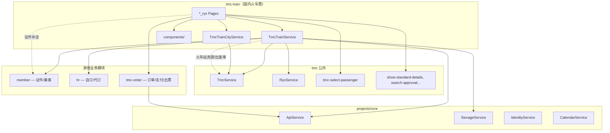
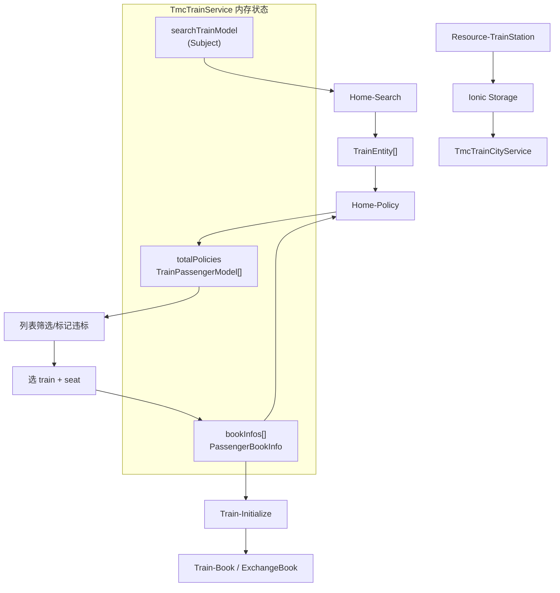

# 火车票模块（Legacy ryx）

> **源码路径**：`beeantmobile-main/projects/ryx/src/app/tmc/tmc-train/`  
> **范围**：国内火车票（融易行主线为 `*_ryx` 变体）  
> **迁移对照**：[PAGE-API-MATRIX.md](../api/PAGE-API-MATRIX.md)、[H5-RYX-MIGRATION.md](../api/H5-RYX-MIGRATION.md)

本文档描述旧版融易行 **国内火车票** 模块的职责、文件结构、依赖关系、数据流与 API，供 H5 迁移时对照业务行为与接口字段。

> **使用原则**：仅作业务与接口对照，不可照搬技术架构、编码规范或 UI 实现（见 [`.cursor/rules/legacy-ryx-reference.mdc`](../../.cursor/rules/legacy-ryx-reference.mdc)）。

---

## 1. 模块主要职责

**企业因公国内火车票预订全流程**，覆盖：

| 职责       | 说明                                                              |
| ---------- | ----------------------------------------------------------------- |
| 搜索条件   | 出发/到达站、日期、单程/往返、车次号（可选）                      |
| 车次列表   | 拉取车次、客户端筛选/排序（车型、时段、席别、有票）               |
| 席别选择   | 在列表页直接选席别（无独立舱位页），Policy 差标校验               |
| 多人预订   | 每位乘客独立选车次/席别（`bookInfos`），支持往返两段              |
| 12306 账号 | 绑定/解绑/验证 12306 账号，下单前校验                             |
| 选座       | 填单页 `seat-picker` 选具体座位（A/B/C/D/F 等）                   |
| 改签       | 从订单进入改签流（`GetExchangeInfo` → 重新搜索 → `ExchangeBook`） |
| 填单下单   | Initialize → Book / ExchangeBook，含出差单、审批、支付类型        |
| 本地缓存   | 火车站资源（`LastUpdateTime` 增量）、上次出发日期、常用站点       |

核心状态集中在单例 **`TmcTrainService`**（融易行与通用 TMC 共用），各 Page 通过 Service + RxJS `BehaviorSubject` / `Subject` 共享数据。

与机票模块的差异：**列表页即完成席别选择**，选完后直接进入填单页，没有独立的「舱位页 / 已选汇总页」路由。

---

## 2. 关键文件与职责

### 2.1 模块入口与路由

| 文件                          | 职责                                  |
| ----------------------------- | ------------------------------------- |
| `tmc-train.module.ts`         | 模块入口                              |
| `tmc-train-routing.module.ts` | **全部火车路由**（含 `_ryx` / `_en`） |

**融易行页面路由（`tmc-train-routing.module.ts`）**

| 路由                   | 页面     | 职责                                           |
| ---------------------- | -------- | ---------------------------------------------- |
| `tmc-train-search_ryx` | 搜索首页 | 选站点/日期、单程往返、选乘客/出差单、发起查询 |
| `tmc-train-list_ryx`   | 车次列表 | 列表展示、筛选排序、选席别、Policy 过滤        |
| `tmc-train-book_ryx`   | 填单下单 | 12306 验证、选座、Initialize + Book、支付      |

**通用/辅助页面**

| 路由                       | 职责                               |
| -------------------------- | ---------------------------------- |
| `tmc-train-select-station` | 独立选站页（字母索引、热门、历史） |
| `tmc-train-search` 等      | 非 ryx 皮肤或英文 `_en` 变体       |

> **路由解析说明**：搜索页跳转列表时使用 `CoreHelper.getRoutePath("tmc-train-list")`，由 Style 解析到 `_ryx` 变体。

**关联但不在 `tmc-train/` 目录**

| 路由                         | 模块         | 职责                               |
| ---------------------------- | ------------ | ---------------------------------- |
| `tmc-select-passenger`       | `tmc/`       | 选择乘车人                         |
| `tmc-order-train-detail_ryx` | `tmc-order/` | 火车订单详情、退票/改签/出票       |
| `tmc-order-list`             | `tmc-order/` | 订单列表（通用线填单后可能跳转）   |
| `tmc-checkout-success`       | `tmc/`       | 通用线填单成功后跳转（ryx 已不用） |
| `member-credential-list`     | `member/`    | 证件管理（填单页跳转补全证件）     |

### 2.2 核心 Service

| 文件                                  | 职责                                                                                                            |
| ------------------------------------- | --------------------------------------------------------------------------------------------------------------- |
| **`tmc-train.service.ts`**            | **业务中枢**（~1470 行）：搜索模型、乘客预订信息、Search/Policy/Schedule/Initialize/Book、12306 绑定、改签/退票 |
| **`tmc-train-city.service.ts`**       | 站点选择浮层（DOM `CityPage`，字母索引、热门、历史；实现模式同酒店/机票浮层）                                   |
| `tmc.service.ts`                      | 火车站资源 `Resource-TrainStation`、出差单、Channel、支付轮询 `checkPay`                                        |
| `tmc-order.service.ts`                | 订单详情、`payOrder`、出票 `IssueTrain`、取消 `CancelTrain`                                                     |
| `member.service.ts` / `hr.service.ts` | 乘客证件、自订/代订类型                                                                                         |
| `ryx.service.ts`                      | 出差单选人（`ICanSelectPassenger`）                                                                             |

> **CityPage 浮层实现**：`tmc-train-city.service.ts` 复用与酒店/机票相同的 DOM 浮层模式（`document.createElement` 插入 `<body>`，不走 Router）。另有独立路由页 `tmc-train-select-station` 作为 Angular 组件选站入口。

### 2.3 页面结构（Base + 壳）

```
tmc-train-search_ryx/
  tmc-train-search_ryx.base.ts     ← 搜索、选站、选乘客、跳转列表
  tmc-train-search_ryx.page.ts/html

tmc-train-list_ryx/
  tmc-train-list_ryx.base.page.ts  ← 列表、Policy、选席别 → 填单页
  tmc-train-list_ryx.page.ts/html

tmc-train-book_ryx/
  tmc-train-book_ryx.base.page.ts  ← 12306 验证、选座、Initialize、Book、跳订单详情
  tmc-train-book_ryx.page.ts/html

tmc-train-select-station/
  tmc-train-select-station.base.page.ts  ← 独立选站页逻辑
  tmc-train-select-station.page.ts/html
```

### 2.4 共享组件（`tmc-train/components/`）

| 组件                               | 职责                            |
| ---------------------------------- | ------------------------------- |
| `train-list-item` / `_ryx` / `_en` | 车次卡片、席别按钮、选座入口    |
| `train-filter`                     | 筛选（车型、时段、席别、有票）  |
| `seat-picker`                      | 填单页选具体座位（A/B/C/D/F）   |
| `selected-train-segment-info`      | 已选车次信息展示（Modal）       |
| `selected-train-segment-info-df`   | 融易行版已选信息 Modal          |
| `select-and-replaceinfo`           | 替换/重选预订信息               |
| `validate12306`                    | 12306 账号绑定/验证码校验       |
| `train-refund`                     | 退票确认                        |
| `trainschedule`                    | 经停站时刻表（`Home-Schedule`） |
| `train-ticket`                     | 车票样式展示                    |
| `warm-prompt`                      | 预订须知                        |

### 2.5 数据模型（Service 内 + `@ear/models`）

| 模型                                   | 说明                                                          |
| -------------------------------------- | ------------------------------------------------------------- |
| `SearchTrainModel`                     | 搜索条件（`FromStation`/`ToStation`、`Date`、往返、改签标志） |
| `PassengerBookInfo<ITrainInfo>`        | 乘客 + 已选车次/席别/选座位置                                 |
| `ICurrentViewtTainItem`                | 当前选中 `{ train, selectedSeat }`                            |
| `TrainEntity` / `TrainSeatEntity`      | 车次与席别                                                    |
| `TrainPassengerModel`                  | Policy 返回的乘客差标                                         |
| `ExchangeTrainModel`                   | 改签信息                                                      |
| `OrderBookDto` / `InitialBookDtoModel` | 提交订单 / Initialize 返回 DTO                                |
| `TrafficlineEntity`                    | 火车站资源实体                                                |

### 2.6 目录结构一览

```
projects/ryx/src/app/tmc/tmc-train/
├── tmc-train.service.ts            ★ 业务中枢
├── tmc-train-city.service.ts       站点选择浮层
├── tmc-train-routing.module.ts     路由
├── tmc-train-search_ryx/           搜索
├── tmc-train-list_ryx/             列表 + 选席别
├── tmc-train-book_ryx/             填单
├── tmc-train-select-station/       独立选站页
├── components/                     列表项、筛选、选座、12306 等
└── （另有 _en / 无 _ryx 通用页面变体）
```

---

## 3. 与其他模块的依赖关系



| 依赖                          | 用途                                    |
| ----------------------------- | --------------------------------------- |
| **core/ApiService**           | 所有 `RequestEntity` → Beeant Proxy     |
| **core/StorageService**       | 上次出发日期、常用站点缓存              |
| **core/IdentityService**      | 登录态；Identity 变更时刷新站点资源     |
| **core/CalendarService**      | 日期选择、时刻格式化                    |
| **TmcService**                | 火车站资源、出差单、Channel、`checkPay` |
| **RyxService**                | 出差单关联选人                          |
| **MemberService / HrService** | 乘客证件、自订/代订类型                 |
| **TmcOrderService**           | 支付 `payOrder`、出票、取消、订单详情   |
| **TmcTrainCityService**       | 搜索页内嵌选站浮层                      |
| **tmc-select-passenger**      | 搜索页/列表页添加乘车人                 |
| **member-credential-list**    | 填单页跳转补全证件                      |
| **tmc-order**                 | 下单后进火车订单详情                    |

---

## 4. 数据流向

### 4.1 端到端主流程（单程 / 多人）

```mermaid
flowchart LR
  A["搜索<br/>tmc-train-search_ryx"] --> B["选站点<br/>TmcTrainCityService 浮层"]
  B --> C["选乘客/出差单<br/>tmc-select-passenger"]
  C --> D["列表<br/>tmc-train-list_ryx"]
  D --> E["Search + Policy"]
  E --> F["选席别<br/>onBookTicket"]
  F --> G["填单<br/>tmc-train-book_ryx"]
  G --> H["12306 验证 + 选座"]
  H --> I["Initialize + Book"]
  I --> J["支付轮询"]
  J --> K["订单详情<br/>tmc-order-train-detail_ryx"]
```



### 4.2 Service 内状态流



### 4.3 各阶段数据载体

| 阶段       | 写入                                                        | 读取                             | API                                               |
| ---------- | ----------------------------------------------------------- | -------------------------------- | ------------------------------------------------- |
| 启动搜索页 | —                                                           | Storage 站点缓存                 | `Resource-TrainStation`（经 `TmcService`）        |
| 选站点     | `searchTrainModel.fromCity/toCity`, `FromStation/ToStation` | 浮层 / 独立选站页                | —                                                 |
| 查列表     | `trains[]`（内存）                                          | `searchTrainModel` + `bookInfos` | `Home-Search` v1.0                                |
| 差标校验   | `totalPolicies`                                             | 乘客 AccountId + TravelFormId    | `Home-Policy` v2.0                                |
| 选席别     | `bookInfos[].bookInfo`                                      | `{ train, selectedSeat }`        | —（列表页内完成）                                 |
| 经停站     | —                                                           | 车次号 + 日期                    | `Home-Schedule` v1.0                              |
| 12306 验证 | —                                                           | 账号/密码/验证码                 | `Train-AccountValidate` / `Train-CodeValidate` 等 |
| 填单初始化 | `initialBookDto`                                            | `OrderBookDto`                   | `Train-Initialize`                                |
| 提交订单   | —                                                           | 完整 `OrderBookDto` + Channel    | `Train-Book` 或 `Train-ExchangeBook`              |
| 支付       | —                                                           | `TradeNo`                        | `TmcService.checkPay` → `orderService.payOrder`   |

### 4.4 列表加载细节（`loadPolicyedTrainsAsync`）

```
searchAsync(SearchTrainModel)          → Home-Search 获取原始车次
  → 区分白名单/非白名单乘客
  → policyAsync(trains, passengerIds) → Home-Policy 获取差标
  → 合并 TrainPolicies 到列表展示（违标标记、过滤）
  → 客户端 filterTrains（车型/时段/席别/有票）
  → filterPassengerPolicyTrains（按当前筛选乘客过滤）
  → 分页渲染 vmTrains
```

### 4.5 往返票补充流程

```
去程选席完成 → bookInfos[tripType = departureTrip]
            → selectReturnTrip() 切换 searchTrainModel（站点互换、tripType = returnTrip）
            → 再查 Home-Search → 选返程车次/席别
            → bookInfos[tripType = returnTrip]
            → tmc-train-book_ryx 填单（合并两段）
```

### 4.6 改签流程（从订单进入）

```
订单列表/详情 → onExchangeTrainTicket
             → getExchangeInfo(TicketId)        → Home-GetExchangeInfo
             → 写入 bookInfos[0].exchangeInfo
             → 设置 searchTrainModel.isExchange = true
             → 跳转 tmc-train-search_ryx 重新搜索
             → 列表选新车次/席别
             → tmc-train-book_ryx
             → exchangeBook(bookDto)            → Train-ExchangeBook
```

### 4.7 下单后路径（融易行）

```
onBook() → trainService.bookTrain(bookDto)  // 或 exchangeBook
         → TradeNo 有效
         → checkPay(TradeNo) 轮询
         → orderService.payOrder({ orderId })（若需支付）
         → goToDetailPage(TradeNo)
         → CoreHelper.go('tmc-order-train-detail', { orderId })
         → trainService.removeAllBookInfos()
```

> 注：融易行 **`goToMyOrders`（跳订单列表）已被注释**，实际走 **火车订单详情页**。通用线 `tmc-train-book` 仍可能跳 `tmc-checkout-success`。

### 4.8 重选车次

```
列表/填单页触发 reselect
  → 清空该乘客 bookInfo
  → CoreHelper.go('tmc-train-list', { doRefresh: true })
  → 重新 Search + Policy
```

---

## 5. 重要 API / 接口

所有请求经 **`ApiService`**，格式为 `RequestEntity { Method, Data, Version }` → Beeant Proxy。

### 5.1 资源类（`TmcService`）

| Method                                | Service 方法         | 用途       | 主要 Data 字段   |
| ------------------------------------- | -------------------- | ---------- | ---------------- |
| `TmcApiHomeUrl-Resource-TrainStation` | `getStationsAsync()` | 火车站资源 | `LastUpdateTime` |
| `TmcApiBookUrl-Home-GetTravelUrl`     | `getTravelUrl()`     | 出差单列表 | —                |

### 5.2 查询类（`TmcTrainService`）

| Method                                  | Service 方法        | 用途           | 主要 Data 字段                                                                |
| --------------------------------------- | ------------------- | -------------- | ----------------------------------------------------------------------------- |
| `TmcApiTrainUrl-Home-Search`            | `searchAsync()`     | **车次列表**   | `Date`, `FromStation`, `ToStation`, `TrainCode`；Version **1.0**，Timeout 60s |
| `TmcApiTrainUrl-Home-Schedule`          | `scheduleAsync()`   | **经停站时刻** | `Date`, `FromStation`, `ToStation`, `TrainNo`, `TrainCode`                    |
| `TmcApiTrainUrl-Home-Policy`            | `policyAsync()`     | **差标/违标**  | `Passengers`, `Trains`（JSON 字符串）, `TravelFromId`；Version **2.0**        |
| `TmcApiTrainUrl-Home-GetExchangeInfo`   | `getExchangeInfo()` | 改签信息       | `TicketId`                                                                    |
| `TmcApiTrainUrl-Home-GetTrainPassenger` | `refund()` 前置     | 退票乘客信息   | `TicketId`                                                                    |

### 5.3 预订类（`TmcTrainService`）

| Method                             | Service 方法             | 用途       |
| ---------------------------------- | ------------------------ | ---------- |
| `TmcApiBookUrl-Train-Initialize`   | `getInitializeBookDto()` | 预订初始化 |
| `TmcApiBookUrl-Train-Book`         | `bookTrain()`            | 提交订单   |
| `TmcApiBookUrl-Train-ExchangeBook` | `exchangeBook()`         | 改签下单   |

### 5.4 12306 账号（`TmcTrainService`）

| Method                                     | Service 方法        | 用途              |
| ------------------------------------------ | ------------------- | ----------------- |
| `TmcApiBookUrl-Train-Bind`                 | `bind12306()`       | 绑定 12306 账号   |
| `TmcApiBookUrl-Train-Unbind`               | `Unbind12306()`     | 解绑              |
| `TmcApiBookUrl-Train-AccountValidate`      | `accountValidate()` | 账号密码验证      |
| `TmcApiBookUrl-Train-CodeValidate`         | —                   | 短信验证码验证    |
| `TmcApiBookUrl-Train-GetContacts`          | —                   | 获取 12306 常旅客 |
| `TmcApiBookUrl-Train-GetBindAccountNumber` | —                   | 查询已绑定账号    |

### 5.5 订单/退改/出票（`TmcOrderService` / `TmcTrainService`）

| Method                              | 用途                 |
| ----------------------------------- | -------------------- |
| `TmcApiOrderUrl-Order-Detail`       | 订单详情             |
| `TmcApiOrderUrl-Order-GetOrderPays` | 支付渠道             |
| `TmcApiOrderUrl-Pay-Create`         | 发起支付             |
| `TmcApiOrderUrl-Train-Refund`       | 退票                 |
| `TmcApiOrderUrl-Order-IssueTrain`   | 出票                 |
| `TmcApiOrderUrl-Order-CancelTrain`  | 取消火车订单         |
| （内部）`TmcService.checkPay`       | 下单后轮询是否可支付 |

### 5.6 API 网关配置

火车票 API 基址在 `ApiConfig.json` 的 `Urls.TmcApiTrainUrl`，例如：

```
https://train-api-tmc.rongtrip.cn  （生产）
```

---

## 6. 与新 monorepo 对照

| Legacy 页面                  | 新 H5 路由          | 迁移状态                  |
| ---------------------------- | ------------------- | ------------------------- |
| `tmc-train-search_ryx`       | `/train`            | 部分（缺往返/改签/12306） |
| `tmc-train-list_ryx`         | `/train/list`       | 部分，Policy/筛选简化     |
| `tmc-train-book_ryx`         | `/train/book`       | 未迁                      |
| 选站浮层 / 独立选站页        | （待建）            | 未迁                      |
| 下单后                       | 订单详情 / 支付     | 未迁                      |
| `tmc-order-train-detail_ryx` | `/orders/train/:id` | 未迁                      |

新 monorepo 当前 API 封装见 `packages/api/src/apis/train.ts`（`getStations`、`searchTrains`）。完整页面对照见 [PAGE-API-MATRIX.md](../api/PAGE-API-MATRIX.md)。
