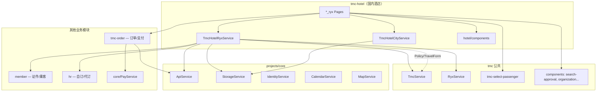
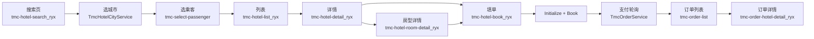
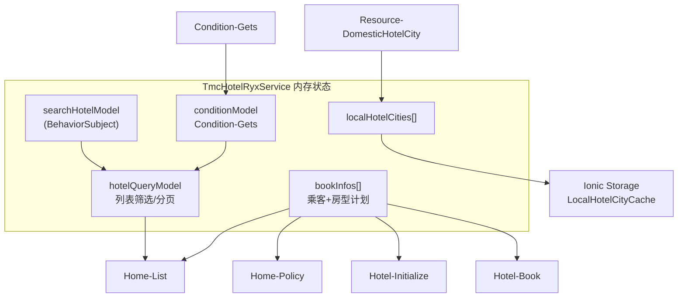

# 酒店模块（Legacy ryx）

> **源码路径**：`beeantmobile-main/projects/ryx/src/app/tmc/tmc-hotel/`  
> **范围**：国内酒店（融易行主线为 `*_ryx` 变体）；国际酒店见独立模块 `tmc-international-hotel`  
> **迁移对照**：[domains/hotel.md](../api/domains/hotel.md)、[PAGE-API-MATRIX.md](../api/PAGE-API-MATRIX.md)

本文档描述旧版融易行 **国内酒店** 模块的职责、文件结构、依赖关系、数据流与 API，供 H5 迁移时对照业务行为与接口字段。

> **使用原则**：仅作业务与接口对照，不可照搬技术架构、编码规范或 UI 实现（见 [`.cursor/rules/legacy-ryx-reference.mdc`](../../.cursor/rules/legacy-ryx-reference.mdc)）。

---

## 1. 模块主要职责

**企业因公国内酒店预订全流程**，覆盖：

| 职责     | 说明                                                       |
| -------- | ---------------------------------------------------------- |
| 搜索条件 | 目的地城市、入住/离店日期、关键词/定位、协议/特价酒店类型  |
| 资源查询 | 酒店列表（分页 + 筛选）、详情、房型/价格计划               |
| 合规校验 | 差旅政策（Policy）、出差单（TravelForm）、超标原因、审批人 |
| 多人预订 | 按乘客维度维护 `bookInfos`，支持合住/分房逻辑              |
| 下单支付 | Initialize → Book → 轮询支付状态 → 跳转订单                |
| 本地缓存 | 国内酒店城市列表（`LastUpdateTime` 增量）、搜索条件        |

核心状态集中在 **`TmcHotelRyxService`**（融易行）/ **`TmcHotelService`**（通用 TMC 线），各 Page 通过 Service + RxJS `BehaviorSubject` 共享数据。

---

## 2. 关键文件与职责

### 2.1 模块入口与路由

| 文件                              | 职责                        |
| --------------------------------- | --------------------------- |
| `tmc-hotel.module.ts`             | 注册通用酒店子模块          |
| `tmc-hotel_ryx.module.ts`         | 融易行酒店模块入口          |
| `tmc-hotel-routing.module.ts`     | 通用路由（含 `_en` 英文版） |
| `tmc-hotel_ryx-routing.module.ts` | **融易行路由**（见下表）    |

**融易行页面路由（`tmc-hotel_ryx-routing.module.ts`）**

| 路由                        | 页面       | 职责                                     |
| --------------------------- | ---------- | ---------------------------------------- |
| `tmc-hotel-search_ryx`      | 搜索首页   | 选城市/日期、选乘客、发起查询            |
| `tmc-hotel-searchtext_ryx`  | 关键词搜索 | 酒店名/地标搜索                          |
| `tmc-hotel-list_ryx`        | 列表       | 分页列表、星级/区域/协议筛选             |
| `tmc-hotel-detail_ryx`      | 酒店详情   | 房型列表、政策校验入口                   |
| `tmc-hotel-room-detail_ryx` | 房型详情   | 单个房型/计划详情                        |
| `tmc-hotel-show-images_ryx` | 图片浏览   | 酒店/房间图集                            |
| `tmc-hotel-book_ryx`        | 填单下单   | 联系人、出差单、审批、支付类型、提交订单 |

**关联但不在 `tmc-hotel/` 目录**

| 路由                         | 模块         | 职责                   |
| ---------------------------- | ------------ | ---------------------- |
| `tmc-order-hotel-detail_ryx` | `tmc-order/` | 酒店订单详情、取消     |
| `tmc-order-list`             | `tmc-order/` | 下单成功后跳转订单列表 |
| `tmc-select-passenger`       | `tmc/`       | 选择入住乘客           |
| `tmc-hotel-map`              | `tmc-hotel/` | 地图（通用线）         |

### 2.2 核心 Service

| 文件                                  | 职责                                                                                       |
| ------------------------------------- | ------------------------------------------------------------------------------------------ |
| **`tmc-hotel_ryx.service.ts`**        | 融易行酒店**业务中枢**：搜索模型、乘客预订信息、API 调用、城市缓存、Policy/Initialize/Book |
| `tmc-hotel.service.ts`                | 通用 TMC 线，逻辑与 ryx 版高度重复                                                         |
| **`tmc-hotel-city.service.ts`**       | 城市选择浮层（见下方 CityPage 说明）                                                       |
| `tmc.service.ts`                      | 出差单 `GetTravelUrl`、TMC 公司、Channel、推荐酒店等共享能力（**不含**酒店城市资源）       |
| `tmc-order.service.ts`                | 订单详情、支付、取消酒店订单                                                               |
| `member.service.ts` / `hr.service.ts` | 乘客证件、自订/代订类型                                                                    |

> **CityPage 浮层实现**：`tmc-hotel-city.service.ts` 内的 `CityPage` 通过原生 DOM API（`document.createElement`、`document.body.appendChild` 等）动态构建 UI 并插入 `<body>`，**不走 Angular Router**。搜索页调用 `onSelectCity()` 打开/关闭浮层，支持字母索引、热门、历史。这与 `tmc-hotel-*_ryx` 路由页面是两套 UI 机制。

### 2.3 页面结构（Base + 壳）

每个页面通常为 **`*.base.page.ts`（逻辑）+ `*.page.ts/html/scss`（融易行 UI）**：

```
tmc-hotel-search_ryx/
  tmc-hotel-search_ryx.base.page.ts   ← 搜索逻辑、跳转
  tmc-hotel-search_ryx.page.ts/html   ← 融易行 UI

tmc-hotel-list_ryx/
  tmc-hotel-list_ryx.base.page.ts     ← 列表加载、筛选、无限滚动
  tmc-hotel-list_ryx.page.ts          ← 继承 Base

tmc-hotel-book_ryx/
  tmc-hotel-book_ryx.base.page.ts     ← 填单、Initialize、Book、支付
  tmc-hotel-book_ryx.page.ts/html
```

### 2.4 共享组件（`tmc-hotel/components/`）

| 组件                                | 职责                                   |
| ----------------------------------- | -------------------------------------- |
| `hotel-query` / `hotel-query_ryx`   | 列表页筛选 Tab（星级、区域、协议类型） |
| `hotel-filter` / `hotel-filter_ryx` | 筛选面板                               |
| `hotel-list-item` / `_ryx`          | 列表卡片                               |
| `room-plan-item`                    | 价格计划行                             |
| `room-detail`                       | 房型详情块                             |
| `hotel-outnumber`                   | 出差单号 / outnumber                   |
| `warranty`                          | 担保/预订须知确认                      |
| `date-city_ryx`                     | 日期 + 城市选择区                      |
| `show-freebook-tip`                 | 「随心住」提示                         |

### 2.5 数据模型（`@ear/models`）

Service 中大量使用的实体：

| 模型                                  | 说明                                        |
| ------------------------------------- | ------------------------------------------- |
| `SearchHotelModel`                    | 搜索条件（城市、日期、关键词、定位）        |
| `HotelQueryEntity`                    | 列表查询参数（分页、筛选、Stars 等）        |
| `HotelDayPriceEntity` / `HotelEntity` | 列表/详情酒店                               |
| `RoomEntity` / `RoomPlanEntity`       | 房型与价格计划                              |
| `PassengerBookInfo<IHotelInfo>`       | 乘客 + 所选房间计划                         |
| `OrderBookDto`                        | 提交订单 DTO                                |
| `InitialBookDtoModel`                 | Initialize 返回（服务费、超标原因、审批等） |

### 2.6 目录结构一览

```
projects/ryx/src/app/tmc/tmc-hotel/
├── tmc-hotel_ryx.service.ts      ★ 融易行业务中枢
├── tmc-hotel.service.ts          通用线（逻辑重复）
├── tmc-hotel-city.service.ts     城市选择浮层
├── tmc-hotel_ryx-routing.module.ts
├── tmc-hotel-search_ryx/         搜索
├── tmc-hotel-searchtext_ryx/     关键词
├── tmc-hotel-list_ryx/           列表 + 筛选
├── tmc-hotel-detail_ryx/         详情
├── tmc-hotel-room-detail_ryx/    房型
├── tmc-hotel-show-images_ryx/    图片
├── tmc-hotel-book_ryx/           填单下单
├── components/                   筛选、列表项、担保等
└── （另有 _en / 无 _ryx 通用页面变体）
```

---

## 3. 与其他模块的依赖关系



| 依赖                          | 用途                                  |
| ----------------------------- | ------------------------------------- |
| **core/ApiService**           | 所有 `RequestEntity` → `/Home/Proxy`  |
| **core/StorageService**       | 城市缓存 `LocalHotelCityCache`        |
| **core/IdentityService**      | 登录态；Identity 变更时重置预订       |
| **core/CalendarService**      | 日期选择、晚数计算                    |
| **core/MapService**           | 定位 → `GetCityByMap`                 |
| **TmcService**                | 出差单、TMC 配置、Channel、Agent 模式 |
| **MemberService / HrService** | 乘客证件、自订类型                    |
| **TmcOrderService**           | 支付 `payOrder`、订单详情、取消       |
| **tmc-select-passenger**      | 搜索页/详情页选乘客                   |
| **tmc-order**                 | 下单后进订单列表/订单详情             |

---

## 4. 数据流向

### 4.1 端到端主流程



### 4.2 Service 内状态流



### 4.3 各阶段数据载体

| 阶段       | 写入                               | 读取                             | API                                                     |
| ---------- | ---------------------------------- | -------------------------------- | ------------------------------------------------------- |
| 启动搜索页 | —                                  | Storage 城市缓存                 | `Resource-DomesticHotelCity`                            |
| 选城市     | `searchHotelModel.destinationCity` | `TmcHotelCityService` 浮层       | —                                                       |
| 查列表     | `hotelQueryModel`                  | `searchHotelModel` + `bookInfos` | `Home-List`                                             |
| 加载筛选   | `conditionModel`                   | 城市 Code                        | `Condition-Gets`                                        |
| 看详情     | 当前酒店/房型                      | `searchHotelModel` 日期          | `Home-Detail`                                           |
| 政策校验   | `RoomPlan.Rules`                   | 乘客 AccountId + TravelFormId    | `Home-Policy`                                           |
| 填单初始化 | `initialBookDto`                   | `OrderBookDto`                   | `Hotel-Initialize`                                      |
| 提交订单   | —                                  | 完整 `OrderBookDto`              | `Hotel-Book`                                            |
| 支付       | —                                  | `TradeNo`                        | `orderService.payOrder` → `GetOrderPays` / `Pay-Create` |

### 4.4 下单后路径（融易行）

```
onBook() → hotelService.onBook(bookDto)
         → TradeNo 有效
         → checkPay(TradeNo) 轮询
         → orderService.payOrder({ orderId })
         → goToMyOrders()
         → router.navigate(["tmc-order-list"], { tabId: hotel })
         → hotelService.removeAllBookInfos()
```

> 注：代码中 `tmc-checkout-success` 跳转已被注释，酒店线实际走 **订单列表**，与机票/火车不同。

---

## 5. 重要 API / 接口

所有请求经 **`ApiService`**，格式为 `RequestEntity { Method, Data, Version }` → Beeant Proxy。

### 5.1 酒店域（`TmcHotelRyxService`）

| Method                                     | Service 方法                | 用途            | 主要 Data 字段                                                                          |
| ------------------------------------------ | --------------------------- | --------------- | --------------------------------------------------------------------------------------- |
| `TmcApiHomeUrl-Resource-DomesticHotelCity` | `loadDomesticHotelCities()` | 国内酒店城市    | `LastUpdateTime`                                                                        |
| `TmcApiHotelUrl-Condition-Gets`            | `getHotelConditionsAsync()` | 列表筛选项      | `cityCode`                                                                              |
| `TmcApiHotelUrl-Home-List`                 | `getHotelList()`            | 酒店列表        | `CityCode`, `BeginDate`, `EndDate`, `Passengers`, `SearchKey`, `Lat/Lng`, `Categories`… |
| `TmcApiHotelUrl-Home-Detail`               | `getHotelDetail()`          | 酒店详情 + 房型 | `HotelId`, 日期, `MinPrice`, `travelformid`                                             |
| `TmcApiHotelUrl-Home-Policy`               | `getHotelPolicyAsync()`     | 差旅政策/违标   | `RoomPlans`, `Passengers`, `CityCode`, `TravelFromId`                                   |
| `TmcApiHotelUrl-Home-SearchHotel`          | `searchHotelByText()`       | 关键词搜索      | `Keyword`, `CityCode`, `PageIndex`                                                      |
| `TmcApiHotelUrl-City-GetCityByMap`         | `getCityByMap()`            | 定位反查城市    | `position.lat/lng`                                                                      |
| `TmcApiBookUrl-Hotel-Initialize`           | `getInitializeBookDto()`    | 预订初始化      | `OrderBookDto`（含 Passengers、TravelFormId）                                           |
| `TmcApiBookUrl-Hotel-Book`                 | `onBook()`                  | 提交订单        | `OrderBookDto` + `Channel`                                                              |

### 5.2 关联域（酒店流程调用）

| Method                                  | 调用方               | 用途                                |
| --------------------------------------- | -------------------- | ----------------------------------- |
| `TmcApiBookUrl-Home-GetTravelUrl`       | `TmcService`         | 拉取出差单列表（填单选 TravelForm） |
| `TmcApiHotelUrl-Home-RecommendHotel`    | `TmcService`         | 首页推荐酒店                        |
| `TmcApiOrderUrl-Order-Detail`           | `TmcOrderService`    | 订单详情                            |
| `TmcApiOrderUrl-Order-GetOrderPays`     | `TmcOrderService`    | 支付渠道                            |
| `TmcApiOrderUrl-Pay-Create`             | `PayService` / Order | 发起支付                            |
| `TmcApiOrderUrl-Order-CancelOrderHotel` | `TmcOrderService`    | 取消酒店订单                        |
| `TmcApiHomeUrl-Staff-Passengers` 等     | `MemberService`      | 员工/乘客证件                       |

### 5.3 API 网关配置

酒店 API 基址在 `ApiConfig.json` 的 `Urls.TmcApiHotelUrl`，例如：

```
https://hotel-api-tmc.rongtrip.cn  （生产）
```

---

## 6. 与新 monorepo 对照

| Legacy 页面                  | 新 H5 路由                                       | 迁移状态                       |
| ---------------------------- | ------------------------------------------------ | ------------------------------ |
| `tmc-hotel-search_ryx`       | `/hotel`                                         | 部分（缺关键词/定位/复杂筛选） |
| `tmc-hotel-list_ryx`         | `/hotel/list`                                    | 已迁，筛选简化                 |
| `tmc-hotel-detail_ryx`       | `/hotel/:hotelId`                                | 已迁，Policy UI 未接           |
| `tmc-hotel-book_ryx`         | `/hotel/:hotelId/book`                           | 已迁，审批/支付类型简化        |
| 下单后                       | `/hotel/result/:orderId` → `/hotel/pay/:orderId` | 新方案用独立结果/支付页        |
| `tmc-order-hotel-detail_ryx` | `/orders/hotel/:id`                              | 未迁                           |

新 monorepo 实现详见 [domains/hotel.md](../api/domains/hotel.md)。
