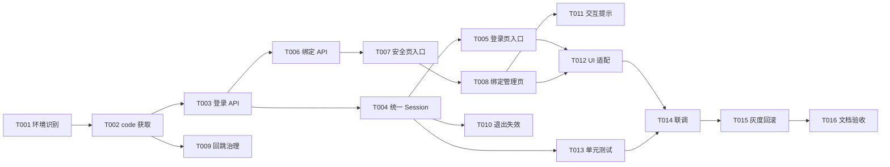

# 钉钉登录任务清单

> 对应设计：[钉钉登录技术方案.md](./钉钉登录技术方案.md)  
> 当前状态：待开发，所有任务初始为“未开始”。

## 任务列表

### T001 梳理并确认钉钉环境识别

- 任务名称：统一钉钉 H5/Web 环境识别
- 任务描述：新增共享的 DingTalk 环境适配模块，集中处理 User-Agent、容器能力和配置开关判断，页面不得重复实现环境识别。
- 验证标准：
  - 钉钉 H5 能识别为支持环境。
  - 普通 Chrome、Safari、Android WebView 默认不误判为支持环境。
  - 配置关闭时登录和绑定入口均不展示。
  - 识别结果可被 H5 和 Web 页面复用。
  - 完成状态：已完成

### T002 统一钉钉授权 code 获取

- 任务名称：实现直接 SDK 和回跳两种 code 获取方式
- 任务描述：封装 `getLoginCode()`、`getBindCode()` 和 `/home/GetDingTalkCode` 回跳参数处理，统一清理 `dingtalkcode`。
- 验证标准：
  - 直接 SDK 返回 code 时可进入登录或绑定请求。
  - 回跳 URL 中的 code 只消费一次。
  - 成功、失败、刷新后均不会重复提交旧 code。
  - URL 清理后保留合法业务回跳参数。
  - 完成状态：已完成

### T003 增加钉钉登录 API 类型与 adapter

- 任务名称：接入 `ApiLoginUrl-Home-DingTalkLogin`
- 任务描述：在 `packages/shared-types` 增加钉钉登录 DTO，在 `packages/api` 增加 API 方法和统一错误处理。
- 验证标准：
  - 请求通过现有 ProxyClient 发送。
  - 请求字段符合 legacy 和后端最终协议。
  - 空 Ticket、业务失败、HTTP 失败均可被页面识别。
  - 不在页面中自行拼接签名。
  - 完成状态：已完成

### T004 接入统一登录 Session

- 任务名称：钉钉登录复用统一 Session
- 任务描述：把钉钉登录结果接入 `Identity/Get`、`saveLoginResult`、WebSocket URL 和 Session Guard。
- 验证标准：
  - `Identity/Get` 成功后才认为登录完成。
  - localStorage 只保存统一登录结果，不保存钉钉 code。
  - 登录成功后 `returnTo` 能正确恢复。
  - Identity 失败时清理残留 Session 并返回登录页。
  - 完成状态：已完成

### T005 登录页增加钉钉入口

- 任务名称：H5/Web 登录页钉钉登录交互
- 任务描述：在现有账号/短信登录页增加条件展示的钉钉登录入口，复用当前 loading、toast、协议和导航样式。
- 验证标准：
  - 仅支持环境显示入口。
  - 点击后按钮进入 loading，不能重复点击。
  - 成功跳回 `returnTo`。
  - 失败不清空已有表单内容，并显示用户可理解的错误提示。
  - H5/Web 响应式布局无重叠和横向溢出。
  - 完成状态：已完成

### T006 增加钉钉绑定 API

- 任务名称：接入绑定、列表、解绑接口
- 任务描述：增加 `ApiPasswordUrl-DingTalk-Bind`、`List`、`Remove`、`Check` 的类型、adapter 和 query/mutation hooks。
- 验证标准：
  - 每个接口请求方法和字段与后端协议一致。
  - Query 失败不会导致账户安全页整体不可用。
  - Mutation 成功后能使列表缓存失效或重新查询。
  - 解绑使用列表项 `Id`，不会误删其他绑定。
  - 完成状态：已完成

### T007 账户安全页增加钉钉入口

- 任务名称：新增第三方账号分组
- 任务描述：在 H5/Web `AccountSecurityPage` 中增加“钉钉账号”行，使用当前 `SettingsSectionLabel`、`SettingsMenuCard` 和 `SettingsMenuRow`。
- 验证标准：
  - 支持环境且配置开启时显示。
  - 未绑定显示“未绑定”，已绑定显示数量摘要。
  - 点击整行进入钉钉绑定页。
  - 接口 loading/error 不影响其他账户安全功能。
  - 完成状态：已完成

### T008 新增钉钉绑定管理页

- 任务名称：实现 `/settings/dingtalk`
- 任务描述：沿用 `SettingsPageChrome`，实现列表、空态、loading、错误态、绑定按钮和解绑操作。
- 验证标准：
  - 页面标题为“钉钉绑定”，返回行为与设置页一致。
  - 空列表、单条、多条绑定均正确展示。
  - 绑定成功后自动刷新列表。
  - 解绑成功后列表和账户安全摘要同步更新。
  - H5 使用安全区，Web 使用当前设置页宽度和弹窗风格。
  - 完成状态：已完成

### T009 统一绑定回跳参数

- 任务名称：绑定回跳路由与参数治理
- 任务描述：支持 `path=account-dingtalk`、`dingtalkcode`、当前 ticketName 和业务 query 的安全保留与清理。
- 验证标准：
  - 回跳后能正确进入绑定页。
  - 非绑定页面不会误消费 `dingtalkcode`。
  - 未授权或错误回跳不会开放重定向。
  - 刷新页面不会重复绑定。
  - 完成状态：已完成

### T010 统一退出和登录失效

- 任务名称：钉钉登录场景复用退出体系
- 任务描述：确保手动退出、Session Guard、Identity-Check、接口 `nologin` 和登录失败都复用当前清理与跳转逻辑。
- 验证标准：
  - 退出后清理 ticket、token、用户信息和 WebSocket URL。
  - 登录失效后带 `preventAutoLogin=1` 返回登录页。
  - `returnTo` 保留原业务内部路径。
  - 不会因为钉钉入口导致自动登录循环。
  - 完成状态：已完成

### T011 完善钉钉绑定确认与提示

- 任务名称：绑定/解绑交互状态
- 任务描述：实现用户取消、授权过期、绑定冲突、解绑确认、服务端错误和重试提示。
- 验证标准：
  - 用户取消授权不会显示系统错误。
  - 解绑必须二次确认。
  - 错误提示不包含 ticket、token、code。
  - 错误后可以再次操作。
  - 完成状态：已完成

### T012 H5/Web UI 适配与无障碍

- 任务名称：对齐当前页面视觉和交互规范
- 任务描述：按 `docs/DESIGN.md` 和现有登录/设置页面实现品牌颜色、卡片、间距、safe-area、按钮状态和 aria 属性。
- 验证标准：
  - H5 在常见 Android WebView 与 iOS WebView 不横向溢出。
  - Web 窄窗口下标题、按钮、弹窗不重叠。
  - loading、disabled、error、empty、bound 状态均有视觉反馈。
  - 主要按钮、返回按钮和解绑操作具备可访问名称。
  - 完成状态：已完成

### T013 增加 mock 与单元测试

- 任务名称：认证流程和页面状态测试
- 任务描述：为 API adapter、环境识别、code 消费、Session 保存清理、登录/绑定页面状态添加测试。
- 验证标准：
  - 覆盖成功、失败、取消、过期、重复点击、刷新场景。
  - 覆盖 H5/Web 的环境差异。
  - 覆盖空绑定列表、多绑定列表和解绑失败。
  - 测试不依赖真实钉钉账号。
  - 完成状态：已完成

### T014 联调真实后端

- 任务名称：测试环境钉钉联调
- 任务描述：使用测试环境配置和指定钉钉组织验证登录、绑定、列表、解绑、Session Guard 和回跳。
- 验证标准：
  - 登录成功率和失败提示符合预期。
  - 后端返回的真实字段已映射。
  - 绑定关系在 legacy 和重构页面中可互相看到。
  - 解绑后 legacy 与重构页面状态一致。
- 完成状态：未开始

### T015 灰度发布与回滚

- 任务名称：配置开关、监控与回滚
- 任务描述：增加钉钉登录/绑定开关，配置测试、灰度和生产环境的默认值，并补充无敏感信息的埋点。
- 验证标准：
  - 关闭开关后不展示入口。
  - 灰度用户可正常使用，非灰度用户不受影响。
  - 监控不记录 code、ticket、token。
  - 出现异常时关闭开关即可回滚。
- 完成状态：未开始

### T016 文档、验收和上线检查

- 任务名称：完成开发交付文档
- 任务描述：更新 API 说明、环境配置、测试账号要求、上线步骤和验收记录。
- 验证标准：
  - 文档链接有效。
  - 任务清单状态与实际开发一致。
  - H5/Web、钉钉容器、普通浏览器、失败与回滚场景均有验收记录。
  - 业务方能够根据文档复现登录和绑定流程。
- 完成状态：未开始

## 任务依赖关系

## 任务状态变更记录

| 日期 | 修改人 | 变更 |
| --- | --- | --- |
| 2026-08-06 | Codex | 创建 T001-T016，初始状态均为“未开始” |
| 2026-08-06 | Codex | 完成 T001-T013：实现钉钉环境识别、code 回跳、登录/绑定 API、统一 Session、H5/Web 登录入口与绑定管理页，并通过类型检查与 Mock/API 单元测试 |
