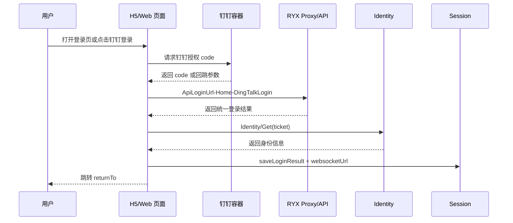
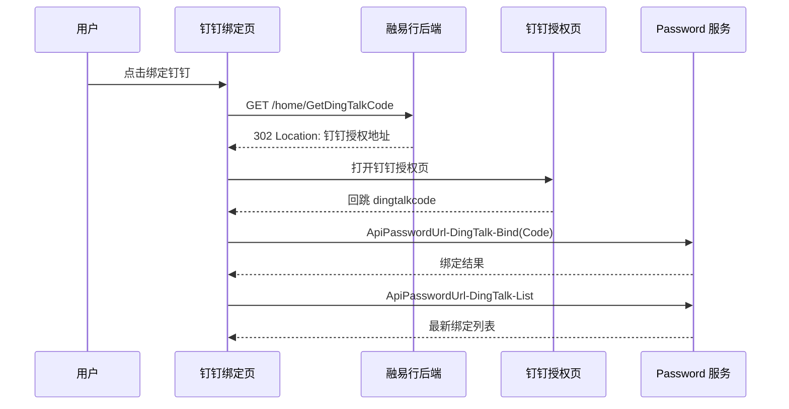
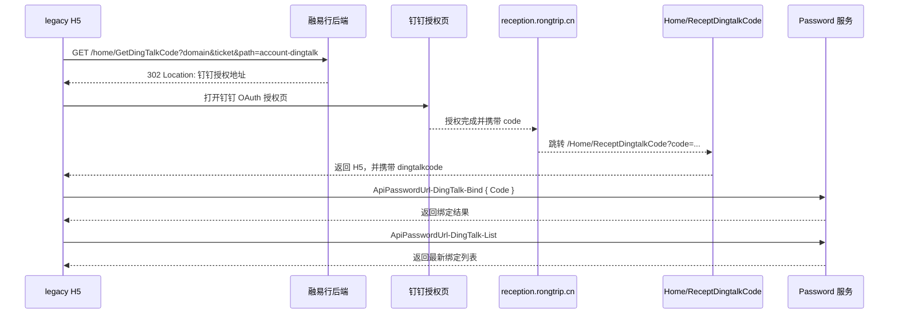
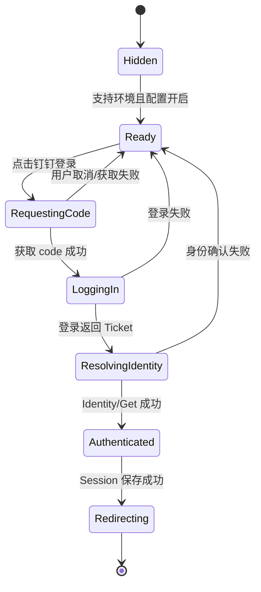
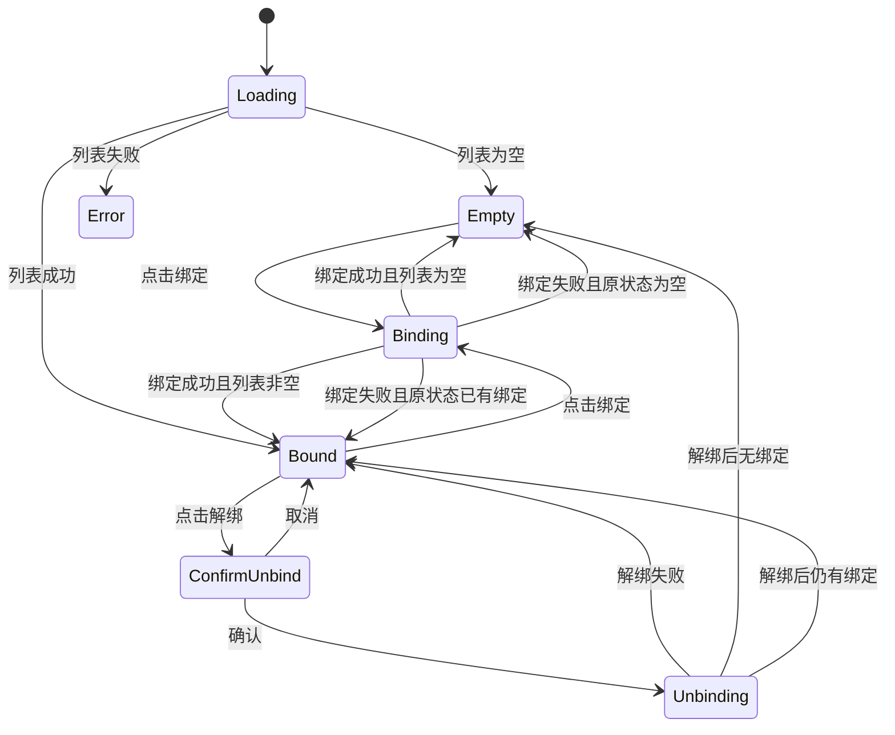

# 钉钉登录技术方案

## 1. 需求基础信息

| 项目     | 内容                                                                                                   |
| -------- | ------------------------------------------------------------------------------------------------------ |
| 需求名称 | 融易行钉钉登录、绑定与解绑                                                                             |
| 适用工程 | `rongyixing-monorepo/apps/h5`、`rongyixing-monorepo/apps/web`、`packages/api`、`packages/shared-types` |
| 对照工程 | `beeantmobile-main/projects/ryx`、`beeantmobile-main/projects/core`                                    |
| 业务模块 | 登录认证、账户安全、第三方账号绑定、Session 管理                                                       |
| 相关规范 | [DESIGN.md](../DESIGN.md)、[前端状态存储.md](./前端状态存储.md)                                        |
| 相关任务 | [钉钉登录任务清单.md](./钉钉登录任务清单.md)                                                           |

本文档用于保存 legacy 钉钉功能的梳理结果，并给出在当前 React + Vite H5/Web 项目中的落地方案。本文档只定义实现方案，不代表当前功能已经开发完成。

## 2. 项目背景和目标

### 2.1 Legacy 现状

legacy 中钉钉不是一套独立的用户体系，而是融易行统一账号的一个登录和绑定渠道：

- 登录成功后仍然进入融易行的统一 Session。
- 账号安全页展示已绑定的钉钉账号。
- 绑定动作先导航到 `/home/GetDingTalkCode`，由后端返回钉钉授权跳转；授权完成后回到融易行页面，前端消费 `dingtalkcode` 完成绑定。
- 解绑动作只解除当前融易行账号与钉钉账号的关联，不删除融易行账号。
- 登录后的身份仍通过 `ticket`、`Identity/Get` 和后续的账号信息接口确认。

### 2.2 本次目标

1. 在 H5/Web 中建立统一的钉钉登录适配层。
2. 复用现有 `RYBLogin -> Identity/Get -> saveLoginResult` 认证链路。
3. 支持钉钉容器内登录、账户安全页绑定、已绑定列表和解绑。
4. 保留当前项目已有的 `returnTo`、`preventAutoLogin`、Session Guard 和退出清理规则。
5. H5 与 Web 只共享业务状态和 API 层，页面交互分别适配移动 WebView 和桌面/宽屏浏览器。
6. UI 参考当前登录页、账户安全页和设置页，不照搬 legacy 的 Ionic 页面样式。

### 2.3 非目标

- 不新增独立的钉钉用户表或独立登录态。
- 不在本次需求中接入企业微信、飞书等其他第三方登录。
- 不改变密码登录、短信登录、外部 URL ticket 登录的既有流程。
- 不允许前端自行解析或伪造钉钉身份，身份确认必须以服务端响应为准。

## 3. Legacy 功能与当前项目差异

### 3.1 Legacy 关键文件

| 能力                 | Legacy 文件                                                                                     |
| -------------------- | ----------------------------------------------------------------------------------------------- |
| 登录页钉钉分支       | `beeantmobile-main/projects/ryx/src/app/login/login.base.page.ts`                               |
| 登录服务与环境判断   | `beeantmobile-main/projects/core/src/services/login/login.service.ts`                           |
| 钉钉绑定页           | `beeantmobile-main/projects/ryx/src/app/account/account-dingtalk/account-dingtalk.page.ts`      |
| 账户安全页入口和列表 | `beeantmobile-main/projects/ryx/src/app/account/account-security/account-security.base.page.ts` |
| 身份与统一认证       | `beeantmobile-main/projects/core/src/services/identity/identity.service.ts`                     |

### 3.2 Legacy 已有接口

- `ApiLoginUrl-Home-DingTalkLogin`
- `ApiPasswordUrl-DingTalk-Check`
- `ApiPasswordUrl-DingTalk-Bind`
- `ApiPasswordUrl-DingTalk-List`
- `ApiPasswordUrl-DingTalk-Remove`
- `${apiUrl}/home/GetDingTalkCode`

legacy 登录页虽然保留了 `loginType = "dingtalk"` 分支，但当前模板中没有稳定、明显的独立登录按钮；稳定可复用的钉钉能力主要集中在账户安全和绑定页。实现时应以业务确认后的产品入口为准，不因为 legacy 存在代码分支就默认在所有环境展示入口。

### 3.3 当前重构项目已有能力

当前 H5/Web 已具备：

- `apps/h5/src/lib/external-ticket.ts`
- `apps/web/src/lib/external-ticket.ts`
- `packages/api/src/apis/auth-proxy.ts`
- `packages/api/src/methods/auth-flow.ts`
- `packages/shared-types/src/auth-proxy.ts`
- `clearSession()`、`saveLoginResult()`、`startSessionGuard()`
- `/login/password`
- `/settings/security`

外部 URL ticket 的现行链路为：

```text
URL ticket
  -> clearSession()
  -> authProxy.rybLogin({ ticket })
  -> Identity/Get(loginResult.Ticket)
  -> saveLoginResult()
  -> getWebSocketUrl()
  -> startSessionGuard()
```

钉钉登录和绑定必须接入这条统一认证链路，不能另存一套钉钉 token。

## 4. 业务边界与统一认证模型

### 4.1 统一认证结果

所有登录入口最终归一为：

```ts
interface UnifiedLoginSession {
  Ticket: string;
  Id: string;
  Name: string;
  Token?: string;
  WebSocketUrl?: string;
}
```

字段来源：

| 字段           | 来源                         | 用途                     |
| -------------- | ---------------------------- | ------------------------ |
| `Ticket`       | `RYBLogin` 或 `Identity/Get` | 后续 Proxy 请求身份      |
| `Id`           | 登录接口或 `Identity/Get`    | 当前用户标识             |
| `Name`         | 登录接口或 `Identity/Get`    | 用户展示                 |
| `Token`        | 登录接口或 `Identity/Get`    | Proxy 请求中的登录 token |
| `WebSocketUrl` | `Identity/GetWebSocketUrl`   | 消息和 Session 状态监听  |

### 4.2 Session 存储约束

继续使用当前 `apps/*/src/lib/session.ts`：

| localStorage key | 说明                        |
| ---------------- | --------------------------- |
| `ticket`         | 当前融易行 ticket           |
| `loginToken`     | 登录返回 token              |
| `accessToken`    | 兼容当前请求层的 token 镜像 |
| `loginUserName`  | 当前用户名称                |
| `loginUserId`    | 当前用户 ID                 |
| `websocketUrl`   | WebSocket 地址              |
| `ticketName`     | ticket 名称兼容字段         |

约束：

1. 钉钉 code 只存在于内存和短生命周期 URL 参数中，不写入 localStorage。
2. 只有 `RYBLogin` 成功、且 `Identity/Get` 成功后，才认为钉钉登录完成。
3. 绑定 code 不等于登录 ticket，不能调用 `saveLoginResult()`。
4. 退出、登录失效、登录页初始化时继续调用 `clearSession()`。
5. 不在日志中打印钉钉 code、ticket、Token 或完整请求签名。

## 5. 总体业务流程



绑定流程与登录流程分离：



## 6. 钉钉环境识别

### 6.1 展示原则

钉钉入口不应在普通 Chrome、普通 Safari、非钉钉 WebView 中无条件出现。建议统一封装：

```ts
interface DingTalkEnvironment {
  isDingTalkH5: boolean;
  isSupported: boolean;
  reason?: "user-agent" | "container-api" | "config-disabled" | "unknown";
}
```

判断顺序：

1. 读取运行环境和 User-Agent，判断是否为钉钉 H5。
2. 检查应用配置是否开启钉钉绑定/登录。
3. 检查当前页面是否允许展示该入口。
4. 如果容器能力不可用，展示不可用提示或隐藏入口，不进入失败的授权跳转。

环境识别应集中在 `apps/*/src/lib/dingtalk.ts` 或共享包中，页面不得自行重复判断 User-Agent。

### 6.2 H5 与 Web

| 场景             | 展示钉钉登录   | 展示钉钉绑定   | 处理方式                                |
| ---------------- | -------------- | -------------- | --------------------------------------- |
| 钉钉 H5/WebView  | 是，受配置控制 | 是，受配置控制 | 通过 `/home/GetDingTalkCode` 或容器 SDK |
| 普通移动浏览器   | 默认否         | 默认否         | 保持账号/短信登录                       |
| 普通桌面浏览器   | 默认否         | 默认否         | 保持账号/短信登录                       |
| 开发环境强制联调 | 可选           | 可选           | 仅通过显式 query 或开发配置开启         |

是否在普通 Web 中展示二维码或跳转钉钉，需要产品和后端另行确认；本方案不默认创造新的二维码登录协议。

## 7. 登录流程设计

### 7.1 登录入口

当前登录页已有账号密码、短信验证码、协议同意、错误 toast 和 loading 状态。钉钉登录作为第三方登录入口加入现有登录方式区域下方：

1. 只有 `isSupported && config.enableDingTalkLogin` 时显示。
2. 使用钉钉品牌图标和“钉钉登录”文本按钮。
3. 不改变账号/短信 tab 的默认选中状态。
4. 登录成功后统一执行 `navigateAfterLogin()`，恢复 `returnTo`。
5. 登录失败保留当前页面和用户已填写的账号/短信内容。

### 7.2 直接 code 登录

如果容器可以直接通过 SDK 获取 code：

```text
点击钉钉登录
  -> 防重复点击
  -> DingTalkAdapter.getLoginCode()
  -> ApiLoginUrl-Home-DingTalkLogin { Code, Device?, DeviceName? }
  -> 验证返回 Ticket
  -> Identity/Get(Ticket)
  -> saveLoginResult()
  -> getWebSocketUrl()
  -> startSessionGuard()
  -> returnTo
```

### 7.3 回跳 code 登录

如果只能通过后端回跳：

```text
点击钉钉登录
  -> 跳转 /home/GetDingTalkCode
  -> 保留当前 returnTo、path 及必要业务参数
  -> 回到登录页 ?dingtalkcode=...
  -> 消费一次 dingtalkcode
  -> 清理 URL 中的 dingtalkcode
  -> ApiLoginUrl-Home-DingTalkLogin
  -> 统一 Session 初始化
```

`dingtalkcode` 的消费必须是幂等的：页面刷新不能重复提交同一个 code；成功或失败后都应从地址栏移除。

### 7.4 登录成功判定

以下条件全部满足，才允许跳转业务页：

1. 登录接口 HTTP 请求成功。
2. 业务响应为成功。
3. 返回非空 `Ticket`。
4. `Identity/Get` 成功并获得有效身份。
5. Session 已写入。
6. WebSocket URL 获取失败时可降级，不阻断主登录；但需记录可观测日志。

## 8. 外部 URL ticket 流程

外部 URL ticket 与钉钉登录是两个入口，但最终认证链路一致：

```text
外部 URL ?ticket=external
  -> clearSession()
  -> RYBLogin(ticket=external, LoginType="ryb")
  -> 得到真实 Ticket
  -> Identity/Get(真实 Ticket)
  -> saveLoginResult()
```

规则：

- 只有 URL 传入的 ticket 才调用 `RYBLogin` 置换。
- 密码登录、短信登录、钉钉登录不经过外部 ticket 置换。
- 外部 ticket 不直接写入 localStorage。
- 当前实现中 `RYBLogin` 成功后会保存登录结果，再调用 `Identity/Get` 补齐身份；方案落地时必须保留“只接受置换后的真实 ticket 作为最终 Session”的语义。
- 置换失败清理 Session，并跳转 `/login/password?returnTo=...`。

## 9. 钉钉绑定、列表与解绑

### 9.1 绑定

绑定入口放在“账户安全”页的第三方账号区域，点击进入“钉钉绑定”页。

绑定页：

1. 初始化调用 `ApiPasswordUrl-DingTalk-List`。
2. 已支持钉钉 H5 且配置开启时展示“绑定钉钉”按钮。
3. 点击按钮请求 `/home/GetDingTalkCode`。
4. 回跳后消费 `dingtalkcode`，调用 `ApiPasswordUrl-DingTalk-Bind`。
5. 绑定成功后重新调用 List，展示最新结果。

legacy 中的回跳参数包括：

```text
domain
ticket/ticketName
path=account-dingtalk
dingtalkcode
```

当前实现应通过 URL 工具统一拼装和清理，不能手工拼接未编码的用户参数。

### 9.2 已绑定列表

列表项最少包含：

```ts
interface DingTalkBindingItem {
  Id: string;
  Name: string;
}
```

状态：

- 加载中：显示轻量 loading。
- 空态：显示“暂未绑定钉钉账号”和主按钮。
- 已绑定：显示钉钉名称，可进入解绑。
- 加载失败：保留页面骨架，显示错误提示和“重新加载”。

### 9.3 解绑

1. 点击已绑定项的解绑动作。
2. 弹出二次确认：“解绑后将无法使用该钉钉账号登录，是否继续？”
3. 确认后调用 `ApiPasswordUrl-DingTalk-Remove { Id }`。
4. 成功后刷新列表并显示成功 toast。
5. 失败不清除列表项，显示服务端错误。

## 10. API 接口汇总

### 10.1 钉钉登录

- 接口名称：钉钉登录
- 接口路径：`POST` Proxy 方法 `ApiLoginUrl-Home-DingTalkLogin`
- 接口说明：使用钉钉授权 code 换取融易行统一登录结果。
- 请求参数：

| 参数         | 类型   | 必填 | 说明                           |
| ------------ | ------ | ---- | ------------------------------ |
| `Code`       | string | 是   | 钉钉授权 code，仅内存传递      |
| `Device`     | string | 否   | App/容器设备标识               |
| `DeviceName` | string | 否   | 设备名称                       |
| `LoginType`  | string | 否   | 由后端约定，不能由页面随意改写 |

- 返回值：

```json
{
  "Status": true,
  "Message": "",
  "Data": {
    "Ticket": "string",
    "Id": "string",
    "Name": "string",
    "Token": "string"
  }
}
```

- 返回值说明：

| 字段     | 说明                          |
| -------- | ----------------------------- |
| `Ticket` | 统一登录 ticket，空值视为失败 |
| `Id`     | 用户 ID                       |
| `Name`   | 用户名称                      |
| `Token`  | 后续 Proxy 请求 token         |

### 10.2 检查当前钉钉绑定（定义存在，但不属于实际绑定链路）

- 接口名称：检查钉钉绑定状态
- 接口路径：`POST` Proxy 方法 `ApiPasswordUrl-DingTalk-Check`
- 接口说明：legacy 代码中定义了该接口和 `SdkType=DingTalk` 参数，但在实际 `account-dingtalk` 绑定流程中没有调用。绑定页不会先调用该接口，绑定成功后也不会调用该接口。
- 请求参数：

| 参数      | 类型   | 必填 | 说明              |
| --------- | ------ | ---- | ----------------- |
| `SdkType` | string | 是   | 固定为 `DingTalk` |

- 返回值：

```json
{
  "Status": false,
  "Message": "string",
  "Data": null
}
```

- 返回值说明：

| 字段      | 说明                                                 |
| --------- | ---------------------------------------------------- |
| `Status`  | 仅表示服务端返回状态；当前 legacy 绑定页不依赖该结果 |
| `Message` | 服务端提示语；当前 legacy 绑定页不使用该接口的提示   |
| `Data`    | 当前 legacy 未依赖具体结构                           |

### 10.3 获取钉钉回跳 code

- 接口名称：获取钉钉授权回跳地址
- 接口路径：`GET` `${apiUrl}/home/GetDingTalkCode`
- 接口说明：让后端/钉钉容器完成授权后回跳指定页面。
- 请求参数：

| 参数                       | 类型   | 必填 | 说明                                                                                             |
| -------------------------- | ------ | ---- | ------------------------------------------------------------------------------------------------ |
| `domain`                   | string | 是   | 当前业务域                                                                                       |
| `ticket` 或当前 ticketName | string | 否   | 当前登录 ticket，用于绑定场景                                                                    |
| `path`                     | string | 是   | 回跳页面，例如 `account-dingtalk`                                                                |
| `returnTo`                 | string | 否   | 仅登录入口用于登录后的业务落点；legacy 绑定页不会主动生成，绑定回调固定进入 `/settings/dingtalk` |

- 返回值：通常为重定向，不以 JSON 作为页面依赖。
- 返回值说明：最终页面通过 URL 中的 `dingtalkcode` 消费授权结果。

## Legacy 钉钉绑定流程核对结论

本节以 legacy 源码
`/Users/jiangjiankang/work/self/rongyixing/legacy/beeantmobile`
为准，记录实际绑定流程。后端的 OAuth 实现不在该前端仓库中，因此后端部分同时标注了“源码确认”和“线上链路观察”的边界。

### 完整时序



### 各环节职责

| 环节         | legacy 的实际行为                                                                   | 关键结论                                        |
| ------------ | ----------------------------------------------------------------------------------- | ----------------------------------------------- |
| 进入账户安全 | 调用 `ApiAccountUrl-Home-Get`、多个第三方账号 `List` 接口                           | `DingTalk-List` 只用于展示绑定状态              |
| 进入绑定页   | `AuthorityGuard` 检查统一登录态；页面调用 `getAppConfig()` 和 `DingTalk-List`       | 未登录先回登录页；必要时可能触发 `Identity/Get` |
| 点击绑定     | 拼接 `/home/GetDingTalkCode` 后执行 `window.location.href`                          | 不是 Ajax、不是 POST、没有前端签名              |
| 302 授权     | 后端返回 `Location`，指向钉钉授权页                                                 | 302 和 OAuth URL 不由 legacy 前端生成           |
| 钉钉回调     | 线上链路经过 `reception.rongtrip.cn/Dingtalk/Oauth`，再到 `Home/ReceptDingtalkCode` | 这部分后端实现不在 legacy 前端仓库              |
| 回到 H5      | 页面启动解析 `path=account-dingtalk` 和 `dingtalkcode`                              | 绑定页初始化时立即消费 code                     |
| 执行绑定     | 调用 `ApiPasswordUrl-DingTalk-Bind`，Data 为 `{ Code }`                             | 正常解析为 Password 服务直连地址                |
| 绑定成功     | 再调用 `ApiPasswordUrl-DingTalk-List`                                               | 页面留在绑定页，不自动跳首页                    |
| 解绑         | 调用 `ApiPasswordUrl-DingTalk-Remove`，Data 为 `{ Id }`                             | 解除绑定关系，不删除融易行账号                  |

### legacy 生成和透传的参数

legacy 绑定页明确生成的参数只有：

```text
domain
当前 ticketName 对应的 ticket
path=account-dingtalk
```

页面还会透传当前 URL 中的其他参数，但排除：

```text
domain、ticket、path、IsLogin、wechatcode
```

因此 `tmcid`、`root`、`returnTo` 如果原本就在 URL 中，会被继续传递；但 legacy 绑定页不会主动计算或补充这些参数。`tmcid=10099` 不是该页面生成的。

### 授权跳转不是前端 SDK 调用

legacy 的绑定按钮没有调用钉钉 JavaScript SDK，也没有调用注释中的 Cordova `DingTalk.getCode()`。它只做：

```text
window.location.href = `${apiUrl}/home/GetDingTalkCode?...`
```

浏览器负责跟随后端返回的 302。浏览器可能自然携带 UA、Referer 和 Cookie，但 legacy 代码没有设置特殊授权 Header。

### 绑定 API 的直连与 Proxy

legacy 的 API 客户端会把：

```text
ApiPasswordUrl-DingTalk-Bind
```

按方法名拆分为：

```text
ApiPasswordUrl + /DingTalk/Bind
```

`List` 和 `Remove` 同理。只有 API 配置没有加载成功时，通用请求层才会回退到：

```text
/Home/Proxy
```

因此，正常配置下绑定、查询、解绑都是 Password 服务直连；`GetDingTalkCode` 是单独的浏览器 GET 跳转，也不是带签名的 Proxy 请求。

### `DingTalk-Check` 的最终结论

`ApiPasswordUrl-DingTalk-Check` 在 legacy 中有定义，但不是实际绑定流程的一环：

1. 没有找到该方法在绑定页面中的有效调用点。
2. `account-dingtalk` 页面不会先调用它。
3. 回调收到 `dingtalkcode` 后直接调用 `DingTalk-Bind`。
4. `DingTalk-Bind` 成功后直接调用 `DingTalk-List`。
5. 登录服务中的检查逻辑还会对 `path=account-dingtalk` 提前跳过。

### 与当前迁移项目的已知差异

当前项目的核心顺序与 legacy 一致，但实现上有以下差异：

| 项目               | legacy                             | 当前迁移项目                                                                          |
| ------------------ | ---------------------------------- | ------------------------------------------------------------------------------------- |
| 授权入口           | `/home/GetDingTalkCode`            | `/home/GetDingTalkCode`                                                               |
| 绑定接口           | `ApiPasswordUrl-DingTalk-Bind`     | `ApiPasswordUrl-DingTalk-Bind`                                                        |
| 绑定参数           | `{ Code }`                         | `{ Code }`                                                                            |
| `returnTo`、`root` | 绑定页不主动生成；已有参数会被透传 | 绑定授权不依赖 `returnTo`，`root` 按当前部署生成；登录入口单独保留登录后的 `returnTo` |
| `tmcid`            | 页面只透传已有参数                 | 授权前必须从入口 URL 或构建配置取得，不通过 `Identity/Get` 补齐                       |
| 回调清理           | 修改 legacy 内存查询对象           | 使用 `history.replaceState` 清理 URL                                                  |
| 列表刷新           | Bind 成功后直接调用 List           | Mutation 成功后使 Query 缓存失效                                                      |

### 当前公测阶段的回调兼容与诊断策略

- 回调 code 参数按不区分大小写处理，兼容 `dingtalkcode`、`DingTalkCode` 以及其他大小写变体；日志会记录实际命中的参数名。
- `tmcid` 是授权前置必填参数，只从入口 URL 或构建配置 `VITE_TMC_ID` 取得；缺失时记录 error 并阻止授权跳转，不调用 `Identity/Get`。
- 绑定流程不依赖 `returnTo`。回调只要命中 `path=account-dingtalk` 或存在大小写不敏感的 code 参数，就固定跳转 `/settings/dingtalk`；后端是否透传 `returnTo` 不改变绑定流程。登录入口的 `returnTo` 仅用于登录成功后的业务落点。
- 公测阶段保留授权入口、回调参数名、`tmcid` 来源、固定回调落点和 Bind 结果等完整 console 日志，便于在 vConsole 中逐步核对；不额外保存跨授权的 `sessionStorage` 状态。

当前项目不应把 `DingTalk-Check` 插入绑定链路，也不应绕过 `GetDingTalkCode` 直接假设前端可以获取钉钉授权 code。

### 10.4 绑定钉钉

- 接口名称：绑定钉钉账号
- 接口路径：`POST` Proxy 方法 `ApiPasswordUrl-DingTalk-Bind`
- 接口说明：将当前融易行账号与钉钉授权 code 关联。
- 请求参数：

| 参数   | 类型   | 必填 | 说明                |
| ------ | ------ | ---- | ------------------- |
| `Code` | string | 是   | 回跳得到的钉钉 code |

- 返回值：

```json
{
  "Status": true,
  "Message": "绑定成功",
  "Data": {}
}
```

- 返回值说明：

| 字段      | 说明         |
| --------- | ------------ |
| `Status`  | 绑定是否成功 |
| `Message` | 页面提示     |

### 10.5 查询绑定列表

- 接口名称：查询钉钉绑定列表
- 接口路径：`POST` Proxy 方法 `ApiPasswordUrl-DingTalk-List`
- 接口说明：查询当前融易行账号绑定的钉钉账号。
- 请求参数：无业务参数，使用当前统一 Session。
- 返回值：

```json
{
  "Status": true,
  "Message": "",
  "Data": [
    {
      "Id": "string",
      "Name": "string"
    }
  ]
}
```

- 返回值说明：

| 字段   | 说明                |
| ------ | ------------------- |
| `Id`   | 绑定关系 ID         |
| `Name` | 钉钉账号/名称展示值 |

### 10.6 解绑钉钉

- 接口名称：解绑钉钉账号
- 接口路径：`POST` Proxy 方法 `ApiPasswordUrl-DingTalk-Remove`
- 接口说明：删除当前账号的一条钉钉绑定关系。
- 请求参数：

| 参数 | 类型   | 必填 | 说明          |
| ---- | ------ | ---- | ------------- |
| `Id` | string | 是   | 绑定列表项 ID |

- 返回值：

```json
{
  "Status": true,
  "Message": "解绑成功",
  "Data": {}
}
```

- 返回值说明：

| 字段      | 说明         |
| --------- | ------------ |
| `Status`  | 解绑是否成功 |
| `Message` | 页面提示     |

## 11. UI 页面交互设计

本节以当前项目现有页面为基准：

- Web 登录页：`apps/web/src/pages/login/PasswordLoginPage.tsx`
- H5 登录页：`apps/h5/src/pages/PasswordLoginPage.tsx`
- Web/H5 账户安全页：`apps/*/src/pages/settings/AccountSecurityPage.tsx`
- 页面壳：`apps/*/src/components/settings/SettingsPageChrome.tsx`
- 设置列表：`apps/*/src/components/settings/SettingsMenuCard.tsx`
- 设计系统：[DESIGN.md](../DESIGN.md)

### 11.1 登录页入口

推荐布局：

```text
账号/短信登录切换
账号或手机号输入区
登录主按钮
忘记密码/辅助入口
钉钉登录
用户协议与隐私政策
```

交互要求：

| 状态           | 页面表现                                        |
| -------------- | ----------------------------------------------- |
| 不支持钉钉环境 | 不显示钉钉入口，不留空白占位                    |
| 支持但未配置   | 不显示入口，并记录配置原因                      |
| 可点击         | 钉钉品牌图标 + “钉钉登录”文本按钮               |
| 获取 code 中   | 按钮 loading，禁止重复点击                      |
| 登录请求中     | 登录区域保持可见，按钮进入 disabled/loading     |
| 登录成功       | 关闭 loading，直接跳转 `returnTo`               |
| 登录失败       | 保留登录页，显示错误 toast，不清空账号/短信表单 |
| code 过期      | 提示“钉钉授权已失效，请重新授权”，允许再次点击  |
| 用户取消授权   | 不视为系统错误，提示“已取消钉钉授权”或静默返回  |

视觉规则：

- 继续使用现有登录页的输入框、主按钮、toast、协议区域。
- 不新增大面积独立品牌卡片，不改变页面主视觉层级。
- Web 使用当前登录页的宽屏内容列；H5 使用当前移动端背景和安全区。
- 钉钉图标使用品牌资源或受控图标组件，不手工绘制不一致的 SVG。
- 入口按钮需有 `aria-label`，loading 状态需可被读屏识别。

### 11.2 账户安全页入口

当前账户安全页使用：

- `SettingsPageChrome`
- `SettingsSectionLabel`
- `SettingsMenuCard`
- `SettingsMenuRow`

建议新增“第三方账号”分组，放在“账户”和“安全”之间：

```text
第三方账号
  钉钉账号                         未绑定 >
```

已绑定时：

```text
钉钉账号                         已绑定 1 个 >
```

规则：

1. 仅在支持钉钉环境且配置允许时显示。
2. 列表请求失败时不影响手机、密码、设备和注销账号功能。
3. 行内摘要只显示“未绑定”“已绑定 1 个”等短文本，具体名称放到详情页。
4. 点击整行进入 `/settings/dingtalk`，不设计过小的独立点击区域。

### 11.3 钉钉绑定管理页

页面结构沿用当前设置页：

```text
顶部：返回按钮 + 标题“钉钉绑定”
内容：绑定列表卡片
底部/卡片尾部：主按钮“绑定钉钉”
```

页面状态：

| 状态     | 交互                                                 |
| -------- | ---------------------------------------------------- |
| 首次加载 | 列表位置展示 loading skeleton 或轻量 loading         |
| 空列表   | 文案“暂未绑定钉钉账号”，展示“绑定钉钉”主按钮         |
| 已绑定   | 展示名称，提供解绑动作                               |
| 多条绑定 | 每条独立显示，禁止合并成不可操作的字符串             |
| 绑定中   | 按钮 disabled/loading，禁止重复跳转                  |
| 绑定成功 | toast 成功，重新加载列表                             |
| 绑定失败 | 显示服务端错误，保留当前列表                         |
| 解绑确认 | H5 使用底部 sheet/dialog，Web 使用居中 ConfirmDialog |
| 解绑成功 | 删除当前项并刷新账户安全摘要                         |

### 11.4 H5 与 Web 交互差异

| 能力     | H5                                 | Web                         |
| -------- | ---------------------------------- | --------------------------- |
| 页面容器 | `min-h-full`、移动安全区           | 当前 Web 设置页内容列       |
| 返回     | 左上角圆形返回按钮                 | 沿用 Web 当前设置页返回样式 |
| 解绑确认 | 底部 sheet 或移动 ConfirmDialog    | 居中弹窗                    |
| Toast    | 当前 H5 `PageToast`                | 当前 Web toast/error 展示   |
| 固定操作 | 预留 `env(safe-area-inset-bottom)` | 不增加移动底部留白          |
| 列表宽度 | 16px 页面边距、白色圆角卡片        | 沿用 Web 设置页卡片宽度     |

### 11.5 设计禁用项

- 不把钉钉绑定做成独立首页大模块。
- 不在普通浏览器中显示点击后必然失败的钉钉按钮。
- 不用浏览器原生 `alert` 替代当前项目的 ConfirmDialog/Toast。
- 不把 code、ticket 或错误原文展示给用户。
- 不在同一个页面同时放多个“绑定钉钉”主按钮。

## 12. 状态机设计

### 12.1 登录状态机



### 12.2 绑定状态机



## 13. 异常与安全策略

### 13.1 异常分类

| 异常               | 用户提示                               | 处理                       |
| ------------------ | -------------------------------------- | -------------------------- |
| 非钉钉环境         | 不展示入口                             | 不发起请求                 |
| SDK 不可用         | 当前环境暂不支持钉钉登录               | 返回登录页                 |
| 用户取消授权       | 已取消钉钉授权                         | 可再次发起                 |
| code 过期          | 钉钉授权已失效，请重新授权             | 清理当前 code              |
| 登录接口失败       | 使用后端 Message，必要时兜底“登录失败” | 不写 Session               |
| Identity/Get 失败  | 登录信息校验失败，请重新登录           | 清理 Session，回登录页     |
| 绑定失败           | 使用后端 Message                       | 保留页面状态               |
| Session 失效       | 登录已失效                             | 复用 `performForceLogout`  |
| WebSocket 获取失败 | 不阻断登录                             | 记录 warning，允许后续重试 |

### 13.2 安全要求

1. 只接受当前页面流程产生的 code，避免复用旧 URL 参数。
2. 回跳参数使用 `URLSearchParams` 编解码。
3. 绑定回调固定进入站内 `/settings/dingtalk`，不使用后端透传的 `returnTo`。
4. 登录入口的 `returnTo` 只允许站内路径，禁止开放重定向。
5. 通过统一 Proxy 层请求，不在页面直接拼接服务端签名。
6. 不把钉钉 code、ticket、Token 写入埋点、错误 toast 或持久化日志。
7. 绑定/解绑接口必须依赖当前已登录 Session。
8. 登录成功后先确认身份，再允许业务页面加载需要权限的数据。

## 14. 可观测性

只记录不包含敏感信息的事件：

| 事件 | 建议字段 |
| --------------------------- | ---------------------------- | ------------------------------------ |
| `dingtalk_login_entry_show` | `app=h5                      | web`、`environment`、`configEnabled` |
| `dingtalk_login_start` | `app`、`source=direct        | redirect` |
| `dingtalk_login_result` | `success`、`errorCode`、耗时 |
| `dingtalk_bind_result` | `success`、耗时 |
| `dingtalk_unbind_result` | `success`、耗时 |
| `dingtalk_identity_result` | `success`、耗时 |

公测阶段允许在 vConsole 记录完整授权/回调 URL、实际 code 参数名和 `tmcid` 来源，便于排查链路；禁止将 `Code`、`Ticket`、`Token` 和签名发送到远程埋点或持久化日志。

## 15. 测试与验收

### 15.1 登录验收

- 钉钉 H5 中可以看到钉钉登录入口。
- 普通浏览器中默认不显示入口。
- 点击后只能发起一次授权请求。
- 授权成功后完成统一 Session 初始化并回到 `returnTo`。
- `Identity/Get` 失败时不会残留旧 Session。
- 用户取消授权后可再次点击。
- 登录失效后跳转当前项目统一登录页，并保留业务路径。

### 15.2 绑定验收

- 账户安全页只在支持环境展示钉钉账号入口。
- 空列表、单条、多条列表均正确展示。
- 绑定成功后列表和账户安全摘要立即更新。
- 解绑需要二次确认。
- 解绑失败不误删前端列表。
- 刷新页面后绑定状态与服务端一致。

### 15.3 H5/Web 验收

- H5 在 Android WebView、iOS WebView、钉钉 H5 中不出现横向溢出。
- Web 在窄窗口和宽窗口下入口、弹窗、错误提示不重叠。
- H5 底部安全区不遮挡绑定按钮。
- 键盘弹出时登录页输入区域仍可见。
- 页面刷新、浏览器前进后退不会重复消费 code。

## 16. 灰度与回滚

### 16.1 灰度

1. 增加配置开关 `enableDingTalkLogin` 和 `enableDingTalkBind`，默认关闭。
2. 先在测试环境、指定钉钉组织和指定账号开启。
3. 观察登录成功率、Identity/Get 失败率、绑定/解绑失败率。
4. 再按 H5/Web 和组织范围逐步放量。

### 16.2 回滚

- 关闭配置开关即可隐藏入口，不影响账号密码和短信登录。
- 绑定页已有数据仍可通过后端保留，不因前端回滚删除绑定关系。
- 若登录链路异常，回滚钉钉入口组件和适配层，保留统一 Session 与外部 ticket 逻辑。

## 17. 实施顺序

1. 先完成环境识别、API 类型和 API adapter。
2. 再完成统一 Session 与登录 code 消费逻辑。
3. 增加登录页入口及成功/失败状态。
4. 增加账户安全入口和绑定管理页。
5. 增加 mock、单元测试和 H5/Web 联调。
6. 通过灰度开关发布。

详细任务见：[钉钉登录任务清单.md](./钉钉登录任务清单.md)。

## 18. 设计确认状态

- 当前状态：已锁定。
- 本文档不直接修改业务代码。
- 进入开发前，应确认：
  - 钉钉登录入口是否只限钉钉 H5。
  - 普通 Web 是否需要二维码/跳转式登录。
  - 后端返回的 `LoginType`、code 字段和错误码是否固定。
  - 一个融易行账号是否允许绑定多个钉钉账号。
  - 解绑后是否需要二次密码或短信校验。

## 19. 变更记录

| 版本        | 日期       | 修改人 | 内容                                                                |
| ----------- | ---------- | ------ | ------------------------------------------------------------------- |
| v1.0        | 2026-08-06 | Codex  | 保存 legacy 钉钉登录梳理结果，补充当前 H5/Web UI 交互设计和实施方案 |
| V1.0-Locked | 2026-08-06 | Codex  | 设计文档已锁定，禁止修改                                            |
