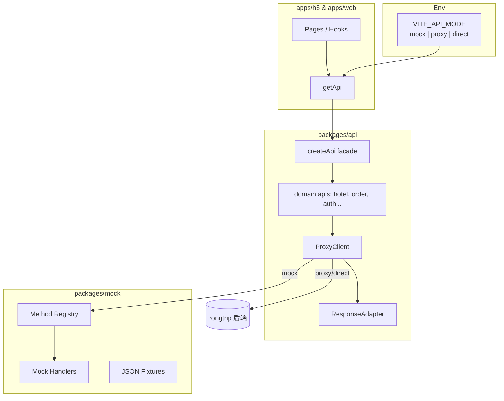

# beeantmobile → rongyixing 接口迁移方案

> **版本**：v3.0  
> **日期**：2026-06-15  
> **源项目**：`beeantmobile-main/projects/ryx`（**H5 版**，非 Capacitor 壳）  
> **源站**：[app.rtesp.com/rl/index.html](http://app.rtesp.com/rl/index.html)  
> **目标项目**：`rongyixing-monorepo` → **`apps/h5`** + `packages/api`  
> **页面→接口矩阵**：[api/PAGE-API-MATRIX.md](./api/PAGE-API-MATRIX.md)（**主操作手册**）  
> **执行看板**：[api/task-list.md](./api/task-list.md)

---

## 1. 背景与目标

### 1.1 为什么要迁移

| 现状 | 问题 |
|------|------|
| beeantmobile 使用 Proxy RPC（`Home/Proxy` + `Method` 字符串） | Angular 12 技术栈老旧，维护成本高 |
| 约 **364** 个唯一 Method、**41** 个后端域 | 接口分散在 175+ service 文件，无统一 TypeScript 契约 |
| 环境切换靠换域名（`mockProBuild`） | 无运行时 Mock，写页面必须联后端 |
| rongyixing-monorepo 仅有 `@ryx/api` 脚手架 | 仅 `auth` 模块，无法支撑业务开发 |

### 1.2 迁移目标

**把 H5 版 ryx（`/rl/`）迁到 `apps/h5`**，按 **[页面→接口矩阵](./api/PAGE-API-MATRIX.md)** 逐页推进。

1. **页面驱动**：29 页矩阵 × Wave 顺序；`METHODS.json`（364）仅作字典。
2. **滚动推进**：每次补齐 **2～3 页** 的 API/Mock，不必等 354 条全梳理完。
3. **接口按需封装**：当前页用到的 Method 进 `@ryx/api`。
4. **Mock / 联调切换**：`VITE_API_MODE`。

**明确不做**：jyx、Capacitor 原生、MMS、CRM、游客 `public/*`、国际/租车（除非 `/rl/` 实测有入口）。

### 1.3 不在本期范围

- 将 364 个 Method 一次性全部 Mock（按模块迭代）
- 把 Proxy 协议整体改成 REST（成本过高，保留适配层）
- Capacitor 原生壳迁移（另立方案）
- jyx-only 接口（6 条）与 MMS / 游客态（除非 ryx 产品明确要求）

### 1.4 迁移基准（ryx vs jyx）

| 项 | 融易行 ryx（本项目） | 君易行 jyx（参考） |
|----|---------------------|-------------------|
| 测试 H5 | `http://app.rtesp.com/rl/index.html` | `http://app.rtesp.com/jyx/index.html` |
| 源码 | `beeantmobile/projects/ryx` | `beeantmobile/projects/jyx` |
| 包名 | `com.ronglvonline.app` | `com.rongtong` |
| 扫描 Method | 354 条引用 | 301 条引用 |
| 共有 | 295 条 | 295 条 |
| 独有 | 59 条（CRM、国际票等） | 6 条 |
| 出差单 | `TmcApiBookUrl-Home-GetTravelUrl` | `FeatureRonglvUrl-jyx-GetTravelForms` |

> **354 不是迁移目标。** 详见 [api/METHODS-RYX-SCOPE.md](./api/METHODS-RYX-SCOPE.md)。  
> **迁移顺序与每页 Method**：见 [api/PAGE-API-MATRIX.md](./api/PAGE-API-MATRIX.md)（29 页，Wave 1–8）。

### 1.5 产品 MVP 与页面矩阵

> 产品边界见 [api/MVP-SCOPE.md](./api/MVP-SCOPE.md)。  
> **执行以 [PAGE-API-MATRIX.md](./api/PAGE-API-MATRIX.md) 为准**（29 页，Wave 1–8）。

| Wave | 产品能力 | 状态 |
|------|----------|------|
| 1 | 登录 | [~] |
| 2 | Tab + 首页/待出行/我的 | [ ] |
| 3 | 订酒店 + 支付 | [~] |
| 4 | 订单中心 | [ ] |
| 5–6 | 机票 + 火车 | [ ] |
| 7 | 出差申请（抓包）+ 选出差单 | [~] |
| 8 | 账户/审批 P2 | [ ] |

**进度 KPI**：页面迁移 ≈28%（6 done + 4 partial / 29），不是 Method 条数。

**出差单**：**选择** `GetTravelUrl` ✅ · **申请** 待 `/rl/` 抓包 ⬜

---

## 2. 源系统接口架构（beeantmobile）

### 2.1 调用链路

```
Page / Domain Service
  → RequestEntity（Method + Data + Ticket + Sign）
  → CoreApiService.sendRequest()
  → POST {baseUrl}/Home/Proxy（或 Method 拆 UrlKey 直连微服务）
  → IResponse<T> { Status, Code, Data, Message }
```

### 2.2 核心文件（源仓库）

| 职责 | 路径 |
|------|------|
| HTTP 引擎 | `beeantmobile-main/projects/core/src/services/api/core-api.service.ts` |
| API 门面 | `beeantmobile-main/projects/core/src/services/api/api.service.ts` |
| 请求实体 | `beeantmobile-main/projects/core/src/services/api/Request.entity.ts` |
| 响应类型 | `beeantmobile-main/projects/models/src/models.ts` |
| 业务域 Service | `projects/ryx/src/app/tmc/`、`account/`、`hr/`、`bpm/` 等 |
| 环境配置 | `projects/ryx/src/config.ts`、`projects/jyx/src/config.ts` |

### 2.3 Method 命名规范

```
{UrlKey}-{Controller}-{Action}
```

示例：

| Method 字符串 | 解析后路径 |
|---------------|------------|
| `TmcApiHotelUrl-Home-List` | `hotel-api-tmc…/Home/List` |
| `TmcApiHotelUrl-Home-Detail` | `hotel-api-tmc…/Home/Detail` |
| `TmcApiOrderUrl-Order-Detail` | `order-api…/Order/Detail` |
| `ApiLoginUrl-Home-DeviceLogin` | `login-api…/Home/DeviceLogin` |

UrlKey 与真实域名映射来自 **`GET /Home/Setting?appId={packageName}`** 返回的 `Urls` 表（约 120 个 key），客户端缓存后用于 `getUrl()`。

### 2.4 请求格式

- **Content-Type**：`application/x-www-form-urlencoded`
- **主要字段**：

| 字段 | 说明 |
|------|------|
| `Method` | RPC 方法名 |
| `Data` | JSON 字符串（业务参数） |
| `Timestamp` | 时间戳 |
| `Token` | 来自 ApiConfig，非用户 JWT |
| `Ticket` | 会话票据 |
| `Domain` | 租户域名 |
| `Sign` | `md5(Data + Timestamp + Token)` |

### 2.5 响应与错误码

```typescript
interface IResponse<T> {
  Status: boolean
  Code: string
  Message: string
  Data: T
  Timestamp?: number
  TraceId?: string
  Sign?: string
}
```

| Code | 行为 |
|------|------|
| `NOLOGIN` | 自动 DeviceLogin 或跳转登录 |
| `NOAUTHORIZE` | 无权限弹窗 |
| `systemerror` | 错误提示 |

### 2.6 接口规模估算

| 指标 | 数量 |
|------|------|
| `req.Method =` 赋值（含 ryx/jyx 重复） | ~836 |
| **唯一 Method 字符串** | **~363** |
| UrlKey 前缀（微服务组） | ~41 |
| 含 API 调用的 service 文件 | ~175 |

### 2.7 业务域分布（按 UrlKey）

| 域 | UrlKey 示例 | 约 Method 数 |
|----|-------------|--------------|
| TMC 首页/预订 | `TmcApiHomeUrl`, `TmcApiBookUrl` | 30 + 29 |
| 订单/支付 | `TmcApiOrderUrl` | 29 |
| 酒店 | `TmcApiHotelUrl` | 8 |
| 机票 | `TmcApiFlightUrl` | 5 |
| 火车 | `TmcApiTrainUrl` | 5 |
| 会员/账户 | `ApiMemberUrl`, `ApiAccountUrl`, `ApiPasswordUrl` | 14 + 11 + 30 |
| 登录 | `ApiLoginUrl` | 若干 |
| HR/出差 | `HrApiUrl`, `FeatureRonglvUrl` | 15 + 5 |
| BPM/审批 | `BpmApiHomeUrl`, `BpmApiOrderUrl`, `WorkflowApiUrl` | 35 |
| 商城 MMS | `MmsApi*` | ~35 |
| 游客态 | `TmcTourist*` | ~50 |

> **去重策略**：以 `projects/ryx` 为准扫描；`jyx` 仅作 diff 补充。

---

## 3. 目标系统架构（rongyixing-monorepo）

### 3.1 现状（2026-06-15）

| 层级 | 状态 | 说明 |
|------|------|------|
| **P0 资产提取** | ✅ 完成 | 364 条 Method **登记**至 `METHODS.json`（inventory，**非**业务实现） |
| **P1 Proxy 适配** | ✅ 完成 | ProxyClient、Gateway、Sign、Setting、NOLOGIN |
| **P2 Mock / 环境** | ✅ 完成 | `@ryx/mock`、`VITE_API_MODE`、DevMenu 切换 |
| **P3 领域 API** | 🟡 部分 | 25 条已封装，约占 **/rl/ 预算 159** 的 **16%**（非 354） |
| **P4 H5 接入** | 🟡 部分 | 登录 + 酒店主链 + 出差单；`apps/web` 未接页面 |
| **P5 质量 CI** | ✅ 完成 | Vitest、CI、`verify:mock`、`check:mock-coverage` |
| **S6 机票/火车** | ⬜ 未开始 | 按 PRD |
| **S7 BPM/审批** | ⬜ 未开始 | 按 PRD |

**H5 已接线 API（13 处调用）**：`authProxy.login/mobileLogin/deviceLogin`、`gateway.sendLoginMobileCode`、`hotel.getList/getDetail/initBook/submitBook`、`travel.getTravelForms`、`member.getPassengerList`、`order.getDetail`、`pay.getOrderPays/create`。

**对标 `/rl/` 整体替换进度**：约 **20%**（酒店预订支付主链 + 登录骨架；缺首页/订单中心/机票火车/我的/BPM）。

### 3.2 目标架构图



### 3.3 分层职责

| 层 | 位置 | 职责 |
|----|------|------|
| DTO | `packages/shared-types` | 请求/响应 TypeScript 类型 |
| Method 常量 | `packages/api/src/methods/` | 自动生成，避免字符串漂移 |
| Proxy 客户端 | `packages/api/src/proxy/` | Sign、Ticket、Setting、send |
| 领域 API | `packages/api/src/apis/` | 薄封装，业务语义方法 |
| Mock | `packages/mock/` | Method → handler + fixtures |
| 应用引导 | `apps/*/src/lib/api.ts` | 按 mode 组装 client |
| Hooks | `apps/*/src/hooks/` | loading/error，页面不直连 API |
| Flow 文档 | `docs/api/domains/*.md` | 业务编排真相（List→Detail→Book→Pay） |

---

## 4. Monorepo 目录规划

```
rongyixing-monorepo/
├── packages/
│   ├── shared-types/
│   │   └── src/
│   │       ├── auth.ts
│   │       ├── hotel.ts
│   │       └── ...
│   │
│   ├── api/
│   │   ├── scripts/
│   │   │   └── extract-methods.mjs      # 从 beeant 扫描
│   │   └── src/
│   │       ├── client.ts                # REST client（保留）
│   │       ├── proxy/
│   │       │   ├── proxy-client.ts
│   │       │   ├── request-entity.ts
│   │       │   ├── api-config.ts        # /Home/Setting
│   │       │   └── response-adapter.ts
│   │       ├── methods/                 # 自动生成
│   │       │   ├── hotel.ts
│   │       │   ├── order.ts
│   │       │   └── index.ts
│   │       └── apis/
│   │           ├── auth.ts
│   │           ├── hotel.ts
│   │           └── ...
│   │
│   └── mock/
│       └── src/
│           ├── registry.ts
│           ├── handlers/
│           │   ├── hotel.ts
│           │   └── ...
│           └── fixtures/
│               └── hotel/
│
├── apps/h5/src/lib/
│   ├── env.ts
│   └── api.ts
│
└── docs/
    ├── 需求.md
    ├── 接口迁移方案.md                  # 本文档
    └── api/
        ├── METHODS.json                 # 扫描产出（待生成）
        └── domains/
            ├── hotel.md
            └── ...
```

---

## 5. Phase 0 — 接口资产提取（自动化）

### 5.1 扫描范围

```
beeantmobile-main/projects/core/src/services/
beeantmobile-main/projects/ryx/src/app/
beeantmobile-main/projects/jyx/src/app/
```

### 5.2 扫描规则

匹配以下模式并 dedupe：

- `req.Method = 'TmcApiHotelUrl-Home-List'`
- `req.Method = "..."`
- `this.apiService.send('...', data)`
- 模板字符串（标记为 dynamic，人工审核）

### 5.3 产出物

| 文件 | 内容 |
|------|------|
| `docs/api/METHODS.json` | method、urlKey、controller、action、sourceFiles、count |
| `docs/api/METHODS.md` | 人类可读清单 |
| `packages/api/src/methods/*.ts` | `export const HotelMethods = { LIST: 'TmcApiHotelUrl-Home-List', ... }` |

### 5.4 脚本命令（规划）

```bash
pnpm --filter @ryx/api extract-methods \
  --source ../../beeantmobile-main \
  --out docs/api/METHODS.json
```

---

## 6. Phase 1 — Proxy 适配层

beeant 业务接口必须经 Proxy 协议，不可直接套用现有 REST `client.post('/hotel/list')`。

### 6.1 ProxyClient 接口（规划）

```typescript
interface ProxyRequest<T = unknown> {
  method: string
  data?: T
  version?: string
  showLoading?: boolean
}

interface ProxyClient {
  send<TReq, TRes>(req: ProxyRequest<TReq>): Promise<TRes>
  loadApiConfig(): Promise<ApiConfig>
  resolveUrl(method: string): string
}
```

### 6.2 必须实现的能力

- [ ] `application/x-www-form-urlencoded` POST
- [ ] `Sign = md5(Data + Timestamp + Token)`
- [ ] `/Home/Setting` 拉取并缓存 `Urls` + `Token`
- [ ] `IResponse` → 统一 `ApiResult<T>` 适配
- [ ] `NOLOGIN` / `NOAUTHORIZE` 回调（对接 `onUnauthorized`）
- [ ] 可选：Method 拆 UrlKey 直连（`direct` 模式）

### 6.3 与现有 REST Client 并存

| 接口类型 | Client |
|----------|--------|
| beeant TMC / 订单 / 会员 / BPM | `ProxyClient` |
| 新 REST 风格接口（若有） | `createApiClient` |
| 页面入口 | 统一 `getApi().hotel.list()`，内部路由到 Proxy |

---

## 7. Phase 2 — Mock / 生产切换

### 7.1 环境变量

```env
# apps/h5/.env.development
VITE_API_MODE=mock
VITE_API_BASE_URL=https://app.rongtrip.cn
VITE_API_MOCK_DELAY=300
```

| `VITE_API_MODE` | 行为 | 场景 |
|-----------------|------|------|
| `mock` | 走 `packages/mock` registry，不发真实请求 | 写页面、离线、CI |
| `proxy` | POST `/Home/Proxy` + 真实后端 | 联调、测试/生产 |
| `direct` | Method 拆 UrlKey 直连微服务 | 对齐 Android 直连 |

### 7.2 Mock 实现（推荐）

**ProxyClient 内置 MockRouter**（主路径）：

```typescript
if (mode === 'mock') {
  return mockRegistry.handle(req.method, JSON.parse(req.data))
}
return realPost('/Home/Proxy', formBody)
```

未注册 Method 返回：

```json
{ "Status": false, "Code": "MOCK_NOT_FOUND", "Message": "No mock for TmcApiXxx-..." }
```

并在 dev 控制台 `console.warn`。

### 7.3 开发期热切换（可选）

```typescript
// localStorage 覆盖，刷新生效
localStorage.setItem('ryx_api_mode', 'mock')
```

或 H5 开发者菜单三档：Mock / Test / Prod（对齐 beeant `developer-options`）。

### 7.4 Vite 代理（proxy 模式防 CORS）

```typescript
// apps/h5/vite.config.ts
server: {
  proxy: {
    '/Home': { target: env.VITE_API_BASE_URL, changeOrigin: true },
  },
}
```

### 7.5 多环境文件

| 文件 | API_MODE | BASE_URL |
|------|----------|----------|
| `.env.development` | `mock` | `http://app.rtesp.cn` |
| `.env.staging` | `proxy` | `http://app.rtesp.cn` |
| `.env.production` | `proxy` | `https://app.rongtrip.cn` |

### 7.6 npm scripts（规划）

```json
{
  "dev:h5:mock": "VITE_API_MODE=mock pnpm --filter @ryx/h5 dev",
  "dev:h5:test": "pnpm --filter @ryx/h5 dev --mode staging",
  "check:mock-coverage": "node packages/api/scripts/check-mock-coverage.mjs"
}
```

---

## 8. Phase 3 — 领域 API 迁移顺序

### 8.1 优先级

| 阶段 | 域 | Method 前缀 | Mock | 说明 |
|------|-----|-------------|------|------|
| **S1** | 登录/身份 | `ApiLoginUrl`, `ApiHomeUrl-Identity-*` | ✓ | Ticket 会话 |
| **S2** | 酒店 | `TmcApiHotelUrl` | ✓ | 复用 `rongyixing-h5` 资产 |
| **S3** | 订单/支付 | `TmcApiOrderUrl` | ✓ | Detail 轮询、Pay/Create |
| **S4** | 会员/常旅客 | `ApiMemberUrl` | ✓ | 入住人选择 |
| **S5** | 出差/HR | `HrApiUrl`, `FeatureRonglvUrl` | ✓ | 出差单列表 |
| **S6** | 机票/火车 | `TmcApiFlightUrl`, `TmcApiTrainUrl` | 按需 | 后续 PRD |
| **S7** | BPM/审批 | `BpmApi*`, `WorkflowApiUrl` | 按需 | beeant 特色 |

### 8.2 单域迁移三步

1. **`shared-types`**：从 `beeantmobile-main/projects/models` 提取/精简 DTO
2. **`packages/api/src/apis/<domain>.ts`**：薄封装 `proxyClient.send({ method, data })`
3. **`packages/mock`**：handler + fixture（可从 `rongyixing-h5/src/mock` 迁移）

### 8.3 酒店域 Method 清单（S2 首批）

对齐 Android / `rongyixing-h5/docs/API.md`：

| Method | 用途 |
|--------|------|
| `Resource/DomesticHotelCity` 或对应 UrlKey | 城市列表 |
| `TmcApiHotelUrl-Home-List` | 酒店列表 |
| `TmcApiHotelUrl-Home-Detail` | 酒店详情 |
| `TmcApiHotelUrl-Home-Policy` | 违标策略 |
| `TmcApiBookUrl-Hotel-Initialize` | 预订初始化 |
| `TmcApiBookUrl-Hotel-Book` | 提交订单 |
| `TmcApiOrderUrl-Order-Detail` | 订单详情 |
| `TmcApiOrderUrl-Order-CancelOrderHotel` | 取消酒店订单 |
| `TmcApiOrderUrl-Order-GetOrderPays` | 支付渠道 |
| `TmcApiOrderUrl-Pay-Create` | 发起支付 |

> 实际 UrlKey 以 `METHODS.json` 扫描结果为准。

### 8.4 复用 rongyixing-h5 资产

| 源路径 | 目标路径 |
|--------|----------|
| `rongyixing-h5/docs/API.md` | `docs/api/domains/hotel.md` |
| `rongyixing-h5/src/mock/*` | `packages/mock/fixtures/` |
| `rongyixing-h5/src/api/hotelApi.ts` | `packages/api/src/apis/hotel.ts` |

---

## 9. Phase 4 — 前端使用规范

### 9.1 页面调用方式

```typescript
// apps/h5/src/hooks/useHotelList.ts
import { useQuery } from '@tanstack/react-query'
import { getApi } from '@/lib/api'

export function useHotelList(params: HotelListParams) {
  return useQuery({
    queryKey: ['hotel', 'list', params],
    queryFn: () => getApi().hotel.getList(params),
  })
}
```

**禁止**：页面内 `fetch('/Home/Proxy')` 或硬编码 Method 字符串。

### 9.2 getApi 引导（规划）

```typescript
// apps/h5/src/lib/api.ts
export function getApi() {
  if (!apiInstance) {
    apiInstance = createApi({
      mode: getApiMode(),           // mock | proxy | direct
      baseUrl: getApiBaseUrl(),
      mockDelay: getMockDelay(),
      getTicket: () => localStorage.getItem('ticket'),
      onUnauthorized: () => { /* 清 ticket，跳登录 */ },
    })
  }
  return apiInstance
}
```

### 9.3 错误与 loading

遵循 `.cursor/rules/error-handling.mdc`：catch `ApiError`，展示 loading / error / empty 三态。

---

## 10. Phase 5 — 质量与工具链

| 工具 | 用途 |
|------|------|
| `extract-methods.mjs` | 从 beeant 生成 METHODS.json + TS 常量 |
| `check-mock-coverage.mjs` | CI：当前模块 Method 是否有 mock handler |
| Vitest + mock `fetchImpl` / Proxy mock | `packages/api` 单测 |
| `pnpm check:mock-coverage` | 合并前检查 |

### Mock 覆盖率目标

| 范围 | 目标 |
|------|------|
| 当前开发域（酒店 S2） | 100% |
| 登录 + 会员（S1+S4） | 100% |
| 全量 364 Method | 按模块迭代，**不阻塞发版**；仅登记 inventory |

---

## 11. 实施排期

### 11.1 已完成（W1–W4）

| 阶段 | 交付 | 状态 |
|------|------|------|
| W1 | `extract-methods` + `METHODS.json` + ProxyClient | ✅ |
| W2 | `packages/mock` + `VITE_API_MODE` + 酒店 10+ Method | ✅ |
| W3 | 登录 + 酒店 hooks + mock/proxy 双通 | ✅ |
| W4 | 订单/支付/会员/出差 API + CI + mock coverage | ✅ |
| W4+ | ryx 出差单 `GetTravelUrl` 修正 + 预订页选单 | ✅ |

### 11.2 进行中 / 待做（按 Wave）

| Wave | 交付 | 优先级 |
|------|------|--------|
| **2** | Tab 壳 + 首页 Workbench/Banner/Notice | P0 ← **下一批** |
| **1 收尾** | identity.get、登出、DeviceLogin 续票 | P0 |
| **3 收尾** | 城市、Policy、SearchHotel UI | P0 |
| **4** | 订单列表 + 酒店订单详情 + pay.process | P1 |
| **5–6** | 机票 / 火车链 | P1 |
| **7** | 出差申请（抓包） | P0 |
| **8** | 账户/审批 P2 | P2 |

> 页面级 Method 见 [api/PAGE-API-MATRIX.md](./api/PAGE-API-MATRIX.md)；勾选见 [api/task-list.md](./api/task-list.md)。

## 12. 关键决策记录

| 决策 | 选择 | 理由 |
|------|------|------|
| 是否改 REST | **否**，保留 Proxy | 363 接口改造成本不可接受 |
| Mock 放哪 | 独立 `packages/mock` | 生产包不带 mock 数据 |
| Method 常量 | **自动生成** | 避免与 beeant 漂移 |
| 扫描基准 | **ryx**，jyx diff | 减少重复 |
| 页面 API 入口 | 统一 `getApi()` + hooks | 与 api-layer 规则一致 |
| 首批业务域 | **酒店** | PRD + rongyixing-h5 已有资产 |
| 迁移单位 | **页面（29 页矩阵）**，Method 随页封装 | 见 PAGE-API-MATRIX.md |
| ryx / jyx | **Method 分轨** | 出差单等接口不可混用 |
| 验收环境 | **app.rtesp.com/rl** | 融易行测试 H5 对标 |

---

## 13. 相关文档

| 文档 | 路径 |
|------|------|
| 产品需求 | [需求.md](./需求.md) |
| **页面→接口矩阵** | [api/PAGE-API-MATRIX.md](./api/PAGE-API-MATRIX.md) |
| **迁移看板** | [api/task-list.md](./api/task-list.md) |
| H5 路由对照 | [api/H5-RYX-MIGRATION.md](./api/H5-RYX-MIGRATION.md) |
| API 层规范 | [`.cursor/rules/api-layer.mdc`](../.cursor/rules/api-layer.mdc) |
| 环境变量规范 | [`.cursor/rules/vite-env.mdc`](../.cursor/rules/vite-env.mdc) |
| rongyixing-h5 酒店 API | `../../rongyixing-h5/docs/API.md` |
| Android 酒店契约 | `../../easy-go-jacky/docs/modules/hotel/` |
| Method 清单 | [api/METHODS.json](./api/METHODS.json) |
| **ryx 迁移范围分析** | [api/METHODS-RYX-SCOPE.md](./api/METHODS-RYX-SCOPE.md) |
| ryx / jyx diff | [api/METHODS-JYX-DIFF.json](./api/METHODS-JYX-DIFF.json) |
| 酒店域 Flow | [api/domains/hotel.md](./api/domains/hotel.md) |

---

## 14. 附录：非 Proxy 的 `/Home/*` 直连接口

以下不走 Method→Url 解析，直接打 app 网关：

| 路径 | 用途 |
|------|------|
| `/Home/Proxy` | 默认 RPC 网关 |
| `/Home/Setting` | 拉 ApiConfig（Urls + Token） |
| `/Home/SendLoginMobileCode` | 登录短信 |
| `/Home/SendIdentityMobileCode` | 身份验证短信 |
| `/Home/ValidateIdentityMobileCode` | 短信校验 |
| `/Home/WechatJsSdk` | 微信 JS-SDK 配置 |
| `/home/GetWechatCode` 等 | OAuth 回调 |

这些接口在 `packages/api/src/gateway/gateway.ts` 单独封装，不走 Mock registry（或仅 fixture 静态响应）。

---

## 15. 当前进度快照

> 最后更新：**2026-06-15** · 以 [task-list.md](./api/task-list.md) 与 [PAGE-API-MATRIX.md](./api/PAGE-API-MATRIX.md) 为准

### 15.1 三层文档体系

| 层级 | 文档 | 用途 |
|------|------|------|
| L0 字典 | `METHODS.json`（364） | 全库 Method 备查 |
| L1 范围 | `METHODS-RYX-SCOPE.md` | 354 扫描 / 144 非主线 |
| **L2 执行** | **`PAGE-API-MATRIX.md`（29 页）** | **逐页迁移操作手册** |
| L3 看板 | `task-list.md` | Wave 勾选 + 域级 Method |

### 15.2 进度（页面 KPI）

| 指标 | 值 |
|------|-----|
| 矩阵内页面 | 29 |
| H5 完成 | 6 |
| H5 部分 | 4 |
| **页面迁移** | **≈28%** |
| 已封装 Method | 25（随页增加） |
| 下一批 | **Wave 2** Tab 壳 + 首页工作台 |

### 15.3 模块进度

| 模块 | API | Mock | H5 页面 | 备注 |
|------|-----|------|---------|------|
| 基础设施 P0–P2 | ✅ | ✅ | ✅ | — |
| Wave 1 登录 | [~] | [~] | [~] | 缺 identity 接页 |
| Wave 2 首页/Tab | [ ] | [ ] | [ ] | **下一批** |
| Wave 3 酒店 | [~] | [~] | [~] | 主链可跑 mock |
| Wave 4 订单 | [~] | [~] | [ ] | API 有，无列表页 |
| Wave 5–6 机/火 | [ ] | [ ] | [ ] | — |
| Wave 7 出差 | [~] | [~] | [~] | 申请待抓包 |

### 15.4 下一步

1. **Wave 2**：TabLayout + `Workbench-Load` / Banner / Notice  
2. **Wave 3 收尾**：城市、Policy、SearchHotel UI  
3. **Wave 4**：`/orders` 列表 + 酒店订单详情  

### 15.5 验收命令

```bash
pnpm analyze-ryx-pages && pnpm analyze-ryx-scope
pnpm build && pnpm typecheck && pnpm test
pnpm check:mock-coverage -- --domain all
pnpm verify:mock
pnpm dev:h5:mock
```
